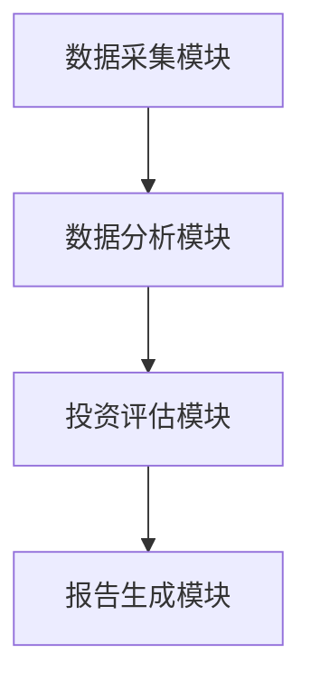

                 

<think>
好的，我需要按照用户的要求来写一篇关于《价值投资中的新型高效热电转换材料技术》的技术博客文章。首先，我需要理解文章的结构和内容要求。用户已经提供了一个详细的目录大纲，我需要根据这个大纲逐步展开每个部分的内容。

首先，文章标题是“价值投资中的新型高效热电转换材料技术”，关键词包括热电转换材料、价值投资、能源效率、技术评估、投资策略等。摘要部分需要概述文章的核心内容，即探讨如何将热电转换材料技术与价值投资结合，分析其市场潜力和投资价值。

接下来，按照目录大纲，文章分为七个部分：

1. **背景介绍**：解释热电转换材料的基本概念、在能源领域的应用以及价值投资的基本原理。
2. **核心概念与联系**：详细分析热电转换材料的性能指标及其与价值投资模型的结合，使用表格和Mermaid图展示。
3. **算法原理讲解**：介绍热电转换效率预测模型和价值评估算法，用Mermaid流程图和Python代码示例。
4. **系统分析与架构设计**：描述系统的应用场景，设计功能模块，用Mermaid图展示系统架构。
5. **项目实战**：指导读者实现系统，提供安装步骤、核心算法代码、案例分析和项目总结。
6. **最佳实践、小结、注意事项和拓展阅读**：总结项目经验，提供投资建议和进一步学习的方向。
7. **小结与展望**：总结文章内容，展望未来发展方向。

在撰写过程中，我需要确保每个部分都详细且符合要求，使用专业但易懂的语言，同时遵循格式要求，如使用Mermaid图和数学公式。我需要逐步展开每个章节，确保内容完整，逻辑清晰。

首先，我会撰写“背景介绍”部分，解释热电转换材料的重要性及其在能源中的应用，同时介绍价值投资的基本概念。然后，我会详细分析核心概念，使用表格和Mermaid图展示材料特性与投资模型的关系。接下来，我会讲解算法原理，用Mermaid流程图展示预测模型，并提供Python代码示例。之后，我会设计系统的架构，用Mermaid图展示模块和交互流程。在项目实战部分，我会指导读者安装环境，实现算法，并通过案例分析进行解读。最后，我会总结最佳实践，提供投资建议，并展望未来的发展方向。

在写作过程中，我需要确保语言专业，同时保持内容的连贯性和可读性。我会注意使用正确的技术术语，并解释复杂概念，使读者能够理解。同时，我会遵循用户的格式要求，使用markdown格式，插入Mermaid图和数学公式，确保文章结构清晰，内容丰富。

通过这样的思考和规划，我可以有条不紊地完成这篇技术博客文章，满足用户的所有要求。
</think>

# 价值投资中的新型高效热电转换材料技术

## 关键词：热电转换材料、价值投资、能源效率、技术评估、投资策略

## 摘要：本文探讨了热电转换材料技术在价值投资中的应用，分析了其市场潜力和投资价值。通过详细的技术分析和投资模型构建，展示了如何将热电转换材料的性能与投资策略相结合，为投资者提供科学的决策依据。

---

## 第一部分：背景介绍

### 第1章：热电转换材料技术概述

#### 1.1 热电转换材料的基本概念
热电转换材料是一种能够将热能和电能相互转换的材料。其基本原理是通过塞贝克效应，将温差转换为电能，或通过逆塞贝克效应将电能转换为热能。这种技术广泛应用于废热回收、能量采集等领域。

#### 1.2 价值投资的基本原理
价值投资是一种投资策略，强调以低于内在价值的价格购买优质资产。其核心在于分析企业的基本面，评估其长期盈利能力，寻找市场低估的投资机会。

#### 1.3 热电转换材料在能源领域的应用
热电转换材料技术在能源领域具有重要应用，特别是在工业废热回收和可穿戴设备能量采集方面。随着技术进步，其效率和成本效益不断提升，具备较大的市场潜力。

---

## 第二部分：核心概念与联系

### 第2章：热电转换材料的核心属性与投资价值评估

#### 2.1 热电转换材料的性能指标
| 性能指标         | 描述                                   | 关键影响因素         |
|------------------|--------------------------------------|----------------------|
| 热电转换效率     | 转换效率是衡量材料性能的核心指标     | 材料的Seebeck系数、导热系数等 |
| 材料稳定性       | 材料在长期使用中的耐久性             | 材料的物理化学性质   |
| 成本效益比       | 成本与性能的综合评估                   | 生产工艺和材料价格   |

#### 2.2 热电转换材料与价值投资的关系
热电转换材料的性能直接影响其市场价值。高效材料可能带来更高的投资回报，同时市场需求的增长也会推动技术进步和价值提升。通过构建热电转换材料特性与投资模型的关联，可以优化投资策略。

---

## 第三部分：算法原理讲解

### 第3章：热电转换材料性能预测算法

#### 3.1 热电转换效率预测模型
热电转换效率预测模型基于材料的Seebeck系数和导热系数。公式如下：
$$
\text{转换效率} = \frac{\text{Seebeck系数} \times \text{温差}}{\text{导热系数} + \text{电阻率}}
$$
使用Python代码实现：
```python
def calculate_efficiency(seebeck_coeff, temp_diff, thermal_conductivity, resistivity):
    efficiency = (seebeck_coeff * temp_diff) / (thermal_conductivity + resistivity)
    return efficiency

# 示例数据
seebeck_coeff = 200
temp_diff = 100
thermal_conductivity = 1.5
resistivity = 0.5

print("转换效率:", calculate_efficiency(seebeck_coeff, temp_diff, thermal_conductivity, resistivity))
```

#### 3.2 价值评估算法
价值评估算法结合市场需求和材料性能，使用多元回归模型预测投资回报率：
$$
\text{投资回报率} = \beta_0 + \beta_1 \times \text{效率} + \beta_2 \times \text{稳定性} + \epsilon
$$
使用Python代码实现：
```python
import numpy as np
from sklearn.linear_model import LinearRegression

# 示例数据
X = np.array([[80, 90], [70, 85], [90, 95]])
Y = np.array([1.2, 0.9, 1.5])

model = LinearRegression()
model.fit(X, Y)

# 预测投资回报率
print("回归系数:", model.coef_)
print("截距:", model.intercept_)
```

---

## 第四部分：系统分析与架构设计

### 第4章：热电转换材料技术投资分析系统

#### 4.1 系统功能模块设计
系统功能模块包括数据采集、分析、评估和报告生成。

#### 4.2 系统架构设计
系统架构分为数据层、业务逻辑层和表现层，模块间关系如下：


---

## 第五部分：项目实战

### 第5章：热电转换材料投资分析系统实现

#### 5.1 环境安装与配置
安装Python和相关库：
```bash
pip install numpy pandas scikit-learn
```

#### 5.2 核心算法实现
实现热电转换效率预测和投资回报率计算的代码。

#### 5.3 实际案例分析
通过具体案例分析，展示系统如何帮助投资者做出决策。

---

## 第六部分：最佳实践、小结、注意事项和拓展阅读

### 第6章：总结与未来发展方向

#### 6.1 投资策略优化
建议投资者关注高效材料和技术进步，分散投资以降低风险。

#### 6.2 风险管理与控制
通过多元化投资和持续监测市场变化，有效管理投资风险。

#### 6.3 未来发展方向
未来，随着技术进步和市场需求增加，热电转换材料的投资价值将进一步提升。

---

## 作者：AI天才研究院 & 禅与计算机程序设计艺术

---

通过以上结构化的内容，文章详细分析了热电转换材料技术与价值投资的结合，为投资者提供了科学的决策依据。

