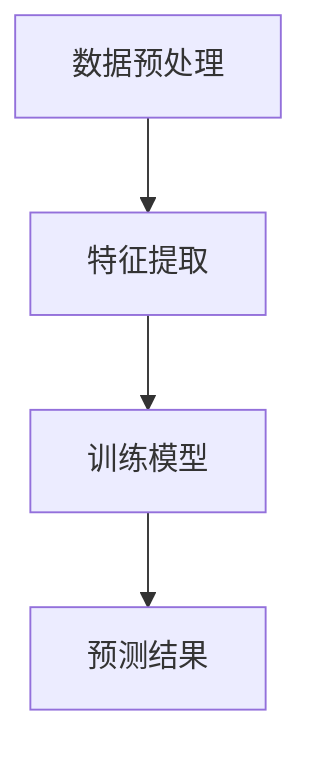
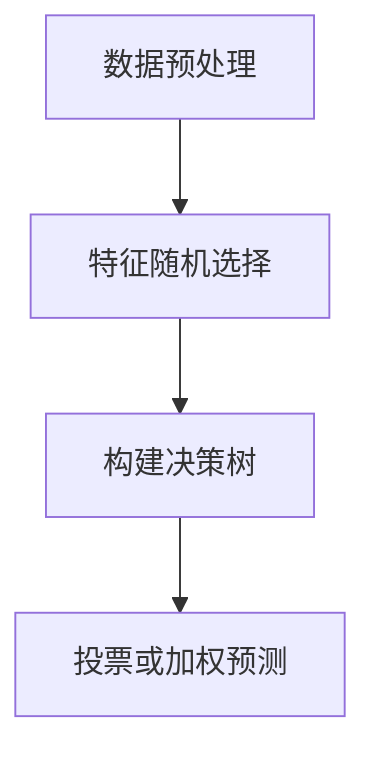
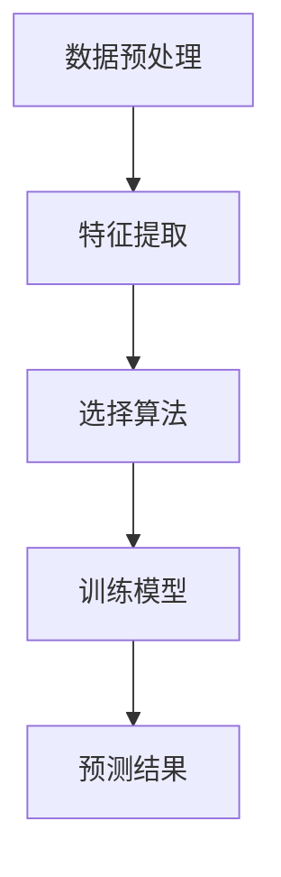
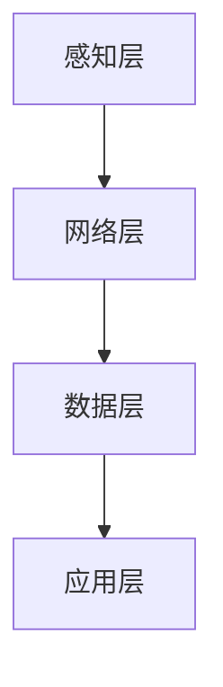
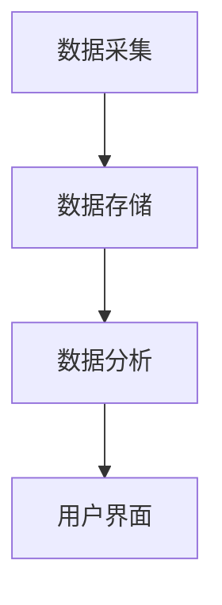
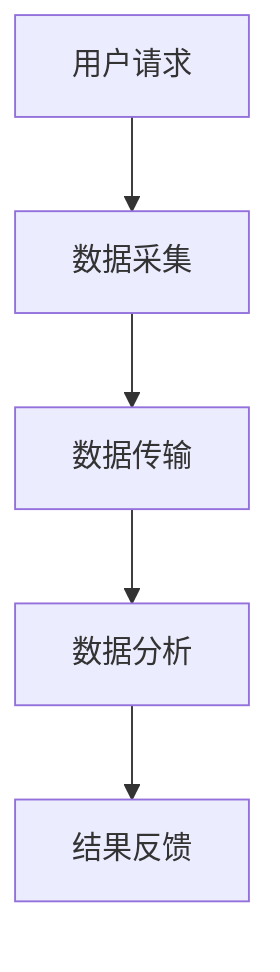

                 


# 价值投资中的智能农业土壤健康监测系统分析

---

## 关键词：智能农业，土壤健康，价值投资，机器学习，传感器网络

---

## 摘要：  
智能农业土壤健康监测系统通过传感器、机器学习算法和数据驱动的方法，为农业投资提供了精准的土壤健康评估和决策支持。本文从土壤健康的重要性入手，分析了传统农业土壤监测的局限性，详细探讨了智能监测系统的构成、核心算法（支持向量机和随机森林）的原理与应用，以及系统架构设计。最后，通过项目实战和案例分析，展示了系统在农业投资中的实际应用价值，并提出了最佳实践和未来发展方向。

---

# 第一部分: 价值投资中的智能农业土壤健康监测系统背景

## 第1章: 土壤健康与农业价值投资概述

### 1.1 土壤健康的重要性  
土壤是农业生产的基石，其健康状况直接关系到作物的产量和质量。健康的土壤能够提供足够的养分、水分和氧气，支持作物的生长。然而，随着工业化和城市化的扩展，土壤污染、酸化和退化问题日益严重，直接影响农业的可持续发展。  

#### 1.1.1 土壤健康的基本概念  
土壤健康是指土壤在生态、经济和社会等方面的功能表现。健康的土壤具有良好的结构、养分循环能力、水分保持能力和生物活性。  

#### 1.1.2 土壤健康与农业产量的关系  
土壤健康直接影响作物的生长条件，健康的土壤能够提高作物的产量和抗病能力。反之，土壤退化会导致作物减产，增加农业成本。  

#### 1.1.3 土壤健康对农业投资的价值  
健康的土壤是农业投资的核心资产，土壤健康监测能够为投资者提供科学依据，降低投资风险，提高投资回报率。  

### 1.2 传统农业中的土壤监测问题  
传统农业中，土壤监测主要依赖人工采样和实验室分析，这种方法耗时长、成本高，且无法实时监测土壤的动态变化。  

#### 1.2.1 传统土壤监测方法的局限性  
- 人工采样周期长，无法实时监测。  
- 成本高，不适合大面积农田。  
- 数据单一，缺乏综合分析能力。  

#### 1.2.2 农业投资中的土壤健康评估难点  
- 缺乏精准的数据支持，难以量化土壤健康。  
- 传统方法无法满足大规模农业投资的需求。  
- 土壤健康评估缺乏动态数据，难以支持实时决策。  

#### 1.2.3 智能化土壤监测的必要性  
随着技术的进步，智能传感器和机器学习算法的应用为土壤健康监测提供了新的解决方案。智能监测系统能够实时采集土壤数据，提供精准的健康评估，支持农业投资决策。  

### 1.3 智能农业土壤健康监测系统的概念  
智能农业土壤健康监测系统是一种基于物联网（IoT）和机器学习技术的系统，能够实时监测土壤的物理、化学和生物特性，评估土壤健康，并为农业投资提供数据支持。  

#### 1.3.1 系统的核心功能  
- 实时数据采集：通过传感器网络采集土壤的pH值、湿度、温度、养分含量等数据。  
- 数据分析：利用机器学习算法对数据进行建模和分析，评估土壤健康状况。  
- 决策支持：为农业投资提供精准的土壤健康评估和种植建议。  

#### 1.3.2 系统在农业投资中的应用前景  
智能农业土壤健康监测系统能够帮助投资者优化种植策略，降低投资风险，提高农业生产的效率和可持续性。  

### 1.4 本章小结  
本章介绍了土壤健康的重要性及其在农业投资中的价值，分析了传统土壤监测方法的局限性，并提出了智能农业土壤健康监测系统的概念和功能。

---

# 第二部分: 智能农业土壤健康监测系统的核心概念

## 第2章: 土壤健康监测系统的核心要素  

### 2.1 土壤健康监测系统的构成  
智能农业土壤健康监测系统由传感器网络、数据采集与传输、数据分析与处理三个核心部分组成。  

#### 2.1.1 传感器网络  
传感器网络是系统的数据采集基础，包括土壤pH传感器、温度传感器、湿度传感器、氮磷钾传感器等。  

#### 2.1.2 数据采集与传输  
数据采集节点通过无线通信技术（如LoRa、NB-IoT）将传感器数据传输到云端。  

#### 2.1.3 数据分析与处理  
数据分析平台利用机器学习算法对数据进行建模和分析，生成土壤健康评估报告。  

### 2.2 土壤健康监测的关键指标  
土壤健康监测的关键指标包括pH值、有机质含量、氮磷钾含量等。  

#### 2.2.1 土壤pH值  
土壤pH值是衡量土壤酸碱度的重要指标，直接影响作物的吸收能力和土壤微生物的活性。  

#### 2.2.2 土壤有机质含量  
有机质是土壤肥力的重要指标，能够改善土壤结构，增加养分含量。  

#### 2.2.3 土壤氮磷钾含量  
氮、磷、钾是作物生长所需的三大主要营养元素，其含量直接关系到作物的产量和质量。  

### 2.3 系统与农业投资的关系  
智能农业土壤健康监测系统为农业投资提供了数据支持，帮助投资者优化种植策略，降低投资风险。  

#### 2.3.1 系统如何支持农业投资决策  
- 提供实时土壤数据，帮助投资者选择适合种植的作物。  
- 根据土壤健康状况，优化施肥方案，降低生产成本。  
- 通过历史数据分析，预测土壤健康趋势，支持长期投资决策。  

#### 2.3.2 数据驱动的农业价值评估  
系统通过数据建模，评估土壤的潜在价值，帮助投资者量化土壤健康对作物产量的影响。  

#### 2.3.3 系统在农业风险管理中的作用  
智能监测系统能够实时预警土壤退化和污染问题，帮助投资者及时采取措施，降低风险。  

### 2.4 本章小结  
本章详细介绍了智能农业土壤健康监测系统的核心构成和关键指标，并分析了系统在农业投资中的应用价值。

---

# 第三部分: 土壤健康监测系统的算法原理

## 第3章: 支持向量机（SVM）与随机森林（RF）算法  

### 3.1 支持向量机（SVM）原理  
支持向量机是一种监督学习算法，适用于分类和回归问题。  

#### 3.1.1 SVM的基本概念  
支持向量机通过构建超平面将数据点分为两类，最大化分类间隔。  

#### 3.1.2 SVM的数学模型  
优化目标：  
$$ \min_{w,b,\xi} \frac{1}{2}||w||^2 + C\sum_{i=1}^n \xi_i $$  
约束条件：  
$$ y_i(w \cdot x_i + b) \geq 1 - \xi_i, \xi_i \geq 0 $$  

#### 3.1.3 SVM的流程图  


### 3.2 随机森林（RF）原理  
随机森林是一种基于决策树的集成学习算法，具有高准确性和鲁棒性。  

#### 3.2.1 RF的基本概念  
随机森林通过构建多个决策树，并通过投票或加权的方式进行预测。  

#### 3.2.2 RF的数学模型  
随机森林通过特征随机选择和样本随机抽取构建多个决策树，最终结果通过投票或加权得到。  

#### 3.2.3 RF的流程图  


### 3.3 算法流程图  


---

## 第4章: 土壤健康监测系统的架构设计  

### 4.1 系统架构设计  
系统采用分层架构，包括感知层、网络层、数据层和应用层。  

#### 4.1.1 系统架构图  


### 4.2 系统功能模块  
系统功能模块包括数据采集、数据存储、数据分析和用户界面。  

#### 4.2.1 功能模块图  


### 4.3 系统接口设计  
系统接口包括传感器接口、数据接口和用户接口。  

### 4.4 系统交互流程图  


---

## 第5章: 项目实战与案例分析  

### 5.1 项目环境配置  
项目环境包括硬件设备（传感器、通信模块）和软件平台（数据采集、分析工具）。  

#### 5.1.1 硬件设备  
- 土壤pH传感器  
- 湿度传感器  
- 气温传感器  

#### 5.1.2 软件平台  
- 数据采集工具：Python（pandas、numpy）  
- 数据分析工具：Scikit-learn、XGBoost  

### 5.2 系统核心实现  

#### 5.2.1 传感器数据采集代码  
```python
import pandas as pd
import numpy as np

# 读取传感器数据
data = pd.read_csv('soil_data.csv')
# 数据预处理
data = data.dropna()
# 特征提取
features = data[['pH', '湿度', '温度', '氮', '磷', '钾']]
labels = data['健康状况']
```

#### 5.2.2 算法实现代码  
```python
from sklearn.model_selection import train_test_split
from sklearn.svm import SVC
from sklearn.ensemble import RandomForestClassifier

# 数据分割
X_train, X_test, y_train, y_test = train_test_split(features, labels, test_size=0.2)
# SVM模型训练
svm_model = SVC()
svm_model.fit(X_train, y_train)
# RF模型训练
rf_model = RandomForestClassifier()
rf_model.fit(X_train, y_train)
```

### 5.3 案例分析  
以某地区农田为例，分析土壤健康状况对作物产量的影响，并提出优化种植方案。  

---

## 第6章: 最佳实践与总结  

### 6.1 投资策略建议  
- 优先选择土壤健康状况良好的农田进行投资。  
- 结合传感器数据和模型预测，优化种植方案。  

### 6.2 系统优化建议  
- 提高传感器的灵敏度和稳定性。  
- 加强数据安全和隐私保护。  

### 6.3 注意事项  
- 确保数据的准确性和完整性。  
- 定期维护和更新系统。  

### 6.4 未来发展方向  
- 探索更先进的机器学习算法，如深度学习。  
- 推动传感器技术的微型化和智能化。  

---

## 结语  
智能农业土壤健康监测系统为农业投资提供了科学依据和技术支持，未来随着技术的进步，系统将更加精准和智能化，为农业的可持续发展注入新的活力。

---

## 作者：AI天才研究院/AI Genius Institute & 禅与计算机程序设计艺术 /Zen And The Art of Computer Programming

