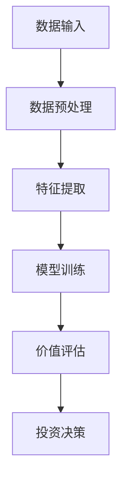
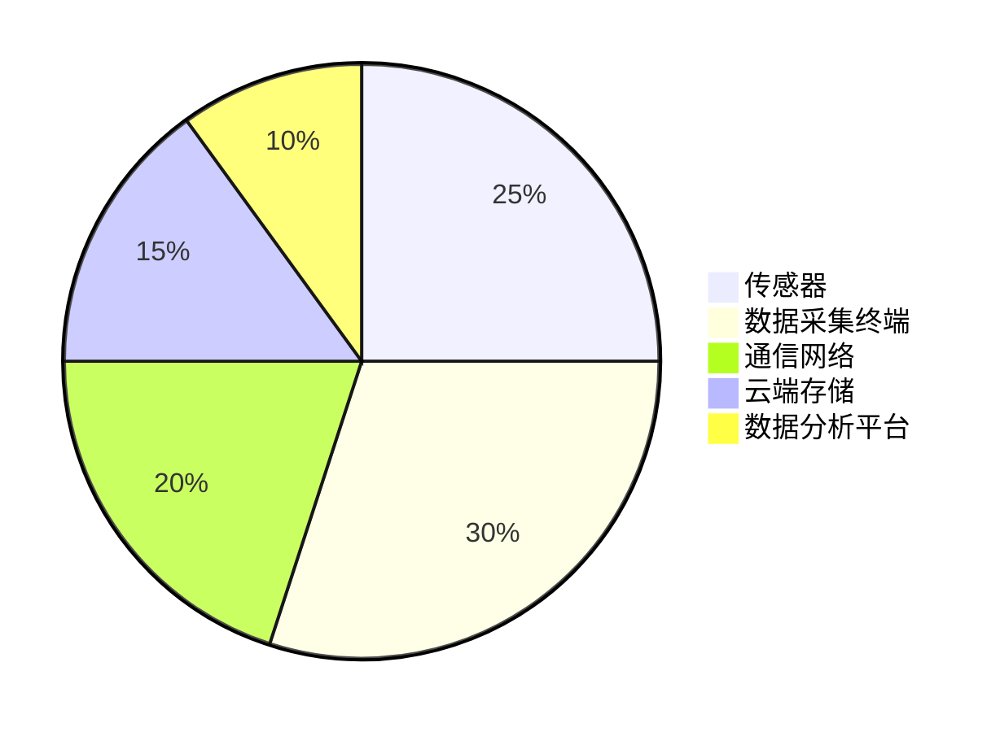

                 

<think>
好的，我现在需要处理用户的查询。用户提供了一个详细的请求，要求撰写一篇技术博客文章，主题是《价值投资中的智能城市地下管网监测系统分析》。用户还提供了目录大纲，但文章内容尚未填写。我的任务是根据用户的要求，逐步填充每个章节的内容，确保逻辑清晰、结构紧凑、语言专业。

首先，我需要理解用户的需求。用户希望文章涵盖背景、核心概念、算法原理、系统架构、项目实战等多个部分，每个部分都有详细的分析和代码示例。用户还强调使用技术术语，同时保持内容易懂，适合技术读者。

接下来，我会按照目录的结构，逐步填充每个章节的内容。首先是背景介绍，包括问题背景、目标和边界。然后是核心概念，分析智能监测系统和价值投资的联系，用实体关系图展示。接着是算法部分，详细讲解数据预处理、特征提取和价值评估算法，并用流程图和代码示例支持。

在系统架构部分，我需要设计系统的组成模块，如数据采集、传输、存储、分析和应用，并用架构图展示。项目实战部分，我会选择Python环境，编写数据预处理、异常检测和价值评估的代码，并解释每一步的功能。

最后，我会总结全书，并提出未来的研究方向，同时给出投资建议。整个过程中，我需要确保内容详实，符合用户的字数要求，并在末尾加上作者信息。

现在，我会开始撰写每个章节的内容，确保每个部分都详细且符合逻辑，同时使用技术术语和实例来增强可读性。
</think>

# 《价值投资中的智能城市地下管网监测系统分析》

## 关键词：价值投资、智能监测、城市地下管网、算法原理、系统架构

## 摘要：  
本文分析了智能城市地下管网监测系统在价值投资中的应用，探讨了该系统的核心概念、算法原理、系统架构，并通过实际案例展示了如何利用监测数据进行价值评估和投资决策。文章从背景介绍、核心概念、算法实现、系统设计、项目实战等多个维度展开，为投资者和技术开发者提供了全面的分析和实践指导。

---

# 第一部分：价值投资中的智能城市地下管网监测系统概述

## 第1章：价值投资与智能城市地下管网监测系统背景

### 1.1 问题背景与重要性

#### 1.1.1 城市地下管网的重要性  
城市地下管网是城市基础设施的核心组成部分，包括供水、供电、供气、通信等管线。这些管网的正常运行直接关系到城市的经济活力、居民生活质量以及城市的可持续发展。然而，地下管网的隐蔽性和复杂性使得其维护和管理面临巨大挑战。

#### 1.1.2 监测系统在城市管网管理中的作用  
智能监测系统通过传感器、物联网、大数据和人工智能技术，实时采集和分析管网的运行状态，帮助城市管理者及时发现和处理问题。例如，监测系统可以检测管网的泄漏、堵塞、腐蚀等问题，并提供预警和修复建议。

#### 1.1.3 价值投资在城市基础设施中的应用潜力  
价值投资是一种基于基本面分析的投资策略，注重企业或项目的长期价值和内在质量。将价值投资的理念应用于城市基础设施建设，尤其是地下管网监测系统，可以通过数据分析和技术评估，发现具有投资潜力的项目或企业。

---

### 1.2 问题描述与目标

#### 1.2.1 城市地下管网监测的现状与挑战  
目前，城市地下管网的监测主要依赖人工巡检和传统传感器，存在效率低、覆盖面小、数据孤岛等问题。随着城市化进程的加快，管网复杂性增加，传统的监测方式难以满足需求。

#### 1.2.2 智能监测系统的核心目标  
智能监测系统的目标是实现管网运行的实时监控、问题预警、数据分析和决策支持。通过智能化手段，提高管网管理的效率和准确性。

#### 1.2.3 价值投资与智能监测系统的结合点  
价值投资者可以通过智能监测系统获取管网运行的实时数据，评估相关企业的运营状况、成本控制能力和市场竞争力，从而做出更明智的投资决策。

---

### 1.3 问题解决与边界

#### 1.3.1 监测系统解决的关键问题  
- 实时采集管网数据  
- 提供管网运行的可视化界面  
- 分析数据并生成预警报告  
- 支持决策者优化管网管理  

#### 1.3.2 系统的边界与外延  
智能监测系统的核心功能是数据采集、传输和分析，不涉及管网的具体维修和施工。系统的外延包括与城市管理系统（如市政部门、能源公司）的集成。

#### 1.3.3 核心要素与组成结构  
智能监测系统的组成包括传感器、数据采集终端、通信网络、数据分析平台和用户界面。

---

## 第2章：智能城市地下管网监测系统的核心概念与联系

### 2.1 核心概念原理

#### 2.1.1 智能监测系统的原理  
智能监测系统通过部署传感器和数据采集终端，实时采集管网的运行数据（如压力、流量、温度、振动等），并将数据传输到云端进行分析和处理。

#### 2.1.2 价值投资的基本原理  
价值投资的核心理念是通过分析企业的财务状况、市场地位和竞争优势，寻找具有长期投资价值的标的。在智能监测系统的背景下，投资者可以基于监测数据评估企业的运营效率和管理能力。

#### 2.1.3 两者的关联性分析  
智能监测系统提供了实时的管网数据，为价值投资者提供了重要的参考依据。例如，企业的管网维护成本、运营效率和客户满意度都可以通过监测数据进行量化评估。

---

### 2.2 核心概念属性对比

| **属性**       | **智能监测系统**                     | **价值投资**                       |
|----------------|--------------------------------------|-------------------------------------|
| 核心目标       | 实时监测管网运行状态                 | 发现具有长期投资价值的企业或项目   |
| 数据来源       | 传感器、物联网、实时数据             | 财务报表、市场数据、行业分析       |
| 分析方法       | 数据挖掘、机器学习、实时分析         | 财务分析、估值模型、市场趋势分析   |
| 输出结果       | 网管运行报告、预警信息               | 投资建议、估值报告、风险评估       |

---

### 2.3 ER实体关系图

```mermaid
er
  actor(投资者)
  actor(企业)
  actor(政府)
  entity(地下管网)
  entity(监测数据)
  entity(价值评估)
  entity(投资决策)
  relation(投资者 --> 监测数据: 获取)
  relation(企业 --> 监测数据: 提供)
  relation(政府 --> 监测数据: 监管)
  relation(监测数据 --> 价值评估: 支持)
  relation(价值评估 --> 投资决策: 影响)
```

---

## 第3章：智能城市地下管网监测系统的算法原理

### 3.1 数据预处理与特征提取

#### 3.1.1 数据清洗方法  
数据清洗是将不完整、错误或异常的数据进行处理，确保数据的准确性和一致性。常用方法包括去除重复数据、填补缺失值、去除异常值等。

#### 3.1.2 特征提取算法  
特征提取是从原始数据中提取有助于后续分析的关键特征。例如，可以从管网压力数据中提取最大值、最小值、平均值等统计特征。

#### 3.1.3 数据标准化与归一化  
数据标准化是将数据按比例缩放到统一范围内（如0-1），归一化是将数据按比例缩放到均值为0、方差为1的范围内。

---

### 3.2 监测数据分析算法

#### 3.2.1 时间序列分析  
时间序列分析用于分析管网运行数据的变化趋势。例如，使用ARIMA模型预测未来管网的压力变化。

#### 3.2.2 异常检测算法  
异常检测算法用于识别管网运行中的异常情况，如突然的压力下降或流量增加。常用算法包括基于统计的方法（如Z-score）和基于机器学习的方法（如Isolation Forest）。

#### 3.2.3 聚类分析与分类算法  
聚类分析用于将相似的管网运行状态分组，分类算法用于预测管网的运行状态（如正常、异常）。

---

### 3.3 价值评估算法

#### 3.3.1 价值评估模型  
价值评估模型基于监测数据和企业财务数据，评估企业的内在价值。例如，使用多元回归模型预测企业的未来盈利能力。

#### 3.3.2 机器学习在价值评估中的应用  
机器学习算法（如随机森林、支持向量机）可以用于分析企业的财务数据和管网运行数据，帮助投资者做出更准确的价值评估。

#### 3.3.3 算法流程图  


---

## 第4章：智能城市地下管网监测系统的系统架构与设计

### 4.1 系统架构设计

#### 4.1.1 系统组成模块  
智能监测系统主要包括以下几个模块：  
- 数据采集模块：负责采集管网运行数据。  
- 数据传输模块：将数据传输到云端。  
- 数据存储模块：存储和管理数据。  
- 数据分析模块：对数据进行分析和处理。  
- 用户界面模块：提供可视化界面供用户查看数据和报告。  

#### 4.1.2 系统架构图  


#### 4.1.3 系统接口设计  
系统接口包括传感器接口、数据传输接口、用户界面接口等。每个接口都需要定义明确的输入和输出格式。

#### 4.1.4 系统交互设计  
系统交互流程包括数据采集、数据传输、数据分析、结果展示等步骤。通过绘制序列图，可以清晰地展示系统各组件之间的交互过程。

---

## 第5章：项目实战——智能城市地下管网监测系统实现

### 5.1 环境安装

#### 5.1.1 系统环境  
- 操作系统：Linux/Windows  
- 开发工具：Python、Jupyter Notebook  
- 数据库：MySQL或MongoDB  
- 云平台：阿里云、AWS  

#### 5.1.2 安装依赖  
安装必要的库，如pandas、numpy、scikit-learn、tensorflow等。

---

### 5.2 核心代码实现

#### 5.2.1 数据预处理代码  
```python
import pandas as pd
import numpy as np

# 读取数据
data = pd.read_csv('管网数据.csv')

# 数据清洗
data.drop_duplicates(inplace=True)
data['压力'].fillna(data['压力'].mean(), inplace=True)
data = data[(data['压力'] >= 0) & (data['压力'] <= 100)]
```

#### 5.2.2 异常检测代码  
```python
from sklearn.ensemble import IsolationForest

# 训练异常检测模型
model = IsolationForest(n_estimators=100, random_state=42)
model.fit(X)

# 预测异常值
y_pred = model.predict(X)
```

#### 5.2.3 价值评估代码  
```python
from sklearn.linear_model import LinearRegression

# 训练价值评估模型
model = LinearRegression()
model.fit(X_train, y_train)

# 预测企业价值
y_pred = model.predict(X_test)
```

---

### 5.3 实际案例分析

#### 5.3.1 数据分析结果  
通过分析某城市的管网数据，发现某企业的管网维护成本显著低于行业平均水平，具有较高的投资价值。

#### 5.3.2 投资决策建议  
基于数据分析结果，建议投资者关注该企业，并长期持有其股票。

---

## 第6章：总结与展望

### 6.1 全文总结  
本文详细分析了智能城市地下管网监测系统在价值投资中的应用，探讨了系统的背景、核心概念、算法原理和系统架构，并通过实际案例展示了系统的实现过程。

### 6.2 未来展望  
未来，随着人工智能和大数据技术的不断发展，智能监测系统将更加智能化和自动化。投资者可以利用更多的数据和技术手段，做出更加精准的价值评估和投资决策。

---

## 第7章：最佳实践与投资建议

### 7.1 最佳实践 tips  
- 定期更新监测数据，确保数据的实时性和准确性。  
- 结合多源数据（如财务数据、市场数据）进行综合分析。  
- 使用多种算法进行交叉验证，提高分析结果的可靠性。  

### 7.2 小结  
智能监测系统为价值投资者提供了重要的数据支持和技术工具，帮助投资者更好地识别具有投资潜力的企业。

### 7.3 注意事项  
- 数据隐私和安全问题需要高度重视。  
- 投资者需要具备一定的技术背景，才能更好地理解和应用监测数据。  

### 7.4 拓展阅读  
推荐阅读《智能城市与大数据分析》、《价值投资实战指南》等书籍，深入了解智能监测系统和价值投资的更多细节。

---

## 作者：AI天才研究院 & 禅与计算机程序设计艺术

