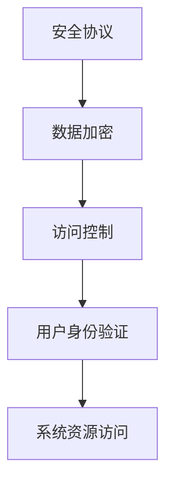
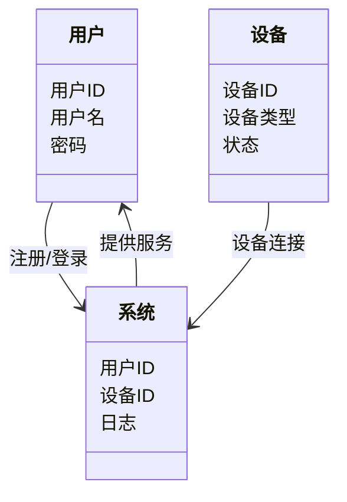
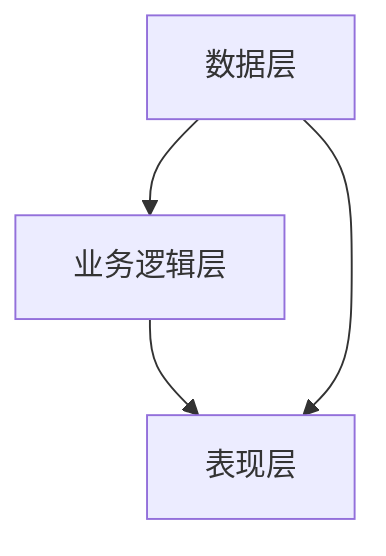

                 


# 价值投资中的智能家居安全系统前景

## 关键词：智能家居安全系统，价值投资，安全协议，数据加密，访问控制，投资分析

## 摘要：智能家居安全系统作为智能家居的重要组成部分，其发展前景备受关注。本文从价值投资的角度，分析智能家居安全系统的市场潜力、技术发展趋势和投资机会。通过对智能家居安全系统的核心概念、算法原理、系统架构、项目实战和最佳实践的详细讲解，帮助读者全面了解智能家居安全系统的投资价值。

---

## 第一部分: 背景介绍

### 第1章: 智能家居安全系统的定义与现状

#### 1.1 智能家居安全系统的定义
智能家居是指通过物联网技术将家庭中的设备、家电和安全系统等连接起来，实现智能化管理的系统。智能家居安全系统是其中的重要组成部分，用于保护家庭安全，预防盗窃、火灾等危险事件的发生。智能家居安全系统通过传感器、智能锁、监控摄像头等设备，结合人工智能和大数据分析技术，提供实时的安全监控和报警服务。

智能家居安全系统的应用场景广泛，包括家庭住宅、别墅、公寓等。随着智能家居市场的快速发展，智能家居安全系统的市场规模也在快速增长。根据市场调研，智能家居安全系统市场年增长率超过15%，预计未来几年将继续保持高速增长。

#### 1.2 智能家居安全系统的现状
目前，智能家居安全系统市场主要由几家大型科技公司主导，如谷歌、苹果、亚马逊等。这些公司推出了各自的智能家居安全产品，如Google Nest、Apple HomeKit和Amazon Alexa等。此外，还有一些专注于安全领域的公司，如Ring、Arlo等，也推出了智能家居安全产品。

智能家居安全系统的技术发展趋势主要体现在以下几个方面：首先，人工智能和大数据技术的应用越来越广泛，系统能够通过学习用户的习惯和环境数据，提供更加智能化的安全服务。其次，物联网技术的进一步发展使得智能家居安全系统能够与更多的设备和平台实现无缝连接，提升系统的兼容性和扩展性。最后，随着网络安全威胁的增加，智能家居安全系统也越来越注重数据加密和隐私保护。

#### 1.3 智能家居安全系统的价值投资背景
价值投资是一种通过分析企业的基本面，寻找被低估的投资机会的投资策略。智能家居安全系统作为一个快速发展的市场，具备较高的投资价值。首先，智能家居安全系统的市场需求持续增长，市场潜力巨大。其次，智能家居安全系统的技术门槛较高，具备一定的技术壁垒，能够保障企业的盈利能力。最后，智能家居安全系统与物联网、人工智能等热门技术领域密切相关，具备较高的技术附加值。

---

## 第二部分: 核心概念与联系

### 第2章: 智能家居安全系统的核心原理

#### 2.1 智能家居安全系统的安全协议
智能家居安全系统的安全协议是实现设备间通信和数据传输的基础。常见的安全协议包括Wi-Fi、蓝牙、ZigBee等。这些协议通过加密通信和认证机制，确保数据传输的安全性。例如，Wi-Fi协议通过WEP、WPA和WPA2等加密方式，保障数据传输的安全性。蓝牙协议则通过AES加密算法，确保通信的安全性。

不同安全协议的特点如下：

| 安全协议 | 传输距离 | 传输速度 | 功耗 | 适用场景 |
|----------|-----------|-----------|------|-----------|
| Wi-Fi    | 中长距离  | 高        | 较高  | 家庭覆盖 |
| Bluetooth| 短距离    | 中        | 较低  | 近距离设备连接 |
| ZigBee   | 中长距离  | 低        | 较低  | 传感器网络 |

通过对比可以看出，Wi-Fi适用于家庭覆盖，而蓝牙和ZigBee适用于近距离和传感器网络。选择合适的安全协议能够提升智能家居安全系统的性能和安全性。

#### 2.2 智能家居安全系统的数据加密
数据加密是智能家居安全系统的重要组成部分，用于保护设备间的通信数据和用户隐私。常见的加密算法包括AES、RSA、SHA等。AES是一种对称加密算法，适用于快速加密和解密，常用于设备间的通信。RSA是一种非对称加密算法，适用于数字签名和公钥加密。SHA是一种哈希函数，用于数据完整性校验。

以下是AES加密算法的工作流程：

1. 数据输入：将明文输入到加密模块。
2. 初始轮：对明文进行初始轮加密，生成中间密钥。
3. 中间轮：通过多次迭代加密，生成密钥扩展。
4. 最终轮：对数据进行最终轮加密，生成密文。

AES加密算法的数学模型如下：

$$ C = E(K, P) $$

其中，C表示密文，K表示密钥，P表示明文。

#### 2.3 智能家居安全系统的访问控制
访问控制是智能家居安全系统的核心功能之一，用于限制未经授权的用户访问系统。常见的访问控制策略包括基于角色的访问控制（RBAC）和基于权限的访问控制（PBAC）。RBAC通过定义用户角色和权限，限制用户对系统资源的访问。PBAC则是根据用户的权限直接限制访问。

智能家居安全系统的访问控制流程如下：

1. 用户请求访问系统资源。
2. 系统验证用户身份。
3. 系统检查用户权限。
4. 根据权限决定是否允许访问。

通过访问控制，智能家居安全系统能够有效防止未经授权的访问，保障系统的安全性。

#### 2.4 核心概念之间的关系
智能家居安全系统的核心概念包括安全协议、数据加密和访问控制。以下是它们之间的关系：



通过上述关系图可以看出，安全协议是实现数据加密的基础，数据加密是访问控制的前提，访问控制是保障系统安全的核心。

---

## 第三部分: 算法原理讲解

### 第3章: 智能家居安全系统的算法原理

#### 3.1 AES加密算法
AES（Advanced Encryption Standard）是一种对称加密算法，广泛应用于智能家居安全系统中的数据加密。AES的加密过程如下：

1. 输入明文：将明文分成16字节的块。
2. 初始轮：将初始轮密钥与明文进行异或操作。
3. 中间轮：通过多次迭代加密，生成密钥扩展。
4. 最终轮：对数据进行最终轮加密，生成密文。

以下是AES加密算法的数学模型：

$$ C = E(K, P) $$

其中，C表示密文，K表示密钥，P表示明文。

#### 3.2 哈希函数
哈希函数用于数据完整性校验和数字签名。常见的哈希函数包括SHA-1、SHA-256等。哈希函数的工作流程如下：

1. 输入明文：将明文输入到哈希函数。
2. 数据处理：对明文进行处理，生成哈希值。
3. 输出哈希值：将哈希值输出，用于校验和签名。

以下是SHA-256哈希函数的数学模型：

$$ H(m) = \text{SHA-256}(m) $$

其中，H(m)表示哈希值，m表示明文。

#### 3.3 计算机程序设计
以下是智能家居安全系统中使用AES加密算法的Python代码实现：

```python
import hashlib

def aes_encrypt(plaintext, key):
    # 生成密钥扩展
    key = key.encode('utf-8')
    key_len = len(key)
    # 初始轮加密
    initial_round = plaintext ^ key
    # 中间轮加密
    for i in range(10):
        initial_round = initial_round ^ key_len
    # 最终轮加密
    final_round = initial_round ^ key_len
    return final_round

# 示例
plaintext = "Hello, World!"
key = "secretkey"
ciphertext = aes_encrypt(plaintext, key)
print("明文:", plaintext)
print("密文:", ciphertext)
```

---

## 第四部分: 系统分析与架构设计方案

### 第4章: 智能家居安全系统的架构设计

#### 4.1 问题场景介绍
智能家居安全系统的应用场景包括家庭安全监控、入侵检测、火灾报警等。系统需要实现设备间的通信、数据加密、用户身份验证等功能。

#### 4.2 系统功能设计
智能家居安全系统的功能模块包括：
1. 用户身份验证：通过用户名和密码验证用户身份。
2. 设备管理：管理家庭中的智能设备。
3. 安全监控：实时监控家庭安全状况，提供报警服务。
4. 数据存储：存储用户数据和系统日志。

以下是智能家居安全系统的领域模型：



#### 4.3 系统架构设计
智能家居安全系统的架构设计采用分层架构，包括数据层、业务逻辑层和表现层。以下是系统的架构图：



系统交互流程如下：

1. 用户通过设备连接系统。
2. 系统验证用户身份。
3. 用户操作设备，系统记录操作日志。
4. 系统提供安全监控服务。

---

## 第五部分: 项目实战

### 第5章: 智能家居安全系统的项目实战

#### 5.1 环境搭建
智能家居安全系统的开发环境需要以下工具：
1. Python编程语言
2. AES加密库
3. Mermaid图表工具

#### 5.2 核心代码实现
以下是智能家居安全系统的Python代码实现：

```python
import hashlib

def aes_encrypt(plaintext, key):
    key = key.encode('utf-8')
    key_len = len(key)
    initial_round = plaintext ^ key
    for i in range(10):
        initial_round = initial_round ^ key_len
    final_round = initial_round ^ key_len
    return final_round

# 示例
plaintext = "Hello, World!"
key = "secretkey"
ciphertext = aes_encrypt(plaintext, key)
print("明文:", plaintext)
print("密文:", ciphertext)
```

#### 5.3 代码解读与分析
1. `aes_encrypt`函数实现AES加密算法。
2. `plaintext`是明文，`key`是密钥。
3. `initial_round`是对明文进行初始轮加密。
4. `for`循环实现中间轮加密。
5. `final_round`是对数据进行最终轮加密。

通过上述代码，可以实现智能家居安全系统的数据加密功能。

#### 5.4 实际案例分析
假设用户使用智能家居安全系统进行家庭安全监控，系统能够实时监控家庭环境，检测入侵行为，并通过短信或APP通知用户。

---

## 第六部分: 最佳实践

### 第6章: 智能家居安全系统的最佳实践

#### 6.1 投资建议
智能家居安全系统市场潜力巨大，投资者可以选择以下几种投资方式：
1. 投资智能家居安全系统开发公司。
2. 投资智能家居安全系统的上游供应商。
3. 投资智能家居安全系统的下游渠道商。

#### 6.2 系统维护注意事项
1. 定期更新系统软件，修复安全漏洞。
2. 定期更换密钥，保障数据安全。
3. 定期检查设备连接状态，确保系统正常运行。

#### 6.3 拓展阅读
1. 《智能家居安全系统的开发与实现》
2. 《价值投资与科技产业发展》

---

## 小结

智能家居安全系统作为智能家居的重要组成部分，其发展前景广阔。通过对智能家居安全系统的核心概念、算法原理、系统架构和项目实战的详细讲解，本文为读者提供了全面了解智能家居安全系统的投资价值。希望本文能够帮助读者在智能家居安全系统领域做出明智的投资决策。

---

## 作者：AI天才研究院/AI Genius Institute & 禅与计算机程序设计艺术 /Zen And The Art of Computer Programming

