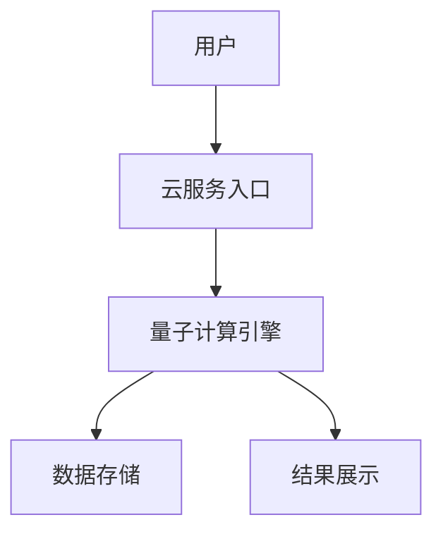
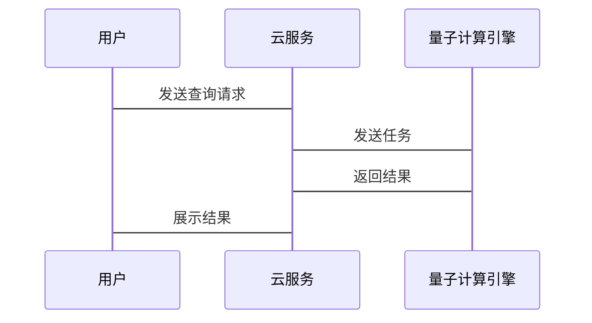

                 


# 价值投资中的量子计算机云服务市场分析

> 关键词：量子计算，云服务，价值投资，金融市场，投资策略

> 摘要：本文深入探讨了量子计算机云服务在价值投资中的应用，分析了量子计算的核心算法、数学模型以及其在金融市场中的潜力。通过结合市场现状、技术优势和投资策略，本文为投资者提供了基于量子计算的创新投资方法。

---

## 第1章: 量子计算与云服务的结合

### 1.1 量子计算的基本概念

#### 1.1.1 量子计算的定义与原理

量子计算是一种基于量子力学原理的计算方式，利用量子叠加和量子纠缠的特性，能够在某些特定问题上远超经典计算机的计算能力。量子计算机的核心在于其量子位（qubit），与经典计算机的二进制位（bit）不同，量子位可以同时处于多个状态的叠加态。

$$
\text{量子叠加态表示为：} \quad |0\rangle + |1\rangle
$$

量子计算的运算速度在处理复杂问题时具有显著优势，尤其是在大数据分析、优化问题和密码学等领域。

#### 1.1.2 量子计算机与经典计算机的区别

- **并行计算能力**：量子计算机可以同时处理多种可能性，而经典计算机需要逐一处理。
- **计算复杂度**：对于某些问题（如大数因式分解），量子计算机的复杂度远低于经典计算机。
- **量子纠缠**：量子计算机通过量子纠缠实现信息的高效传递，而经典计算机无法做到这一点。

#### 1.1.3 量子计算在云服务中的应用

量子计算云服务允许用户通过互联网访问量子计算机的能力，无需拥有实体量子计算机。这种模式降低了使用量子计算的门槛，使得更多的企业和个人能够利用量子计算的优势。

### 1.2 量子计算机云服务的现状

#### 1.2.1 量子计算机云服务的发展历程

量子计算机云服务的发展始于20世纪末，随着量子计算技术的成熟，各大科技公司开始提供量子云服务。目前，主要的量子云服务提供商包括IBM、Google和Rigetti等。

#### 1.2.2 当前市场的主要参与者

- **IBM**：提供基于超导回路的量子计算机云服务。
- **Google**：展示了量子霸权，即量子计算机在特定问题上的计算速度超过经典计算机。
- **Rigetti**：专注于量子退火机，用于优化问题的求解。

#### 1.2.3 量子计算机云服务的市场潜力

随着量子计算技术的不断进步，其在金融、物流、能源等领域的应用潜力巨大。尤其是在金融领域，量子计算可以用于投资组合优化、风险管理等复杂问题。

### 1.3 价值投资与量子计算机云服务的结合

#### 1.3.1 价值投资的基本概念

价值投资是一种投资策略，通过分析公司的基本面，寻找市场价格低于其内在价值的股票进行投资。其核心在于发现市场中的低估机会。

#### 1.3.2 量子计算机云服务对投资决策的影响

量子计算可以显著提高金融分析的效率和精度，帮助投资者更快地找到市场中的低估机会。例如，量子计算机可以快速分析大量数据，识别复杂的投资模式。

#### 1.3.3 量子计算机云服务在金融市场的应用前景

量子计算机可以用于优化投资组合、预测市场趋势、识别套利机会等。尤其是在高频交易和风险管理方面，量子计算具有显著的优势。

---

## 第2章: 量子计算的核心算法与数学模型

### 2.1 量子算法的基本原理

#### 2.1.1 量子门与量子电路

量子门是量子计算的基本操作单元，常见的量子门包括Hadamard门、Pauli门和CNOT门。量子电路由多个量子门组成，用于实现特定的量子算法。

$$
\text{Hadamard门的矩阵表示为：} \quad \frac{1}{\sqrt{2}} \begin{pmatrix} 1 & 1 \\ 1 & -1 \end{pmatrix}
$$

#### 2.1.2 量子叠加与量子纠缠

量子叠加允许量子位同时处于多个状态，而量子纠缠则允许多个量子位之间形成强关联。这些特性使得量子计算机能够处理复杂的问题。

#### 2.1.3 量子算法的优势

量子算法在某些特定问题上具有指数级的计算优势，例如Shor算法用于大数因式分解，Grover算法用于无序数据库搜索。

### 2.2 量子计算中的数学模型

#### 2.2.1 量子态的表示与叠加

量子态可以用向量表示，例如二维量子态可以表示为：

$$
|\psi\rangle = a|0\rangle + b|1\rangle
$$

其中，$a$ 和 $b$ 是复数，满足 $|a|^2 + |b|^2 = 1$。

#### 2.2.2 量子测量的概率计算

测量一个量子态会破坏其叠加态，测量结果为$|0\rangle$的概率为$|a|^2$，结果为$|1\rangle$的概率为$|b|^2$。

#### 2.2.3 量子算法的复杂度分析

量子算法的时间复杂度通常优于经典算法，例如Grover算法的时间复杂度为$O(\sqrt{N})$，而经典算法的时间复杂度为$O(N)$。

### 2.3 量子计算在金融分析中的应用

#### 2.3.1 量子线性回归模型

量子线性回归模型可以用于预测股票价格，其计算效率远高于经典线性回归模型。

#### 2.3.2 量子优化算法在投资组合中的应用

量子优化算法可以用于寻找最优投资组合，使得风险最小化或收益最大化。

#### 2.3.3 量子模拟在风险管理中的应用

量子模拟可以用于分析复杂的金融模型，例如信用风险和市场风险。

---

## 第3章: 量子计算机云服务的市场分析

### 3.1 市场现状与趋势

#### 3.1.1 量子计算机云服务的市场规模

目前，量子计算机云服务的市场规模较小，但随着技术的进步和应用的扩展，市场规模将快速增长。

#### 3.1.2 市场增长的驱动因素

- **技术进步**：量子计算机的性能不断提升。
- **市场需求**：金融、物流等领域对量子计算的需求增加。
- **政策支持**：政府对量子计算技术的支持。

#### 3.1.3 市场发展的主要障碍

- **技术瓶颈**：量子计算机的稳定性有待提高。
- **成本高昂**：量子计算机的建设和维护成本较高。
- **人才短缺**：量子计算专业人才稀缺。

### 3.2 主要参与者分析

#### 3.2.1 国际科技巨头的布局

- **IBM**：提供量子云服务，并致力于量子计算机的商业化。
- **Google**：展示了量子霸权，并计划推广量子云服务。
- **Rigetti**：专注于量子优化问题，提供云服务。

#### 3.2.2 国内企业的竞争态势

- **中国科学院**：在量子计算领域进行了大量研究。
- **百度**：推出了量子计算云平台。

#### 3.2.3 新兴创业公司的崛起

- ** startups**: 专注于量子计算的应用开发。

### 3.3 市场竞争格局

#### 3.3.1 技术竞争分析

- **技术领先者**：IBM和Google。
- **技术追赶者**：Rigetti和国内企业。

#### 3.3.2 价格竞争分析

- **价格战**：量子云服务的价格逐步下降，以吸引更多的用户。

#### 3.3.3 服务模式的竞争

- **按需付费**：用户可以根据需求选择服务。

### 3.4 未来市场发展趋势

#### 3.4.1 技术进步对市场的推动

- **量子计算机性能提升**：处理能力更强。
- **算法优化**：量子算法的效率不断提高。

#### 3.4.2 应用场景的拓展

- **金融领域**：量子计算在投资组合优化、风险管理中的应用。
- **其他领域**：物流、能源等领域的应用扩展。

#### 3.4.3 市场整合与并购趋势

- **并购整合**：量子计算领域的并购活动增加，以增强技术实力。

---

## 第4章: 价值投资中的量子计算机云服务应用

### 4.1 量子计算在价值投资中的作用

#### 4.1.1 技术优势

- **计算效率高**：量子计算可以快速分析大量数据。
- **优化能力**：量子优化算法可以帮助投资者找到最优投资组合。

#### 4.1.2 投资策略的创新

- **基于量子算法的投资策略**：利用量子计算进行市场预测和投资决策。

### 4.2 量子计算在金融分析中的应用

#### 4.2.1 投资组合优化

量子优化算法可以用于寻找最优投资组合，使得风险最小化或收益最大化。

#### 4.2.2 风险管理

量子模拟可以用于分析复杂的金融模型，例如信用风险和市场风险。

#### 4.2.3 套利机会

量子计算可以帮助投资者发现市场中的套利机会。

### 4.3 量子计算在价值投资中的实际案例

#### 4.3.1 投资组合优化

假设我们有一个包含10只股票的投资组合，目标是找到收益最大化的组合。通过量子优化算法，可以在短时间内找到最优解。

#### 4.3.2 市场预测

量子线性回归模型可以用于预测股票价格，其预测精度远高于经典线性回归模型。

---

## 第5章: 量子计算机云服务的系统架构设计

### 5.1 问题场景介绍

量子计算机云服务需要处理大量的金融数据，提供高效的计算服务。

### 5.2 系统功能设计

- **数据采集**：从金融市场获取实时数据。
- **算法处理**：运行量子算法进行数据分析。
- **结果展示**：将分析结果以可视化的方式呈现。

### 5.3 系统架构设计

#### 5.3.1 系统架构图



#### 5.3.2 系统接口设计

- **输入接口**：接收用户的查询请求。
- **输出接口**：返回量子计算的结果。

#### 5.3.3 系统交互流程



---

## 第6章: 项目实战

### 6.1 环境安装

- **量子计算库**：安装Qiskit库。
- **开发工具**：安装Jupyter Notebook。

### 6.2 核心实现

#### 6.2.1 量子算法实现

```python
from qiskit import QuantumCircuit, execute, Aer

# 创建量子电路
qc = QuantumCircuit(1, 1)

# 应用Hadamard门
qc.h(0)

# 测量
qc.measure(0, 0)

# 执行量子程序
simulator = Aer.get_backend('simulator')
job = execute(qc, simulator)
result = job.result()

# 输出结果
print(result.get_counts())
```

#### 6.2.2 应用案例分析

- **案例1**：投资组合优化。
- **案例2**：风险管理分析。

### 6.3 项目小结

通过项目实战，我们可以看到量子计算在金融分析中的巨大潜力。量子计算云服务的应用将极大地提升投资决策的效率和精度。

---

## 第7章: 总结与展望

### 7.1 本章总结

本文深入分析了量子计算的核心算法、数学模型以及其在金融市场的应用。量子计算云服务为价值投资提供了新的工具和方法，显著提高了投资决策的效率和精度。

### 7.2 未来展望

随着量子计算技术的不断进步和应用场景的拓展，量子计算云服务将在金融领域发挥越来越重要的作用。未来的研究方向包括优化算法、降低成本和人才培养。

### 7.3 投资建议

投资者应密切关注量子计算技术的发展，合理利用量子计算云服务，以获取更大的投资收益。

### 7.4 注意事项

- **技术风险**：量子计算技术尚未完全成熟，可能存在技术瓶颈。
- **市场风险**：量子计算云服务的市场尚处于发展阶段，存在不确定性。

### 7.5 拓展阅读

- **推荐书籍**：《量子计算机科学》
- **推荐网站**：IBM Quantum Experience

---

## 作者信息

作者：AI天才研究院/AI Genius Institute & 禅与计算机程序设计艺术/Zen And The Art of Computer Programming

