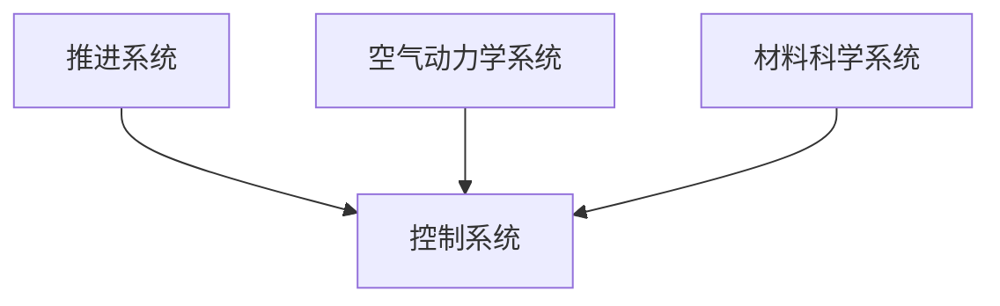
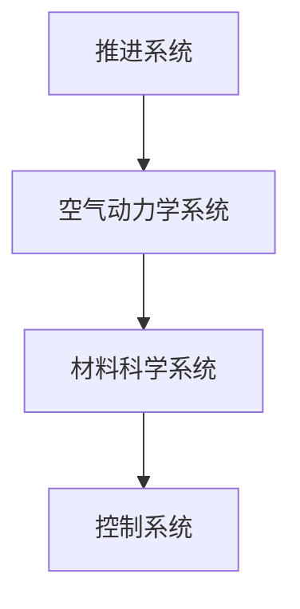

                 

# 价值投资中的高超音速民用航空技术前景

> **关键词**：价值投资，高超音速技术，民用航空，投资前景，技术分析

> **摘要**：随着科技的飞速发展，高超音速技术在民用航空领域的应用前景备受关注。本文从高超音速技术的基本原理、经济价值、投资机会等方面进行详细分析，探讨其在价值投资中的潜在机会与挑战。通过系统分析和案例研究，为投资者提供科学的决策依据。

---

## 第1章 高超音速技术与民用航空的背景介绍

### 1.1 高超音速技术的基本概念

高超音速技术是指飞行速度超过5倍音速（ Mach 5，约6174公里/小时）的飞行技术。这种技术的核心在于突破音障，实现超高速飞行，同时解决高温、空气动力学等问题。

#### 1.1.1 高超音速技术的定义

高超音速技术是指飞行器在大气层内或外层空间以超过5倍音速的速度飞行的技术。其关键在于突破音障，克服高温、空气动力学等挑战。

#### 1.1.2 高超音速技术的核心要素

高超音速技术的核心要素包括：
- **推进系统**：如 scramjet（冲压发动机）。
- **空气动力学设计**：优化飞行器形状以减少阻力。
- **材料科学**：耐高温、高强度的材料。

#### 1.1.3 高超音速技术的演进历程

高超音速技术起源于20世纪50年代，经历了从实验阶段到实际应用的逐步发展。近年来，随着技术进步，高超音速技术在民用航空领域的应用前景逐渐明朗。

### 1.2 高超音速技术在民用航空中的应用前景

#### 1.2.1 民用航空的现状与挑战

当前，民用航空面临燃油效率、噪音污染、飞行速度等问题。高超音速技术有望解决这些问题，提供更高效的飞行方案。

#### 1.2.2 高超音速技术对民用航空的潜在影响

高超音速技术将显著缩短飞行时间，提升燃油效率，并降低噪音污染。例如，从纽约到北京的飞行时间将缩短至约2小时。

#### 1.2.3 高超音速技术的市场价值与投资机会

高超音速技术的市场价值体现在其对航空业的颠覆性影响。投资者可以关注相关技术的研发公司和航空公司。

### 1.3 价值投资与高超音速技术的结合

#### 1.3.1 价值投资的基本原理

价值投资强调以低于内在价值的价格买入优质资产。在高超音速技术领域，投资者需要识别具有长期竞争优势的公司。

#### 1.3.2 高超音速技术的经济价值

高超音速技术的经济价值体现在其对航空业的革命性影响，包括更高的载客量、更低的运营成本和更短的飞行时间。

#### 1.3.3 价值投资在高超音速技术领域的应用

投资者应关注高超音速技术的研发进展、市场需求和政策支持，选择具有技术优势和市场潜力的公司进行投资。

### 1.4 本章小结

本章介绍了高超音速技术的基本概念、在民用航空中的应用前景以及其与价值投资的结合。高超音速技术的潜力巨大，投资者需抓住机会。

---

## 第2章 高超音速技术的核心原理与系统分析

### 2.1 高超音速技术的核心原理

#### 2.1.1 高超音速飞行的空气动力学原理

高超音速飞行器的空气动力学设计需要考虑高速气流下的压力、温度和阻力。通过优化设计，减少空气阻力，提高飞行效率。

#### 2.1.2 高超音速推进系统的原理

 scramjet（冲压发动机）通过高速气流压缩空气，与燃料混合燃烧，产生推力。其核心在于高效燃烧和气流控制。

#### 2.1.3 高超音速材料科学的关键技术

耐高温材料（如碳纤维复合材料）和高强度合金是高超音速技术的关键。这些材料能够承受数千摄氏度的高温，确保飞行器结构的完整性。

### 2.2 高超音速技术的系统架构

#### 2.2.1 高超音速飞行器的系统组成

高超音速飞行器由推进系统、空气动力学系统、材料科学系统和控制系统组成。各系统协同工作，确保飞行器的高效运行。

#### 2.2.2 高超音速系统的功能模块

- **推进模块**：负责产生推力。
- **空气动力学模块**：优化气流，减少阻力。
- **材料模块**：提供耐高温和高强度的结构支持。
- **控制系统**：协调各模块，确保飞行稳定性。

#### 2.2.3 高超音速系统的架构图

### 2.3 高超音速技术的数学模型与公式

#### 2.3.1 高超音速飞行的动力学方程

推力公式：
$$ F = m \cdot a $$

其中，\( F \) 是推力，\( m \) 是质量，\( a \) 是加速度。

#### 2.3.2 推进系统的效率计算公式

推进效率公式：
$$ \eta = \frac{F}{I} $$

其中，\( \eta \) 是效率，\( F \) 是推力，\( I \) 是燃料消耗率。

#### 2.3.3 材料科学的强度与耐高温模型

材料强度公式：
$$ S = \frac{F}{A} $$

其中，\( S \) 是应力，\( F \) 是力，\( A \) 是面积。

### 2.4 本章小结

本章详细分析了高超音速技术的核心原理，包括空气动力学、推进系统和材料科学。这些技术是实现高超音速飞行的关键。

---

## 第3章 高超音速技术的经济价值与投资分析

### 3.1 高超音速技术的经济价值分析

#### 3.1.1 高超音速技术的成本结构

高超音速技术的研发和生产成本较高，但其带来的经济效益显著。例如，缩短飞行时间可以提升票价和客流量。

#### 3.1.2 高超音速技术的市场需求

市场需求主要集中在高端航空服务和快速货运领域。随着技术成熟，市场需求将大幅增长。

#### 3.1.3 高超音速技术的经济效益

高超音速技术可以降低运营成本，提升航班频率和载客量，带来显著的经济效益。

### 3.2 高超音速技术的投资机会与风险

#### 3.2.1 高超音速技术的投资风险

- **技术风险**：高超音速技术尚未完全成熟，存在研发失败的风险。
- **市场风险**：市场需求可能不及预期。
- **政策风险**：政府政策的变化可能影响技术的应用。

#### 3.2.2 高超音速技术的市场机会

- **技术领先优势**：率先掌握高超音速技术的企业将占据市场主导地位。
- **政策支持**：政府可能提供资金和技术支持。

#### 3.2.3 高超音速技术的竞争优势

高超音速技术的竞争力体现在其速度和效率上，能够显著缩短飞行时间，提升用户体验。

### 3.3 价值投资策略与高超音速技术的结合

#### 3.3.1 价值投资的基本策略

投资者应关注高超音速技术的研发进展，选择具有技术优势和市场潜力的公司进行投资。

#### 3.3.2 高超音速技术的估值方法

基于未来现金流的贴现法，考虑技术成熟度和市场需求。

#### 3.3.3 高超音速技术的投资组合构建

投资者应分散投资，结合高超音速技术与其他相关产业，降低风险。

### 3.4 本章小结

本章分析了高超音速技术的经济价值和投资机会，强调投资者需关注技术风险和市场需求，制定科学的投资策略。

---

## 第4章 高超音速技术的系统分析与架构设计

### 4.1 高超音速技术的系统分析

#### 4.1.1 高超音速技术的系统分析

高超音速技术的系统分析需要考虑飞行器的空气动力学、推进系统、材料科学和控制系统。

#### 4.1.2 高超音速系统的功能模块

- **推进模块**：提供推力。
- **空气动力学模块**：优化气流。
- **材料模块**：提供耐高温和高强度支持。
- **控制系统**：协调各模块。

#### 4.1.3 高超音速系统的架构图

### 4.2 高超音速技术的系统架构设计

#### 4.2.1 问题场景介绍

高超音速飞行器需要在高速飞行中保持稳定性，同时克服高温和空气阻力。

#### 4.2.2 系统功能设计

- **空气动力学设计**：优化飞行器形状，减少阻力。
- **推进系统设计**：开发高效 scramjet。
- **材料科学设计**：选择耐高温材料。

#### 4.2.3 系统架构设计

### 4.3 高超音速技术的系统接口设计

#### 4.3.1 系统接口设计

各系统之间的接口设计需要确保信息传递和功能协同。

#### 4.3.2 系统交互设计

### 4.4 本章小结

本章详细分析了高超音速技术的系统架构设计，强调各系统协同工作的重要性。

---

## 第5章 高超音速技术的未来展望与投资建议

### 5.1 高超音速技术的未来发展趋势

#### 5.1.1 技术发展

高超音速技术将向更高效、更稳定的系统发展，材料科学和推进系统是关键。

#### 5.1.2 市场变化

市场需求将快速增长，高超音速技术将在高端航空服务和快速货运领域占据重要地位。

### 5.2 高超音速技术的投资建议

#### 5.2.1 长期投资

投资者应长期关注高超音速技术的研发进展和市场需求变化。

#### 5.2.2 风险管理

分散投资，避免过度集中在单一技术或公司。

#### 5.2.3 政策关注

密切关注政府政策和行业动态，抓住政策支持的机会。

### 5.3 本章小结

本章展望了高超音速技术的未来发展趋势，并提出了相应的投资建议，帮助投资者制定科学的投资策略。

---

## 第6章 项目实战：高超音速技术投资分析

### 6.1 项目背景介绍

#### 6.1.1 项目介绍

分析某高超音速技术公司，评估其技术实力、市场定位和财务状况。

### 6.2 项目分析

#### 6.2.1 技术分析

评估公司的推进系统、空气动力学设计和材料科学技术。

#### 6.2.2 市场分析

分析市场需求、竞争对手和市场定位。

#### 6.2.3 财务分析

评估公司的财务状况，包括收入、利润和研发投入。

### 6.3 投资建议

#### 6.3.1 投资策略

基于分析结果，制定投资策略，包括买入时机和投资比例。

#### 6.3.2 风险提示

提醒投资者注意技术风险和市场风险，制定风险管理策略。

### 6.4 本章小结

本章通过项目实战，帮助投资者掌握高超音速技术的投资分析方法。

---

## 第7章 总结与展望

### 7.1 总结

高超音速技术在民用航空领域的应用前景广阔，具有巨大的经济价值和投资潜力。投资者需关注技术发展和市场需求，制定科学的投资策略。

### 7.2 展望

未来，高超音速技术将更加成熟，市场需求将进一步扩大。投资者应抓住机会，积极参与高超音速技术的投资。

---

## 作者信息

作者：AI天才研究院/AI Genius Institute & 禅与计算机程序设计艺术/Zen And The Art of Computer Programming

---

**结语**：高超音速技术是未来航空业的核心技术，其在民用航空领域的应用将彻底改变航空业的格局。投资者需抓住这一机遇，通过价值投资的方式，实现长期稳定的收益。

