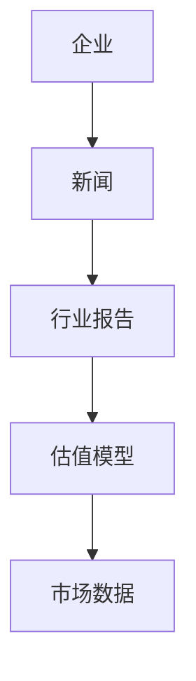
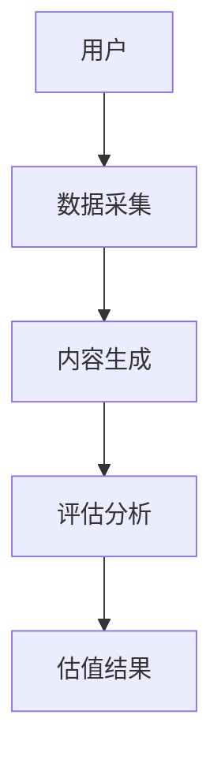
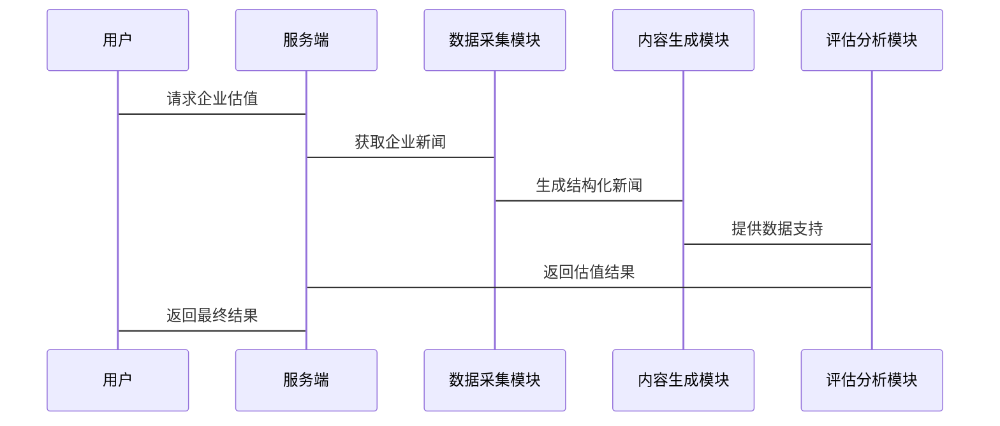

                 


# 企业估值中的AI驱动的自动化新闻写作平台评估

**关键词：** AI驱动、自动化新闻写作、企业估值、自然语言处理、生成式AI

**摘要：**  
本文探讨了AI驱动的自动化新闻写作平台在企业估值中的应用。通过分析新闻写作与企业估值的关联，详细阐述了生成式AI、自然语言处理等技术在企业估值中的应用原理，并通过实际案例分析，展示了如何利用自动化新闻写作平台提升企业估值的效率和准确性。本文还提供了系统架构设计、算法实现及项目实战，帮助读者深入了解AI驱动的新闻写作平台在企业估值中的实际应用。

---

## 第1章 背景介绍

### 1.1 问题背景
#### 1.1.1 传统企业估值方法的局限性
传统企业估值方法依赖于人工分析和经验判断，存在效率低、主观性强、数据处理能力有限等问题。特别是在处理大量非结构化数据（如新闻、行业报告）时，传统方法难以快速提取关键信息，导致估值结果的不准确性和滞后性。

#### 1.1.2 新闻写作与企业估值的关联性
企业新闻是影响市场情绪和企业估值的重要因素。通过自动化新闻写作，可以实时生成与企业相关的新闻内容，提取关键信息并快速应用于估值模型中。这不仅提高了估值效率，还增强了估值的客观性和准确性。

#### 1.1.3 AI技术在金融领域的应用现状
AI技术在金融领域的应用日益广泛，特别是在新闻分析、市场预测和企业估值方面。生成式AI和自然语言处理技术的结合，为自动化新闻写作提供了技术基础。

### 1.2 问题描述
#### 1.2.1 企业估值中的关键信息提取难点
企业估值需要依赖大量的外部信息，包括新闻、行业报告、社交媒体等。这些信息通常是非结构化的，人工提取效率低下，且容易遗漏关键信息。

#### 1.2.2 AI驱动的新闻写作平台的可行性
通过AI技术生成自动化新闻，可以快速提取企业相关的关键信息，并将其整合到估值模型中。这不仅提高了数据处理效率，还为估值提供了更多的数据支持。

#### 1.2.3 平台在企业估值中的潜力
自动化新闻写作平台可以实时生成与企业相关的新闻内容，帮助投资者快速了解企业的动态，从而提高估值的准确性和实时性。

### 1.3 问题解决
#### 1.3.1 AI驱动的新闻写作平台如何辅助企业估值
通过自动化新闻写作，平台可以快速生成与企业相关的新闻内容，并提取关键信息用于估值模型。这不仅提高了数据处理效率，还增强了估值的客观性和准确性。

#### 1.3.2 自动化新闻生成的技术实现路径
自动化新闻生成基于生成式AI和自然语言处理技术，通过训练大规模的数据集，生成符合语法规则的新闻内容。这些内容可以用于企业估值中的信息提取和分析。

#### 1.3.3 平台如何整合企业估值的关键数据
自动化新闻写作平台通过整合企业新闻、行业报告、社交媒体等数据，生成结构化的信息，为估值模型提供支持。

### 1.4 边界与外延
#### 1.4.1 企业估值的边界条件
企业估值的边界条件包括数据的完整性和准确性、模型的有效性以及市场的稳定性等。

#### 1.4.2 自动化新闻写作的适用范围
自动化新闻写作适用于结构化的新闻生成，但目前还难以完全替代人类记者的深度报道和分析。

#### 1.4.3 平台功能的扩展性分析
自动化新闻写作平台的功能可以扩展到更多的领域，如市场预测、风险评估等。

### 1.5 核心要素组成
#### 1.5.1 数据来源与处理
数据来源包括企业新闻、行业报告、社交媒体等，通过自然语言处理技术进行结构化处理。

#### 1.5.2 自然语言生成模型
基于生成式AI和深度学习模型，生成符合语法规则的新闻内容。

#### 1.5.3 企业估值算法
通过整合自动化新闻生成的内容，结合企业财务数据和市场信息，构建企业估值模型。

---

## 第2章 核心概念与联系

### 2.1 核心概念原理
#### 2.1.1 生成式AI的原理
生成式AI通过生成模型（如GPT）生成文本内容。模型通过大量数据训练，学习语言的结构和语义，从而生成符合语法规则的文本。

#### 2.1.2 自然语言处理技术
自然语言处理技术用于理解和分析文本内容，提取关键信息并进行结构化处理。

#### 2.1.3 企业估值模型的构建
企业估值模型结合自动化新闻生成的内容和传统财务数据，通过机器学习算法进行估值预测。

### 2.2 概念属性特征对比
| 概念       | 属性特征               |
|------------|------------------------|
| 生成式AI   | 基于深度学习，生成文本内容 |
| 自然语言处理 | 提取和分析文本信息     |
| 企业估值模型 | 结合多种数据进行预测   |

### 2.3 ER实体关系图


---

## 第3章 算法原理

### 3.1 算法流程
1. 数据预处理：对新闻文本进行分词、去停用词等处理。
2. 模型训练：基于生成式AI模型（如GPT）进行训练，生成符合语法规则的新闻内容。
3. 信息提取：通过自然语言处理技术提取关键信息。
4. 估值预测：结合提取的信息和财务数据，进行企业估值预测。

### 3.2 算法实现

#### 3.2.1 生成式AI模型
使用GPT模型进行新闻生成，代码如下：

```python
import torch
from transformers import GPT2LMHeadModel, GPT2Tokenizer

model_name = "gpt2"
tokenizer = GPT2Tokenizer.from_pretrained(model_name)
model = GPT2LMHeadModel.from_pretrained(model_name)

input_text = "公司名称：XYZ科技，行业：科技，最新财报：收入增长20%，净利润增长15%。"
inputs = tokenizer.encode(input_text, return_tensors="pt")

outputs = model.generate(inputs, max_length=100, do_sample=True)
print(tokenizer.decode(outputs[0], skip_special_tokens=True))
```

#### 3.2.2 自然语言处理模型
使用BERT模型进行文本分析，代码如下：

```python
from transformers import BertTokenizer, BertModel
import torch

tokenizer = BertTokenizer.from_pretrained('bert-base-uncased')
model = BertModel.from_pretrained('bert-base-uncased')

text = "公司名称：XYZ科技，行业：科技，最新财报：收入增长20%，净利润增长15%。"
inputs = tokenizer(text, return_tensors='pt', padding=True, truncation=True)
outputs = model(**inputs)
print(outputs.last_hidden_state)
```

#### 3.2.3 企业估值模型
结合自动化新闻生成的内容和财务数据，构建企业估值模型。例如，使用LSTM进行时间序列预测。

---

## 第4章 系统分析与架构设计

### 4.1 问题场景介绍
系统需要实现自动化新闻写作和企业估值的结合，提供实时的企业估值服务。

### 4.2 系统功能设计
1. 数据采集模块：采集企业新闻、行业报告等数据。
2. 内容生成模块：生成结构化的新闻内容。
3. 评估分析模块：结合生成的内容和财务数据，进行企业估值。
4. 用户交互模块：提供可视化界面，展示估值结果。

### 4.3 系统架构设计


### 4.4 接口设计
系统提供RESTful API接口，用于数据交互和结果查询。

### 4.5 交互序列图


---

## 第5章 项目实战

### 5.1 环境安装
安装Python和相关库：
```bash
pip install transformers torch
```

### 5.2 核心代码实现
#### 5.2.1 新闻生成代码
```python
from transformers import GPT2LMHeadModel, GPT2Tokenizer

model_name = "gpt2"
tokenizer = GPT2Tokenizer.from_pretrained(model_name)
model = GPT2LMHeadModel.from_pretrained(model_name)

def generate_news(company_info):
    inputs = tokenizer(company_info, return_tensors="pt")
    outputs = model.generate(inputs, max_length=100, do_sample=True)
    return tokenizer.decode(outputs[0], skip_special_tokens=True)
```

#### 5.2.2 信息提取代码
```python
from transformers import BertTokenizer, BertModel

tokenizer = BertTokenizer.from_pretrained('bert-base-uncased')
model = BertModel.from_pretrained('bert-base-uncased')

def extract_info(text):
    inputs = tokenizer(text, return_tensors='pt', padding=True, truncation=True)
    outputs = model(**inputs)
    return outputs.last_hidden_state
```

### 5.3 实际案例分析
以XYZ科技为例，通过自动化新闻写作生成新闻内容，并结合财务数据进行估值预测。

### 5.4 项目小结
通过项目实战，验证了AI驱动的新闻写作平台在企业估值中的实际应用效果。

---

## 第6章 最佳实践

### 6.1 小结
本文详细探讨了AI驱动的自动化新闻写作平台在企业估值中的应用，通过理论分析和实际案例，展示了平台的技术实现和应用价值。

### 6.2 注意事项
在实际应用中，需要注意数据的准确性和模型的可解释性，避免因为数据偏差导致的估值错误。

### 6.3 拓展阅读
推荐阅读相关领域的最新研究成果，如生成式AI在金融领域的应用、自然语言处理技术的优化等。

---

## 作者：AI天才研究院/AI Genius Institute & 禅与计算机程序设计艺术/Zen And The Art of Computer Programming

