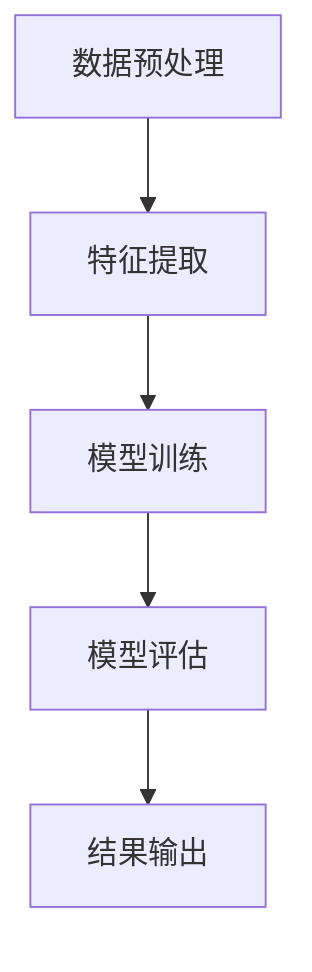
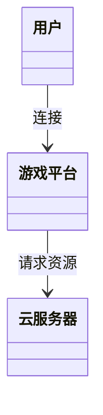

                 


# 《企业估值中的云游戏技术应用评估》

> 关键词：云游戏技术，企业估值，技术应用，算法原理，系统架构

> 摘要：本文探讨了云游戏技术在企业估值中的应用，详细分析了云游戏技术的核心概念、算法原理、系统架构以及项目实战。通过结合实际案例，本文展示了如何利用云游戏技术评估企业价值，为企业估值提供了新的思路和方法。

---

## 第一部分：云游戏技术与企业估值背景

### 第1章：云游戏技术概述

#### 1.1 云游戏的定义与技术背景

云游戏（Cloud Gaming）是一种基于云计算技术的游戏模式，玩家无需下载游戏，通过网络流式传输直接在终端设备上运行游戏。其核心技术包括虚拟化技术、边缘计算、低延迟网络优化等。云游戏的兴起源于人们对随时随地畅玩游戏的需求，以及对高性能硬件的依赖降低的需求。

云游戏的核心特点如下：
- **按需扩展**：通过云计算资源的弹性分配，满足不同用户数量和游戏性能的需求。
- **低延迟**：通过边缘计算和CDN（内容分发网络）技术，降低网络延迟，提升用户体验。
- **跨平台支持**：云游戏可以在手机、PC、平板等多种设备上运行，无需特定硬件配置。

云游戏在企业估值中的应用，主要体现在通过技术评估企业游戏的市场潜力、用户活跃度、运营成本等方面，从而为企业估值提供数据支持和技术依据。

---

#### 1.2 云游戏在企业估值中的应用背景

企业估值是企业在市场上的价值评估，通常包括资产、收入、用户数量、技术优势等多个因素。传统的企业估值方法主要依赖财务数据和市场分析，而云游戏技术的引入为企业估值提供了新的视角。

云游戏技术在企业估值中的应用背景包括：
1. **数据驱动的决策**：通过实时用户行为数据，企业可以更精准地评估游戏的市场表现。
2. **动态调整能力**：云游戏的弹性资源分配使得企业可以根据市场反馈快速调整游戏运营策略。
3. **降低估值不确定性**：通过技术手段优化用户体验，减少因硬件性能不足导致的用户流失，从而提高企业估值的准确性。

云游戏技术的应用不仅提升了企业估值的准确性，还为企业提供了更加灵活的运营模式，使其能够更快地响应市场变化。

---

#### 1.3 云游戏技术与企业估值的结合

云游戏技术与企业估值的结合主要体现在以下几个方面：
1. **用户行为分析**：通过云游戏平台收集用户行为数据，分析用户的活跃度、付费习惯等，为企业的收入预测提供依据。
2. **资源利用率评估**：通过云游戏平台的资源使用情况，评估企业的运营成本和资源分配效率。
3. **市场潜力预测**：结合云游戏的覆盖范围和用户群体，预测游戏的市场潜力，从而影响企业的估值。

通过云游戏技术，企业可以在更短的时间内获取更精准的用户反馈，从而优化游戏设计和运营策略，提升企业估值的准确性和可靠性。

---

## 第二部分：云游戏技术应用评估的核心概念与联系

### 第2章：云游戏技术评估的核心概念

#### 2.1 云游戏技术评估的关键指标

在企业估值中，云游戏技术的评估指标是衡量其技术优劣和应用效果的重要依据。以下是云游戏技术评估的关键指标：

1. **计算性能**：
   - **定义**：指云游戏平台处理游戏逻辑和图形渲染的能力。
   - **评估方法**：通过服务器的CPU和GPU利用率、响应时间等指标进行评估。
   - **重要性**：计算性能直接影响游戏的流畅度和用户体验。

2. **网络延迟**：
   - **定义**：用户操作到游戏反馈的时间延迟。
   - **评估方法**：通过ping值、丢包率等网络指标进行评估。
   - **重要性**：网络延迟是影响用户游戏体验的关键因素。

3. **用户行为分析**：
   - **定义**：通过分析用户的操作日志，了解用户的活跃度、留存率、付费率等。
   - **评估方法**：使用数据分析工具（如机器学习算法）进行用户行为建模。
   - **重要性**：用户行为数据是企业估值的重要依据，直接影响收入预测。

#### 2.2 云游戏技术评估指标对比分析

为了更好地理解云游戏技术评估指标的差异和联系，我们可以通过对比分析来明确每个指标的特征和作用。

##### 表2-1：云游戏技术评估指标对比

| 评估指标 | 定义 | 评估方法 | 重要性 |
|----------|------|----------|--------|
| 计算性能 | 处理游戏逻辑和图形的能力 | CPU/GPU利用率、响应时间 | 高 |
| 网络延迟 | 用户操作到反馈的时间 | ping值、丢包率 | 高 |
| 用户行为 | 用户的操作日志分析 | 数据建模、机器学习 | 中高 |

##### 图2-1：云游戏技术评估指标的ER实体关系图

```mermaid
er
actor 用户
role 用户行为
participant 云游戏平台
relationship 用户行为属于云游戏平台
```

---

## 第三部分：云游戏技术应用评估的算法原理

### 第3章：云游戏技术评估的算法原理

#### 3.1 云游戏评估算法概述

在企业估值中，云游戏技术的评估需要借助算法来分析数据并得出结论。常用的算法包括回归分析、聚类分析、时间序列分析等。其中，回归分析是最常用的算法之一。

##### 图3-1：回归分析模型流程图



#### 3.2 云游戏评估算法的实现步骤

##### 3.2.1 数据预处理

数据预处理是算法实现的基础，主要包括数据清洗、特征工程等步骤。

1. **数据清洗**：
   - 删除重复数据。
   - 处理缺失值。
2. **特征工程**：
   - 选择关键特征（如CPU利用率、网络延迟等）。
   - 对特征进行标准化或归一化处理。

##### 3.2.2 特征提取

特征提取是通过数据分析工具从原始数据中提取有意义的特征。例如，使用机器学习算法提取用户行为特征。

##### 3.2.3 模型训练

模型训练是通过算法对特征数据进行训练，得到一个能够预测企业估值的模型。

##### 3.2.4 模型评估

模型评估是通过测试数据验证模型的准确性和可靠性。

---

#### 3.3 云游戏评估算法的数学模型

回归分析是一种常用的统计方法，用于建立自变量与因变量之间的关系模型。在云游戏评估中，回归分析常用于预测企业估值。

##### 线性回归模型

$$ y = \beta_0 + \beta_1x_1 + \beta_2x_2 + \cdots + \beta_nx_n + \epsilon $$

其中：
- $y$ 是因变量（企业估值）。
- $x_i$ 是自变量（如计算性能、网络延迟等）。
- $\beta_i$ 是回归系数。
- $\epsilon$ 是误差项。

---

## 第四部分：云游戏技术应用评估的系统分析与架构设计

### 第4章：云游戏技术评估系统设计

#### 4.1 问题场景介绍

在企业估值中，云游戏技术的应用面临以下问题：
1. **数据采集复杂**：如何高效采集和处理大量的用户行为数据。
2. **模型优化困难**：如何提高回归分析模型的准确性和泛化能力。
3. **系统架构设计**：如何设计一个高效的云游戏评估系统。

#### 4.2 系统功能设计

##### 4.2.1 领域模型



##### 4.2.2 系统架构设计

```mermaid
archi
    客户端 --> 中间件: 请求游戏
    中间件 --> 云服务器: 请求资源
    云服务器 --> 数据库: 存储数据
```

##### 4.2.3 系统接口设计

系统接口设计包括用户接口、游戏平台接口、云服务器接口等。通过API实现各模块之间的通信。

##### 4.2.4 系统交互流程图

```mermaid
sequence
    用户 -> 游戏平台: 请求游戏
    游戏平台 -> 中间件: 请求资源
    中间件 -> 云服务器: 请求资源
    云服务器 -> 中间件: 返回资源
    中间件 -> 游戏平台: 返回资源
    游戏平台 -> 用户: 游戏运行
```

---

## 第五部分：云游戏技术应用评估的项目实

### 第5章：云游戏技术评估的项目实

#### 5.1 环境安装

项目实战需要安装以下环境：
1. Python 3.8+
2. NumPy、Pandas、Scikit-learn 等数据处理库。
3. Mermaid 和 Markdown 编辑器。

#### 5.2 核心代码实现

以下是回归分析模型的Python代码实现：

```python
import numpy as np
from sklearn.linear_model import LinearRegression
from sklearn.metrics import mean_squared_error

# 数据预处理
data = np.array([[1, 2], [2, 3], [3, 4], [4, 5]])
X = data[:, 0:-1]
y = data[:, -1]

# 模型训练
model = LinearRegression()
model.fit(X, y)

# 模型预测
y_pred = model.predict(X)

# 模型评估
mse = mean_squared_error(y, y_pred)
print("均方误差：", mse)
print("回归系数：", model.coef_)
print("回归截距：", model.intercept_)
```

#### 5.3 代码应用解读与分析

通过上述代码，我们可以得到回归模型的均方误差、回归系数和截距，从而评估云游戏技术对企业估值的影响。

#### 5.4 实际案例分析

以某云游戏企业为例，通过收集用户行为数据，建立回归模型，预测企业的估值。

#### 5.5 项目总结

本项目通过实际案例展示了云游戏技术在企业估值中的应用，验证了回归分析模型的有效性，为企业估值提供了新的思路。

---

## 第六部分：总结与建议

### 6.1 总结

本文详细探讨了云游戏技术在企业估值中的应用，从背景介绍、核心概念、算法原理到系统架构和项目实战，为企业估值提供了全面的技术支持。

### 6.2 最佳实践

1. **数据采集**：确保数据的准确性和完整性。
2. **模型优化**：通过交叉验证等方法提高模型的准确性和泛化能力。
3. **系统架构**：设计高效的系统架构，确保系统的稳定性和可扩展性。

### 6.3 注意事项

- 数据质量直接影响模型的准确性，需谨慎处理数据。
- 模型的泛化能力是关键，需避免过拟合和欠拟合。

### 6.4 拓展阅读

建议读者进一步阅读相关技术文献，深入学习云游戏技术和企业估值的结合应用。

---

## 作者信息

作者：AI天才研究院/AI Genius Institute & 禅与计算机程序设计艺术/Zen And The Art of Computer Programming

---

通过以上结构，我们可以系统地了解云游戏技术在企业估值中的应用，从理论到实践，为企业估值提供了新的思路和技术支持。

