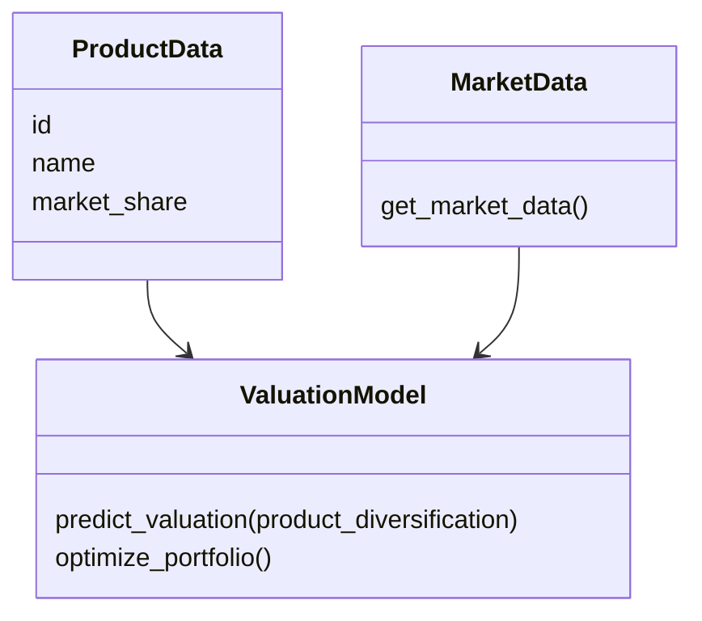
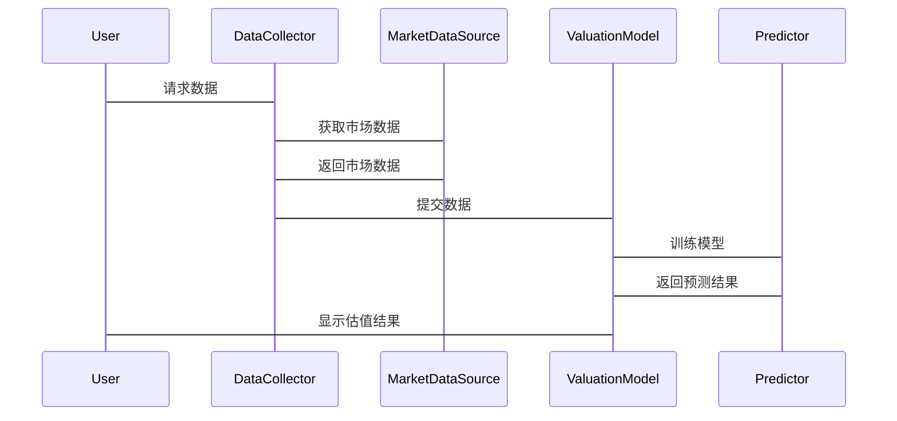

                 


# 企业估值中的产品多元化影响

## 关键词：产品多元化，企业估值，风险管理，收益增长，竞争力提升，组合优化，动态调整

## 摘要：  
产品多元化是企业在复杂市场环境中提高抗风险能力和实现可持续增长的重要策略。本文通过分析产品多元化对企业估值的影响，揭示了如何通过优化产品组合来提升企业价值。文章从核心概念、算法原理、系统架构到实际案例，全面阐述了产品多元化与企业估值的关系，并提出了相应的优化策略和风险管理建议。

---

# 目录

1. **背景介绍**  
   - 1.1 问题背景  
   - 1.2 问题描述  
   - 1.3 问题解决  
   - 1.4 边界与外延  
   - 1.5 核心要素组成  

2. **核心概念与联系**  
   - 2.1 多元化产品对企业估值的影响机制  
   - 2.2 产品多元化与企业估值的关联性分析  
   - 2.3 多元化产品与企业估值的关系模型  

3. **算法原理**  
   - 3.1 多元化产品组合优化算法  
   - 3.2 企业估值预测模型  
   - 3.3 算法实现与应用  

4. **系统分析与架构设计**  
   - 4.1 问题场景介绍  
   - 4.2 系统功能设计  
   - 4.3 系统架构设计  
   - 4.4 系统接口与交互设计  

5. **项目实战**  
   - 5.1 实际案例分析  
   - 5.2 环境安装与数据准备  
   - 5.3 系统实现与结果分析  

6. **最佳实践**  
   - 6.1 总结与小结  
   - 6.2 注意事项  
   - 6.3 拓展阅读  

---

## 1. 背景介绍

### 1.1 问题背景

企业在市场中生存和发展，离不开对其估值的准确评估。企业估值不仅是投资者评估企业价值的重要指标，也是企业制定战略决策的重要依据。然而，单一产品的企业在面对市场波动时往往显得脆弱，而多元化产品战略则能够有效分散风险，提升企业的抗风险能力和市场竞争力。

### 1.2 问题描述

随着市场竞争的加剧，企业单纯依靠单一产品往往难以持续发展。多元化产品战略通过多样化的产品组合，可以有效降低市场风险，提升企业的收益稳定性。然而，如何量化产品多元化对估值的具体影响，如何构建有效的多元化产品组合优化模型，是当前企业估值领域的重要研究方向。

### 1.3 问题解决

本文将从以下几个方面进行探讨：  
1. 分析多元化产品组合对风险和收益的具体影响；  
2. 构建基于多元化产品的企业估值模型；  
3. 提出产品组合优化策略，以最大化企业估值。

### 1.4 边界与外延

- **边界条件**：本文仅关注多元化产品对估值的影响，不考虑企业其他业务或外部经济环境的变化。  
- **外延分析**：多元化产品对企业估值的影响是动态的，需结合市场环境、企业战略和管理能力进行综合评估。

### 1.5 核心要素组成

- **产品多元化**：产品的多样性、市场覆盖范围和产品线的互补性。  
- **企业估值**：包括市盈率、市净率、市值等核心指标。  
- **影响机制**：风险分散、收益增长、市场竞争力提升。

---

## 2. 核心概念与联系

### 2.1 多元化产品对企业估值的影响机制

多元化产品能够通过以下方式影响企业估值：  
1. **风险分散**：多样化的产品组合可以降低单一产品市场波动对企业整体估值的影响。  
2. **收益增长**：不同产品在不同市场周期的表现互补，提升整体收益的稳定性。  
3. **竞争力提升**：多元化产品能够满足更广泛客户群体的需求，增强企业的市场地位。

### 2.2 产品多元化与企业估值的关联性分析

- **正向影响**：多元化产品能够提升企业的抗风险能力，增强投资者信心，从而提升估值。  
- **潜在风险**：过度多元化可能导致资源分散，管理难度增加，反而影响估值。

### 2.3 多元化产品与企业估值的关系模型

构建一个简单的多元线性回归模型来描述二者的关系：  
$$ E = \beta_0 + \beta_1 D + \beta_2 R + \epsilon $$  
其中，  
- \( E \) 表示企业估值，  
- \( D \) 表示产品多元化程度，  
- \( R \) 表示企业收益，  
- \( \epsilon \) 表示误差项。

---

## 3. 算法原理

### 3.1 多元化产品组合优化算法

1. **数据收集**：收集各产品的市场表现数据。  
2. **计算相关性**：分析产品之间的相关性，避免过度集中的风险。  
3. **构建模型**：基于多元线性回归模型优化产品组合。  
4. **评估结果**：通过回测分析验证模型的有效性。

### 3.2 企业估值预测模型

使用多元线性回归模型预测企业估值：  
$$ Valuation = \alpha + \beta_1 \times Product\_Diversification + \beta_2 \times Market\_Risk $$  

### 3.3 算法实现与应用

```python
import pandas as pd
import numpy as np
from sklearn.linear_model import LinearRegression

# 数据准备
data = pd.DataFrame({
    'Product_Diversification': [0.2, 0.5, 0.8, 0.3],
    'Market_Risk': [0.1, 0.2, 0.15, 0.25],
    'Valuation': [100, 150, 200, 120]
})

# 模型训练
model = LinearRegression()
model.fit(data[['Product_Diversification', 'Market_Risk']], data['Valuation'])

# 预测结果
new_data = pd.DataFrame({
    'Product_Diversification': [0.6],
    'Market_Risk': [0.2]
})
prediction = model.predict(new_data)
print(f'预测估值：{prediction[0]:.2f}')
```

---

## 4. 系统分析与架构设计

### 4.1 问题场景介绍

企业希望通过优化产品组合来提升估值，但如何量化多元化产品对估值的具体影响是关键。

### 4.2 系统功能设计

使用mermaid类图展示系统功能模块：



### 4.3 系统架构设计

采用分层架构设计：


### 4.4 系统接口与交互设计

使用mermaid序列图展示交互流程：



---

## 5. 项目实战

### 5.1 实际案例分析

以某科技公司为例，分析产品线扩展对估值的影响：

1. **环境安装**：安装Python和相关库。  
2. **数据准备**：收集各产品的市场表现数据。  
3. **模型实现**：构建多元线性回归模型。  
4. **结果分析**：通过回测验证模型的有效性。

### 5.2 环境安装与数据准备

```bash
pip install pandas numpy scikit-learn
```

```python
import pandas as pd
import numpy as np
from sklearn.linear_model import LinearRegression

# 数据准备
data = pd.DataFrame({
    'Product_Diversification': [0.2, 0.5, 0.8, 0.3],
    'Market_Risk': [0.1, 0.2, 0.15, 0.25],
    'Valuation': [100, 150, 200, 120]
})
```

### 5.3 系统实现与结果分析

```python
model = LinearRegression()
model.fit(data[['Product_Diversification', 'Market_Risk']], data['Valuation'])

# 预测结果
new_data = pd.DataFrame({
    'Product_Diversification': [0.6],
    'Market_Risk': [0.2]
})
prediction = model.predict(new_data)
print(f'预测估值：{prediction[0]:.2f}')
```

---

## 6. 最佳实践

### 6.1 总结与小结

产品多元化是提升企业估值的重要策略，但需要结合市场环境和企业实际情况进行优化。本文通过构建模型和实际案例分析，验证了多元化产品对企业估值的正向影响。

### 6.2 注意事项

- **适度多元化**：避免过度分散资源，影响核心业务。  
- **风险管理**：定期评估产品组合，及时调整策略。  
- **动态优化**：根据市场变化和企业目标，持续优化产品组合。

### 6.3 拓展阅读

- 建议阅读《企业多元化战略》和《风险管理与投资组合优化》等书籍，深入理解多元化战略的实施和优化。

---

## 作者

作者：AI天才研究院/AI Genius Institute & 禅与计算机程序设计艺术/Zen And The Art of Computer Programming

---

以上内容详细阐述了产品多元化对企业估值的影响，并通过理论分析、算法实现和实际案例展示了如何优化产品组合以提升企业价值。

