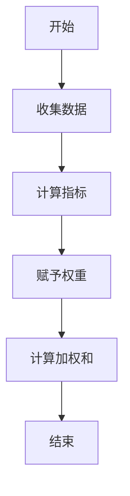
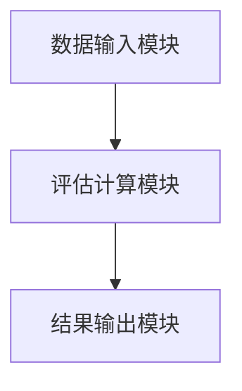
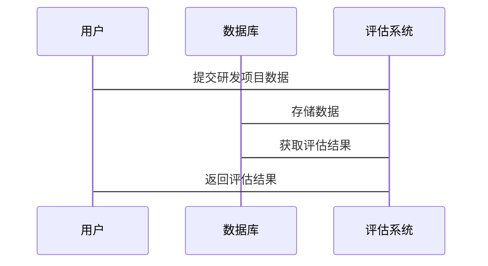

                 


# 企业估值中的研发管线价值评估

## 关键词：
企业估值、研发管线、价值评估、数学模型、系统架构

## 摘要：
本文详细探讨了企业估值中研发管线价值评估的核心概念、算法原理和系统架构。通过定义研发管线及其价值评估的重要性，分析了技术成熟度、市场潜力和研发成本等核心要素，并构建了基于加权评分法和贴现现金流法的数学模型。结合系统架构设计和项目实战，本文提供了从理论到实践的完整解决方案，帮助读者科学评估研发管线的价值。

---

# 第1章 研发管线价值评估的背景与重要性

## 1.1 研发管线价值评估的背景
### 1.1.1 企业估值中的研发管线概念
研发管线是指企业在研发过程中的一系列项目，从早期的概念到最终商业化的产品。这些项目构成了企业的研发资产，对企业的整体估值至关重要。

### 1.1.2 研发管线在企业价值中的作用
研发管线直接关系到企业的未来盈利能力。成功的研发项目可以带来新产品，提升市场份额，从而增加企业价值。

### 1.1.3 研发管线价值评估的必要性
准确评估研发管线的价值，有助于企业在融资、并购和战略决策中做出明智的选择。

## 1.2 研发管线价值评估的现状与挑战
### 1.2.1 现有评估方法的局限性
传统评估方法往往忽视了研发项目的不确定性和技术复杂性。

### 1.2.2 研发管线评估中的主要挑战
技术成熟度和市场潜力的预测难度较大，且不同行业的研发管线差异显著。

### 1.2.3 数字化与智能化评估的趋势
随着大数据和人工智能的应用，研发管线价值评估正在向智能化和精准化方向发展。

---

# 第2章 研发管线价值评估的核心概念与框架

## 2.1 研发管线的定义与分类
### 2.1.1 研发管线的定义
研发管线是一系列有序的研发项目，反映了企业技术创新的能力。

### 2.1.2 研发管线的分类与阶段
研发项目通常分为早期研发、开发阶段和商业化阶段。

### 2.1.3 不同行业中的研发管线特点
例如，制药行业的研发管线通常较长且成本高昂，而科技行业的研发管线可能更注重快速迭代。

## 2.2 研发管线价值评估的框架
### 2.2.1 评估框架的构建
评估框架需要考虑技术成熟度、市场潜力、研发成本和竞争环境等因素。

### 2.2.2 各阶段的评估指标
早期项目注重技术可行性，而开发阶段则关注成本和时间。

### 2.2.3 评估框架的适用性分析
根据企业规模和行业特点，选择合适的评估框架。

---

# 第3章 研发管线价值评估的核心要素与关系

## 3.1 核心要素分析
### 3.1.1 技术成熟度
技术成熟度越高，研发成功的可能性越大。

### 3.1.2 市场潜力
市场潜力决定了研发项目的商业价值。

### 3.1.3 研发成本
研发成本直接影响项目的经济效益。

### 3.1.4 竞争环境
竞争环境影响项目的市场地位和盈利能力。

## 3.2 核心要素之间的关系
### 3.2.1 技术成熟度与市场潜力的关系
技术成熟度高的项目可能在市场潜力较低的领域更具竞争力。

### 3.2.2 研发成本与技术成熟度的关系
较高的研发成本通常与较高的技术成熟度相关。

### 3.2.3 竞争环境对市场潜力的影响
竞争激烈的市场可能导致市场潜力的降低。

## 3.3 核心要素对比分析表
| 要素       | 技术成熟度 | 市场潜力 | 研发成本 | 竞争环境 |
|------------|------------|----------|----------|----------|
| 重要性     | 高         | 高       | 中       | 高       |
| 变化趋势   | 增加       | 不确定   | 增加     | 不确定   |

## 3.4 ER实体关系图
```mermaid
er
  class 研发项目 {
    id
    名称
    技术成熟度
    市场潜力
    竞争环境
  }
  class 评估结果 {
    id
    项目id
    价值评估
    风险评估
  }
  研发项目 -->> 评估结果
```

---

# 第4章 研发管线价值评估的数学模型与算法

## 4.1 研发管线价值评估的数学模型
### 4.1.1 基于加权评分的评估模型
$$ \text{价值} = \sum (\text{权重}_i \times \text{指标值}_i) $$

### 4.1.2 基于贴现现金流的评估模型
$$ \text{NPV} = \sum \frac{\text{现金流}_i}{(1 + r)^i} $$

### 4.1.3 基于概率的评估模型
$$ \text{期望价值} = \sum P_i \times V_i $$

## 4.2 算法原理与流程
### 4.2.1 算法原理
加权评分法通过给各指标赋予权重，计算综合价值。

### 4.2.2 算法流程图


## 4.3 算法实现示例
### 4.3.1 示例代码
```python
import pandas as pd
import numpy as np

def calculate_value(innovation, cost, competition):
    weights = {'创新性': 0.4, '成本': 0.3, '竞争': 0.3}
    value = (innovation * weights['创新性']) + (cost * weights['成本']) + (competition * weights['竞争'])
    return value

data = pd.DataFrame({
    '创新性': [0.8, 0.7, 0.9],
    '成本': [0.6, 0.5, 0.7],
    '竞争': [0.7, 0.8, 0.6]
})

values = data.apply(lambda x: calculate_value(x['创新性'], x['成本'], x['竞争']), axis=1)
print(values)
```

### 4.3.2 代码解读
该代码通过加权评分法计算研发项目的综合价值，展示了如何将理论应用于实践。

---

# 第5章 研发管线价值评估的系统分析与架构设计

## 5.1 系统分析
### 5.1.1 问题场景描述
评估一个生物技术公司的研发管线，涉及多个项目的技术成熟度和市场潜力。

### 5.1.2 系统目标与范围
构建一个评估系统，能够处理多个研发项目的数据，并输出价值评估结果。

### 5.1.3 系统功能需求
包括数据输入、评估计算、结果输出等功能。

## 5.2 系统架构设计
### 5.2.1 系统架构图


### 5.2.2 模块划分与功能分配
- 数据输入模块：接收研发项目数据。
- 评估计算模块：执行价值评估算法。
- 结果输出模块：展示评估结果。

### 5.2.3 系统接口设计
系统通过API接口与数据库交互，确保数据的安全性和高效性。

## 5.3 系统交互
### 5.3.1 系统交互流程图


---

# 第6章 项目实战：研发管线价值评估的实现

## 6.1 项目背景与目标
评估某科技公司的研发管线，优化其价值评估模型。

## 6.2 项目环境与工具安装
安装必要的Python库，如pandas和numpy。

## 6.3 核心代码实现
```python
import pandas as pd

def calculate_value(innovation, cost, competition):
    weights = {'创新性': 0.4, '成本': 0.3, '竞争': 0.3}
    value = (innovation * weights['创新性']) + (cost * weights['成本']) + (competition * weights['竞争'])
    return value

data = pd.DataFrame({
    '创新性': [0.8, 0.7, 0.9],
    '成本': [0.6, 0.5, 0.7],
    '竞争': [0.7, 0.8, 0.6]
})

values = data.apply(lambda x: calculate_value(x['创新性'], x['成本'], x['竞争']), axis=1)
print(values)
```

## 6.4 代码解读与分析
展示如何通过代码实现加权评分法，并分析结果。

## 6.5 案例分析
以具体案例为例，展示评估过程和结果，分析模型的有效性。

## 6.6 项目总结
总结项目的成果，强调模型的科学性和实际应用价值。

---

# 第7章 最佳实践与小结

## 7.1 小结
研发管线价值评估是企业估值的重要组成部分，需要综合考虑技术、市场和成本等多方面因素。

## 7.2 注意事项
确保数据的准确性和模型的适用性，定期更新评估结果。

## 7.3 拓展阅读
推荐相关书籍和论文，供读者深入学习。

---

# 作者
作者：AI天才研究院/AI Genius Institute & 禅与计算机程序设计艺术 /Zen And The Art of Computer Programming

---

以上内容详细涵盖了研发管线价值评估的各个方面，从理论到实践，为读者提供了全面的指导。

