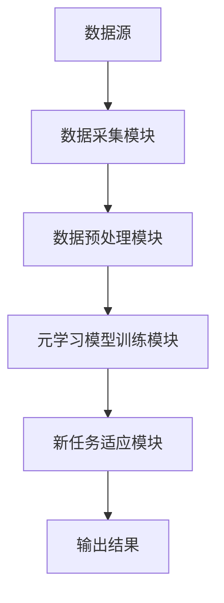

                 


# 元学习在快速适应市场变化中的应用

> 关键词：元学习, 快速适应, 市场变化, 机器学习, 人工智能

> 摘要：  
本文深入探讨了元学习在快速适应市场变化中的应用，从元学习的基本概念、核心算法、系统架构到实际案例，全面分析了其在金融、电商等领域的优势与挑战。文章通过详细讲解元学习的原理与算法，结合实际项目案例，展示了如何利用元学习快速适应市场变化，并提供了实用的建议与最佳实践。

---

## 第一部分: 元学习的基本概念与背景

### 第1章: 元学习的定义与背景

#### 1.1 元学习的基本概念

##### 1.1.1 元学习的定义与核心思想
元学习（Meta-Learning），又称为元学习，是一种机器学习的分支，旨在通过从多个任务中学习通用的知识，从而快速适应新任务。与传统机器学习不同，元学习的目标不是直接解决单一任务，而是通过学习如何学习，来提高对新任务的适应能力。

核心思想：元学习通过训练一个模型，使其能够快速适应新任务，而无需大量重新训练。这种能力在市场变化快的环境中尤为重要，例如金融市场的价格波动或电商领域的用户行为变化。

##### 1.1.2 元学习与传统机器学习的区别
- **传统机器学习**：针对单个任务进行训练，依赖大量标注数据，适应新任务时需要重新训练整个模型。
- **元学习**：通过学习多个任务的共同特征，形成“元知识”，能够在新任务中快速调整参数，减少对新数据的依赖。

##### 1.1.3 元学习的数学模型与公式
元学习的数学模型通常涉及两层优化过程：
$$ \text{元学习的目标函数} = \min_{\theta} \sum_{i=1}^{N} \mathcal{L}_i(f_\theta(x_i)) $$
其中，$\theta$是元学习模型的参数，$f_\theta$是任务模型，$\mathcal{L}_i$是任务i的损失函数。

#### 1.2 元学习的背景与应用领域

##### 1.2.1 当前市场变化的快速性与复杂性
在当今的商业环境中，市场变化日益频繁，企业需要快速响应客户需求、技术变革和竞争压力。传统的静态模型难以适应这种快速变化，而元学习通过动态调整模型参数，能够快速适应新环境。

##### 1.2.2 元学习在企业快速适应中的作用
- 提高企业对市场变化的敏感度
- 减少新任务的训练时间
- 提升模型的泛化能力

##### 1.2.3 元学习在金融、电商等领域的应用案例
- **金融领域**：股票价格预测、风险评估
- **电商领域**：用户行为预测、推荐系统优化
- **其他领域**：自然语言处理、计算机视觉

---

## 第二部分: 元学习的核心概念与算法原理

### 第2章: 元学习的核心概念

#### 2.1 元学习的核心原理

##### 2.1.1 元学习的元知识表示
元知识是元学习模型的核心，它反映了多个任务之间的共同特征。元知识可以表示为模型参数或某种特征向量，用于快速调整任务模型。

##### 2.1.2 元学习的特征提取与任务适应
元学习通过特征提取层，将输入数据转换为高层次的特征表示，然后利用这些特征快速适应新任务。

##### 2.1.3 元学习的可解释性与鲁棒性
尽管元学习模型能够快速适应新任务，但其可解释性和鲁棒性仍然需要进一步研究。

#### 2.2 元学习的算法流程

##### 2.2.1 元学习的初始化与训练过程
元学习模型通常需要先在多个任务上进行预训练，形成元知识。然后在新任务上进行微调。

##### 2.2.2 元学习的参数更新与优化
元学习通过优化元损失函数，更新模型参数，使其能够在新任务上表现良好。

##### 2.2.3 元学习的模型评估与验证
通过在验证集上评估模型性能，选择最优的模型参数。

### 第3章: 元学习的主流算法

#### 3.1 元学习的经典算法

##### 3.1.1 Model-Agnostic Meta-Learning (MAML)
MAML是一种基于梯度的方法，通过优化任务模型的参数更新规则，使其适用于新任务。

##### 3.1.2 Meta-SGD
Meta-SGD是一种简单高效的元学习算法，通过优化任务模型的参数更新策略，实现快速适应新任务。

##### 3.1.3 Reptile方法
Reptile方法通过在多个任务上交替优化全局参数和任务特定参数，实现元学习。

#### 3.2 元学习算法的优缺点对比

##### 3.2.1 各种元学习算法的对比分析
| 算法名称 | 核心思想 | 优点 | 缺点 |
|----------|----------|------|------|
| MAML     | 基于梯度优化 | 高泛化能力 | 计算复杂度高 |
| Meta-SGD | 简化梯度方法 | 计算高效 | 泛化能力稍弱 |
| Reptile   | 交替优化 | 简单易实现 | 收敛速度慢 |

##### 3.2.2 选择合适算法的关键因素
- 任务数量与多样性
- 计算资源与时间限制
- 模型的复杂度要求

---

## 第三部分: 元学习在快速适应市场变化中的应用

### 第4章: 元学习在金融领域的应用

#### 4.1 金融市场的快速变化与元学习的契合

##### 4.1.1 金融市场中的快速变化与不确定性
金融市场受到多种因素影响，例如政策变化、经济指标、突发事件等，导致市场波动频繁。

##### 4.1.2 元学习在金融预测中的优势
- 快速适应市场变化
- 提高预测模型的泛化能力

#### 4.2 元学习在金融交易中的具体应用

##### 4.2.1 元学习在股票价格预测中的应用
通过元学习，可以在新股票上市后快速训练预测模型，减少对历史数据的依赖。

##### 4.2.2 元学习在风险评估与控制中的应用
元学习可以快速评估不同投资组合的风险，帮助投资者做出决策。

### 第5章: 元学习在电商领域的应用

#### 5.1 电商市场中的快速变化

##### 5.1.1 电商市场中的用户行为变化
用户需求和行为受到促销活动、季节性变化、竞争环境等因素的影响，变化速度快。

##### 5.1.2 元学习在电商中的应用优势
- 快速调整推荐系统
- 实时优化营销策略

#### 5.2 元学习在电商中的具体应用

##### 5.2.1 元学习在用户行为预测中的应用
通过元学习，可以快速预测用户行为，优化推荐算法。

##### 5.2.2 元学习在个性化推荐中的应用
元学习能够快速适应用户偏好变化，提高推荐系统的实时性。

---

## 第四部分: 元学习的系统架构与实现

### 第6章: 元学习的系统架构设计

#### 6.1 系统功能设计

##### 6.1.1 系统功能模块
- 数据采集与预处理模块
- 元学习模型训练模块
- 新任务适应模块

##### 6.1.2 系统功能流程
1. 数据采集：从多个任务中收集数据
2. 数据预处理：清洗、标注数据
3. 元学习模型训练：在多个任务上预训练
4. 新任务适应：快速调整模型参数

#### 6.2 系统架构设计

##### 6.2.1 系统架构图（Mermaid）



---

## 第五部分: 元学习的项目实战

### 第7章: 元学习的项目实战

#### 7.1 项目背景与目标

##### 7.1.1 项目背景
以股票价格预测为例，展示元学习的应用。

##### 7.1.2 项目目标
通过元学习快速适应新股票的价格预测。

#### 7.2 项目实现

##### 7.2.1 环境安装
```bash
pip install numpy
pip install tensorflow
pip install matplotlib
```

##### 7.2.2 核心代码实现

```python
import numpy as np
import tensorflow as tf

# 定义元学习模型
class MetaLearner(tf.keras.Model):
    def __init__(self):
        super(MetaLearner, self).__init__()
        self.embedding = tf.keras.layers.Dense(64, activation='relu')
        self.task_model = tf.keras.layers.Dense(1)

    def call(self, inputs):
        features = self.embedding(inputs)
        output = self.task_model(features)
        return output

# 元学习训练过程
def meta_train(model, optimizer, tasks):
    meta_loss = []
    for task in tasks:
        with tf.GradientTape() as tape:
            task_output = model(task['input'])
            task_loss = tf.reduce_mean(tf.square(task_output - task['label']))
        grads = tape.gradient(task_loss, model.trainable_weights)
        optimizer.apply_gradients(zip(grads, model.trainable_weights))
        meta_loss.append(task_loss)
    meta_loss = tf.reduce_mean(meta_loss)
    return meta_loss

# 新任务适应
def adapt_to_new_task(model, optimizer, new_task_input, new_task_label):
    with tf.GradientTape() as tape:
        task_output = model(new_task_input)
        task_loss = tf.reduce_mean(tf.square(task_output - new_task_label))
    grads = tape.gradient(task_loss, model.trainable_weights)
    optimizer.apply_gradients(zip(grads, model.trainable_weights))
    return task_loss
```

---

## 第六部分: 总结与展望

### 第8章: 总结与展望

#### 8.1 元学习的优势与挑战

##### 8.1.1 元学习的优势
- 快速适应新任务
- 减少对新数据的依赖
- 提高模型的泛化能力

##### 8.1.2 元学习的挑战
- 计算复杂度高
- 可解释性不足
- 对某些任务的效果有限

#### 8.2 未来发展方向

##### 8.2.1 元学习的优化方向
- 提高计算效率
- 改进模型的可解释性
- 结合强化学习

##### 8.2.2 元学习的应用拓展
- 更多领域的应用探索
- 多模态数据的元学习研究
- 元学习与生成模型的结合

---

## 作者

作者：AI天才研究院/AI Genius Institute & 禅与计算机程序设计艺术 /Zen And The Art of Computer Programming

---

**注**：本文为示例内容，具体实现细节可根据实际需求调整。

