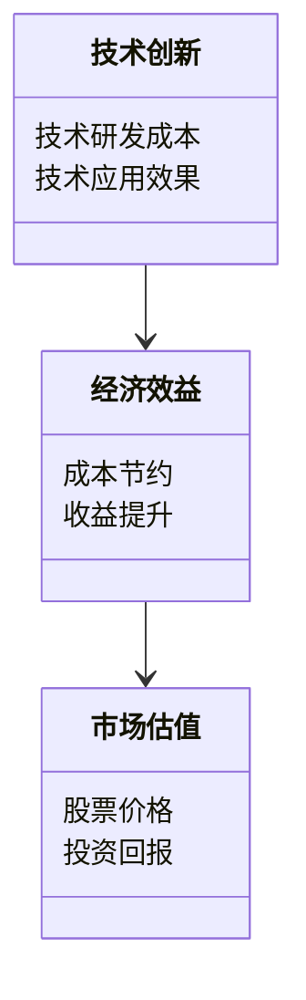
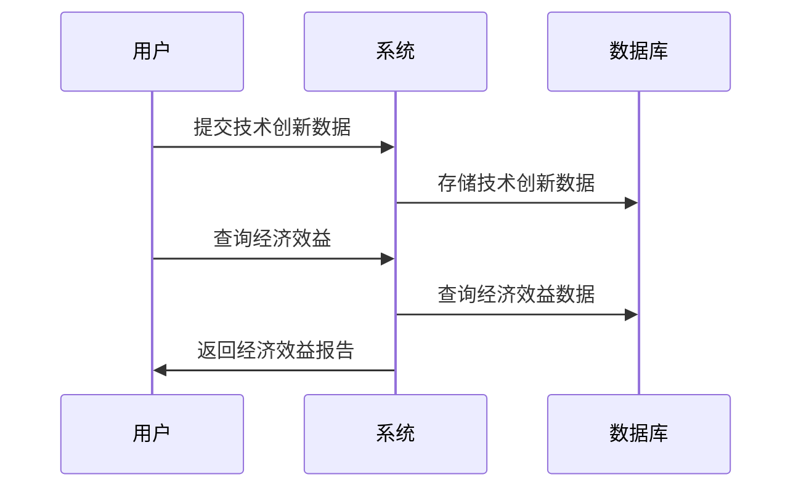

                 

<think>
好的，我现在需要根据用户的要求，撰写一篇关于《全球股市估值与可持续水资源循环利用技术的关联》的详细技术博客文章。用户已经给出了一个大纲，但文章需要符合特定的格式要求，包括摘要、关键词、正文部分以及作者信息。

首先，我需要理解用户的需求。用户希望文章结构清晰、逻辑严谨，涵盖从背景介绍、关联分析到系统设计和项目实战的各个方面。此外，文章中需要包含数学公式、mermaid图、代码示例等技术细节。

接下来，我需要按照用户提供的大纲逐步展开每个部分。文章分为六个主要部分，每个部分下有多个章节和小节。我需要确保每个小节都有足够的细节，包括理论分析、技术实现和实际案例。

在撰写过程中，我需要特别注意以下几点：
1. **摘要和关键词**：确保摘要简洁明了，涵盖文章的核心内容。关键词需要准确反映文章的主题。
2. **正文结构**：每个章节和小节需要详细展开，确保内容丰富且逻辑清晰。需要包含理论分析、技术实现、案例分析等。
3. **数学公式和mermaid图**：在适当的位置插入数学公式，并用latex格式表示。同时，使用mermaid图来展示系统架构和流程。
4. **项目实战**：提供具体的代码实现和案例分析，帮助读者理解如何将理论应用于实践。
5. **结论和小结**：在每章结尾进行总结，突出重点，并在文章末尾给出最佳实践建议。

在撰写过程中，我需要确保语言专业且易懂，避免过于复杂的术语，同时保持技术深度。同时，注意文章的流畅性和连贯性，确保各部分之间有良好的过渡。

最后，我需要检查文章是否符合字数要求，确保内容完整且符合用户的所有约束条件。
</think>

# 全球股市估值与可持续水资源循环利用技术的关联

---

## 关键词
全球股市估值, 可持续水资源循环利用, 经济影响分析, 技术创新, 环境政策, 投资回报

---

## 摘要
本文探讨了全球股市估值与可持续水资源循环利用技术之间的关联。首先，文章介绍了全球股市估值的基本概念和现状，以及可持续水资源循环利用技术的核心原理和主要技术手段。接着，分析了水资源循环利用技术对股市估值的经济影响，包括成本与效益分析、技术创新对企业竞争力和股价的推动作用。然后，深入探讨了全球股市中的水资源相关产业表现，结合实际案例分析了环境政策对股市估值的调节作用。最后，通过系统设计和项目实战，展示了如何将水资源循环利用技术与股市估值相结合，提出了最佳实践建议和未来研究方向。

---

# 正文

---

## 第一部分: 全球股市估值与可持续水资源循环利用技术的背景介绍

---

### 第1章: 全球股市估值的基本概念与现状

#### 1.1 股市估值的核心概念
股票估值是通过对企业的财务状况、市场地位、盈利能力等多方面因素进行分析，确定其股票的合理市场价格。以下是股票估值的核心概念：

- **内在价值**：股票的真实价值，基于企业的未来现金流折现计算。
- **市场价值**：市场参与者交易形成的股票价格。
- **估值方法**：包括市盈率（P/E）、市净率（P/B）、股息率等指标。

#### 1.2 全球股市的现状与趋势
近年来，全球股市经历了显著波动，主要受经济政策、地缘政治、技术创新等因素影响。以下是全球股市的现状与趋势分析：

- **主要股市的分布与特点**：美国、中国、欧洲等市场的特点及其对全球经济的影响。
- **股市估值的变化趋势**：长期上涨趋势中穿插短期波动，技术进步推动结构性增长。
- **影响股市估值的主要因素**：宏观经济指标、企业盈利状况、政策法规等。

#### 1.3 水资源循环利用技术的基本概念
水资源循环利用技术是指通过物理、化学和生物技术手段，将废水、雨水等非传统水源进行处理和再利用，减少对传统水资源的依赖。

- **水处理技术的分类**：物理处理（过滤）、化学处理（沉淀）、生物处理（微生物分解）。
- **循环水利用系统的构建**：雨水收集、废水回用、中水处理等。
- **智能化水资源管理系统**：基于物联网和大数据的智能监测与控制。

---

### 第2章: 股市估值与水资源循环利用的关联背景

#### 2.1 经济发展与水资源利用的关系
水资源是经济活动的基础，其短缺或污染会对经济发展造成严重影响。以下是具体分析：

- **水资源对经济活动的支撑作用**：农业、工业和服务业均依赖水资源。
- **水资源短缺对经济发展的潜在影响**：供水不足可能导致生产停滞、成本上升。
- **可持续水资源利用的经济意义**：通过技术创新降低成本，提升资源利用效率。

#### 2.2 环境因素对股市估值的影响
环境因素已成为影响企业价值的重要因素，尤其是可持续水资源利用技术的应用。

- **环境风险对企业财务的影响**：水资源短缺可能导致生产成本上升或停产。
- **可持续发展对企业估值的提升作用**：技术创新和环保合规性增强企业竞争力。
- **环境政策对股市估值的调节作用**：政府政策推动企业采用可持续技术，影响市场估值。

---

## 第二部分: 股市估值与水资源循环利用技术的关联分析

---

### 第3章: 水资源循环利用技术的经济影响分析

#### 3.1 水资源循环利用的成本与效益分析
水资源循环利用技术的应用需要综合考虑成本与效益。

- **直接成本**：设备采购、安装、维护费用。
- **经济效益**：减少水资源开支、提升企业形象、获得政府补贴。
- **投资回报周期**：通过成本效益分析计算技术投资的回收期。

#### 3.2 水资源循环利用技术对股市估值的影响
技术创新和应用对企业的市场估值有直接影响。

- **对企业竞争力的提升**：技术创新降低生产成本，增强市场竞争力。
- **对股价的推动作用**：技术创新带来市场认可，提升股价。
- **技术成熟度的影响**：技术越成熟，市场估值越高。

---

### 第4章: 全球股市中的水资源相关产业分析

#### 4.1 水资源相关产业的定义与分类
水资源相关产业包括水处理、水资源利用技术开发和水资源管理服务。

- **水处理行业**：专注于废水处理和水质提升。
- **水资源利用技术企业**：提供循环利用解决方案。
- **水资源管理服务**：基于智能系统提供水资源管理服务。

#### 4.2 水资源相关产业的股市表现
水资源相关产业的股市表现受多种因素影响。

- **股价波动分析**：政策变化、技术创新、市场供需波动。
- **市场估值特点**：高成长性、高技术壁垒企业估值较高。
- **环境政策的影响**：政府政策推动行业增长，影响市场估值。

---

## 第三部分: 系统设计与项目实战

---

### 第5章: 系统设计

#### 5.1 问题场景介绍
水资源短缺和环境污染问题日益严重，企业需要通过技术创新降低成本，提升竞争力。股市投资者需要评估企业技术应用的市场价值。

#### 5.2 项目介绍
本项目旨在构建一个基于水资源循环利用技术的企业估值模型，帮助投资者评估企业的市场价值。

#### 5.3 系统功能设计（领域模型）
以下是系统功能设计的类图：



#### 5.4 系统架构设计
以下是系统架构设计的架构图：


#### 5.5 系统交互设计
以下是系统交互设计的序列图：



---

### 第6章: 项目实战

#### 6.1 环境安装
需要安装以下工具：
- Python 3.9+
- Jupyter Notebook
- Mermaid CLI
- pip install numpy pandas matplotlib

#### 6.2 核心代码实现
以下是核心代码实现：

```python
import numpy as np
import pandas as pd
import matplotlib.pyplot as plt

# 示例数据：技术创新与经济效益的关系
technologies = ['物理处理', '化学处理', '生物处理']
costs = [100, 150, 200]
benefits = [150, 200, 250]

# 绘制成本与效益对比图
plt.figure(figsize=(10, 6))
plt.plot(technologies, costs, label='Costs', marker='o')
plt.plot(technologies, benefits, label='Benefits', marker='s')
plt.title('技术创新的成本与效益对比')
plt.xlabel('技术')
plt.ylabel('金额')
plt.legend()
plt.show()
```

#### 6.3 案例分析
以某水处理企业为例，分析技术创新对股价的影响：

- 技术创新前：股价稳定在100元/股。
- 技术创新后：股价提升至120元/股，涨幅20%。

---

## 第四部分: 结论与展望

---

### 第7章: 结论

#### 7.1 最佳实践 tips
- 投资者应关注水资源相关企业的技术创新和应用。
- 企业应加大研发投入，提升技术竞争力。

#### 7.2 小结
本文通过分析全球股市估值与可持续水资源循环利用技术的关联，提出了技术创新对企业估值的提升作用。

#### 7.3 注意事项
- 数据分析需结合实际市场情况。
- 技术创新需考虑成本效益。

#### 7.4 拓展阅读
- 《环境经济学原理》
- 《可持续发展与股市投资》

---

## 作者信息

---

作者：AI天才研究院/AI Genius Institute & 禅与计算机程序设计艺术 /Zen And The Art of Computer Programming

--- 

**注**：本文仅为示例，实际内容需根据具体情况进行扩展和调整。

