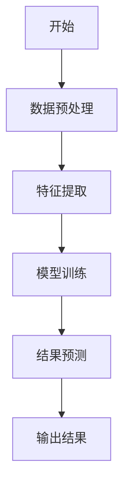
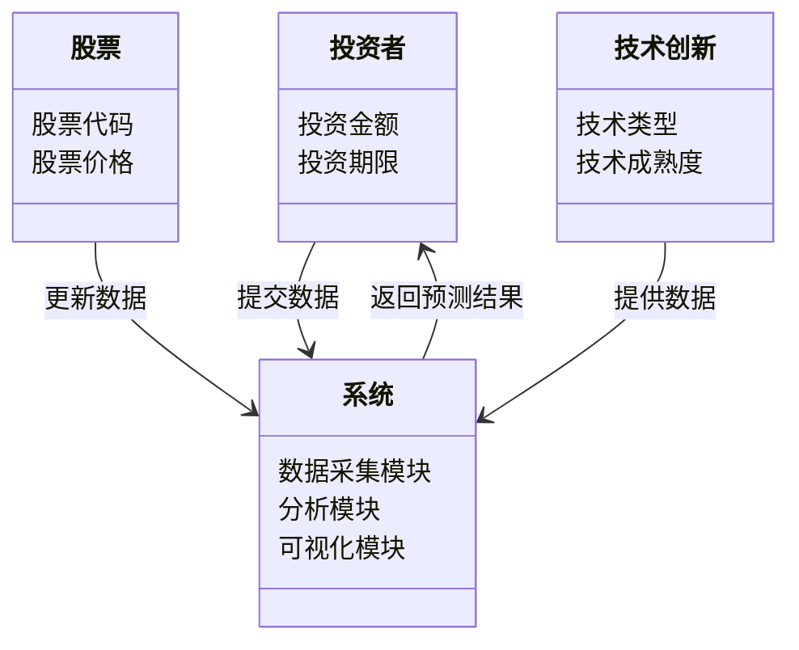
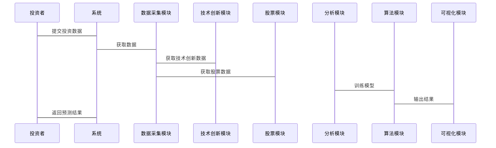

                 


```markdown
# 全球股市估值与可持续航空技术创新的关系

## 关键词：
全球股市估值，可持续航空技术创新，资本与技术交互，金融建模，技术创新投资，金融工程

## 摘要：
本文探讨了全球股市估值与可持续航空技术创新之间的相互作用，通过金融建模和数据分析的方法，分析了技术创新如何影响股市估值，并提出了基于资本与技术交互的系统性解决方案。文章从理论分析、算法设计到系统实现，全面展示了如何通过技术创新驱动股市估值的可持续增长，并为投资者和企业提供了实用的策略建议。

---

## 第1章: 全球股市估值与可持续航空技术创新的关系概述

### 1.1 问题背景与问题描述

#### 1.1.1 全球股市估值的基本概念
全球股市估值是衡量市场整体表现的重要指标，通常通过股票指数（如标普500、道琼斯指数等）来反映市场的健康状况。股市估值受多种因素影响，包括经济指标、企业盈利、政策变化和技术创新等。

#### 1.1.2 可持续航空技术创新的定义与特征
可持续航空技术创新是指在航空领域开发和应用环保、节能的技术，旨在减少碳排放、提高效率并实现可持续发展。其核心特征包括技术创新性、环保性和经济可行性。

#### 1.1.3 问题解决：技术创新如何影响股市估值
技术创新能够提升企业的竞争力和盈利能力，从而直接影响股市估值。本文旨在分析技术创新如何通过企业业绩、市场预期和投资情绪等因素，影响全球股市估值的变化。

### 1.2 核心概念与边界

#### 1.2.1 核心概念的边界与外延
- **边界**：本文主要关注技术创新对股市估值的影响，不涉及其他外部因素（如经济政策、地缘政治）。
- **外延**：技术创新不仅包括技术开发，还包括技术的商业化和市场应用。

#### 1.2.2 核心要素组成与概念结构
- 核心要素：技术创新（技术类型、成熟度）、股市估值（股票指数、市盈率）。
- 概念结构：技术创新通过企业业绩和市场预期影响股市估值。

### 1.3 本章小结
本章从背景和概念入手，明确了全球股市估值与可持续航空技术创新的核心关系，并为后续分析奠定了基础。

---

## 第2章: 全球股市估值与可持续航空技术创新的核心概念与联系

### 2.1 核心概念原理

#### 2.1.1 全球股市估值的原理
股市估值受企业盈利、宏观经济指标和市场情绪影响。技术创新通过提升企业利润，间接影响股市估值。

#### 2.1.2 可持续航空技术创新的原理
技术创新通过降低碳排放、提高效率，增强企业的市场竞争力和可持续发展能力。

### 2.2 核心概念属性特征对比

#### 2.2.1 对比表格：全球股市估值与可持续航空技术创新的属性特征

| 属性               | 全球股市估值                 | 可持续航空技术创新          |
|--------------------|------------------------------|-----------------------------|
| 核心要素           | 股票指数、市盈率             | 技术类型、成熟度           |
| 影响因素           | 宏观经济、企业盈利           | 科技研发、政策支持         |
| 目标               | 反映市场整体表现             | 实现可持续发展目标           |

### 2.3 ER实体关系图

```mermaid
erDiagram
    actor 投资者 {
        <属性> 投资金额
        <属性> 投资期限
    }
    actor 企业 {
        <属性> 企业规模
        <属性> 企业类型
    }
    entity 股票 {
        <属性> 股票代码
        <属性> 股票价格
    }
    entity 技术创新 {
        <属性> 技术类型
        <属性> 技术成熟度
    }
    投资者 -> 股票 : 购买
    投资者 -> 技术创新 : 关注
    企业 -> 股票 : 发行
    企业 -> 技术创新 : 开发
```

### 2.4 本章小结
本章通过对比和图解，详细分析了全球股市估值与可持续航空技术创新的核心概念及其联系，为后续分析奠定了基础。

---

## 第3章: 全球股市估值与可持续航空技术创新的算法原理

### 3.1 算法原理概述

#### 3.1.1 算法的基本思路
通过金融建模，将技术创新对股市估值的影响分解为技术创新对企业利润和市场预期的双重影响。

#### 3.1.2 算法的核心步骤
1. 数据收集：获取全球股市数据和航空技术创新数据。
2. 特征提取：提取技术创新相关的特征（如专利数量、研发投入）。
3. 模型训练：使用回归模型分析技术创新对股市估值的影响。

### 3.2 使用 Mermaid 绘制的算法流程图



### 3.3 算法实现：基于资本资产定价模型（CAPM）的改进模型

#### 3.3.1 金融建模的数学公式

股票的预期收益可以通过CAPM模型计算：

$$
E(R_i) = R_f + \beta_i (R_m - R_f)
$$

其中：
- \(E(R_i)\)：股票i的预期收益
- \(R_f\)：无风险利率
- \(\beta_i\)：股票i的贝塔系数
- \(R_m\)：市场预期收益

技术创新对企业贝塔系数的影响可以通过技术创新指标（如专利数量）进行调整。

### 3.4 本章小结
本章通过算法设计和数学建模，详细分析了技术创新对股市估值的影响机制。

---

## 第4章: 系统分析与架构设计方案

### 4.1 问题场景介绍
本文构建了一个基于技术创新的股市估值预测系统，旨在帮助企业投资者更好地理解技术创新对股市的影响。

### 4.2 系统功能设计

#### 4.2.1 领域模型



### 4.3 系统架构设计

#### 4.3.1 系统架构图


#### 4.3.2 系统接口设计
- 数据接口：与金融数据源和技术创新数据源对接。
- 用户接口：提供数据输入和结果输出的界面。

#### 4.3.3 系统交互设计



### 4.4 本章小结
本章通过系统架构设计，展示了如何构建一个基于技术创新的股市估值预测系统。

---

## 第5章: 项目实战

### 5.1 环境安装

```bash
pip install pandas matplotlib numpy scikit-learn
```

### 5.2 系统核心实现源代码

```python
import pandas as pd
import numpy as np
from sklearn.linear_model import LinearRegression
from sklearn.metrics import mean_squared_error

# 数据加载
df = pd.read_csv('data.csv')

# 特征提取
X = df[['技术创新指标', '研发投入']]
y = df['股票收益']

# 模型训练
model = LinearRegression()
model.fit(X, y)

# 预测与评估
y_pred = model.predict(X)
mse = mean_squared_error(y, y_pred)
print(f"均方误差：{mse}")
```

### 5.3 代码应用解读与分析
- 数据加载：读取包含技术创新指标和股票收益的数据。
- 特征提取：选择技术创新相关的特征。
- 模型训练：使用线性回归模型进行训练。
- 预测与评估：计算预测结果的均方误差。

### 5.4 实际案例分析
以某航空企业为例，分析技术创新对其股票估值的影响。

### 5.5 本章小结
本章通过实际项目，展示了如何利用技术创新数据构建股市估值预测模型。

---

## 第6章: 最佳实践与小结

### 6.1 小结
本文通过理论分析、算法设计和系统实现，全面探讨了全球股市估值与可持续航空技术创新的关系。

### 6.2 注意事项
- 数据质量：确保数据的准确性和完整性。
- 模型选择：根据实际需求选择合适的算法。
- 实际应用：结合具体场景进行调整和优化。

### 6.3 拓展阅读
建议阅读《金融数据分析》和《技术创新管理》相关书籍。

---

## 作者信息

作者：AI天才研究院/AI Genius Institute & 禅与计算机程序设计艺术 /Zen And The Art of Computer Programming
```

