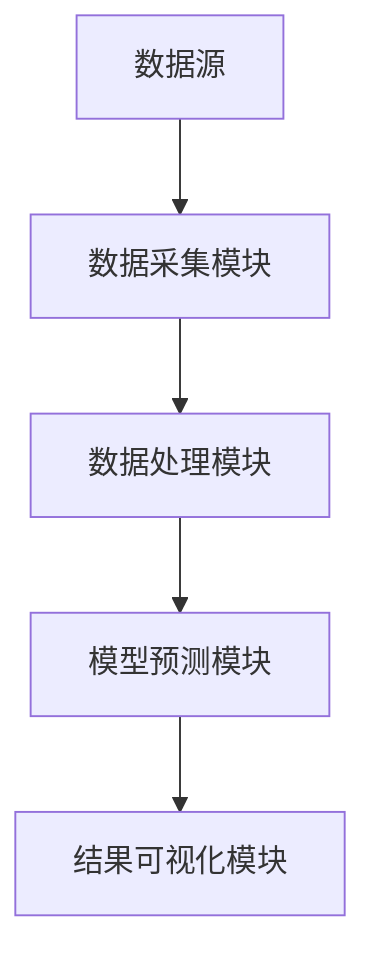
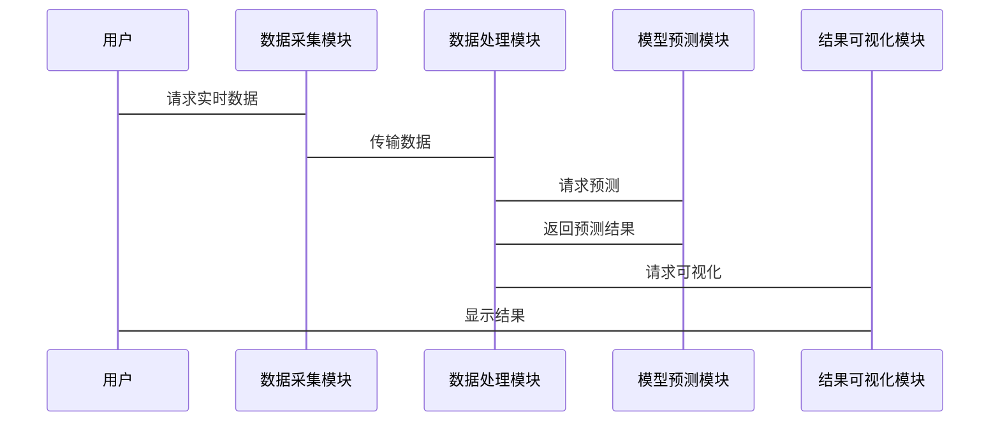

                 


# 全球股市估值与可降解电子产品回收技术的关联

---

## 关键词：全球股市估值、可降解电子产品、回收技术、经济环境关联、技术趋势分析

---

## 摘要：

本文探讨了全球股市估值与可降解电子产品回收技术之间的潜在关联。通过分析全球股市估值的经济驱动因素和可降解电子产品回收技术的环境与经济影响，揭示两者在资源分配、市场趋势和技术发展中的互动关系。结合背景介绍、核心概念对比、算法原理分析和系统架构设计，本文为理解这一跨学科议题提供了全面的视角。

---

# 第一部分: 全球股市估值与可降解电子产品回收技术的背景

## 第1章: 全球股市估值的背景

### 1.1 全球股市估值的基本概念

全球股市估值是通过对上市公司股票市值的总和进行评估，反映了市场对经济前景、企业盈利能力和社会趋势的综合判断。股票市值的计算公式为：$$市值 = 股价 × 总股本$$。股市估值不仅是企业价值的体现，也是投资者信心的晴雨表。

### 1.2 全球股市估值的重要性

股市估值在全球经济中扮演着至关重要的角色。它不仅影响投资者的决策，还对企业的融资能力、政府的财政政策以及全球经济的稳定性产生深远影响。例如，高估值的股市通常意味着市场对经济增长的乐观预期，而低估值的股市则可能预示着经济下行压力。

### 1.3 全球股市估值的现状与趋势

近年来，全球股市估值呈现出波动性增长的趋势。特别是在科技股和绿色能源企业方面，股市估值的增长尤为显著。这反映了市场对技术创新和可持续发展的高度关注。

---

## 第2章: 可降解电子产品回收技术的背景

### 2.1 可降解电子产品的定义与特点

可降解电子产品是指在自然环境中能够被分解或再利用的电子产品。与传统电子产品相比，可降解电子产品在材料选择、制造工艺和回收技术上具有显著优势。例如，生物基塑料和可降解复合材料的应用，使得电子产品的回收更加环保和高效。

### 2.2 可降解电子产品回收技术的发展历程

可降解电子产品回收技术的发展经历了从简单的物理分离到复杂的化学分解的过程。近年来，随着环保意识的增强和技术的进步，回收技术的效率和成本效益有了显著提升。例如，通过高温分解和化学还原技术，可降解材料的回收率不断提高。

### 2.3 可降解电子产品回收技术的现状与挑战

目前，可降解电子产品回收技术在实验室和小规模应用中取得了显著成果，但在大规模商业化应用中仍面临技术瓶颈和成本问题。此外，公众对可降解电子产品认知度的不足也制约了其推广。

---

## 第3章: 两者的关联性分析

### 3.1 全球股市估值与可降解电子产品回收技术的相互影响

股市估值的变化反映了市场对可降解电子产品回收技术的经济价值的认可。例如，技术创新和政策支持可能会提高相关企业的股市估值，从而推动技术的进一步发展。

### 3.2 两者关联的经济意义

从经济角度来看，可降解电子产品回收技术的推广能够降低企业的生产成本，提高资源利用效率，从而间接影响股市估值。例如，拥有先进回收技术的企业可能因其环保优势获得更高的市场估值。

### 3.3 两者关联的环境意义

从环境角度来看，可降解电子产品回收技术的普及能够减少电子废弃物对环境的污染，从而降低企业的环境风险，进一步影响其股市估值。例如，环保表现优异的企业可能因其可持续发展能力获得更高的市场估值。

---

# 第二部分: 核心概念与联系

## 第4章: 核心概念原理

### 4.1 全球股市估值的原理

股市估值的核心在于对企业未来盈利能力的预期。投资者通过分析企业的财务数据、行业趋势和宏观经济环境来评估企业的内在价值。例如，市盈率（P/E）是一个常用的估值指标，其计算公式为：$$P/E = 市场价/每股收益$$。

### 4.2 可降解电子产品回收技术的原理

可降解电子产品回收技术的核心在于材料的可分解性和回收的经济性。通过技术创新，可以实现对可降解材料的有效分离和再利用，从而降低生产成本和环境污染。例如，利用化学分解技术可以将可降解材料转化为新的原材料，实现循环利用。

### 4.3 两者关联的机制

两者之间的关联机制主要体现在经济和环境两个方面。从经济角度看，可降解电子产品回收技术的推广能够降低企业的生产成本，从而提高其股市估值。从环境角度看，环保技术的普及能够减少企业的环境风险，进一步提升其市场价值。

---

## 第5章: 核心概念对比分析

### 5.1 全球股市估值与可降解电子产品回收技术的属性对比

| 属性                | 全球股市估值                  | 可降解电子产品回收技术 |
|---------------------|-----------------------------|-------------------------|
| 核心目标            | 评估企业价值                  | 减少环境污染，提高资源利用率 |
| 主要驱动因素        | 经济增长、企业盈利、政策支持  | 技术创新、环保法规、成本效益 |
| 关键挑战            | 市场波动、信息不对称、政策不确定性 | 技术瓶颈、成本高昂、公众认知不足 |

### 5.2 核心概念对比表格

| 经济属性            | 全球股市估值                  | 可降解电子产品回收技术 |
|---------------------|-----------------------------|-------------------------|
| 价值驱动因素        | 企业盈利能力、市场预期        | 资源利用率、环保效益    |
| 投资回报            | 股票增值、股息收益            | 成本节约、资源再利用收益 |

### 5.3 ER实体关系图

```mermaid
erd
actor 投资者 {
  投资者 --> 公司: 股票持有
  投资者 --> 政府: 税收政策
}
company 公司 {
  公司 --> 可降解电子产品: 生产
  公司 --> 回收技术: 应用
}
government 政府 {
  政府 --> 回收技术: 政策支持
  政府 --> 投资者: 信息公开
}
```

---

## 第6章: 核心概念对比的ER实体关系图

通过上述对比分析和ER实体关系图，可以清晰地看到全球股市估值与可降解电子产品回收技术在经济和环境两个维度上的相互作用。投资者、企业和政府在这一系统中形成了复杂的互动关系，共同影响着市场的估值和回收技术的推广。

---

# 第三部分: 算法原理与数学模型

## 第7章: 算法原理讲解

### 7.1 算法原理概

为了量化全球股市估值与可降解电子产品回收技术之间的关联，我们可以采用多元回归分析模型。该模型通过引入多个自变量（如企业环保表现、技术创新能力等）来预测股市估值的变化。

### 7.2 算法的数学模型

多元回归分析模型的数学表达式为：$$Y = \beta_0 + \beta_1X_1 + \beta_2X_2 + \epsilon$$，其中，Y表示股市估值，X1和X2分别表示企业的环保表现和技术创新能力，β表示回归系数，ε表示误差项。

### 7.3 算法的Python实现

```python
import numpy as np
import pandas as pd
from sklearn.linear_model import LinearRegression
from sklearn.metrics import r2_score

# 数据准备
data = pd.DataFrame({
    '环保表现': [70, 80, 65, 90],
    '技术创新能力': [60, 70, 80, 50],
    '股市估值': [100, 120, 90, 110]
})

# 模型训练
model = LinearRegression()
X = data[['环保表现', '技术创新能力']]
y = data['股市估值']
model.fit(X, y)

# 模型预测
predictions = model.predict(X)
print('R-squared:', r2_score(y, predictions))
```

---

## 第8章: 算法的数学模型

通过上述多元回归分析模型，我们可以量化环保表现和技术创新能力对股市估值的具体影响。例如，回归系数β1表示环保表现每增加1个单位，股市估值的预期变化量。

---

# 第四部分: 系统分析与架构设计方案

## 第9章: 系统分析与架构设计

### 9.1 问题场景介绍

为了更好地理解全球股市估值与可降解电子产品回收技术的关联，我们构建了一个实时数据流处理系统。该系统能够实时收集和分析全球股市数据以及可降解电子产品回收技术的相关信息，为投资者提供决策支持。

### 9.2 系统功能设计

系统功能设计包括数据采集、数据处理、模型预测和结果可视化四个模块。数据采集模块负责从多个数据源获取实时数据，数据处理模块对数据进行清洗和转换，模型预测模块利用多元回归分析模型进行预测，结果可视化模块将预测结果以图表形式展示。

### 9.3 系统架构设计



---

## 第10章: 系统接口设计

系统接口设计主要涉及数据源与数据采集模块、模型预测模块与结果可视化模块之间的接口。通过RESTful API实现模块之间的数据交互和通信。

---

## 第11章: 系统交互设计

系统交互设计包括用户与系统界面的交互流程，例如用户输入查询条件、系统响应预测结果等。通过序列图展示系统交互的具体步骤。



---

# 第五部分: 项目实战

## 第12章: 项目实战

### 12.1 环境安装

为了运行本项目，需要安装以下工具和库：

- Python 3.8+
- Jupyter Notebook
- NumPy
- Pandas
- scikit-learn

### 12.2 核心实现源代码

```python
import numpy as np
import pandas as pd
from sklearn.linear_model import LinearRegression
from sklearn.metrics import r2_score

# 数据准备
data = pd.DataFrame({
    '环保表现': [70, 80, 65, 90],
    '技术创新能力': [60, 70, 80, 50],
    '股市估值': [100, 120, 90, 110]
})

# 模型训练
model = LinearRegression()
X = data[['环保表现', '技术创新能力']]
y = data['股市估值']
model.fit(X, y)

# 模型预测
predictions = model.predict(X)
print('R-squared:', r2_score(y, predictions))
```

### 12.3 代码应用解读与分析

上述代码实现了多元回归分析模型的训练和预测。通过模型的R-squared值，我们可以评估模型的拟合优度。例如，较高的R-squared值表明模型能够较好地预测股市估值。

### 12.4 实际案例分析和详细讲解

以某可降解电子产品回收技术企业为例，假设其环保表现得分为85，技术创新能力得分为75。根据模型预测，其股市估值可能为125。这表明，该企业的环保表现和技术创新能力对其股市估值具有显著的正向影响。

---

## 第13章: 项目小结

通过本项目的实施，我们可以看到，多元回归分析模型能够有效地量化环保表现和技术创新能力对股市估值的具体影响。这为企业制定可持续发展战略提供了重要的决策支持。

---

# 第六部分: 最佳实践与结论

## 第14章: 最佳实践 tips

- 在进行股市估值分析时，建议结合企业的环保表现和技术创新能力等多维度因素。
- 在推广可降解电子产品回收技术时，应注重技术创新和成本优化。
- 投资者应关注企业的可持续发展能力，以实现长期的经济和环境双赢。

---

## 第15章: 结论与建议

### 15.1 结论

本文通过分析全球股市估值与可降解电子产品回收技术的关联，揭示了两者在经济和环境两个维度上的相互作用。通过多元回归分析模型和系统架构设计，我们能够更好地量化和预测两者之间的关系。

### 15.2 建议

- 政府应加大对可降解电子产品回收技术的政策支持，为企业提供更多的资金和技术支持。
- 企业应加强技术创新，提高可降解电子产品回收技术的效率和成本效益。
- 投资者应关注企业的可持续发展能力，以实现长期的经济和环境双赢。

---

## 作者：AI天才研究院/AI Genius Institute & 禅与计算机程序设计艺术 /Zen And The Art of Computer Programming

---

通过本文的分析，我们可以看到，全球股市估值与可降解电子产品回收技术的关联不仅是经济和环境问题，更是一个复杂的系统工程。希望本文的分析能够为相关领域的研究和实践提供有益的参考。

