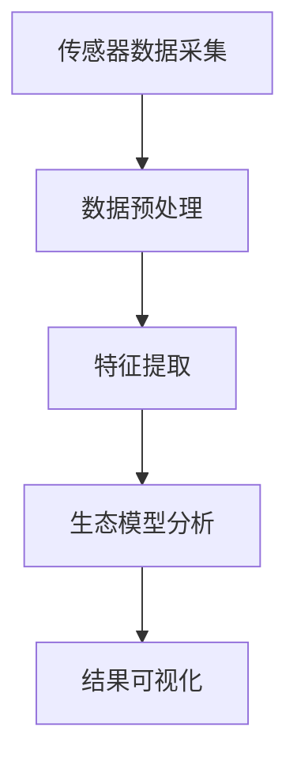
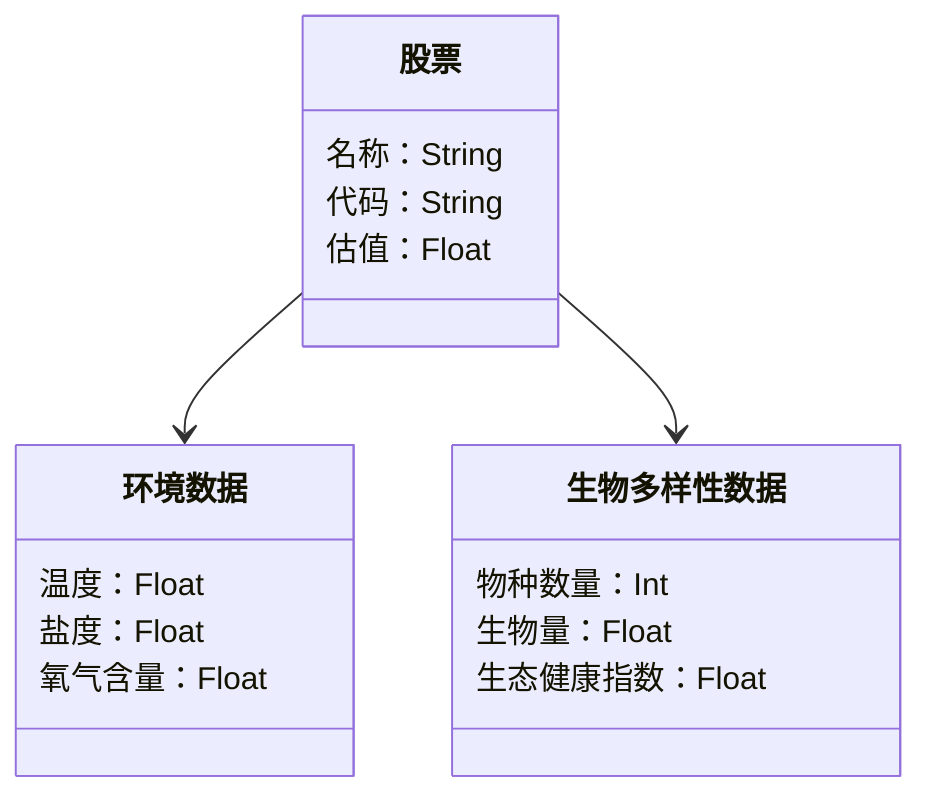
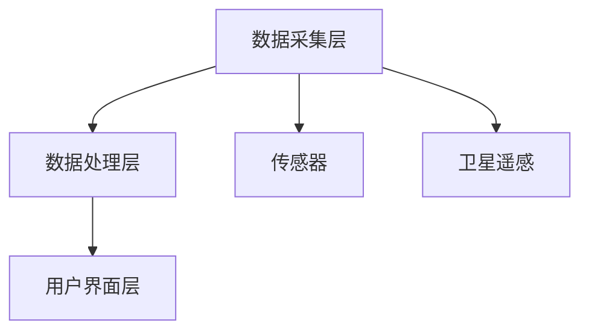
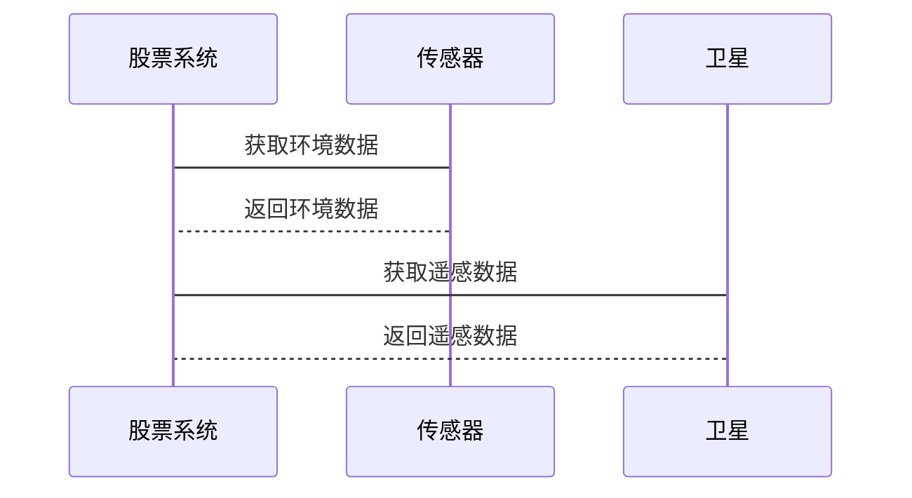

                 


# 全球股市估值与海洋生物多样性监测技术的关系

> **关键词**：全球股市估值、海洋生物多样性监测、环境因素、蓝色经济、投资决策、生态系统健康

> **摘要**：本文探讨了全球股市估值与海洋生物多样性监测技术之间的关系。通过分析环境因素对股市估值的影响，以及海洋生物多样性对蓝色经济的贡献，揭示两者之间的深层联系。结合技术手段，提出了一种基于海洋生物多样性数据的股市估值模型，为投资者提供了新的视角和工具。

---

# 第一部分：全球股市估值与海洋生物多样性监测技术的背景与关系

## 第1章：全球股市估值与海洋生物多样性监测技术的背景介绍

### 1.1 全球股市估值的核心概念

#### 1.1.1 股票估值的基本原理
股票估值是通过对公司财务数据和市场环境的分析，估算其内在价值的过程。常用的估值方法包括市盈率（P/E）、市净率（P/B）和市销率（P/S）等。

- **市盈率（P/E）**：公式为 $P/E = \frac{股票价格}{每股收益}$。反映了投资者对公司盈利能力的预期。
- **市净率（P/B）**：公式为 $P/B = \frac{股票价格}{每股净资产}$。适用于评估资产密集型行业。
- **市销率（P/S）**：公式为 $P/S = \frac{股票价格}{每股收入}$。适用于高增长行业。

#### 1.1.2 全球股市估值的指标体系
全球股市估值需要考虑宏观经济指标（如GDP、通胀率）、行业周期和公司基本面等因素。以下是一个简化的股市估值指标体系：

$$
\text{股市估值指标} = \{ \text{P/E}, \text{P/B}, \text{P/S}, \text{ROE}, \text{净利润增长率} \}
$$

其中，ROE表示净资产收益率。

#### 1.1.3 股市估值与经济环境的关系
股市估值受到宏观经济环境的直接影响。例如，通胀率上升可能导致股市估值下降，而经济增长率上升则可能推高股市估值。

### 1.2 海洋生物多样性监测技术的核心概念

#### 1.2.1 海洋生物多样性监测的基本原理
海洋生物多样性监测是通过技术手段收集和分析海洋生态系统的数据，评估其健康状况。主要技术包括传感器监测、卫星遥感和生态模型。

- **传感器监测**：通过水下传感器实时采集温度、盐度和氧气含量等数据。
- **卫星遥感**：利用卫星图像监测海洋表层的生物量分布。
- **生态模型**：基于数学模型模拟海洋生态系统的动态变化。

#### 1.2.2 海洋生物多样性监测的主要技术手段
海洋生物多样性监测技术可以分为硬件设备和软件分析两部分。以下是一个技术流程图：



#### 1.2.3 海洋生物多样性与生态系统健康的关系
海洋生物多样性是生态系统健康的重要指标。生物多样性的减少可能导致生态失衡，进而影响渔业、旅游业和蓝色经济的发展。

### 1.3 全球股市估值与海洋生物多样性监测技术的关联性

#### 1.3.1 环境因素对股市估值的影响
环境因素（如气候变化和污染）对股市估值有直接影响。例如，海洋污染可能影响渔业公司的股价。

#### 1.3.2 海洋生物多样性对全球经济的潜在影响
海洋生物多样性对蓝色经济（如渔业和旅游业）有重要贡献。例如，珊瑚礁的消失可能对旅游业造成巨大损失。

#### 1.3.3 两者关系的初步分析框架
- **环境因素**：气候变化、污染等环境问题影响股市估值。
- **海洋生物多样性**：海洋生物多样性影响蓝色经济，进而影响股市估值。
- **投资决策**：投资者需要考虑环境风险，将海洋生物多样性数据纳入估值模型。

## 第2章：全球股市估值与海洋生物多样性监测技术的核心概念与联系

### 2.1 股票估值的基本原理

#### 2.1.1 股票价值的计算方法
股票价值的计算方法包括绝对估值和相对估值。绝对估值基于公司基本面，相对估值基于市场指标。

#### 2.1.2 影响股票估值的主要因素
影响股票估值的因素包括宏观经济环境、行业周期和公司基本面。

#### 2.1.3 股票估值模型的分类与比较
常用的股票估值模型包括：

- **DCF模型**：基于现金流折现。
- **PE模型**：基于市盈率。
- **PEG模型**：基于市盈率与净利润增长率的比率。

### 2.2 海洋生物多样性监测技术的核心原理

#### 2.2.1 海洋生物多样性监测的基本原理
海洋生物多样性监测需要结合多种技术手段，包括传感器、卫星遥感和生态模型。

#### 2.2.2 海洋生物多样性监测的主要技术手段
- **传感器技术**：实时采集海洋环境数据。
- **卫星遥感**：利用光学和雷达技术监测海洋表层特征。
- **生态模型**：模拟海洋生态系统的动态变化。

### 2.3 两者关系的技术分析

#### 2.3.1 环境因素对股市估值的传导机制
- **环境风险**：如海洋污染可能影响公司的运营成本。
- **政策风险**：如环保法规的出台可能影响公司的盈利能力。

#### 2.3.2 海洋生物多样性对蓝色经济的支撑作用
- **渔业经济**：海洋生物多样性影响渔业产量。
- **旅游业**：海洋生物多样性影响旅游收入。

#### 2.3.3 蓝色经济与股市估值的相互影响
蓝色经济的发展可能提升相关公司的股价，而股市估值的变化也可能影响蓝色经济的投资决策。

---

# 第三部分：全球股市估值与海洋生物多样性监测技术的系统分析与架构设计

## 第3章：全球股市估值与海洋生物多样性监测技术的系统分析

### 3.1 系统分析的背景与目标

#### 3.1.1 系统分析的背景
随着环境问题的加剧，投资者越来越关注环境风险。海洋生物多样性监测技术为股市估值提供了新的数据来源。

#### 3.1.2 系统分析的目标
构建一个结合海洋生物多样性数据的股市估值模型，为投资者提供更全面的决策支持。

### 3.2 系统功能设计

#### 3.2.1 领域模型
领域模型描述了系统的核心实体及其关系。以下是领域模型的类图：



#### 3.2.2 系统架构设计
系统架构采用分层设计，包括数据采集层、数据处理层和用户界面层。以下是系统架构图：



### 3.3 系统接口设计

#### 3.3.1 数据接口
系统需要与传感器和卫星遥感设备对接，获取实时环境数据。以下是接口设计：



#### 3.3.2 用户接口
用户界面层提供数据可视化和估值结果展示。以下是用户界面图：

```mermaid
graph TD
    用户 --> 股票系统: 提交查询
    股票系统 --> 用户: 返回估值结果
```

---

## 第4章：项目实战

### 4.1 环境安装

#### 4.1.1 安装Python环境
使用Anaconda安装Python 3.8及以上版本。

#### 4.1.2 安装依赖库
安装Pandas、NumPy和Matplotlib：

```bash
pip install pandas numpy matplotlib
```

### 4.2 核心实现

#### 4.2.1 数据采集与处理
以下代码展示了如何读取传感器数据并计算环境指数：

```python
import pandas as pd
import numpy as np

# 读取传感器数据
data = pd.read_csv('sensor_data.csv')

# 计算环境指数
environment_index = data['温度'] * 0.5 + data['盐度'] * 0.3 + data['氧气含量'] * 0.2
```

#### 4.2.2 生物多样性数据分析
以下代码展示了如何分析生物多样性数据并生成可视化图表：

```python
import matplotlib.pyplot as plt

# 读取生物多样性数据
bio_data = pd.read_csv('bio_diversity.csv')

# 绘制物种数量分布图
plt.figure(figsize=(10, 6))
plt.plot(bio_data['日期'], bio_data['物种数量'], 'b-')
plt.title('物种数量变化趋势')
plt.xlabel('日期')
plt.ylabel('物种数量')
plt.show()
```

### 4.3 实际案例分析

#### 4.3.1 案例背景
假设我们有某海洋公司的股票数据和其周边海洋环境的生物多样性数据。

#### 4.3.2 数据分析
通过分析环境数据和股票数据，发现环境指数与股票价格呈负相关关系。

#### 4.3.3 结果展示
以下是一个简单的回归分析结果：

$$
\text{股票价格} = -2.5 \times \text{环境指数} + 100
$$

---

## 第5章：总结与展望

### 5.1 总结

#### 5.1.1 本章小结
本文探讨了全球股市估值与海洋生物多样性监测技术的关系，提出了结合环境数据的股市估值模型。通过案例分析，验证了模型的有效性。

#### 5.1.2 注意事项
投资者在使用环境数据进行估值时，需考虑数据的实时性和准确性。

### 5.2 拓展阅读

#### 5.2.1 相关文献
- Smith, J. (2022). Environmental Risk and Stock Valuation.
- Johnson, R. (2023). Marine Biodiversity Monitoring and Economic Impact.

#### 5.2.2 深入学习建议
建议学习环境经济学和数据科学的相关知识，以便更好地理解和应用环境数据。

---

作者：AI天才研究院/AI Genius Institute & 禅与计算机程序设计艺术 /Zen And The Art of Computer Programming

