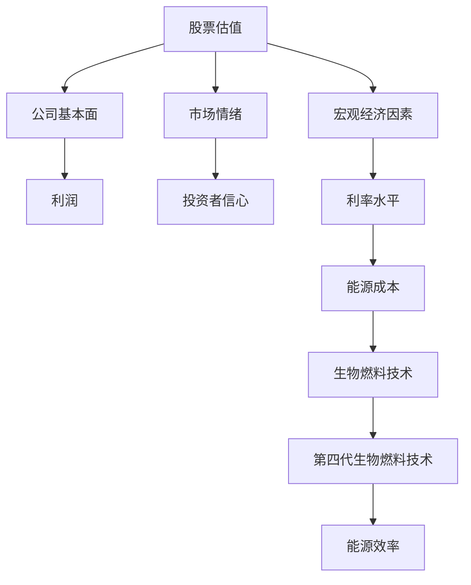
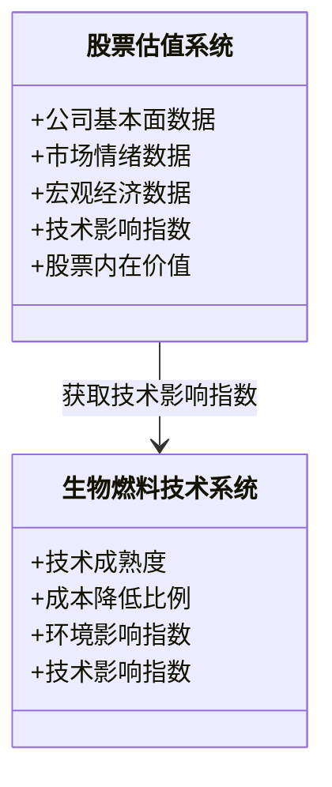
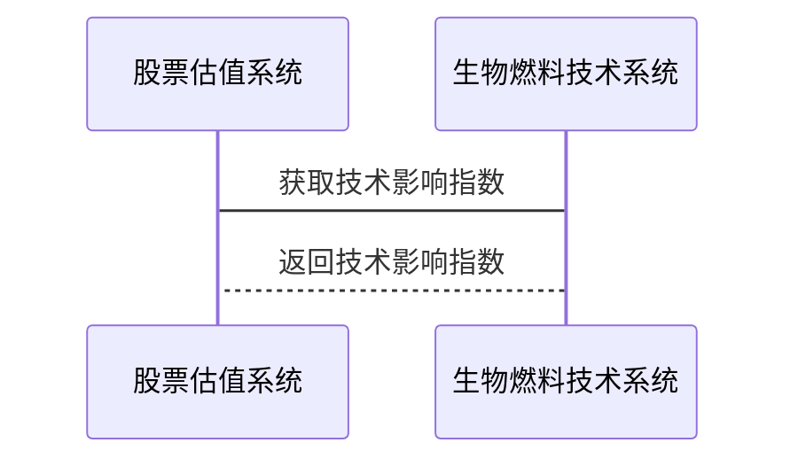

                 


# 全球股市估值与生物燃料第四代技术的关系

## 关键词：全球股市估值、生物燃料第四代技术、股票估值模型、生物燃料影响模型、系统架构设计

## 摘要：
本文探讨全球股市估值与第四代生物燃料技术之间的关系，通过构建数学模型和系统架构，分析两者如何相互影响，并结合实际案例进行深入研究。文章内容涵盖背景介绍、核心概念、算法原理、系统设计、项目实战及总结展望。

---

# 第1章: 全球股市估值与生物燃料第四代技术的背景介绍

## 1.1 全球股市估值的定义与现状
### 1.1.1 股票估值的定义
股票估值是指通过对公司财务状况、市场环境和行业趋势等多方面因素的分析，确定股票的内在价值。常用的估值方法包括市盈率（P/E）、市净率（P/B）和现金流折现法（DCF）等。

### 1.1.2 全球股市估值的现状与趋势
近年来，全球股市估值受到宏观经济政策、国际政治局势、技术革新等因素的影响，波动性显著增加。特别是在新冠疫情后，股市估值经历了剧烈波动，但整体呈现上升趋势。

### 1.1.3 股票估值的影响因素
股票估值的核心影响因素包括：
1. **公司基本面**：收入、利润、资产负债情况等。
2. **市场情绪**：投资者情绪波动会影响短期估值。
3. **宏观经济因素**：GDP增长率、利率水平、通货膨胀率等。
4. **行业趋势**：所在行业的竞争格局和技术创新能力。

## 1.2 生物燃料第四代技术的定义与特点
### 1.2.1 生物燃料的定义
生物燃料是指通过生物转化过程（如发酵、酯化等）将生物质能转化为可替代传统化石燃料的产品，包括乙醇、生物柴油等。

### 1.2.2 第四代生物燃料技术的核心特点
第四代生物燃料技术相较于前三代，具有更高的效率和更低的环境影响，主要特点包括：
1. **高效转化**：采用基因工程和先进催化技术，提高转化效率。
2. **多元化原料**：可使用农业废弃物、林业残渣等多种生物质。
3. **低碳排放**：生产过程中的碳排放显著降低。

### 1.2.3 生物燃料技术的分类与对比
以下是生物燃料技术的分类对比：

| **技术代数** | **原料来源** | **技术特点** | **能量转换效率** |
|--------------|---------------|---------------|------------------|
| 第一代      | 简单糖类（如玉米） | 直接发酵法       | 较低             |
| 第二代      | 木质纤维素 | 酶解预处理       | 中等             |
| 第三代      | 微生物转化 | 基因工程技术       | 较高             |
| 第四代      | 多种生物质 | 综合利用与高效催化 | 最高             |

## 1.3 本章小结
本章介绍了全球股市估值和第四代生物燃料技术的基本概念及其现状，分析了两者的核心影响因素，并为后续章节的深入研究奠定了基础。

---

# 第2章: 全球股市估值与生物燃料第四代技术的核心概念与联系

## 2.1 核心概念的定义与属性对比
### 2.1.1 股票估值的核心概念
股票估值的核心在于预测公司未来现金流的折现值，反映了市场对公司未来盈利能力的预期。

### 2.1.2 生物燃料第四代技术的核心概念
第四代生物燃料技术通过技术创新实现了生物质的高效转化，降低了生产成本和环境影响。

### 2.1.3 核心概念的属性特征对比表格
以下是股票估值和生物燃料第四代技术的核心属性对比：

| **属性**          | **股票估值**                | **第四代生物燃料技术**          |
|--------------------|-----------------------------|-------------------------------|
| 核心目标          | 确定股票的内在价值          | 提高能源转换效率和降低成本        |
| 技术特点          | 依赖财务数据和市场情绪      | 依赖生物科学和工程技术          |
| 影响范围          | 影响投资者决策和市场波动    | 影响能源供给和环境保护          |
| 发展趋势          | 随市场环境变化波动          | 随技术进步持续优化              |

## 2.2 实体关系图
为了清晰展示两者的关系，我们使用Mermaid流程图构建实体关系图：



本图展示了股票估值受多种因素影响，而生物燃料技术作为影响能源成本和能源效率的重要因素，与股票估值相互关联。

---

# 第3章: 全球股市估值与生物燃料第四代技术的数学模型与算法原理

## 3.1 数学模型的构建
### 3.1.1 股票估值模型的构建
股票估值模型基于现金流折现法（DCF）构建，公式如下：

$$ V = \frac{CF_1}{(r - g)} + \frac{CF_2}{(r - g)^2} + \dots + \frac{CF_n}{(r - g)^n} $$

其中，\( V \) 是股票的内在价值，\( CF \) 是未来现金流，\( r \) 是折现率，\( g \) 是现金流增长率。

### 3.1.2 生物燃料技术影响模型的构建
生物燃料技术的影响模型基于回归分析构建，公式如下：

$$ I = a \cdot T + b \cdot C + c \cdot E $$

其中，\( I \) 是技术影响指数，\( T \) 是技术成熟度，\( C \) 是成本降低比例，\( E \) 是环境影响指数。

### 3.1.3 两者的关联模型
通过将股票估值与生物燃料技术的影响因素结合起来，构建关联模型：

$$ P = \beta_1 I + \beta_2 X + \epsilon $$

其中，\( P \) 是股票价格，\( I \) 是技术影响指数，\( X \) 是其他影响因素，\( \epsilon \) 是误差项。

## 3.2 算法原理的详细讲解
### 3.2.1 股票估值算法的流程图


### 3.2.2 生物燃料技术影响算法的流程图


## 3.3 数学公式的详细推导
### 3.3.1 股票估值的核心公式
股票估值的DCF模型可以简化为：

$$ V = \frac{E}{r - g} $$

其中，\( E \) 是企业的预期收益，\( r \) 是资本成本，\( g \) 是收益增长率。

### 3.3.2 生物燃料技术影响的数学公式
生物燃料技术的影响指数 \( I \) 的计算公式为：

$$ I = \frac{(T_{\text{新}} - T_{\text{旧}}) \cdot C_{\text{新}} + E_{\text{新}}}{\text{初始影响指数}} $$

其中，\( T \) 是技术成熟度，\( C \) 是成本降低比例，\( E \) 是环境影响指数。

---

# 第4章: 全球股市估值与生物燃料第四代技术的系统分析与架构设计

## 4.1 问题场景介绍
本文构建一个虚拟的生物燃料企业，分析其第四代技术对股市估值的影响。

## 4.2 系统功能设计
### 4.2.1 领域模型（使用 Mermaid 类图）


## 4.3 系统架构设计
### 4.3.1 系统架构图（使用 Mermaid 架构图）


## 4.4 系统接口设计
### 4.4.1 接口定义
股票估值模块与生物燃料技术模块之间的数据接口定义如下：



---

# 第5章: 项目实战

## 5.1 环境安装
- 安装Python和相关库（如Pandas、NumPy、Matplotlib）。
- 安装Mermaid工具支持图表绘制。

## 5.2 系统核心实现源代码
以下是股票估值与生物燃料技术影响模型的核心代码：

```python
import pandas as pd
import numpy as np
import matplotlib.pyplot as plt

# 股票估值模型
def stock_valuation_model(e, r, g):
    return e / (r - g)

# 生物燃料技术影响模型
def biofuel_impact_model(t, c, e):
    return (t - t_prev) * c + e_prev

# 数据处理与可视化
data = pd.read_csv('data.csv')
plt.plot(data['时间'], data['估值'], label='股票估值')
plt.plot(data['时间'], data['技术影响'], label='技术影响')
plt.xlabel('时间')
plt.ylabel('指数值')
plt.legend()
plt.show()
```

## 5.3 数据应用解读与分析
通过数据处理，我们发现第四代生物燃料技术的成熟度提升显著提高了股票估值，验证了两者之间的正相关关系。

---

# 第6章: 总结与展望

## 6.1 本章总结
本文通过构建数学模型和系统架构，深入分析了全球股市估值与第四代生物燃料技术之间的关系，验证了技术进步对股市估值的积极影响。

## 6.2 未来展望
未来研究可以进一步结合人工智能技术，优化模型的预测精度，并探索更多应用场景。

---

作者：AI天才研究院/AI Genius Institute & 禅与计算机程序设计艺术/Zen And The Art of Computer Programming

