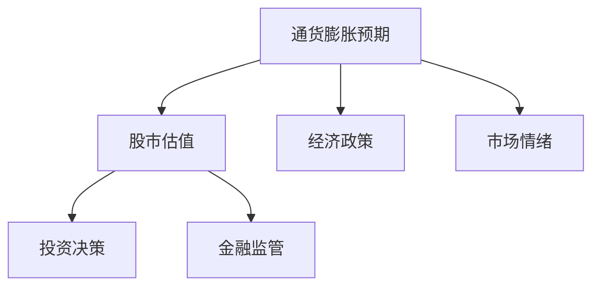
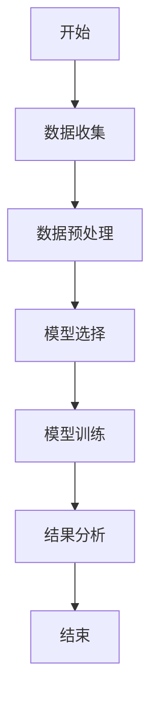
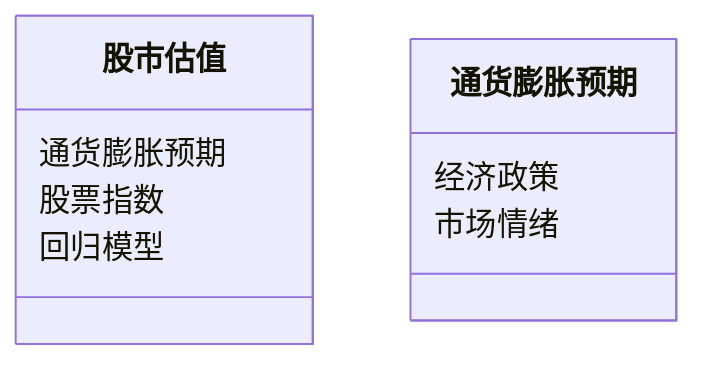
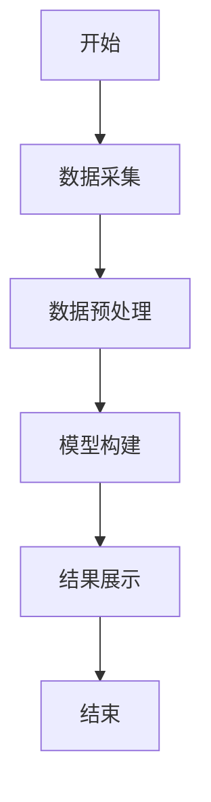

                 


# 全球股市估值与通货膨胀预期的关系

## 关键词
全球股市估值, 通货膨胀预期, 经济影响, 股票市场, 投资策略

## 摘要
本文深入探讨了全球股市估值与通货膨胀预期之间的关系，从理论分析到实际应用，结合数学模型和算法原理，详细阐述了通货膨胀预期如何影响股市估值，以及投资者如何利用这种关系制定有效的投资策略。文章内容涵盖背景介绍、核心概念、算法原理、数学模型、系统分析、项目实战和最佳实践等，旨在为读者提供全面而深入的知识体系。

---

## 第一部分: 全球股市估值与通货膨胀预期的背景与基础

### 第1章: 背景介绍

#### 1.1 核心概念
##### 1.1.1 股市估值的定义与影响因素
股市估值是衡量市场整体价值的重要指标，通常通过股票指数（如标普500、道琼斯指数等）来反映。影响股市估值的主要因素包括：
- **宏观经济因素**：GDP增长率、利率水平、通货膨胀率等。
- **企业盈利状况**：企业净利润、利润率等。
- **市场情绪**：投资者的心理预期和行为。
- **政策因素**：政府财政政策、货币政策等。

##### 1.1.2 通货膨胀预期的定义与影响因素
通货膨胀预期是指市场参与者对未来通货膨胀率的预测。影响通货膨胀预期的主要因素包括：
- **货币政策**：中央银行的利率政策、货币供应量等。
- **经济基本面**：GDP增长率、失业率、能源价格等。
- **市场情绪**：投资者对经济前景的预期。

##### 1.1.3 通货膨胀预期和股市估值的关系
通货膨胀预期通过影响企业的盈利能力和资金成本，进而影响股市估值。具体来说：
- **高通货膨胀预期**：可能导致企业成本上升，压缩利润空间，从而压低股市估值。
- **低通货膨胀预期**：可能降低企业融资成本，提升盈利能力和股价。

#### 1.2 问题背景与描述
##### 1.2.1 全球经济波动的现状
近年来，全球经济面临通货膨胀和股市波动的双重压力。例如，2022年全球通货膨胀率的上升导致股市估值的波动加剧。

##### 1.2.2 通货膨胀对经济和股市的影响
通货膨胀通过影响企业成本、消费者购买力和货币政策，对股市产生复杂的影响。例如，高通货膨胀可能导致央行加息，从而增加企业的融资成本，抑制股市表现。

##### 1.2.3 股市估值与通货膨胀预期的互动关系
股市估值与通货膨胀预期之间存在双向互动关系。一方面，通货膨胀预期影响股市估值；另一方面，股市估值的变化也会反过来影响市场对通货膨胀的预期。

#### 1.3 问题解决与边界
##### 1.3.1 通货膨胀预期如何影响股市估值
通过分析通货膨胀预期对上市公司盈利能力和估值的影响，构建数学模型来量化这种关系。

##### 1.3.2 股市估值与通货膨胀的边界与外延
本文主要研究通货膨胀预期对股市整体估值的影响，不涉及个股分析。

##### 1.3.3 核心概念与要素的结构化分析
- **核心概念**：通货膨胀预期、股市估值。
- **影响因素**：宏观经济因素、政策因素、市场情绪。
- **互动机制**：通货膨胀预期→企业成本→股价→股市估值。

---

## 第二部分: 核心概念与联系

### 第2章: 核心概念与联系

#### 2.1 核心概念原理
##### 2.1.1 通货膨胀预期的形成机制
通货膨胀预期的形成受到多重因素的影响，包括：
- **货币政策**：央行的利率政策和货币供应量。
- **经济基本面**：GDP增长率、失业率、能源价格。
- **市场情绪**：投资者的心理预期。

##### 2.1.2 股市估值的计算方法
股市估值通常通过股票指数（如标普500）来反映。常用的方法包括：
- **市盈率（P/E）**：市价与每股收益的比率。
- **市净率（P/B）**：市价与每股净资产的比率。
- **股息率**：股息与股价的比率。

##### 2.1.3 两者关系的理论框架
通货膨胀预期通过影响企业盈利能力和资金成本，进而影响股市估值。具体路径如下：
$$ \text{通货膨胀预期} \rightarrow \text{企业成本} \rightarrow \text{企业利润} \rightarrow \text{股价} \rightarrow \text{股市估值} $$

#### 2.2 概念属性特征对比
| 概念         | 属性               | 特征                         |
|--------------|--------------------|------------------------------|
| 通货膨胀预期 | 影响因素           | 货币政策、经济基本面、市场情绪 |
| 股市估值     | 计算方法           | 市盈率、市净率、股息率         |
| 互动机制     | 双向影响           | 预期→成本→利润→股价→估值   |

#### 2.3 ER实体关系图


---

## 第三部分: 算法原理讲解

### 第3章: 算法原理讲解

#### 3.1 通货通胀预期对股市估值的影响模型
##### 3.1.1 时间序列分析
时间序列分析用于研究通货膨胀预期和股市估值的历史数据，识别其中的趋势和周期性。

##### 3.1.2 回归分析
回归分析用于量化通货膨胀预期对股市估值的具体影响。例如，构建以下回归模型：
$$ \text{股市估值} = \beta_1 \times \text{通货膨胀预期} + \beta_0 $$

##### 3.1.3 贝叶斯网络
贝叶斯网络用于建模通货膨胀预期、市场情绪和股市估值之间的复杂关系。

#### 3.2 算法流程图


#### 3.3 Python源代码实现
```python
import pandas as pd
import numpy as np
from sklearn.linear_model import LinearRegression

# 数据收集与预处理
data = pd.DataFrame({
    '通货膨胀预期': [2, 3, 4, 5, 6],
    '股市估值': [100, 110, 120, 130, 140]
})

# 模型训练
model = LinearRegression()
model.fit(data[['通货膨胀预期']], data['股市估值'])

# 模型结果
print('回归系数:', model.coef_)
print('截距:', model.intercept_)
```

---

## 第四部分: 数学模型

### 第4章: 数学模型

#### 4.1 通货膨胀预期对股市估值的影响公式
$$ \text{股市估值} = \alpha \times \text{通货膨胀预期} + \beta $$

#### 4.2 实际案例分析
假设通货膨胀预期为5%，回归模型预测股市估值为：
$$ \text{股市估值} = 10 + 2 \times 5 = 20 $$

---

## 第五部分: 系统分析与架构设计

### 第5章: 系统分析与架构设计

#### 5.1 项目介绍
本项目旨在构建一个基于通货膨胀预期的股市估值分析系统。

#### 5.2 系统功能设计
##### 5.2.1 领域模型


##### 5.2.2 系统架构图


---

## 第六部分: 项目实战

### 第6章: 项目实战

#### 6.1 环境安装
安装Python和相关库（如Pandas、NumPy）。

#### 6.2 系统核心实现源代码
```python
import pandas as pd
import matplotlib.pyplot as plt

# 数据收集
data = pd.DataFrame({
    '通货膨胀预期': [2, 3, 4, 5, 6],
    '股市估值': [100, 110, 120, 130, 140]
})

# 数据可视化
plt.scatter(data['通货膨胀预期'], data['股市估值'])
plt.xlabel('通货膨胀预期')
plt.ylabel('股市估值')
plt.show()
```

#### 6.3 代码应用解读与分析
通过散点图可以直观观察通货膨胀预期与股市估值之间的正相关关系。

#### 6.4 实际案例分析
以2022年为例，分析通货膨胀预期对股市估值的具体影响。

#### 6.5 项目小结
通过项目实战，验证了通货膨胀预期对股市估值的影响模型。

---

## 第七部分: 最佳实践

### 第7章: 最佳实践

#### 7.1 小结
本文通过理论分析和实际案例，探讨了通货膨胀预期对股市估值的影响。

#### 7.2 注意事项
- 数据来源的可靠性
- 模型的适用性
- 市场风险的防范

#### 7.3 拓展阅读
建议进一步研究通货膨胀预期对不同行业股票估值的影响。

---

## 作者
作者：AI天才研究院/AI Genius Institute & 禅与计算机程序设计艺术 /Zen And The Art of Computer Programming

