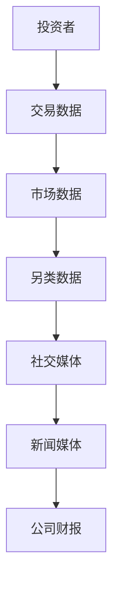
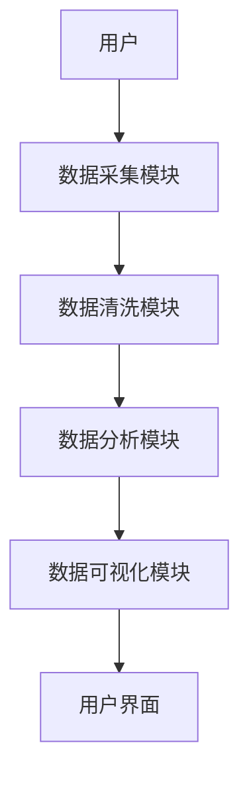

                 


# 另类数据在投资分析中的价值

**关键词：另类数据，投资分析，大数据，情感分析，机器学习**

**摘要：**  
本文探讨了另类数据在投资分析中的价值。在传统金融数据之外，另类数据如社交媒体情绪、卫星图像和供应链数据等，为投资者提供了更全面的视角。通过分析这些数据，投资者可以捕捉市场趋势、识别风险，并做出更明智的投资决策。本文从另类数据的定义、分类、算法原理、系统架构设计以及项目实战等方面展开，深入解析其在投资分析中的应用潜力。

---

## 第1章: 另类数据的背景与定义

### 1.1 传统金融数据的局限性

#### 1.1.1 传统金融数据的定义与特点
传统金融数据主要包括股票价格、交易量、市盈率等财务指标，这些数据通常用于衡量市场的基本走势。然而，它们往往无法捕捉市场情绪、行业趋势或突发事件等非线性因素。

#### 1.1.2 传统金融数据的局限性
尽管传统金融数据在投资分析中占据重要地位，但其局限性日益显现。例如，它们无法反映市场参与者的心理变化，也无法预测突发事件对市场的影响。

#### 1.1.3 另类数据的兴起背景
随着技术的进步，数据来源的多样化，另类数据逐渐兴起。投资者开始意识到，非传统数据如社交媒体情绪、卫星图像和供应链数据，能够提供更多关于市场动态的信息。

---

### 1.2 另类数据的定义与分类

#### 1.2.1 另类数据的定义
另类数据是指传统金融数据之外的非结构化或半结构化数据，包括文本数据（如社交媒体评论）、图像数据（如卫星图像）和网络流量数据等。

#### 1.2.2 另类数据的主要分类
另类数据可以分为以下几类：
1. **文本数据**：社交媒体帖子、新闻文章。
2. **图像数据**：卫星图像、公司财报中的图表。
3. **网络数据**：网站流量、点击流数据。
4. **物联网数据**：供应链传感器数据。

#### 1.2.3 另类数据的来源与获取方式
另类数据的主要来源包括社交媒体平台、新闻网站、卫星图像服务和物联网设备等。获取方式则包括API接口、爬虫技术以及与数据供应商的合作。

---

### 1.3 另类数据在投资分析中的价值

#### 1.3.1 另类数据的优势
1. 提供市场情绪指标。
2. 识别行业趋势。
3. 预测突发事件的影响。

#### 1.3.2 另类数据的应用场景
1. 预测市场走势。
2. 评估公司基本面。
3. 监测行业动态。

#### 1.3.3 另类数据的未来发展趋势
随着人工智能和大数据技术的进步，另类数据的应用将更加广泛和深入。未来的投资分析将更加依赖于多源数据的融合分析。

---

## 第2章: 另类数据的核心概念与联系

### 2.1 另类数据的核心概念

#### 2.1.1 数据类型与属性
另类数据的类型多样，每种数据都有其独特的属性。例如，文本数据具有情感色彩，而图像数据则包含视觉信息。

#### 2.1.2 数据处理与分析方法
处理另类数据通常需要自然语言处理（NLP）和计算机视觉技术。例如，文本数据可以通过情感分析提取市场情绪。

#### 2.1.3 数据关联性与预测能力
另类数据与其他数据的关联性决定了其预测能力。例如，社交媒体情绪与股票价格可能存在正相关关系。

---

### 2.2 另类数据与其他数据的对比

#### 2.2.1 与传统金融数据的对比
| **维度** | **传统金融数据** | **另类数据** |
|----------|------------------|--------------|
| 数据类型 | 结构化数据        | 非结构化数据 |
| 数据来源 | 交易所、财报      | 社交媒体、卫星图像 |
| 数据频率 | 高频             | 低频、高频   |

#### 2.2.2 与大数据的对比
另类数据是大数据的一部分，但其在金融领域的应用更具针对性。

#### 2.2.3 与实时数据的对比
另类数据可以是实时的，也可以是历史的，而传统实时数据通常指的是高频交易数据。

---

### 2.3 另类数据的实体关系图



---

## 第3章: 另类数据的算法原理与数学模型

### 3.1 文本挖掘与情感分析

#### 3.1.1 文本挖掘的基本原理
文本挖掘通过提取文本中的有用信息，帮助投资者了解市场情绪。常用技术包括关键词提取和主题建模。

#### 3.1.2 情感分析的算法流程
1. 数据清洗。
2. 特征提取。
3. 模型训练。
4. 情感预测。

#### 3.1.3 示例分析与代码实现
```python
from textblob import TextBlob
text = "The company's new product launch was a huge success."
print(TextBlob(text).sentiment.polarity)
```

---

### 3.2 时间序列分析

#### 3.2.1 时间序列分析的基本原理
时间序列分析通过分析数据的时间依赖性，预测未来的市场走势。

#### 3.2.2 常用算法与数学模型
1. 移动平均模型（MA）。
2. 自回归模型（AR）。
3. ARIMA模型。

#### 3.2.3 示例分析与代码实现
```python
from statsmodels.tsa.arima.model import ARIMA
import pandas as pd

data = pd.read_csv('time_series_data.csv')
model = ARIMA(data['value'], order=(1,1,0))
model_fit = model.fit()
```

---

### 3.3 机器学习模型

#### 3.3.1 常用机器学习算法
1. 线性回归。
2. 支持向量机（SVM）。
3. 神经网络。

#### 3.3.2 神经网络模型的构建与训练
```python
import tensorflow as tf
from tensorflow.keras import layers

model = tf.keras.Sequential()
model.add(layers.Dense(64, activation='relu', input_shape=(input_dim,)))
model.add(layers.Dense(1, activation='sigmoid'))
model.compile(optimizer='adam', loss='binary_crossentropy', metrics=['accuracy'])
model.fit(X_train, y_train, epochs=10, batch_size=32)
```

---

### 3.4 数学模型与公式

#### 3.4.1 情感评分计算公式
$$ \text{情感评分} = \frac{\text{正面词数量} - \text{负面词数量}}{\text{总词数量}} $$

#### 3.4.2 回归分析公式
$$ y = \beta_0 + \beta_1 x_1 + \beta_2 x_2 + \ldots + \beta_n x_n + \epsilon $$

#### 3.4.3 时间序列预测公式
$$ \hat{y}_{t} = \alpha y_{t-1} + (1-\alpha) y_{t-2} $$

---

## 第4章: 另类数据的系统分析与架构设计

### 4.1 系统功能设计

#### 4.1.1 数据采集模块
负责从社交媒体、新闻网站等来源采集数据。

#### 4.1.2 数据清洗模块
对采集到的数据进行预处理，去除噪音。

#### 4.1.3 数据分析模块
使用机器学习算法对数据进行分析，生成投资建议。

#### 4.1.4 数据可视化模块
将分析结果以图表形式展示。

---

### 4.2 系统架构设计



---

## 第5章: 项目实战

### 5.1 项目背景与目标
通过分析社交媒体情绪数据，预测股票价格走势。

### 5.2 系统环境与依赖
1. Python 3.8+
2. NumPy、Pandas、TextBlob、TensorFlow。

---

### 5.3 核心代码实现

#### 5.3.1 数据采集
```python
import requests
from bs4 import BeautifulSoup

url = 'https://finance.yahoo.com'
response = requests.get(url)
soup = BeautifulSoup(response.text, 'html.parser')
```

#### 5.3.2 数据分析
```python
from textblob import TextBlob

text = "The company's new product launch was a huge success."
blob = TextBlob(text)
print(blob.sentiment.polarity)
```

#### 5.3.3 模型训练
```python
from tensorflow.keras import layers

model = tf.keras.Sequential()
model.add(layers.Dense(64, activation='relu', input_shape=(input_dim,)))
model.add(layers.Dense(1, activation='sigmoid'))
model.compile(optimizer='adam', loss='binary_crossentropy', metrics=['accuracy'])
model.fit(X_train, y_train, epochs=10, batch_size=32)
```

---

### 5.4 项目小结
通过本项目，我们展示了如何利用另类数据进行投资分析。社交媒体情绪分析可以帮助投资者预测市场走势，提供额外的决策依据。

---

## 第6章: 总结与展望

### 6.1 最佳实践 tips
1. 数据清洗是关键。
2. 选择合适的算法。
3. 结合传统数据与另类数据。

### 6.2 小结
另类数据为投资分析提供了新的视角和工具，其应用潜力巨大。

### 6.3 注意事项
1. 数据隐私问题。
2. 模型的可解释性。

### 6.4 拓展阅读
1. 《大数据投资：另类数据的应用》。
2. 《机器学习在金融中的应用》。

---

**作者：AI天才研究院 & 禅与计算机程序设计艺术**

