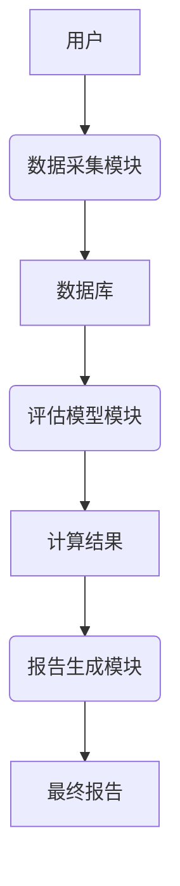

                 


# 可持续发展目标对公司估值的长期影响

> **关键词**：可持续发展目标（SDGs）、公司估值、长期影响、企业战略、财务表现、风险管理

> **摘要**：  
可持续发展目标（Sustainable Development Goals，SDGs）是联合国提出的17个全球性目标，涵盖经济、社会和环境等多个方面。本文从SDGs的核心概念出发，分析其对公司估值的长期影响，包括对企业战略、财务表现、风险管理和社会责任等方面的影响。通过理论分析、案例研究和系统设计，探讨SDGs如何通过改善企业治理、优化资源分配和提升品牌形象等方式，提升公司的长期价值。同时，本文还将结合实际案例和系统架构，提供如何将SDGs与企业估值相结合的具体方法。

---

# 第一部分: 可持续发展目标对公司估值的背景与概念

## 第1章: 可持续发展目标的定义与背景

### 1.1 可持续发展目标的起源与意义

#### 1.1.1 可持续发展目标的起源  
可持续发展目标（SDGs）是由联合国于2015年通过的17个全球性目标，旨在指导全球在2030年前实现消除贫困、保护地球和促进繁荣等目标。SDGs的前身是千年发展目标（MDGs），但SDGs的范围更广，涵盖了经济、社会和环境三个维度。

#### 1.1.2 可持续发展目标的核心理念  
SDGs的核心理念是“平衡”——在追求经济增长的同时，兼顾社会公平和环境保护。这不仅是一个全球性的挑战，也是企业必须面对的长期战略问题。

#### 1.1.3 可持续发展目标与企业社会责任的关系  
SDGs与企业社会责任（CSR）密切相关，但SDGs的范围更广，强调企业不仅要履行社会责任，还要将其融入企业的核心业务和战略中。

### 1.2 可持续发展目标对公司估值的影响背景

#### 1.2.1 全球经济与环境问题的现状  
当前，全球面临气候变化、资源枯竭、社会不平等和经济不景气等多重挑战。这些问题不仅影响全球经济，也对企业的发展和估值产生了深远影响。

#### 1.2.2 可持续发展目标对企业发展的驱动作用  
SDGs为企业提供了明确的方向，鼓励企业在追求利润的同时，关注社会和环境问题。这种双重目标使得企业在长期发展中更具竞争力。

#### 1.2.3 企业估值与可持续发展目标的关联性  
企业的长期估值不仅仅取决于财务表现，还与其社会影响力和环境表现密切相关。SDGs为企业提供了提升长期价值的框架。

---

## 第2章: 可持续发展目标的核心概念与框架

### 2.1 可持续发展目标的核心要素

#### 2.1.1 经济、社会和环境三个维度的分析  
SDGs的17个目标可以分为三个主要维度：  
- **经济维度**：消除贫困、经济增长、工业创新。  
- **社会维度**：社会公平、减少不平等、健康福祉。  
- **环境维度**：气候变化、资源保护、清洁饮水。

#### 2.1.2 可持续发展目标的17个具体目标解析  
以下是SDGs的17个目标：  
1. 消除贫困，确保所有人享有体面的生活。  
2. 消除饥饿，实现粮食安全。  
3. 确保健康的生活方式，促进福祉。  
4. 保证全人Lifetime教育。  
5. 实现性别平等。  
6. 确保清洁饮水和卫生设施。  
7. 确保清洁能源的获取和可持续发展。  
8. 促进包容性经济增长和体面就业。  
9. 建立 resilient infrastructure，促进工业创新。  
10. 减少不平等。  
11. 建设可持续城市和社区。  
12. 促进 responsible consumption 和生产。  
13. 应对气候变化。  
14. 保护海洋生态。  
15. 保护陆地生态系统。  
16. 促进和平、正义与 strong institutions。  
17. 加强全球伙伴关系。

#### 2.1.3 目标之间的相互作用与协同效应  
SDGs的各个目标不是孤立的，而是相互关联、相互作用的。例如，减少贫困（目标1）与气候变化（目标13）之间存在协同效应，因为贫困地区的居民更容易受到气候变化的影响。

### 2.2 可持续发展目标与企业价值的关系

#### 2.2.1 可持续发展目标对企业长期价值的影响  
SDGs通过促进社会公平、环境保护和经济增长，帮助企业建立长期的竞争优势。例如，企业通过减少碳排放（目标13）可以降低运营成本，同时提升品牌形象。

#### 2.2.2 可持续发展目标与企业财务表现的关联性  
越来越多的投资者关注企业的ESG（环境、社会、治理）表现。企业通过实现SDGs目标，可以提升投资者信心，从而提升公司估值。

#### 2.2.3 可持续发展目标对企业风险管理和机会的影响  
SDGs可以帮助企业识别和应对潜在的环境和社会风险。例如，企业通过实现资源保护（目标6和15）可以降低供应链中断的风险。

---

## 第3章: 可持续发展目标对公司估值的核心影响因素

### 3.1 可持续发展目标对企业战略的影响

#### 3.1.1 可持续发展目标对企业长期战略规划的指导作用  
SDGs为企业提供了长期发展的蓝图。企业可以根据SDGs目标制定战略，例如将“清洁能源获取”（目标7）作为能源战略的核心。

#### 3.1.2 可持续发展目标对企业组织架构和文化的影响  
实现SDGs目标需要企业内部组织架构和文化的调整。例如，企业可以设立专门的可持续发展部门，推动SDGs的实施。

#### 3.1.3 可持续发展目标对企业创新与竞争优势的影响  
SDGs为企业提供了创新的机会。例如，企业可以通过开发可再生能源技术（目标7）来提升技术竞争力。

### 3.2 可持续发展目标对企业财务表现的影响

#### 3.2.1 可持续发展目标对企业盈利能力的影响  
通过实现SDGs目标，企业可以降低成本、提高效率，从而提升盈利能力。例如，减少能源消耗（目标7）可以降低运营成本。

#### 3.2.2 可持续发展目标对企业市场价值的影响  
SDGs通过提升品牌形象和社会影响力，增加企业的市场价值。例如，企业通过实现性别平等（目标5）可以吸引更多女性消费者。

#### 3.2.3 可持续发展目标对企业风险管理能力的影响  
SDGs可以帮助企业降低环境和社会风险，从而提升企业的风险管理能力。例如，企业通过实现气候变化应对（目标13）可以降低气候相关风险。

---

## 第4章: 可持续发展目标对公司估值的长期影响分析

### 4.1 可持续发展目标对企业长期价值的提升

#### 4.1.1 可持续发展目标通过提升社会影响力增加企业价值  
SDGs通过帮助企业建立社会影响力，增加企业的长期价值。例如，企业通过实现教育公平（目标4）可以提升其社会影响力。

#### 4.1.2 可持续发展目标通过优化资源配置提升企业效率  
SDGs通过优化资源配置，提升企业的运营效率。例如，企业通过实现资源保护（目标6和15）可以降低资源浪费。

#### 4.1.3 可持续发展目标通过降低风险提升企业稳定性  
SDGs通过降低环境和社会风险，提升企业的稳定性。例如，企业通过实现气候变化应对（目标13）可以降低气候相关风险。

### 4.2 可持续发展目标对投资者决策的影响

#### 4.2.1 投资者对SDGs的关注与投资趋势  
越来越多的投资者关注企业的ESG表现，SDGs成为投资者评估企业价值的重要依据。

#### 4.2.2 可持续发展目标通过提升企业ESG表现吸引投资者  
企业通过实现SDGs目标，可以提升其ESG表现，从而吸引更多的投资者。

#### 4.2.3 可持续发展目标通过降低投资风险提升投资信心  
SDGs通过降低环境和社会风险，提升投资者对企业的信心。例如，企业通过实现气候变化应对（目标13）可以降低投资风险。

---

## 第5章: 可持续发展目标对公司估值的系统设计与实现

### 5.1 可持续发展目标对公司估值的系统架构设计

#### 5.1.1 系统需求分析  
系统需求：设计一个能够评估企业实现SDGs目标对公司估值的影响的系统。  
用户角色：企业高管、投资者、可持续发展经理。  

#### 5.1.2 系统功能设计  
- 数据采集模块：采集企业的SDGs相关数据（如能源消耗、碳排放、员工福利）。  
- 评估模型模块：基于SDGs目标，建立评估模型，计算企业实现SDGs目标对估值的影响。  
- 报告生成模块：生成评估报告，展示SDGs目标对企业估值的影响。  

#### 5.1.3 系统架构设计  
以下是系统架构的mermaid图：  



### 5.2 可持续发展目标对公司估值的实现步骤

#### 5.2.1 数据采集与处理  
- 数据采集：从企业内部系统中采集SDGs相关的数据。  
- 数据清洗：对数据进行清洗，确保数据的准确性和完整性。  

#### 5.2.2 评估模型的构建  
- 建立SDGs目标与企业估值的数学模型。  
- 使用机器学习算法（如线性回归、随机森林）进行预测。  

#### 5.2.3 结果分析与优化  
- 分析评估结果，找出影响企业估值的关键SDGs目标。  
- 根据评估结果优化企业的SDGs战略。  

### 5.3 可持续发展目标对公司估值的代码实现

#### 5.3.1 数据采集与预处理  
```python
import pandas as pd

# 采集数据
data = pd.read_csv('sdg_data.csv')

# 数据清洗
data.dropna(inplace=True)
data = data[data['year'] >= 2015]  # 确保数据在SDGs实施后
```

#### 5.3.2 评估模型的构建  
```python
from sklearn.linear_model import LinearRegression

# 建立模型
model = LinearRegression()
model.fit(X, y)

# 预测结果
predictions = model.predict(X_test)
```

#### 5.3.3 结果分析与优化  
```python
import matplotlib.pyplot as plt

# 可视化结果
plt.scatter(X_test, y_test, color='blue', label='实际值')
plt.scatter(X_test, predictions, color='red', label='预测值')
plt.xlabel('SDGs指标')
plt.ylabel('公司估值')
plt.legend()
plt.show()
```

---

## 第6章: 可持续发展目标对公司估值的案例分析

### 6.1 国内案例：某企业通过实现SDGs目标提升估值

#### 6.1.1 案例背景  
某中国企业通过实现“清洁能源获取”（目标7）和“减少不平等”（目标10）等目标，显著提升了其市场价值。

#### 6.1.2 案例分析  
- 通过实现清洁能源目标，企业降低了能源成本，提升了盈利能力。  
- 通过实现减少不平等目标，企业提升了品牌形象，吸引了更多消费者。

### 6.2 国际案例：某跨国公司通过SDGs实现可持续增长

#### 6.2.1 案例背景  
某跨国公司通过实现“气候变化应对”（目标13）和“社会公平”（目标10）等目标，成为行业内的可持续发展领导者。

#### 6.2.2 案例分析  
- 通过实现气候变化应对目标，企业降低了环境风险，提升了投资者信心。  
- 通过实现社会公平目标，企业提升了员工满意度，降低了员工流失率。

---

## 第7章: 可持续发展目标对公司估值的未来展望与建议

### 7.1 未来展望

#### 7.1.1 SDGs与企业估值的深度融合  
未来，SDGs将与企业估值更加深度融合，成为企业战略的核心组成部分。

#### 7.1.2 数字技术在SDGs评估中的应用  
随着人工智能和大数据技术的发展，SDGs评估将更加精准和高效。

### 7.2 最佳实践建议

#### 7.2.1 企业层面的建议  
- 将SDGs目标融入企业的长期战略中。  
- 建立专门的可持续发展部门，推动SDGs的实施。  
- 定期评估SDGs目标对企业估值的影响。

#### 7.2.2 投资者层面的建议  
- 关注企业的ESG表现，将SDGs作为投资决策的重要依据。  
- 投资于实现SDGs目标的企业，降低投资风险。

#### 7.2.3 政府层面的建议  
- 制定支持SDGs目标的政策，为企业实现SDGs目标提供支持。  
- 推动企业与政府的合作，共同实现SDGs目标。

---

## 第8章: 结论与展望

### 8.1 结论

- 可持续发展目标（SDGs）是全球性挑战，也是企业实现长期价值的重要框架。  
- SDGs通过提升企业社会影响力、优化资源配置和降低风险，显著提升企业的长期估值。  
- 企业应将SDGs目标融入战略，投资者应关注企业的SDGs表现。

### 8.2 展望

- 未来，SDGs将与企业估值更加深度融合，成为企业战略的核心组成部分。  
- 随着技术的发展，SDGs评估将更加精准和高效，为企业和投资者提供更好的决策支持。

---

## 参考文献

- 联合国可持续发展署. (2015).《可持续发展2030年议程》.  
- 哈佛大学. (2020).《企业与SDGs：实现长期价值的框架》.  
- 世界银行. (2021).《可持续发展目标对企业价值的影响》.  

---

## 作者：AI天才研究院/AI Genius Institute & 禅与计算机程序设计艺术 /Zen And The Art of Computer Programming

