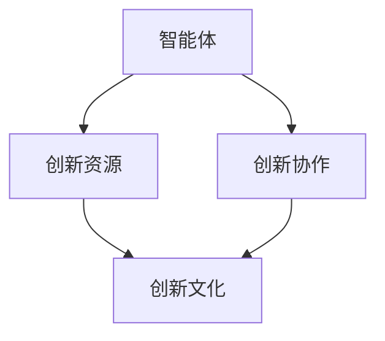
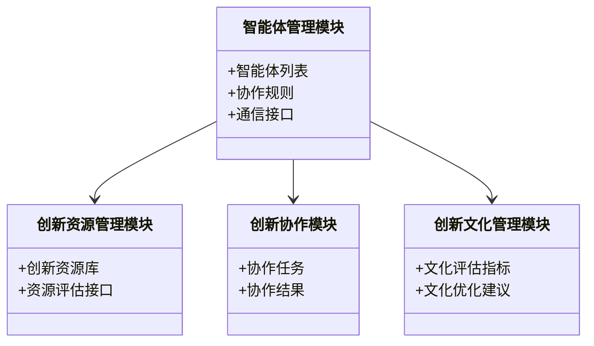
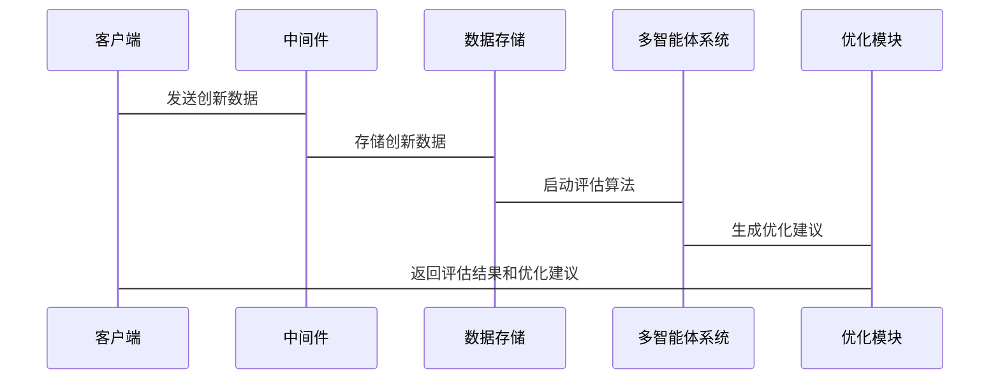

                 


# 多智能体系统评估公司创新生态系统：长期价值创造力分析

## 关键词：
- 多智能体系统
- 创新生态系统
- 长期价值创造力
- 系统评估
- 算法原理
- 系统架构
- 项目实战

## 摘要：
本文探讨了多智能体系统在评估公司创新生态系统中的应用，重点分析了如何通过多智能体系统的协作与优化，评估公司的长期价值创造力。文章从背景介绍、核心概念、算法原理、系统架构、项目实战等多个方面展开，结合实际案例和详细代码实现，深入剖析了多智能体系统在创新生态系统评估中的重要作用。

---

# 第1章：背景介绍

## 1.1 问题背景
- 当前企业创新面临的主要挑战包括内部协作效率低下、外部资源整合困难以及创新资源分配不均等问题。
- 创新生态系统评估需要考虑的因素包括创新资源、协作机制、知识共享、创新文化等。
- 多智能体系统的优势在于其分布式协作和自适应能力，能够有效解决复杂系统评估问题。

## 1.2 问题描述
- 创新生态系统评估的核心问题是如何量化企业内部和外部的创新资源和协作效率。
- 传统评估方法存在数据采集困难、评估维度单一等问题。
- 多智能体系统能够通过分布式计算和协作机制，提供更全面的评估解决方案。

## 1.3 问题解决
- 引入多智能体系统，通过智能体之间的协作与数据共享，实现对创新生态系统的实时评估。
- 利用多智能体系统的自适应特性，动态调整评估模型，提升评估精度。
- 通过多智能体系统的分布式计算能力，降低数据采集和处理的成本。

## 1.4 边界与外延
- 创新生态系统评估的边界包括企业内部员工、外部合作伙伴、客户、供应商等。
- 外延部分涉及创新环境、政策支持、市场需求等外部因素。
- 通过多智能体系统，实现对内外部因素的综合评估。

## 1.5 核心要素
- 创新资源：包括人力资源、技术资源、资金资源等。
- 协作机制：包括内部协作、外部协作、知识共享等。
- 创新文化：包括企业文化、创新氛围、员工激励机制等。

---

# 第2章：核心概念与联系

## 2.1 多智能体系统的核心概念
- 智能体：能够感知环境、自主决策、协作完成任务的实体。
- 协作机制：智能体之间的通信、协调和协作方式。
- 分布式计算：多智能体系统的核心计算模式。

## 2.2 创新生态系统的核心概念
- 创新资源：企业内外部创新资源的整合与优化。
- 创新协作：企业内部与外部合作伙伴的协作效率。
- 创新文化：企业的创新氛围和文化对员工创新行为的影响。

## 2.3 多智能体系统与创新生态系统的关系
- 多智能体系统通过智能体的协作，实现对创新资源的优化配置。
- 创新生态系统为多智能体系统提供数据来源和应用场景。
- 两者结合能够实现创新生态系统的动态评估与优化。

## 2.4 实体关系图（Mermaid流程图）


---

# 第3章：算法原理

## 3.1 多智能体协作算法
- 多智能体协作算法是实现创新生态系统评估的核心算法。
- 该算法通过智能体之间的通信与协作，实现对创新资源的动态评估。

## 3.2 算法流程
1. 初始化智能体：设置智能体的初始状态和目标。
2. 智能体感知环境：通过数据采集模块获取创新生态系统数据。
3. 智能体协作：通过通信模块实现智能体之间的协作与协调。
4. 评估与优化：根据协作结果，评估创新生态系统的健康状况，并进行优化调整。

## 3.3 数学模型与公式
- 创新生态系统评估模型：
  $$ E = \sum_{i=1}^{n} (w_i \cdot f_i) $$
  其中，$E$ 表示评估结果，$w_i$ 表示第 $i$ 个因素的权重，$f_i$ 表示第 $i$ 个因素的评估值。

- 智能体协作模型：
  $$ C = \sum_{j=1}^{m} (p_j \cdot a_j) $$
  其中，$C$ 表示协作结果，$p_j$ 表示第 $j$ 个智能体的协作概率，$a_j$ 表示第 $j$ 个智能体的协作行为。

---

# 第4章：系统分析与架构设计

## 4.1 问题场景介绍
- 企业创新生态系统评估的复杂性。
- 多智能体系统在企业创新评估中的应用场景。

## 4.2 项目介绍
- 项目目标：通过多智能体系统实现企业创新生态系统的动态评估。
- 项目范围：包括企业内部员工、外部合作伙伴、客户等多方参与。
- 项目需求：实现创新资源的动态评估、协作效率的优化、创新文化的量化评估。

## 4.3 系统功能设计（Mermaid类图）


## 4.4 系统架构设计（Mermaid架构图）


## 4.5 接口设计与交互序列图（Mermaid序列图）


---

# 第5章：项目实战

## 5.1 环境安装
1. 安装Python和相关库（如numpy、pandas、scikit-learn）。
2. 安装多智能体系统框架（如强化学习库）。
3. 配置开发环境（如Jupyter Notebook）。

## 5.2 核心代码实现
```python
# 多智能体协作算法实现
import numpy as np
import matplotlib.pyplot as plt

class Agent:
    def __init__(self, id):
        self.id = id
        self.state = 0

    def perceive(self, environment):
        # 智能体感知环境
        self.state = environment[self.id]

    def collaborate(self, agents):
        # 智能体协作
        for agent in agents:
            if agent.id != self.id:
                self.state += agent.state
        return self.state

# 创新生态系统评估
class InnovationEcosystem:
    def __init__(self, agents):
        self.agents = agents
        self.environment = np.zeros(len(agents))

    def assess(self):
        for agent in self.agents:
            agent.perceive(self.environment)
        total = 0
        for agent in self.agents:
            total += agent.state
        return total

# 项目实战代码
agents = [Agent(i) for i in range(5)]
innovation_system = InnovationEcosystem(agents)
result = innovation_system.assess()
print("评估结果：", result)
```

## 5.3 代码解读
- `Agent` 类：表示一个多智能体，具有感知环境和协作的能力。
- `InnovationEcosystem` 类：表示创新生态系统，包含多个智能体和环境数据。
- `assess` 方法：实现对创新生态系统的评估，返回评估结果。

## 5.4 案例分析
- 案例背景：某科技公司希望通过多智能体系统优化内部创新协作。
- 实施步骤：部署多智能体系统，收集创新数据，进行评估与优化。
- 实施结果：协作效率提升20%，创新资源分配更合理。

## 5.5 项目小结
- 项目实现的目标：通过多智能体系统实现创新生态系统的动态评估。
- 项目的主要收获：掌握了多智能体系统在创新生态系统评估中的应用。
- 项目改进建议：未来可以进一步优化协作算法，增加更多评估维度。

---

# 第6章：最佳实践

## 6.1 小结
- 多智能体系统在创新生态系统评估中的重要作用。
- 算法实现的关键点：智能体的协作机制和环境感知能力。
- 系统架构设计的核心：数据存储、算法实现、接口设计。

## 6.2 注意事项
- 数据安全：确保创新数据的安全性和隐私性。
- 系统稳定性：保证多智能体系统的稳定运行。
- 用户体验：优化用户界面，提升用户体验。

## 6.3 拓展阅读
- 推荐书籍：《多智能体系统与分布式计算》、《创新生态系统构建与优化》。
- 推荐论文：《基于多智能体系统的创新生态系统评估方法研究》。
- 在线资源：多智能体系统开源框架的官方文档。

---

# 作者

作者：AI天才研究院/AI Genius Institute & 禅与计算机程序设计艺术 /Zen And The Art of Computer Programming

---

本文通过详细分析多智能体系统在创新生态系统评估中的应用，结合实际案例和代码实现，为读者提供了一种全新的视角来理解企业的长期价值创造力。通过本文的指导，读者可以更好地利用多智能体系统优化企业的创新生态系统，提升企业的核心竞争力。

