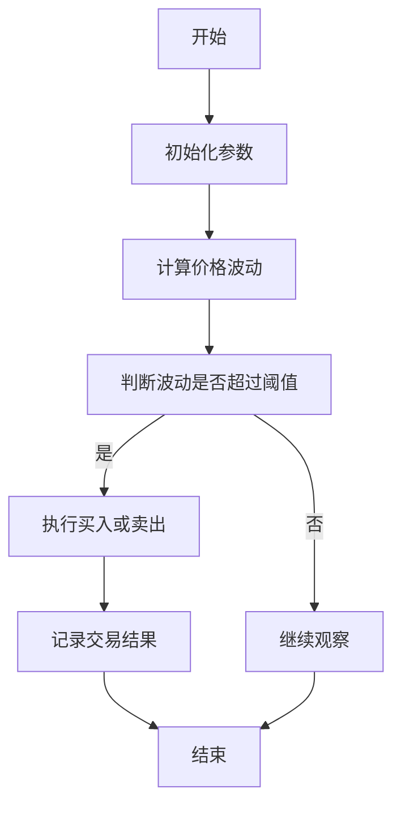
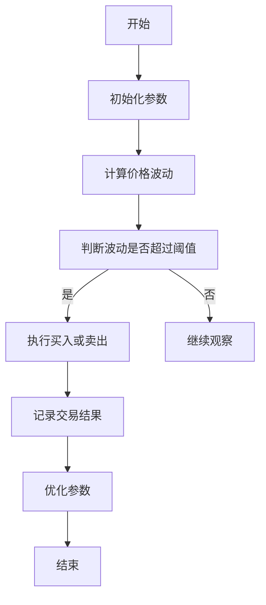
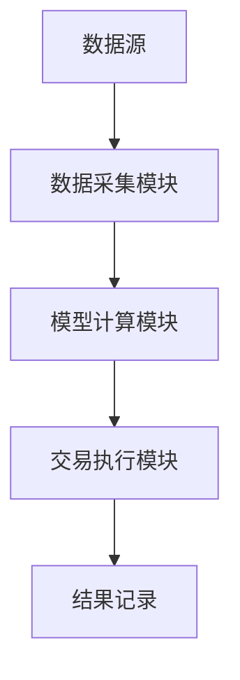
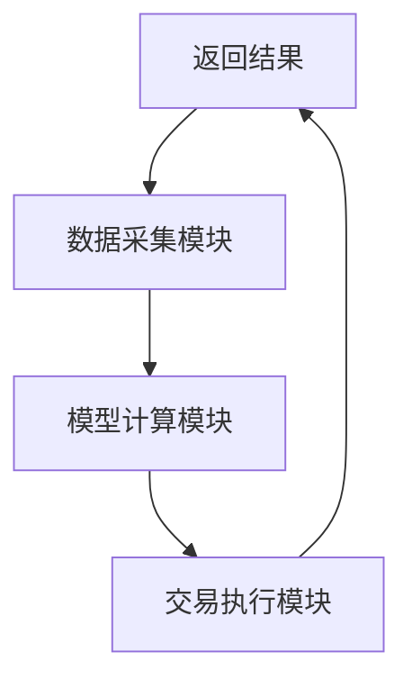

                 


# 如何利用特价股票策略应对央行数字货币趋势

> 关键词：特价股票策略，央行数字货币，趋势分析，数学模型，算法实现，系统架构

> 摘要：本文详细探讨了如何利用特价股票策略应对央行数字货币趋势的变化。通过分析特价股票策略的核心概念、数学模型和算法实现，结合央行数字货币对股票市场的影响，提出了应对策略的具体方法和系统架构设计。文章最后通过实际案例分析和项目实战，展示了如何将理论应用于实践。

---

# 第一部分: 特价股票策略与央行数字货币趋势背景

## 第1章: 特价股票策略与央行数字货币概述

### 1.1 特价股票策略的定义与特点

#### 1.1.1 特价股票策略的定义
特价股票策略是一种基于价格波动的股票投资策略，主要通过识别股票价格的短期波动来捕捉收益。其核心在于利用市场中的短期价格差异，快速进出市场以实现盈利。

#### 1.1.2 特价股票策略的核心特点
- **短期性**：注重短期价格波动，而非长期价值投资。
- **高频交易**：依赖于高频交易技术，快速执行交易指令。
- **风险较高**：由于依赖价格波动，风险相对较高，收益不稳定。

#### 1.1.3 特价股票策略与传统股票投资的区别
| 特性 | 特价股票策略 | 传统股票投资 |
|------|--------------|---------------|
| 投资期限 | 短期 | 长期 |
| 风险水平 | 高 | 中低 |
| 投资逻辑 | 价格波动 | 公司基本面 |

### 1.2 央行数字货币的定义与特点

#### 1.2.1 央行数字货币的定义
央行数字货币（Central Bank Digital Currency, CBDC）是由中央银行发行的数字化货币，具有法定货币地位，支持广泛的应用场景。

#### 1.2.2 央行数字货币的核心特点
- **安全性**：由中央银行背书，具有较高的信用风险。
- **可追溯性**：具备完整的交易记录，便于监管。
- **高效性**：交易速度快，降低了交易成本。

#### 1.2.3 央行数字货币与传统货币的区别
| 特性 | 央行数字货币 | 传统货币 |
|------|--------------|-----------|
| 形态 | 数字化 | 实体化 |
| 发行方 | 中央银行 | 银行、企业 |
| 交易速度 | 高 | 低 |

### 1.3 特价股票策略与央行数字货币的关系

#### 1.3.1 特价股票策略在央行数字货币环境下的机遇
- **交易效率提升**：央行数字货币的高效性可能降低交易成本，提升交易速度。
- **市场流动性增加**：央行数字货币的普及可能增加市场流动性，提供更多交易机会。

#### 1.3.2 央行数字货币对股票市场的影响
- **价格波动加剧**：央行数字货币的引入可能引发市场波动，影响股票价格。
- **市场结构变化**：央行数字货币可能改变市场的参与者结构，影响交易策略。

#### 1.3.3 特价股票策略应对央行数字货币趋势的必要性
随着央行数字货币的普及，股票市场的交易环境将发生变化。特价股票策略需要适应新的市场环境，以保持其竞争力。

---

## 第2章: 特价股票策略的数学模型与算法原理

### 2.1 特价股票策略的数学模型

#### 2.1.1 特价股票策略的基本数学公式
特价股票策略的核心是价格波动预测。以下是一个简化的数学模型：

$$ P_{t} = P_{t-1} + \alpha \cdot \sigma_{t-1} $$
其中，$P_t$ 是当前价格，$P_{t-1}$ 是上一交易日价格，$\sigma_{t-1}$ 是上一交易日的价格波动标准差，$\alpha$ 是模型参数。

#### 2.1.2 特价股票策略的风险评估模型
风险评估可以通过VaR（Value at Risk）模型进行：

$$ VaR = \mu + z \cdot \sigma $$
其中，$\mu$ 是平均回报，$z$ 是标准正态分布的分位数，$\sigma$ 是标准差。

#### 2.1.3 特价股票策略的收益预测模型
收益预测可以通过以下公式实现：

$$ R = \sum_{i=1}^{n} (P_i - P_{i-1}) $$
其中，$R$ 是总收益，$P_i$ 是第i个交易日的价格，$P_{i-1}$ 是第i-1个交易日的价格。

### 2.2 央行数字货币对股票市场的影响模型

#### 2.2.1 央行数字货币对市场流动性的数学分析
市场流动性可以通过以下公式进行分析：

$$ L = \frac{\text{成交额}}{\text{价格波动}} $$
其中，L 是流动性指标，成交额是市场总成交额，价格波动是价格波动幅度。

#### 2.2.2 央行数字货币对股票价格波动的影响
股票价格波动可以通过以下模型进行分析：

$$ \sigma_{\text{股票}} = \beta \cdot \sigma_{\text{CBDC}} $$
其中，$\sigma_{\text{股票}}$ 是股票价格波动，$\sigma_{\text{CBDC}}$ 是央行数字货币的价格波动，$\beta$ 是影响系数。

#### 2.2.3 央行数字货币对投资者行为的数学建模
投资者行为可以通过以下模型进行建模：

$$ B = \sum_{i=1}^{n} b_i \cdot x_i $$
其中，$B$ 是投资者行为指数，$b_i$ 是行为系数，$x_i$ 是投资者行为变量。

### 2.3 特价股票策略的算法实现

#### 2.3.1 特价股票策略的算法流程
以下是特价股票策略的算法流程：



#### 2.3.2 特价股票策略的优化算法
优化算法可以通过以下步骤实现：



#### 2.3.3 特价股票策略的实现代码示例
以下是特价股票策略的Python实现代码：

```python
import numpy as np

def predict_price(current_price, volatility):
    alpha = 0.5
    return current_price + alpha * volatility

# 示例数据
prices = [100, 102, 98, 105, 101]
volatilities = [2, 3, 2, 4, 1]

for i in range(1, len(prices)):
    predicted_price = predict_price(prices[i-1], volatilities[i-1])
    print(f"预测价格: {predicted_price}, 实际价格: {prices[i]}")
```

---

## 第3章: 央行数字货币对股票市场的影响分析

### 3.1 央行数字货币对股票市场的影响机制

#### 3.1.1 央行数字货币对市场流动性的分析
央行数字货币的引入可能增加市场的流动性，从而影响股票价格的波动。

#### 3.1.2 央行数字货币对股票价格波动的影响
央行数字货币可能改变市场参与者的交易行为，从而影响股票价格的波动。

#### 3.1.3 央行数字货币对投资者行为的影响
投资者行为可能变得更加理性，从而影响市场的整体波动。

### 3.2 特价股票策略在央行数字货币环境下的适应性

#### 3.2.1 特价股票策略的调整方向
- **优化交易模型**：根据央行数字货币的影响，优化特价股票策略的交易模型。
- **增加风险控制**：在新的市场环境下，增加风险控制措施。

#### 3.2.2 特价股票策略的优化建议
- **动态调整参数**：根据市场变化，动态调整策略参数。
- **引入新的数据源**：利用央行数字货币的相关数据，优化策略。

---

## 第4章: 特价股票策略应对央行数字货币趋势的具体方法

### 4.1 系统架构设计

#### 4.1.1 系统功能设计
- **数据采集模块**：采集股票价格和央行数字货币相关数据。
- **模型计算模块**：计算价格波动和风险评估。
- **交易执行模块**：根据模型结果执行交易。

#### 4.1.2 系统架构图


#### 4.1.3 系统接口设计
- **数据接口**：与数据源对接，获取实时数据。
- **交易接口**：与交易系统对接，执行交易指令。

#### 4.1.4 系统交互序列图


### 4.2 项目实战

#### 4.2.1 环境安装
- 安装Python和相关库（如numpy、pandas）。

#### 4.2.2 核心功能实现
以下是核心功能的Python代码示例：

```python
import numpy as np

def main():
    # 示例数据
    prices = np.array([100, 102, 98, 105, 101])
    volatilities = np.array([2, 3, 2, 4, 1])
    
    # 计算预测价格
    predicted_prices = np.zeros_like(prices)
    for i in range(1, len(prices)):
        predicted_prices[i] = prices[i-1] + 0.5 * volatilities[i-1]
    
    print("预测价格:", predicted_prices)
    print("实际价格:", prices)

if __name__ == "__main__":
    main()
```

#### 4.2.3 实际案例分析
通过实际案例分析，验证策略的有效性，并总结经验教训。

---

## 第5章: 总结与展望

### 5.1 总结
本文详细探讨了如何利用特价股票策略应对央行数字货币趋势的变化，提出了具体的数学模型和算法实现，并通过实际案例分析验证了策略的有效性。

### 5.2 展望
随着央行数字货币的普及，特价股票策略需要进一步优化和调整，以适应新的市场环境。

---

## 附录

### 附录A: 术语表
- **特价股票策略**：基于价格波动的股票投资策略。
- **央行数字货币**：由中央银行发行的数字化货币。

### 附录B: 工具安装指南
- Python安装指南。
- 相关库（如numpy、pandas）的安装方法。

### 附录C: 参考文献
- 相关文献和参考资料。

---

# 作者：AI天才研究院/AI Genius Institute & 禅与计算机程序设计艺术 /Zen And The Art of Computer Programming

