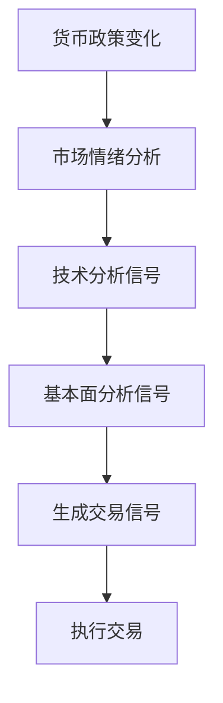

                 


---

## 第2章：货币政策变化的分析与预测（续）

### 2.2 货币政策变化的预测模型

#### 2.2.1 时间序列分析

时间序列分析是一种常用的方法，可以通过历史数据预测未来货币政策的变化。以下是一个简单的ARIMA模型示例：

1. **数据准备**：收集历史货币政策数据（如利率、货币供应量）。
2. **模型选择**：根据数据的特性选择合适的ARIMA参数。
3. **模型训练**：使用历史数据训练模型。
4. **预测与验证**：对未来货币政策进行预测，并验证模型的准确性。

#### 2.2.2 机器学习模型

机器学习模型（如随机森林、神经网络）可以通过多维度数据预测货币政策变化。以下是Python代码示例：

```python
import pandas as pd
import numpy as np
from sklearn.ensemble import RandomForestRegressor

# 数据准备
data = pd.read_csv('policy_data.csv')
X = data[['GDP', 'inflation', 'unemployment']]
y = data['policy_change']

# 模型训练
model = RandomForestRegressor(n_estimators=100, random_state=42)
model.fit(X, y)

# 预测
new_data = np.array([[5, 2, 6]])
prediction = model.predict(new_data)
print(prediction)
```

#### 2.2.3 组合模型的应用

组合模型可以通过集成多种预测方法提高准确性。例如，将时间序列分析和机器学习模型的结果进行加权平均。

---

## 第3章：特价股票策略的核心原理

### 3.1 技术分析与特价股票策略

技术分析是通过股价走势预测未来股价变化的方法。以下是几种常用的技术指标：

- **移动平均线（MA）**：用于判断股价的短期趋势。
- **相对强弱指数（RSI）**：用于判断股价的超买或超卖状态。
- **MACD指标**：用于判断股价的短期和长期趋势。

#### 3.1.1 技术分析在特价股票策略中的应用

1. **识别超跌股票**：通过RSI指标判断股价是否处于超卖状态。
2. **寻找趋势反转点**：通过MA指标判断股价是否触底反弹。

#### 3.1.2 技术分析的优缺点

- **优点**：能够快速捕捉市场趋势变化。
- **缺点**：容易受到市场情绪的影响，存在较高的误判风险。

---

### 3.2 基本面分析与特价股票策略

基本面分析是通过公司财务数据和行业状况评估股票的内在价值。以下是基本面分析的关键指标：

- **市盈率（P/E）**：用于评估股票的估值是否合理。
- **市净率（P/B）**：用于评估股票相对于资产净值的估值。
- **ROE（净资产收益率）**：用于评估公司的盈利能力。

#### 3.2.1 基本面分析在特价股票策略中的应用

1. **寻找低估值股票**：通过P/E和P/B指标寻找价格低于行业平均水平的股票。
2. **评估公司盈利能力**：通过ROE指标判断公司的盈利能力是否稳定。

---

### 3.3 特价股票策略的数学模型

#### 3.3.1 估值模型

以下是使用P/E和P/B指标进行股票估值的示例：

$$ \text{合理股价} = \min(\text{P/E} \times \text{行业平均P/E}, \text{P/B} \times \text{行业平均P/B}) $$

#### 3.3.2 风险调整模型

考虑市场整体风险的特价股票策略模型：

$$ \text{预期收益} = \text{个股收益} - \beta \times (\text{市场收益} - \text{无风险利率}) $$

其中，$\beta$ 是股票的贝塔系数，衡量股票相对于市场的波动性。

---

## 第4章：货币政策变化与特价股票策略的结合

### 4.1 系统架构设计

以下是结合货币政策变化和特价股票策略的系统架构设计：

1. **数据采集模块**：实时采集货币政策数据和股票市场数据。
2. **分析模块**：利用技术分析和基本面分析方法，识别潜在的特价股票。
3. **策略执行模块**：根据货币政策变化触发买卖信号，执行交易。

---

### 4.2 策略执行机制

以下是策略执行的流程图：



---

## 第5章：实证分析与案例研究

### 5.1 实证分析方法

通过历史数据验证特价股票策略的有效性。以下是Python代码示例：

```python
import pandas as pd
import matplotlib.pyplot as plt

# 数据准备
data = pd.read_csv('stock_data.csv')
data['return'] = data['close'].pct_change()

# 计算超额收益
data['excess_return'] = data['return'] - data['market_return']

# 绘制图表
plt.figure(figsize=(10, 6))
plt.plot(data['date'], data['excess_return'])
plt.title('Excess Returns Over Time')
plt.xlabel('Date')
plt.ylabel('Excess Returns')
plt.show()
```

---

## 第6章：风险管理与投资组合优化

### 6.1 风险管理策略

1. **分散投资**：通过投资不同行业和地区的股票分散风险。
2. **止损机制**：设定止损点，避免亏损过大。
3. **动态调整**：根据市场变化动态调整投资组合。

---

### 6.2 投资组合优化方法

使用现代投资组合理论（MPT）优化投资组合。以下是Python代码示例：

```python
import numpy as np
from scipy.optimize import minimize

# 输入参数
returns = np.array([0.1, 0.05, 0.08, 0.06])
cov_matrix = np.array([[0.04, 0.02, 0.01, 0.01],
                        [0.02, 0.03, 0.01, 0.01],
                        [0.01, 0.01, 0.02, 0.01],
                        [0.01, 0.01, 0.01, 0.02]])

# 定义优化函数
def portfolio_variance(weights):
    return np.dot(weights.T, np.dot(cov_matrix, weights))

# 约束条件
cons = ({'type': 'eq', 'fun': lambda w: sum(w) - 1})

# 优化求解
result = minimize(portfolio_variance, [0.25, 0.25, 0.25, 0.25], constraints=cons)

print("最优权重：", result.x)
```

---

## 第7章：总结与展望

### 7.1 总结

本文详细探讨了如何利用特价股票策略应对货币政策变化。通过结合技术分析、基本面分析和数学模型，投资者可以在市场波动中捕捉机会，实现稳健的投资收益。

### 7.2 未来研究方向

1. **智能算法的应用**：探索机器学习和深度学习在货币政策预测和股票策略中的应用。
2. **多因子模型的优化**：结合更多因子（如动量因子、价值因子）优化投资策略。
3. **实时交易系统开发**：开发基于算法的实时交易系统，提升交易效率。

---

## 作者

作者：AI天才研究院/AI Genius Institute & 禅与计算机程序设计艺术 /Zen And The Art of Computer Programming

---

以上是文章的完整目录和部分内容，您可以根据需要进一步扩展或调整。

