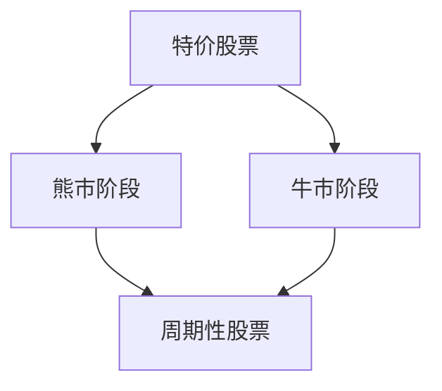
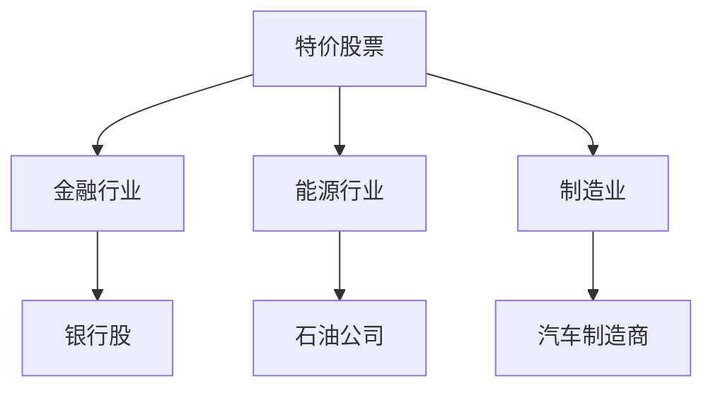
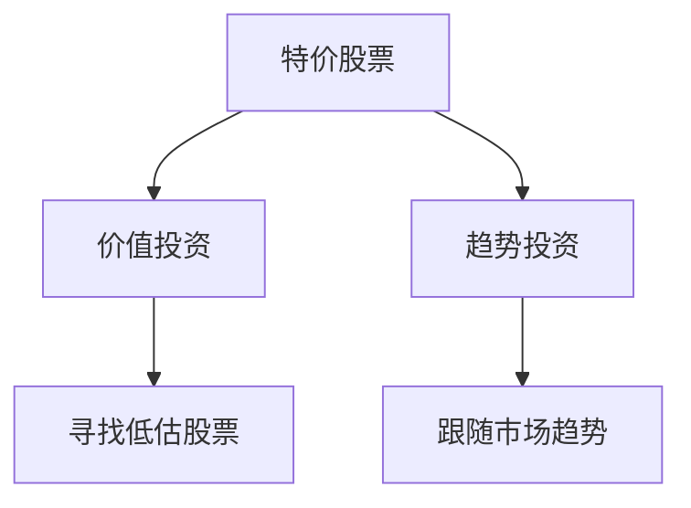

                 

# 如何利用特价股票策略进行资产配置

> 关键词：特价股票策略、资产配置、股票投资、风险管理、投资组合

> 摘要：本文详细探讨了如何利用特价股票策略进行有效的资产配置。通过分析特价股票的定义、分类及适用场景，结合资产配置的理论与方法，提供系统化的投资策略设计和实证分析，帮助投资者优化投资组合，平衡风险与收益，实现长期稳健的投资回报。

---

## 第1章：特价股票策略概述

### 1.1 特价股票的定义与特点

#### 1.1.1 特价股票的定义

特价股票（Cheap Stock）是指市场价格显著低于其内在价值的股票。通常，这些股票可能因市场波动、行业低迷或公司暂时困境而被低估，但具备长期增值的潜力。特价股票的核心在于“便宜”，即市场价格低于其实际价值。

#### 1.1.2 特价股票的特点

| 特性 | 描述 |
|------|------|
| 低估值 | 市场价格低于内在价值，通常表现为市盈率（P/E）或市净率（P/B）低于行业平均水平。 |
| 高股息率 | 部分特价股票公司可能派发较高的股息，吸引追求稳定收益的投资者。 |
| 高波动性 | 由于价格较低，这些股票可能波动较大，既有上涨潜力，也可能继续下跌。 |
| 行业分布广 | 特价股票可能出现在金融、能源、制造业等多个行业。 |

#### 1.1.3 特价股票与普通股票的区别

| 维度 | 特价股票 | 普通股票 |
|------|---------|----------|
| 价格 | 低于内在价值 | 反映市场供需，不一定显著低估 |
| 风险 | 较高，但潜在回报大 | 风险相对稳定 |
| 投资策略 | 长期持有，等待价值回归 | 短期交易或基于趋势投资 |

### 1.2 特价股票的分类

#### 1.2.1 按市场周期分类

- **熊市阶段**：投资者可能寻找超跌股票，这些股票价格被市场低估，具备反弹潜力。
- **牛市阶段**：部分股票可能因市场情绪过高而被高估，但仍有部分股票价格合理，属于特价股票。

#### 1.2.2 按行业分类

- **金融行业**：如银行股，可能因经济低迷而被低估。
- **能源行业**：如石油公司，价格受油价波动影响，可能在市场低迷时被低估。
- **制造业**：如汽车制造商，行业周期性可能导致股价低于实际价值。

#### 1.2.3 按投资策略分类

- **价值投资**：寻找市场价格远低于内在价值的股票，长期持有，等待价值回归。
- **趋势投资**：关注市场趋势，在特定周期内寻找价格被低估的股票进行短期投资。

### 1.3 特价股票策略的适用场景

#### 1.3.1 市场低迷期

市场低迷时，许多股票价格被低估，为投资者提供了廉价买入的机会。此时，特价股票策略非常适合，因为投资者可以以较低价格买入优质股票，等待市场复苏。

#### 1.3.2 特定行业周期

某些行业可能因周期性波动而出现特价股票。例如，能源行业的股票可能在油价下跌时被低估，为投资者提供买入机会。

#### 1.3.3 个人投资目标

投资者应根据自身风险承受能力、投资期限和收益目标选择适用的特价股票策略。例如，风险承受能力强的投资者可以选择波动较大的股票，而风险厌恶的投资者可以选择高股息率的特价股票。

---

## 第2章：资产配置的基本理论

### 2.1 资产配置的定义与重要性

#### 2.1.1 资产配置的定义

资产配置是指将资金分配到不同的资产类别（如股票、债券、房地产等）中，以实现投资目标的过程。合理的资产配置可以平衡风险与收益，优化投资组合的表现。

#### 2.1.2 资产配置的重要性

- **风险分散**：通过投资不同类型的资产，降低单一资产带来的风险。
- **收益增强**：不同资产在不同市场环境下表现不同，合理配置可提高整体收益。
- **适应性调整**：根据市场变化和个人情况，定期调整资产配置比例。

#### 2.1.3 资产配置与风险收益的关系

资产配置的核心在于平衡风险与收益。例如，高风险承受能力的投资者可能更多配置股票，而风险厌恶的投资者可能更多配置债券或现金。

### 2.2 资产配置的分类

#### 2.2.1 按资产类型分类

- **股票**：包括国内股票、国际股票等。
- **债券**：包括政府债券、企业债券等。
- **现金及货币市场工具**：包括活期存款、货币基金等。
- **房地产**：包括住宅、商业地产等。
- **其他资产**：如黄金、艺术品等。

#### 2.2.2 按投资期限分类

- **短期投资**：投资期限在1年以内，适合灵活调整的投资者。
- **中期投资**：投资期限在1至3年，适合有一定耐心的投资者。
- **长期投资**：投资期限在3年以上，适合有长期规划的投资者。

#### 2.2.3 按风险偏好分类

- **保守型**：低风险，追求稳定收益。
- **稳健型**：中等风险，追求平衡的收益与风险。
- **进取型**：高风险，追求高收益。

### 2.3 资产配置的核心原则

#### 2.3.1 风险分散原则

通过将资金分配到不同资产类别和行业中，降低单一资产或行业带来的风险。

#### 2.3.2 收益最大化原则

在风险可控的前提下，追求投资收益的最大化。通过合理配置，避免过度集中在某一资产或行业。

#### 2.3.3 定期调整原则

根据市场变化和个人情况，定期审视和调整资产配置比例，以适应新的投资环境。

---

## 第3章：特价股票策略在资产配置中的作用

### 3.1 特价股票策略对资产配置的影响

#### 3.1.1 提高投资收益

通过购买被低估的股票，投资者可以在市场复苏时获得超额收益。

#### 3.1.2 降低投资风险

在资产配置中加入特价股票，可以平衡其他高风险资产（如债券）的风险，实现风险分散。

#### 3.1.3 增强资产流动性

特价股票通常流动性较好，投资者可以随时买卖，灵活调整投资组合。

### 3.2 特价股票策略与其他投资策略的结合

#### 3.2.1 与定息收益投资结合

将部分资金配置到债券或货币市场工具，其余资金投入特价股票，平衡收益与风险。

#### 3.2.2 与权益投资结合

在股票资产中，加入特价股票策略，选择低估股票，提高整体股票资产的收益潜力。

#### 3.2.3 与衍生品投资结合

利用期权、期货等衍生品对冲特价股票的风险，进一步优化资产配置。

---

## 第4章：基于特价股票策略的资产配置方法

### 4.1 资产配置的步骤与流程

#### 4.1.1 确定投资目标

明确投资目标（如保值、增值）、风险承受能力和投资期限。

#### 4.1.2 评估风险承受能力

通过风险承受能力测试，确定适合的资产配置比例。

#### 4.1.3 制定投资策略

根据目标和风险承受能力，选择合适的资产配置方案。

#### 4.1.4 执行与监控

根据制定的策略执行投资，并定期监控和调整。

### 4.2 特价股票策略的具体应用

#### 4.2.1 选择特价股票的标准

- **低估值**：市盈率、市净率低于行业平均水平。
- **高股息率**：提供稳定收益。
- **行业地位**：选择行业龙头或具有竞争优势的公司。
- **财务健康**：关注公司的盈利能力、资产负债情况等。

#### 4.2.2 定量分析与定性分析

- **定量分析**：使用财务指标（如ROE、ROA）和估值指标（如P/E、P/B）筛选股票。
- **定性分析**：分析公司的行业地位、竞争优势、管理团队等。

#### 4.2.3 投资组合的构建

- **确定比例**：根据风险承受能力，确定特价股票在投资组合中的比例。
- **分散投资**：选择多个行业的特价股票，降低行业风险。
- **定期调整**：根据市场变化和个人情况，调整投资组合。

---

## 第5章：投资组合的构建与管理

### 5.1 投资组合的构建方法

#### 5.1.1 确定投资比例

根据风险承受能力和收益目标，确定特价股票在投资组合中的比例。例如，风险承受能力强的投资者可以将30%-50%的资金投入特价股票。

#### 5.1.2 选择具体股票

根据定量和定性分析，筛选出符合标准的特价股票，构建投资组合。

#### 5.1.3 定期调整组合

定期审视投资组合的表现，根据市场变化和个人情况，进行必要的调整。

### 5.2 投资组合的管理策略

#### 5.2.1 定期复审

每季度或半年复审一次投资组合，评估表现并进行调整。

#### 5.2.2 时机选择

根据市场环境，选择合适的买入和卖出时机，优化投资收益。

#### 5.2.3 风险管理

设置止损点，控制单只股票的持仓比例，分散投资风险。

---

## 第6章：实证分析与案例研究

### 6.1 特价股票策略的实证分析

#### 6.1.1 数据来源

选取过去5年内的市场数据，分析特价股票的表现。

#### 6.1.2 分析方法

采用定量分析方法，计算特价股票组合的收益率、波动率等指标，与市场指数进行比较。

#### 6.1.3 实证结果

结果显示，特价股票策略在熊市或市场低迷期表现优于市场指数，而在牛市中可能跑输市场。

### 6.2 案例研究

#### 6.2.1 案例背景

假设某投资者在2019年选择了一批低估的金融行业股票，如某银行股。

#### 6.2.2 投资组合构建

投资者将50%的资金投入该银行股，其余资金配置到债券和货币市场。

#### 6.2.3 投资结果

银行股在2020年疫情后反弹，投资组合整体收益率跑赢市场指数，实现了较高的回报。

---

## 第7章：风险管理与心理因素

### 7.1 风险管理的重要性

#### 7.1.1 风险评估

定期评估投资组合的风险敞口，识别潜在风险点。

#### 7.1.2 风险控制方法

- **分散投资**：避免过度集中。
- **止损策略**：设定止损点，控制单笔损失。
- **定期再平衡**：根据市场变化调整持仓比例。

### 7.2 投资者的心理因素

#### 7.2.1 心理偏差

- **过度自信**：可能导致错误决策。
- **损失厌恶**：可能错过低位买入机会。

#### 7.2.2 理性决策

投资者应保持理性，避免情绪化决策，严格按照策略执行。

---

## 第8章：总结与展望

### 8.1 总结

通过合理利用特价股票策略进行资产配置，投资者可以在不同市场环境下优化投资组合，平衡风险与收益，实现长期稳健的投资回报。关键在于选择合适的策略，制定合理的投资计划，并严格执行。

### 8.2 展望

随着市场环境的变化，特价股票策略的应用将更加多样化。未来，投资者可以结合大数据分析、人工智能等技术，进一步优化投资决策，提升投资效率。

---

## 作者

作者：AI天才研究院/AI Genius Institute & 禅与计算机程序设计艺术 /Zen And The Art of Computer Programming

