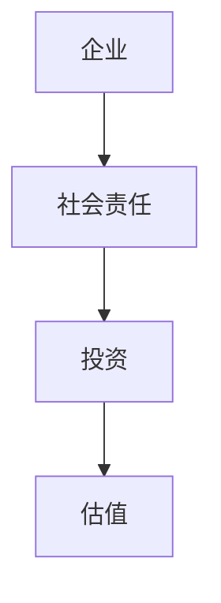
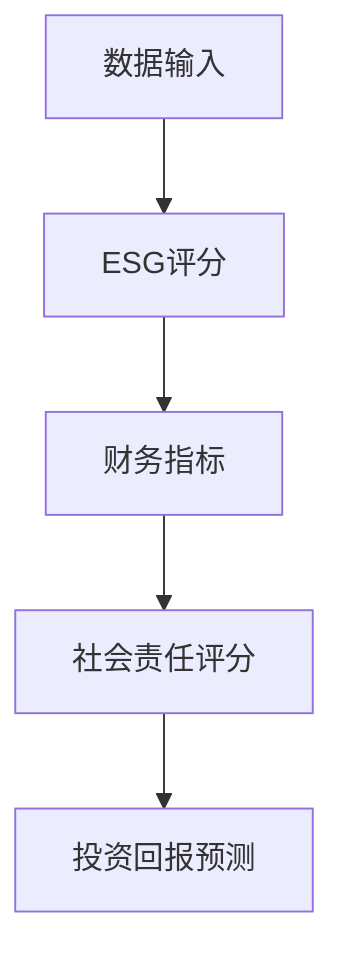
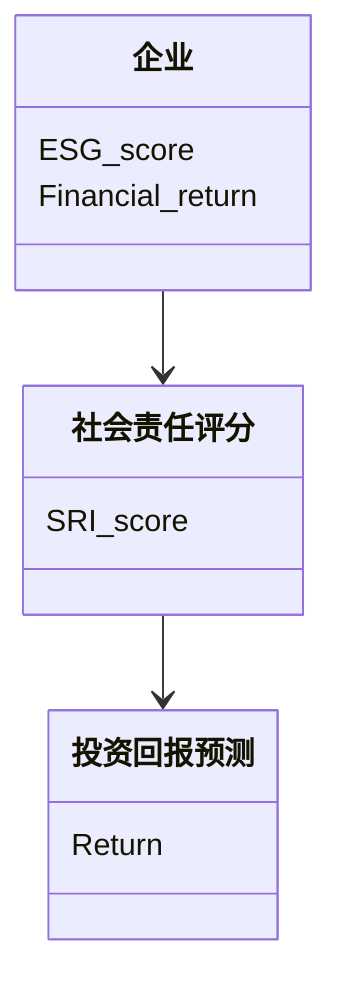
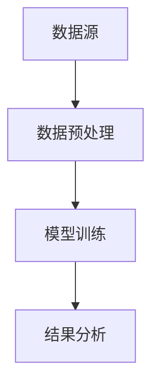

                 


# 如何在估值中考虑企业的社会责任投资

> 关键词：企业估值、社会责任投资、ESG评分、可持续发展、投资模型

> 摘要：企业社会责任投资（SRI）是一种将社会、环境和公司治理因素纳入投资决策的策略。本文从理论基础、数学模型、系统设计和实战案例等多个维度，详细探讨如何在企业估值中考虑社会责任投资。通过分析SRI的核心概念、数学模型和系统架构，结合实际案例，本文旨在为投资者提供一种新的视角，帮助他们在投资决策中更好地平衡经济效益和社会价值。

---

# 第一部分: 企业社会责任投资的背景与概念

## 第1章: 企业社会责任投资的背景与现状

### 1.1 企业社会责任投资的定义与核心概念

#### 1.1.1 企业社会责任投资的定义
企业社会责任投资（SRI）是一种投资策略，强调在投资决策中考虑企业的环境（Environmental）、社会（Social）和公司治理（Governance）因素（ESG），以实现长期的经济效益和社会价值。

#### 1.1.2 社会责任投资的核心要素
- **环境（E）**：关注企业的碳排放、资源利用效率和环保措施。
- **社会（S）**：关注企业的员工权益、社区参与和公平性。
- **公司治理（G）**：关注企业的治理结构、透明度和高管薪酬。

#### 1.1.3 企业社会责任投资的边界与外延
- **边界**：社会责任投资不等同于慈善，它是一种市场化的投资行为。
- **外延**：社会责任投资涵盖第一级市场的企业融资和二级市场的股票投资。

### 1.2 企业社会责任投资的背景与发展趋势

#### 1.2.1 经济全球化与企业社会责任的兴起
随着全球化的推进，企业对社会的影响日益显著，投资者开始关注企业的外部性。

#### 1.2.2 现代企业治理中的社会责任理念
现代企业治理强调利益相关者资本主义（Stakeholder Capitalism），将社会责任纳入企业战略。

#### 1.2.3 可持续发展与社会责任投资的融合
可持续发展目标为企业社会责任投资提供了明确的方向。

### 1.3 企业社会责任投资的现状与挑战

#### 1.3.1 当前企业社会责任投资的主要模式
- **负面筛选**：排除不符合伦理标准的企业。
- **正面筛选**：选择符合社会责任标准的企业。
- **ESG整合**：将ESG因素纳入投资组合管理。

#### 1.3.2 企业社会责任投资面临的挑战
- 数据获取的难度。
- 标准化的缺失。
- 短期收益与长期价值的平衡。

#### 1.3.3 技术驱动下社会责任投资的创新
- **大数据分析**：利用大数据技术量化ESG表现。
- **人工智能**：通过AI优化社会责任投资组合。

## 第2章: 企业社会责任投资的核心概念与联系

### 2.1 核心概念原理

#### 2.1.1 企业社会责任投资的三要素模型
- **环境因素（E）**：企业的环保表现。
- **社会因素（S）**：企业的社会责任履行情况。
- **治理因素（G）**：企业的治理结构和透明度。

#### 2.1.2 社会责任投资与企业价值的关系
社会责任投资通过优化企业的外部性，提升企业的长期价值。

#### 2.1.3 企业社会责任投资的系统性特征
社会责任投资是一种系统性行为，需要综合考虑企业内外部因素。

### 2.2 核心概念属性特征对比表

| 概念       | 属性       | 特征                                   |
|------------|------------|---------------------------------------|
| 企业社会责任 | 综合性     | 包括经济、社会、环境三方面           |
| 投资估值   | 量化性     | 依赖财务指标与非财务指标的结合       |

### 2.3 ER实体关系图



---

# 第二部分: 企业社会责任投资的数学模型与算法原理

## 第3章: 企业社会责任投资的数学模型与算法原理

### 3.1 数学模型与公式

#### 3.1.1 企业社会责任评分模型
$$ SRI\_score = \alpha \cdot ESG + \beta \cdot Financial\_performance $$

#### 3.1.2 社会责任投资的回报预测模型
$$ Return = \gamma \cdot SRI\_score + \delta \cdot Market\_risk $$

### 3.2 算法原理与流程图



### 3.3 算法实现与代码示例

#### 3.3.1 Python代码实现

```python
def calculate_sri_score(esg_score, financial_return):
    alpha = 0.5
    beta = 0.5
    return alpha * esg_score + beta * financial_return
```

---

# 第三部分: 企业社会责任投资的系统分析与架构设计

## 第4章: 企业社会责任投资的系统分析与架构设计

### 4.1 系统分析

#### 4.1.1 问题场景介绍
企业社会责任投资需要整合ESG数据和财务数据，构建一个综合评估系统。

#### 4.1.2 项目目标与范围
- 目标：构建一个基于ESG和财务指标的企业估值模型。
- 范围：包括数据采集、模型构建和结果分析。

#### 4.1.3 系统功能需求
- 数据采集模块：采集企业的ESG和财务数据。
- 模型构建模块：构建SRI评分和投资回报预测模型。
- 结果分析模块：分析投资回报与社会责任评分的关系。

### 4.2 系统架构设计

#### 4.2.1 领域模型mermaid类图



#### 4.2.2 系统架构设计mermaid图



---

# 第四部分: 项目实战

## 第5章: 项目实战

### 5.1 环境安装

#### 5.1.1 安装必要的库
```bash
pip install pandas numpy scikit-learn matplotlib
```

### 5.2 系统核心实现源代码

#### 5.2.1 数据处理代码

```python
import pandas as pd
import numpy as np

# 假设我们有一个包含ESG和财务数据的CSV文件
data = pd.read_csv('sri_data.csv')

# 计算SRI评分
def calculate_sri_score(row):
    esg_score = row['ESG']
    financial_return = row['Financial_return']
    alpha = 0.5
    beta = 0.5
    return alpha * esg_score + beta * financial_return

data['SRI_score'] = data.apply(calculate_sri_score, axis=1)
```

#### 5.2.2 模型训练代码

```python
from sklearn.linear_model import LinearRegression

# 训练投资回报预测模型
model = LinearRegression()
X = data[['SRI_score', 'Market_risk']]
y = data['Return']
model.fit(X, y)
```

#### 5.2.3 结果分析代码

```python
import matplotlib.pyplot as plt

# 可视化SRI评分与投资回报的关系
plt.scatter(data['SRI_score'], data['Return'])
plt.xlabel('SRI Score')
plt.ylabel('Return')
plt.title('SRI Score vs Return')
plt.show()
```

### 5.3 代码应用解读与分析

#### 5.3.1 数据处理
从CSV文件中读取数据，并计算SRI评分。

#### 5.3.2 模型训练
使用线性回归模型训练投资回报预测模型。

#### 5.3.3 结果分析
通过可视化工具分析SRI评分与投资回报之间的关系。

### 5.4 实际案例分析和详细讲解剖析

#### 5.4.1 案例背景
假设我们有一个企业数据集，包括ESG评分、财务回报和市场风险等指标。

#### 5.4.2 案例分析
通过代码实现，计算企业的SRI评分，并预测投资回报。

### 5.5 项目小结

#### 5.5.1 项目成果
构建了一个基于ESG和财务指标的企业估值模型。

#### 5.5.2 经验总结
社会责任投资需要结合定量分析和定性分析。

---

# 第五部分: 总结与展望

## 第6章: 总结与展望

### 6.1 本章小结

#### 6.1.1 核心内容回顾
本文详细探讨了如何在企业估值中考虑社会责任投资，从理论、模型到实践进行了全面分析。

#### 6.1.2 研究结论
社会责任投资是一种可持续的投资策略，能够实现经济效益和社会价值的统一。

### 6.2 展望与建议

#### 6.2.1 展望
未来，随着技术的进步，社会责任投资将更加智能化和个性化。

#### 6.2.2 建议
投资者应关注社会责任投资的长期价值，企业应加强ESG信息披露。

---

# 作者：AI天才研究院/AI Genius Institute & 禅与计算机程序设计艺术 /Zen And The Art of Computer Programming

