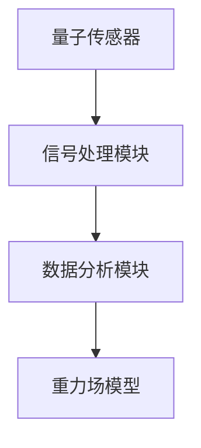
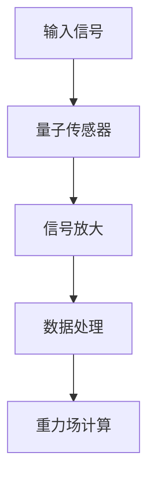
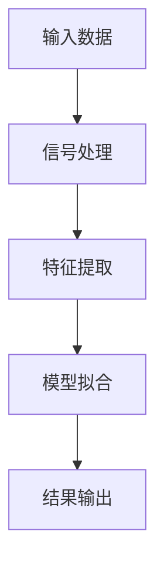
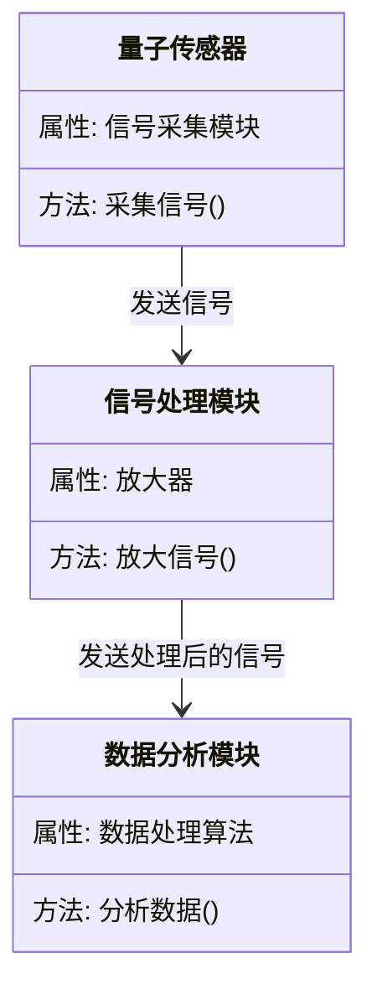

                 


# 如何评估企业的量子传感器重力测量应用

> 关键词：量子传感器, 重力测量, 企业应用, 技术评估, 算法原理

> 摘要：本文详细探讨了如何评估企业在量子传感器重力测量中的应用，从量子传感器的基本概念、核心原理到算法实现，再到系统架构和实际案例分析，全面解析了企业在应用量子传感器时需要考虑的关键因素和评估标准。

---

## 第一部分: 量子传感器重力测量应用的背景与核心概念

### 第1章: 量子传感器与重力测量概述

#### 1.1 量子传感器的基本概念

##### 1.1.1 量子传感器的定义与分类

量子传感器是一种基于量子力学原理设计的测量工具，能够利用量子系统的特性（如量子叠加、量子纠缠和量子干涉）来实现高精度的测量。与传统传感器相比，量子传感器具有更高的灵敏度和分辨率，能够在复杂环境中提供更准确的数据。

量子传感器主要分为以下几类：
1. **量子重力梯度仪**：用于测量重力场的变化，常用于地球勘探和资源探测。
2. **量子干涉仪**：利用干涉原理测量微小的变化，如引力波探测。
3. **量子磁力仪**：用于检测地磁场的变化，应用于地质勘探和导航。

##### 1.1.2 量子传感器在重力测量中的作用

重力测量是量子传感器的重要应用之一。传统的重力测量方法（如弹簧秤、扭秤等）存在测量精度低、灵敏度不足等问题。而量子传感器通过利用量子系统的特性，能够实现高精度、高灵敏度的重力测量，适用于以下场景：
1. **地球勘探**：探测地下资源分布。
2. **空间科学**：研究引力场的变化。
3. **工业检测**：检测设备的平衡状态。

##### 1.1.3 量子传感器与传统传感器的对比

| **特性**         | **传统传感器**             | **量子传感器**             |
|------------------|--------------------------|--------------------------|
| **灵敏度**       | 较低                     | 极高                     |
| **精度**         | 有限                     | 高                       |
| **抗干扰能力**   | 较差                     | 强                      |
| **应用场景**     | 一般测量                 | 高精度、复杂环境         |

#### 1.2 重力测量的基本原理

##### 1.2.1 重力测量的物理基础

重力是由物体所受的引力场决定的，其数学表达式为：
$$ g = G \frac{M}{r^2} $$
其中，$G$ 是万有引力常数，$M$ 是物体的质量，$r$ 是距离。

##### 1.2.2 重力场的数学模型

重力场的数学模型通常表示为：
$$ g(x, y, z) = G \frac{M}{(x^2 + y^2 + z^2)^{1/2}} $$
其中，$(x, y, z)$ 是空间坐标。

##### 1.2.3 重力测量的应用场景

重力测量在多个领域有广泛应用，如地球勘探、空间科学、工业检测等。

#### 1.3 量子传感器在企业中的应用背景

##### 1.3.1 企业对高精度重力测量的需求

随着科技的进步，企业在资源勘探、设备检测等领域对高精度重力测量的需求日益增加。量子传感器能够提供更高的测量精度，帮助企业更准确地进行资源探测和设备检测。

##### 1.3.2 量子传感器技术的商业化进程

近年来，量子传感器技术逐渐从实验室走向商业化。企业可以通过购买或租赁量子传感器设备，应用于生产和检测过程。

##### 1.3.3 企业应用中的挑战与机遇

企业在应用量子传感器时，需要克服技术门槛高、成本昂贵等挑战，同时也能够享受到高精度测量带来的巨大机遇。

### 第2章: 量子传感器重力测量的核心概念与联系

#### 2.1 量子传感器的核心原理

##### 2.1.1 量子力学基础

量子力学是量子传感器的核心理论基础。量子系统具有以下特性：
1. **量子叠加**：粒子可以同时处于多个状态。
2. **量子纠缠**：两个或多个粒子之间存在关联。
3. **量子干涉**：波函数的叠加和干涉现象。

##### 2.1.2 量子传感器的工作机制

量子传感器通过测量量子系统的特性变化来实现重力测量。例如，通过测量量子干涉仪的干涉条纹变化，可以推算出重力场的变化。

##### 2.1.3 量子传感器与传统传感器的对比

| **特性**         | **传统传感器**             | **量子传感器**             |
|------------------|--------------------------|--------------------------|
| **灵敏度**       | 较低                     | 极高                     |
| **精度**         | 有限                     | 高                       |
| **抗干扰能力**   | 较差                     | 强                      |

#### 2.2 重力测量的数学模型

##### 2.2.1 重力场的数学表达式

重力场的数学表达式为：
$$ g(x, y, z) = G \frac{M}{(x^2 + y^2 + z^2)^{1/2}} $$

##### 2.2.2 量子传感器的信号处理流程

量子传感器的信号处理流程包括：
1. **信号采集**：通过量子传感器采集重力场数据。
2. **信号放大**：放大微弱信号。
3. **噪声过滤**：去除背景噪声。
4. **数据处理**：对数据进行分析和模型拟合。

##### 2.2.3 数据分析与误差修正

数据分析是量子传感器重力测量的关键步骤。通过数学模型和算法，可以对测量数据进行误差修正和优化。

#### 2.3 实体关系图与流程图

##### 2.3.1 量子传感器系统架构图（Mermaid）



##### 2.3.2 重力测量流程图（Mermaid）



### 第3章: 量子传感器重力测量的算法原理

#### 3.1 算法原理概述

##### 3.1.1 量子传感器信号处理算法

量子传感器的信号处理算法包括信号放大、噪声过滤和特征提取等步骤。

##### 3.1.2 数据分析与模型拟合

数据分析是量子传感器重力测量的核心步骤，需要对数据进行模型拟合和误差修正。

##### 3.1.3 误差修正与优化算法

通过优化算法，可以减少测量误差，提高测量精度。

#### 3.2 算法流程图（Mermaid）



#### 3.3 Python实现示例

##### 3.3.1 数据处理代码

```python
import numpy as np

def process_signal(signal):
    # 信号放大
    amplified = signal * 10
    # 噪声过滤
    filtered = np.where(amplified > 5, amplified, 0)
    return filtered
```

##### 3.3.2 模型拟合代码

```python
from sklearn.linear_model import LinearRegression

model = LinearRegression()
```

---

## 第二部分: 量子传感器重力测量应用的系统分析与架构设计

### 第4章: 量子传感器重力测量系统的架构设计

#### 4.1 系统功能设计

##### 4.1.1 领域模型（Mermaid 类图）



#### 4.2 系统架构设计

##### 4.2.1 系统架构图（Mermaid）


#### 4.3 系统接口设计

##### 4.3.1 接口描述

量子传感器与信号处理模块之间的接口：
- 输入：原始信号
- 输出：放大后的信号

信号处理模块与数据分析模块之间的接口：
- 输入：放大后的信号
- 输出：处理后的信号

##### 4.3.2 交互流程图（Mermaid）

```mermaid
graph TD
    A[用户] --> B[量子传感器]: 发起测量
    B --> C[信号处理模块]: 采集信号
    C --> D[数据分析模块]: 处理信号
    D --> A: 显示结果
```

### 第5章: 量子传感器重力测量的应用挑战与解决方案

#### 5.1 应用挑战

##### 5.1.1 技术难题

量子传感器的技术门槛较高，需要专业的技术支持。

##### 5.1.2 成本问题

量子传感器的研发和生产成本较高，限制了其广泛应用。

##### 5.1.3 应用环境

量子传感器对环境要求较高，复杂的环境可能影响其测量精度。

#### 5.2 解决方案

##### 5.2.1 技术突破

通过不断的技术创新，降低量子传感器的成本和复杂度。

##### 5.2.2 成本优化

通过规模化生产和技术进步，降低量子传感器的成本。

##### 5.2.3 应用环境优化

优化量子传感器的工作环境，提高其在复杂环境中的适应能力。

---

## 第三部分: 量子传感器重力测量应用的项目实战

### 第6章: 量子传感器重力测量的实际案例分析

#### 6.1 案例背景

某企业在资源勘探中应用量子传感器进行重力测量，以探测地下资源分布。

#### 6.2 数据采集与处理

通过量子传感器采集重力场数据，并利用信号处理算法进行数据放大和噪声过滤。

#### 6.3 数据分析与结果解读

通过数据分析模块对数据进行模型拟合，计算出重力场的变化，进而推断出资源分布情况。

#### 6.4 优化方案

根据测量结果，优化资源勘探策略，提高资源探测效率。

### 第7章: 量子传感器重力测量应用的总结与展望

#### 7.1 总结

本文详细探讨了如何评估企业在量子传感器重力测量中的应用，从量子传感器的基本概念到算法实现，再到系统架构和实际案例分析，全面解析了企业在应用量子传感器时需要考虑的关键因素和评估标准。

#### 7.2 未来展望

随着量子传感器技术的不断发展，其在重力测量中的应用前景广阔。未来，量子传感器将更加智能化、便捷化，为企业带来更大的价值。

---

## 作者：AI天才研究院/AI Genius Institute & 禅与计算机程序设计艺术 /Zen And The Art of Computer Programming

