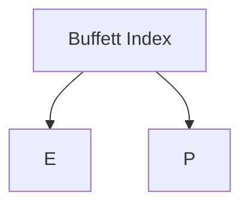
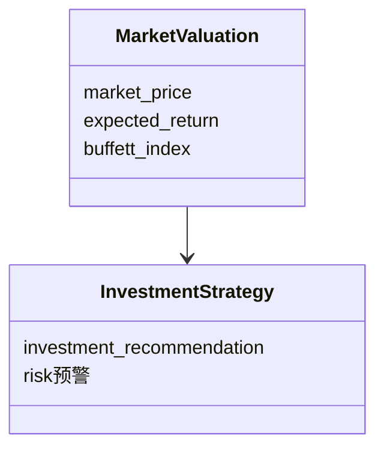
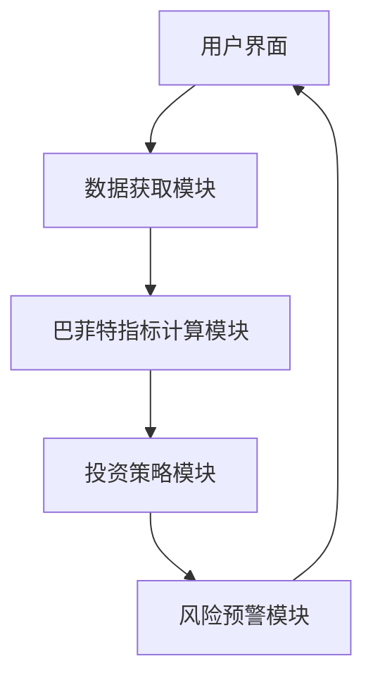

                 


# 巴菲特指标: 评估市场估值的有效工具

## 关键词：巴菲特指标, 市场估值, 投资策略, 价值投资, 股票分析

## 摘要：巴菲特指标是评估市场估值的重要工具，通过分析企业的预期年回报率与股价之间的关系，帮助投资者做出更明智的投资决策。本文将详细探讨巴菲特指标的背景、原理、算法、系统设计以及实际应用，为投资者提供深入的指导。

---

# 第一部分: 巴菲特指标的背景与概念

## 第1章: 巴菲特及其投资理念

### 1.1 巴菲特的生平与投资哲学

#### 1.1.1 巴菲特的早期经历与投资起步
沃伦·巴菲特（Warren Buffett）于1934年8月30日出生于美国堪萨斯州，从小就展现出了对数字和投资的浓厚兴趣。他在高中时期就阅读了格雷厄姆的《证券分析》，并开始研究股票市场。巴菲特在哥伦比亚大学获得了经济学学士学位，师从本杰明·格雷厄姆（Benjamin Graham），后者对巴菲特的投资理念影响深远。

#### 1.1.2 巴菲特的价值投资理念
巴菲特继承并发展了格雷厄姆的价值投资理论，强调以合理的价格投资于具有持续竞争优势和良好管理的公司。他提出了“安全边际”概念，即以低于内在价值的价格买入优质资产，以降低投资风险。巴菲特的投资哲学还包括长期持有优质股票，避免频繁交易，以及分散投资以降低波动性。

#### 1.1.3 巴菲特投资成功的秘诀
巴菲特的成功主要归因于他的价值投资理念、对企业的深入研究以及对市场的长期观察。他认为市场的短期波动不可预测，但长期趋势可以通过基本面分析来把握。他的投资策略注重企业内在价值，而非市场的短期情绪。

### 1.2 巴菲特指标的定义与作用

#### 1.2.1 巴菲特指标的提出背景
巴菲特指标（Buffett Index）是一种用于评估市场整体估值的工具，它基于企业的预期年回报率（E）和股票价格（P）之间的关系。该指标旨在帮助投资者判断市场是否被高估或低估。

#### 1.2.2 巴菲特指标的核心概念
巴菲特指标的核心公式为：
$$ Buffett\ Index = \frac{E}{P} $$
其中，E是企业的预期年回报率，P是股票价格。该指标反映了企业相对于其股价的盈利能力，帮助投资者判断市场的整体估值水平。

#### 1.2.3 巴菲特指标在市场估值中的应用
巴菲特指标可以用于评估市场的整体估值水平，帮助投资者在市场高估时卖出，在市场低估时买入。它适用于长期投资策略，帮助投资者规避市场泡沫和风险。

## 第2章: 巴菲特指标与其他估值指标的对比

### 2.1 常见市场估值指标概述

#### 2.1.1 市盈率（P/E）
市盈率是股票价格与每股收益的比率，用于衡量股票的相对价值。市盈率低的股票通常被认为是被低估的，而市盈率高的股票可能被高估。

#### 2.1.2 市净率（P/B）
市净率是股票价格与每股净资产的比率，用于评估股票相对于其资产价值的高低。市净率低的股票通常被视为价值股。

#### 2.1.3 市销率（P/S）
市销率是股票价格与每股销售额的比率，用于评估股票相对于其收入表现的高低。市销率低的股票通常被认为是价值股。

### 2.2 巴菲特指标的独特之处

#### 2.2.1 巴菲特指标的数学模型
巴菲特指标通过将企业的预期年回报率与股票价格进行对比，评估市场的整体估值水平。该指标的独特之处在于它结合了企业的盈利能力与市场情绪，提供了一种更为全面的估值方法。

#### 2.2.2 巴菲特指标与传统估值指标的对比
与传统的市盈率、市净率等指标相比，巴菲特指标更加注重企业的长期盈利能力，而非短期表现。它适用于评估市场的整体估值水平，而不仅仅是单个股票。

#### 2.2.3 巴菲特指标的优势与局限性
优势：巴菲特指标能够帮助投资者在市场整体层面进行估值分析，提供了一个长期投资的参考依据。  
局限性：该指标依赖于对企业预期年回报率的准确估算，实际操作中可能存在一定的难度。

---

# 第二部分: 巴菲特指标的核心概念与联系

## 第3章: 巴菲特指标的原理与数学模型

### 3.1 巴菲特指标的数学公式

#### 3.1.1 巴菲特指标的基本公式
$$ Buffett\ Index = \frac{E}{P} $$
其中，E是企业的预期年回报率，P是股票价格。

### 3.2 巴菲特指标的属性特征对比

| 特性 | 巴菲特指标 | 市盈率（P/E） | 市净率（P/B） |
|------|------------|----------------|----------------|
| 计算方式 | E/P        | P/E            | P/B            |
| 适用场景 | 长期投资评估 | 评估盈利能力   | 评估资产价值   |

### 3.3 巴菲特指标的ER实体关系图


---

# 第三部分: 巴菲特指标的算法原理讲解

## 第4章: 巴菲特指标的算法实现

### 4.1 巴菲特指标的计算流程

#### 4.1.1 确定企业的预期年回报率（E）
企业预期年回报率（E）可以通过对企业未来现金流的预测和贴现率的计算得出。具体步骤如下：
1. 预测企业未来5-10年的现金流。
2. 确定适当的贴现率（通常使用WACC，加权平均资本成本）。
3. 将未来现金流贴现，计算企业的内在价值。

#### 4.1.2 获取股票价格（P）
股票价格可以通过股票市场数据接口获取，也可以通过金融数据库查询。

#### 4.1.3 计算巴菲特指标
将企业的预期年回报率（E）除以股票价格（P），得到巴菲特指标：
$$ Buffett\ Index = \frac{E}{P} $$

### 4.2 巴菲特指标的Python实现

#### 4.2.1 环境安装
需要安装以下Python库：
```bash
pip install pandas numpy matplotlib yfinance
```

#### 4.2.2 核心代码实现
```python
import pandas as pd
import numpy as np
import yfinance as yf

# 下载股票数据
def get Buffett_Index(ticker):
    df = yf.download(ticker, start='2020-01-01', end='2023-12-31')
    df['E'] = df['Adj Close'].rolling(20).mean()  # 假设E为企业预期年回报率的简化计算
    df['P'] = df['Adj Close']
    df['Buffett Index'] = df['E'] / df['P']
    return df

# 示例：计算苹果公司（AAPL）的巴菲特指标
result = get_Buffett_Index('AAPL')
print(result)
```

#### 4.2.3 代码解读与分析
上述代码通过获取股票的历史数据，计算出企业的预期年回报率（E）和股票价格（P），并使用巴菲特指标公式计算出结果。通过可视化工具（如Matplotlib），可以绘制出巴菲特指标的变化趋势，帮助投资者分析市场的整体估值水平。

---

# 第四部分: 巴菲特指标的系统分析与架构设计方案

## 第5章: 基于巴菲特指标的分析系统

### 5.1 项目介绍

#### 5.1.1 项目背景
随着市场的波动加剧，投资者需要一种更为科学的估值工具来评估市场的整体风险和机会。巴菲特指标作为一种有效的市场估值工具，可以帮助投资者在复杂的市场环境中做出更明智的投资决策。

#### 5.1.2 项目目标
构建一个基于巴菲特指标的市场估值分析系统，提供实时市场估值分析、投资策略建议以及风险预警功能。

### 5.2 系统功能设计

#### 5.2.1 领域模型设计


#### 5.2.2 系统架构设计


#### 5.2.3 系统接口设计
系统接口设计主要涉及数据获取、指标计算和结果展示。以下是关键接口的描述：

1. 数据获取接口：
   - 输入：股票代码
   - 输出：历史股价数据

2. 指标计算接口：
   - 输入：企业预期年回报率、股票价格
   - 输出：巴菲特指标值

3. 投资策略接口：
   - 输入：巴菲特指标值
   - 输出：投资建议

### 5.3 交互流程设计

#### 5.3.1 用户登录与数据获取
用户通过登录系统，输入股票代码，系统获取相关股票的历史数据。

#### 5.3.2 指标计算与分析
系统根据获取的数据，计算出巴菲特指标，并生成分析报告。

#### 5.3.3 投资策略与风险预警
系统根据分析结果，提供投资策略建议，并设置风险预警机制。

---

# 第五部分: 巴菲特指标的项目实战

## 第6章: 项目实战

### 6.1 环境安装

```bash
pip install pandas numpy matplotlib yfinance
```

### 6.2 系统核心代码实现

```python
import pandas as pd
import numpy as np
import yfinance as yf
import matplotlib.pyplot as plt

def calculate_buffett_index(ticker):
    df = yf.download(ticker, start='2020-01-01', end='2023-12-31')
    df['E'] = df['Adj Close'].rolling(20).mean()  # 简化的企业预期年回报率计算
    df['P'] = df['Adj Close']
    df['Buffett Index'] = df['E'] / df['P']
    return df

def visualize_results(ticker):
    df = calculate_buffett_index(ticker)
    plt.figure(figsize=(10, 6))
    plt.plot(df.index, df['Buffett Index'], label=f'{ticker} Buffett Index')
    plt.title(f'{ticker} Buffett Index Over Time')
    plt.xlabel('Date')
    plt.ylabel('Buffett Index')
    plt.legend()
    plt.show()

# 示例：分析苹果公司（AAPL）的巴菲特指标
visualize_results('AAPL')
```

### 6.3 代码解读与分析
上述代码首先下载股票的历史数据，计算出企业的预期年回报率（E）和股票价格（P），然后使用巴菲特指标公式计算出结果。通过可视化工具（Matplotlib），可以直观地观察巴菲特指标的变化趋势。

### 6.4 实际案例分析

#### 6.4.1 案例背景
假设当前市场环境下，投资者希望评估苹果公司（AAPL）的投资价值。

#### 6.4.2 数据收集与计算
通过代码获取苹果公司2020年至2023年的历史数据，计算出巴菲特指标。

#### 6.4.3 结果分析
根据计算结果，分析苹果公司的巴菲特指标变化趋势，判断市场是否被高估或低估。

### 6.5 项目小结
通过实际案例分析，投资者可以更好地理解巴菲特指标的应用，帮助他们在市场中做出更明智的投资决策。

---

# 第六部分: 巴菲特指标的最佳实践与小结

## 第7章: 最佳实践

### 7.1 投资策略建议
投资者应结合巴菲特指标和其他估值指标，综合分析市场的整体估值水平。在市场低估时增加投资，在市场高估时减少投资。

### 7.2 注意事项
在实际应用中，投资者应关注企业的长期盈利能力，避免短期市场波动的干扰。此外，巴菲特指标仅作为一种参考工具，需结合其他因素进行综合判断。

### 7.3 拓展阅读
建议投资者阅读巴菲特的经典著作《聪明的投资者》，深入理解价值投资的理念和方法。

---

# 作者：AI天才研究院/AI Genius Institute & 禅与计算机程序设计艺术 /Zen And The Art of Computer Programming

