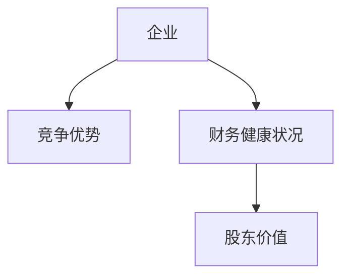
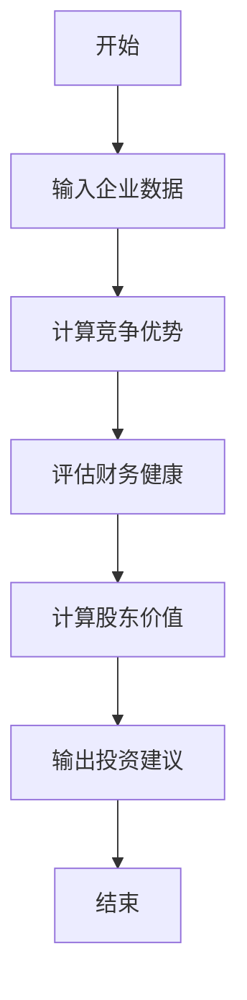
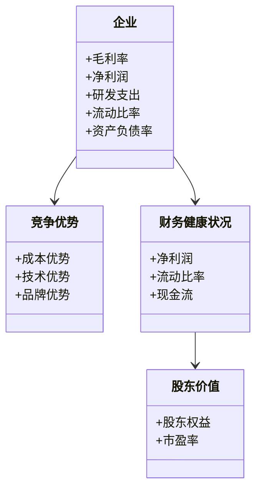
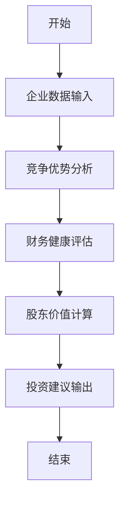

                 


# 巴菲特的商业模式分析

> 关键词：巴菲特，商业模式，投资策略，企业竞争优势，财务健康

> 摘要：本文深入分析了巴菲特的商业模式，从其核心概念、算法原理、系统架构到实际案例分析，详细阐述了巴菲特的长期投资策略、竞争优势分析和风险管理方法，为读者提供了一套基于巴菲特商业模式的系统化分析框架。

---

# 第一部分：背景介绍

## 第1章：巴菲特的商业模式概述

### 1.1 什么是巴菲特的商业模式
巴菲特的商业模式是以价值投资为核心的长期投资策略，强调通过分析企业的竞争优势、财务健康状况和股东价值，来选择具有持续增长潜力的企业进行投资。这种模式不仅适用于企业分析，也可以作为一种通用的商业分析框架。

### 1.2 巴菲特商业模式的核心要素
巴菲特的商业模式主要围绕以下几个核心要素展开：
1. **企业竞争优势**：分析企业的核心竞争力，包括成本优势、技术优势、品牌影响力等。
2. **财务健康状况**：通过财务报表分析企业的盈利能力、资产负债情况和现金流状况。
3. **股东价值最大化**：通过投资决策实现股东价值的最大化。

### 1.3 巴菲特商业模式的适用场景
巴菲特的商业模式适用于企业价值评估、投资决策支持和风险管理等领域。无论是个人投资者还是企业决策者，都可以通过这一模式来优化投资策略和商业决策。

---

# 第二部分：核心概念与联系

## 第2章：核心概念原理

### 2.1 企业竞争优势的定义与分类
企业竞争优势是巴菲特商业模式的核心之一。竞争优势可以分为以下几类：
1. **成本优势**：企业通过规模化生产或技术创新降低成本。
2. **技术优势**：企业拥有独特的技术或专利。
3. **品牌优势**：强大的品牌影响力吸引更多的消费者。
4. **市场垄断**：企业通过市场垄断地位获取超额利润。

### 2.2 股东价值最大化的实现路径
股东价值最大化是巴菲特商业模式的最终目标，其实现路径包括：
1. **选择优质企业**：投资具有持续竞争优势的企业。
2. **长期持有**：通过长期持有优质资产实现价值增长。
3. **分散风险**：通过分散投资降低风险。

### 2.3 财务健康状况的评估标准
财务健康状况是巴菲特商业模式的重要组成部分，主要通过以下指标进行评估：
1. **盈利能力**：净利润率、毛利率等。
2. **资产负债情况**：资产负债率、流动比率等。
3. **现金流状况**：自由现金流、现金流比率等。

## 第3章：核心概念属性特征对比表

### 3.1 企业竞争优势与财务健康状况的对比
| 属性               | 企业竞争优势                     | 财务健康状况                     |
|--------------------|--------------------------------|--------------------------------|
| 定义               | 企业的核心竞争力                 | 企业的财务状况是否健康           |
| 评估指标           | 成本优势、技术优势、品牌优势     | 净利润、资产负债率、现金流       |
| 影响因素           | 市场竞争、技术创新               | 盈利能力、财务杠杆、流动性       |
| 目标               | 提高市场份额和利润率             | 确保企业长期盈利能力             |

## 第4章：ER实体关系图

### 4.1 实体关系图


---

# 第三部分：算法原理

## 第5章：算法原理概述

### 5.1 企业价值评估的数学模型
巴菲特的企业价值评估模型可以通过以下公式表示：
$$ \text{企业价值} = \text{净利润} \times \text{市盈率} $$

其中，市盈率是基于企业财务健康状况和竞争优势的综合指标。

### 5.2 投资决策的逻辑框架
以下是投资决策的逻辑框架：
1. **分析企业竞争优势**：确定企业的核心竞争力。
2. **评估财务健康状况**：通过财务报表分析企业的盈利能力、资产负债情况和现金流状况。
3. **计算股东价值**：通过数学模型计算企业的股东价值。
4. **制定投资策略**：基于以上分析结果，制定长期投资策略。

### 5.3 风险管理的策略模型
风险管理模型可以通过以下步骤实现：
1. **识别风险因素**：分析企业可能面临的风险，如市场风险、财务风险等。
2. **评估风险影响**：通过定量分析评估风险对企业价值的影响。
3. **制定风险管理策略**：通过分散投资、风险对冲等方式降低风险。

## 第6章：算法流程图

### 6.1 算法流程图


## 第7章：核心算法代码实现

### 7.1 计算竞争优势的Python代码
```python
def calculate_competitive_advantage(enterprise_data):
    # 输入企业数据
    # 计算竞争优势
    if enterprise_data['毛利率'] > 20 and enterprise_data['研发支出'] > 0:
        return "持续竞争优势"
    else:
        return "普通竞争优势"
```

### 7.2 评估财务健康的Python代码
```python
def assess_financial_health(enterprise_data):
    # 输入企业数据
    # 评估财务健康状况
    if enterprise_data['净利润'] > 0 and enterprise_data['流动比率'] > 1:
        return "健康"
    else:
        return "不健康"
```

---

# 第四部分：系统分析与架构设计方案

## 第8章：系统分析

### 8.1 领域模型类图


### 8.2 系统架构图


---

# 第五部分：项目实战

## 第9章：项目实战

### 9.1 项目介绍
以分析一家企业的商业模式为例，展示如何应用巴菲特的商业模式分析框架进行实际分析。

### 9.2 环境安装
安装Python和相关库（如Pandas、Matplotlib）。

### 9.3 系统核心实现源代码
```python
import pandas as pd
import matplotlib.pyplot as plt

def main():
    # 读取企业数据
    enterprise_data = pd.read_csv('enterprise.csv')
    
    # 计算竞争优势
    competitive_advantage = []
    for index, row in enterprise_data.iterrows():
        if row['毛利率'] > 20 and row['研发支出'] > 0:
            competitive_advantage.append("持续竞争优势")
        else:
            competitive_advantage.append("普通竞争优势")
    
    # 评估财务健康状况
    financial_health = []
    for index, row in enterprise_data.iterrows():
        if row['净利润'] > 0 and row['流动比率'] > 1:
            financial_health.append("健康")
        else:
            financial_health.append("不健康")
    
    # 计算股东价值
    enterprise_value = enterprise_data['净利润'] * enterprise_data['市盈率']
    
    # 可视化分析
    plt.figure(figsize=(10, 6))
    plt.plot(enterprise_value, label='企业价值')
    plt.xlabel('企业')
    plt.ylabel('企业价值')
    plt.legend()
    plt.show()

if __name__ == '__main__':
    main()
```

### 9.4 代码应用解读与分析
上述代码展示了如何读取企业数据，计算竞争优势和财务健康状况，并通过可视化分析企业价值。代码中的逻辑与巴菲特的商业模式分析框架一致。

### 9.5 实际案例分析
以某企业为例，展示如何应用上述代码进行实际分析。

---

# 第六部分：总结与展望

## 第10章：总结

### 10.1 小结
本文详细分析了巴菲特的商业模式，从核心概念到算法原理，再到系统架构和项目实战，为读者提供了一套完整的商业模式分析框架。

### 10.2 注意事项
在实际应用中，需要结合具体的企业情况，灵活调整分析模型和参数设置。

### 10.3 拓展阅读
建议读者进一步阅读巴菲特的原著《巴菲特选股之道》和相关投资分析书籍。

---

作者：AI天才研究院/AI Genius Institute & 禅与计算机程序设计艺术 /Zen And The Art of Computer Programming

