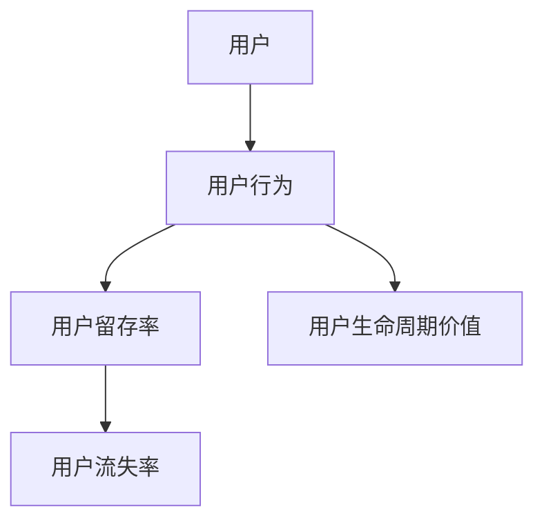
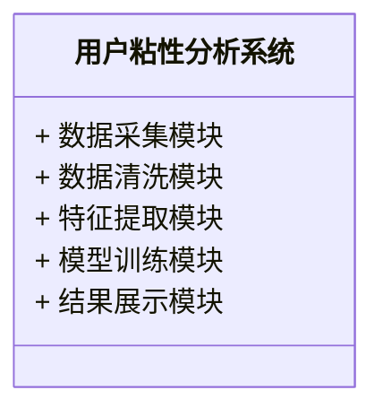
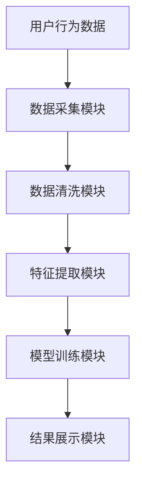

                 


# 彼得林奇如何分析公司的用户粘性指标

> 关键词：用户粘性指标，彼得林奇，用户留存率，生命周期价值，用户行为分析

> 摘要：本文深入探讨了彼得林奇如何通过分析用户粘性指标来评估公司的投资价值。文章从用户粘性指标的定义、核心概念、算法原理、系统架构设计、项目实战以及最佳实践等多个维度展开，结合实际案例和数学模型，全面解析用户粘性指标在投资分析中的重要性。

---

# 第一部分: 用户粘性指标的背景与概念

## 第1章: 用户粘性指标的定义与重要性

### 1.1 用户粘性指标的核心概念

#### 1.1.1 什么是用户粘性
用户粘性是指用户对某个产品或服务的依赖程度。用户粘性越高，用户持续使用该产品或服务的概率越大，企业的留存率和复购率也越高。

#### 1.1.2 用户粘性指标的定义
用户粘性指标是衡量用户对产品或服务依赖程度的量化标准，通常通过用户留存率、用户生命周期价值（CLV）和用户流失率等指标来衡量。

#### 1.1.3 用户粘性与企业价值的关系
用户粘性直接关系到企业的收入和利润。高用户粘性的企业通常具有更强的市场竞争力和抗风险能力，能够通过持续的用户价值创造实现长期增长。

### 1.2 用户粘性指标的背景与问题背景

#### 1.2.1 投资分析中的用户粘性问题
在投资分析中，用户粘性指标是评估企业盈利能力的重要因素。高用户粘性的企业通常能够通过用户留存和复购实现持续增长。

#### 1.2.2 企业用户粘性的重要性
用户粘性是企业核心竞争力的体现。高用户粘性意味着用户对企业的依赖程度高，企业能够通过用户粘性创造更高的价值。

#### 1.2.3 用户粘性指标的边界与外延
用户粘性指标的边界包括用户行为数据、用户属性数据和用户反馈数据。其外延涉及用户生命周期管理、用户行为预测和用户流失预警等领域。

### 1.3 用户粘性指标的核心要素

#### 1.3.1 用户粘性指标的构成
用户粘性指标通常包括以下几部分：
- 用户留存率：用户在一定时间内持续使用产品或服务的比例。
- 用户生命周期价值（CLV）：用户在其生命周期内为企业创造的总收入。
- 用户流失率：用户停止使用产品或服务的比例。

#### 1.3.2 核心概念的属性特征对比表

| 指标名称 | 定义 | 计算公式 | 重要性 |
|----------|------|----------|--------|
| 用户留存率 | 用户在一定时间内持续使用产品或服务的比例 | 留存率 = 次日留存用户数 / 新增用户数 | 高重要性，反映用户粘性 |
| 用户生命周期价值（CLV） | 用户在其生命周期内为企业创造的总收入 | CLV = 平均订单价值 × 购买频率 × 用户生命周期 | 高重要性，反映用户价值 |
| 用户流失率 | 用户停止使用产品或服务的比例 | 流失率 = 流失用户数 / 总用户数 | 中等重要性，反映用户稳定性 |

#### 1.3.3 用户粘性指标的ER实体关系图



---

# 第二部分: 用户粘性指标的核心概念与联系

## 第2章: 用户粘性指标的原理与模型

### 2.1 用户粘性指标的原理

#### 2.1.1 用户粘性指标的计算方法
用户粘性指标的计算通常基于用户行为数据和用户属性数据。以下是常见的计算方法：
- 用户留存率计算：通过分析用户的留存行为，计算用户在一定时间内的留存比例。
- 用户生命周期价值计算：通过分析用户的购买频率和生命周期，计算用户在其生命周期内为企业创造的总收入。
- 用户流失率计算：通过分析用户的流失行为，计算用户在一定时间内停止使用产品或服务的比例。

#### 2.1.2 用户粘性指标的核心公式

##### 用户留存率计算公式
$$ \text{留存率} = \frac{\text{次日留存用户数}}{\text{新增用户数}} $$

##### 用户生命周期价值计算公式
$$ \text{CLV} = \text{平均订单价值} \times \text{购买频率} \times \text{用户生命周期} $$

##### 用户流失率计算公式
$$ \text{流失率} = \frac{\text{流失用户数}}{\text{总用户数}} $$

#### 2.1.3 用户粘性指标的数学模型

##### 用户粘性预测模型
通过机器学习算法（如逻辑回归、随机森林等）对用户粘性进行预测。以下是用户粘性预测模型的示例：

```python
from sklearn.linear_model import LogisticRegression

# 数据准备
X = df[['用户行为特征1', '用户行为特征2', '用户属性特征1', '用户属性特征2']]
y = df['用户粘性标签']

# 模型训练
model = LogisticRegression()
model.fit(X, y)

# 预测用户粘性
predicted_sticky = model.predict(X)
```

---

### 2.2 用户粘性指标的属性特征对比

#### 2.2.1 用户粘性与用户活跃度的对比
用户粘性关注的是用户是否会长期使用产品，而用户活跃度关注的是用户在一定时间内的使用频率。

| 指标名称 | 定义 | 计算公式 | 关注点 |
|----------|------|----------|--------|
| 用户粘性 | 用户对产品或服务的依赖程度 | 留存率、CLV、流失率 | 长期使用 |
| 用户活跃度 | 用户在一定时间内使用产品或服务的频率 | 活跃用户数 / 总用户数 | 短期行为 |

#### 2.2.2 用户粘性与用户生命周期的关系
用户粘性与用户生命周期密切相关。高用户粘性的用户通常具有较长的生命周期，能够为企业创造更高的价值。

#### 2.2.3 用户粘性与用户满意度的差异
用户粘性关注的是用户是否会长期使用产品，而用户满意度关注的是用户对产品或服务的满意程度。高满意度的用户不一定具有高粘性，但高粘性的用户通常具有较高的满意度。

---

### 2.3 用户粘性指标的ER实体关系图


---

# 第三部分: 用户粘性指标的算法原理与数学模型

## 第3章: 用户粘性分析的算法原理

### 3.1 用户粘性分析的算法流程

#### 3.1.1 数据收集与清洗
用户粘性分析的第一步是收集用户行为数据和用户属性数据，并进行数据清洗，去除异常值和缺失值。

```python
import pandas as pd

# 数据清洗
df = pd.read_csv('user_behavior.csv')
df = df.dropna()
df = df.drop_duplicates()
```

#### 3.1.2 用户行为特征提取
通过分析用户行为数据，提取用户留存率、用户生命周期价值等特征。

```python
# 用户留存率计算
df['次日留存'] = df.groupby('用户ID')['时间戳'].apply(lambda x: x.shift(-1).notna().cumprod().cumsum())
```

#### 3.1.3 用户粘性预测模型
使用机器学习算法（如逻辑回归、随机森林等）对用户粘性进行预测。

```python
from sklearn.ensemble import RandomForestClassifier

# 模型训练
model = RandomForestClassifier()
model.fit(X, y)

# 预测用户粘性
predicted_sticky = model.predict(X)
```

### 3.2 用户粘性分析的数学模型

#### 3.2.1 用户留存率的计算公式
$$ \text{留存率} = \frac{\text{次日留存用户数}}{\text{新增用户数}} $$

#### 3.2.2 用户生命周期价值模型
$$ \text{CLV} = \text{平均订单价值} \times \text{购买频率} \times \text{用户生命周期} $$

#### 3.2.3 用户流失预测模型
$$ P(\text{流失}) = 1 - \frac{\text{用户回访概率}}{\text{初始用户数}} $$

---

## 第4章: 用户粘性分析的系统架构设计

### 4.1 系统功能设计
用户粘性分析系统的功能模块包括数据采集、数据清洗、特征提取、模型训练和结果展示。



### 4.2 系统架构设计



### 4.3 系统接口设计
用户粘性分析系统的接口设计包括数据输入接口、模型训练接口和结果展示接口。

---

## 第5章: 用户粘性分析的项目实战

### 5.1 环境安装
安装必要的Python库，如Pandas、Scikit-learn等。

```bash
pip install pandas scikit-learn
```

### 5.2 核心实现

```python
import pandas as pd
from sklearn.ensemble import RandomForestClassifier

# 数据准备
df = pd.read_csv('user_behavior.csv')

# 特征工程
X = df[['用户行为特征1', '用户行为特征2', '用户属性特征1', '用户属性特征2']]
y = df['用户粘性标签']

# 模型训练
model = RandomForestClassifier()
model.fit(X, y)

# 预测结果
predicted_sticky = model.predict(X)
```

### 5.3 实际案例分析
以某互联网公司为例，分析其用户粘性指标，并提出优化建议。

---

## 第6章: 最佳实践与小结

### 6.1 小结
用户粘性指标是评估企业投资价值的重要指标。通过分析用户留存率、用户生命周期价值和用户流失率，可以更好地理解用户行为，优化企业运营策略。

### 6.2 注意事项
- 数据质量是用户粘性分析的基础，需确保数据的准确性和完整性。
- 模型选择需根据具体业务需求和数据特征进行调整。
- 用户粘性分析的结果需结合业务背景进行解读，避免片面化。

### 6.3 拓展阅读
- 《彼得林奇投资学》
- 《用户行为分析与预测》
- 《数据驱动的商业决策》

---

# 作者：AI天才研究院/AI Genius Institute & 禅与计算机程序设计艺术 /Zen And The Art of Computer Programming

---

通过本文的分析，我们深入探讨了彼得林奇如何通过用户粘性指标评估公司的投资价值。从用户粘性指标的定义、核心概念、算法原理到系统架构设计和项目实战，结合实际案例和数学模型，全面解析了用户粘性指标在投资分析中的重要性。希望本文能够为读者提供有价值的参考和启发。

