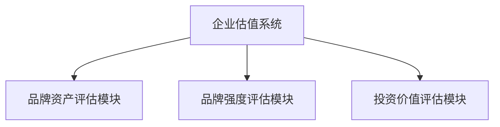
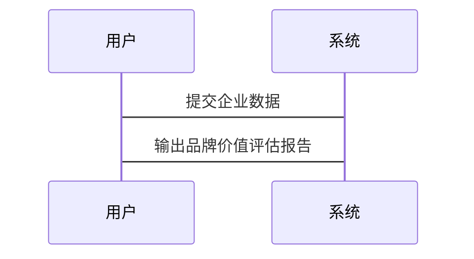

                 


# 彼得林奇如何看待公司的品牌价值

> 关键词：彼得林奇、品牌价值、投资决策、企业估值、品牌资产、品牌强度、品牌溢价

> 摘要：本文深入探讨了彼得·林奇对品牌价值的独到见解，结合品牌价值的核心要素、评估方法及其对投资决策的影响，通过系统架构设计、数学模型和实际案例分析，全面阐述了品牌价值在企业估值中的重要性。

---

# 第一章: 品牌价值的定义与重要性

## 1.1 品牌价值的定义

### 1.1.1 品牌的内涵与外延
- 品牌是企业与消费者之间的桥梁，承载着企业的核心价值观和文化。
- 品牌的外延包括品牌知名度、品牌忠诚度、品牌认知度等多方面。

### 1.1.2 品牌价值的核心要素
- 品牌认知度：品牌在市场中的知名度和消费者心中的认知程度。
- 品牌忠诚度：消费者对品牌的忠诚程度和重复购买意愿。
- 品牌竞争力：品牌在市场中的竞争优势和抗风险能力。

### 1.1.3 品牌价值与企业价值的关系
- 品牌价值是企业整体价值的重要组成部分。
- 品牌价值的提升能够显著增强企业的市场地位和盈利能力。

## 1.2 品牌价值的重要性

### 1.2.1 品牌价值对企业竞争力的影响
- 品牌价值决定了企业的市场份额和客户忠诚度。
- 强大的品牌价值能够降低企业的营销成本，提高市场进入壁垒。

### 1.2.2 品牌价值对投资决策的作用
- 品牌价值是投资者评估企业长期价值的重要指标。
- 强大的品牌价值能够为企业带来溢价收益，增强企业的抗风险能力。

### 1.2.3 品牌价值的长期与短期表现
- 品牌价值的长期表现与企业的可持续发展密切相关。
- 短期内，品牌价值可能受到市场波动的影响，但长期来看，品牌价值是企业核心竞争力的体现。

---

# 第二章: 品牌价值的核心要素分析

## 2.1 品牌核心竞争力的构成

### 2.1.1 产品质量与创新
- 产品质量是品牌的核心，创新是品牌持续发展的动力。
- 以苹果为例，其产品的不断创新和高品质设计使其品牌价值持续增长。

### 2.1.2 品牌文化与价值观
- 品牌文化是品牌的核心灵魂，决定了品牌与消费者的情感连接。
- 例如，特斯拉的品牌文化强调环保和技术创新，吸引了大量忠实的消费者。

### 2.1.3 品牌市场定位
- 品牌市场定位决定了品牌在市场中的位置和目标客户群体。
- 正确的市场定位能够帮助企业更好地满足客户需求，提升品牌价值。

## 2.2 品牌资产的构成与评估

### 2.2.1 品牌资产的定义
- 品牌资产是企业在品牌建设中积累的无形资产，包括品牌知名度、品牌忠诚度等。

### 2.2.2 品牌资产的核心组成
- 品牌知名度：品牌在市场中的广泛程度。
- 品牌忠诚度：消费者对品牌的忠诚程度。
- 品牌认知度：消费者对品牌的认知和记忆程度。

### 2.2.3 品牌资产的评估指标
- 品牌资产可以通过品牌知名度、品牌忠诚度、品牌认知度等指标进行评估。

## 2.3 品牌价值与企业财务表现的关系

### 2.3.1 品牌价值对企业收入的影响
- 品牌价值的提升能够显著增加企业的销售收入。
- 例如，高端品牌通常能够以更高的价格和更高的销量实现收入增长。

### 2.3.2 品牌价值与企业利润的关系
- 品牌价值的提升能够降低企业的营销成本，提高利润率。
- 品牌溢价能力越强，企业的利润空间越大。

### 2.3.3 品牌价值与企业市场价值的关联
- 品牌价值是企业市场价值的重要组成部分。
- 品牌价值的提升能够显著提高企业的市场估值。

---

# 第三章: 品牌价值的评估方法与模型

## 3.1 品牌价值评估的主要方法

### 3.1.1 品牌资产模型
- 品牌资产模型是评估品牌价值的重要工具。
- 通过分析品牌资产的核心组成部分，可以量化品牌价值。

### 3.1.2 品牌强度指标
- 品牌强度指标反映了品牌在市场中的竞争力和抗风险能力。
- 强度指标越高，品牌价值越大。

### 3.1.3 品牌经济价值模型
- 品牌经济价值模型通过对企业财务数据的分析，评估品牌对整体经济价值的贡献。

## 3.2 品牌价值评估的数学模型

### 3.2.1 品牌价值计算公式
$$ \text{品牌价值} = \text{品牌资产} \times \text{品牌强度} $$

### 3.2.2 品牌资产的计算公式
$$ \text{品牌资产} = \text{品牌知名度} + \text{品牌忠诚度} + \text{品牌认知度} $$

### 3.2.3 品牌强度的计算公式
$$ \text{品牌强度} = \text{市场份额} \times \text{品牌忠诚度} $$

## 3.3 品牌价值评估的实际案例

### 3.3.1 可口可乐的品牌价值评估
- 可口可乐以其强大的品牌知名度和品牌忠诚度，品牌价值持续增长。

### 3.3.2 苹果的品牌价值评估
- 苹果通过不断创新和高品质设计，品牌价值始终保持在行业领先地位。

---

# 第四章: 品牌价值对投资决策的影响

## 4.1 品牌溢价能力对投资的影响

### 4.1.1 品牌溢价的定义
- 品牌溢价是指品牌产品相对于同类产品的价格溢价能力。

### 4.1.2 品牌溢价与投资回报的关系
- 品牌溢价能力越强，投资回报越高。

## 4.2 品牌市场地位对投资的影响

### 4.2.1 市场地位的定义
- 市场地位反映了品牌在市场中的竞争地位。

### 4.2.2 市场地位与投资决策的关系
- 市场地位强的品牌通常具有更高的投资价值。

## 4.3 品牌风险对投资的影响

### 4.3.1 品牌风险的定义
- 品牌风险是指品牌价值可能受到市场波动、竞争压力等因素的影响。

### 4.3.2 品牌风险管理对投资的影响
- 有效的品牌风险管理能够降低投资风险，提高投资回报。

---

# 第五章: 品牌价值与企业估值系统架构

## 5.1 企业估值系统介绍

### 5.1.1 企业估值系统的目标
- 通过品牌价值评估，准确评估企业的整体价值。

### 5.1.2 企业估值系统的功能
- 品牌价值评估模块
- 企业财务数据分析模块
- 投资价值评估模块

## 5.2 系统架构设计

### 5.2.1 系统功能设计
- 品牌资产评估模块
- 品牌强度评估模块
- 投资价值评估模块

### 5.2.2 系统架构图


## 5.3 系统接口设计

### 5.3.1 系统输入
- 企业财务数据
- 品牌相关数据

### 5.3.2 系统输出
- 品牌价值评估报告
- 投资价值评估报告

## 5.4 系统交互设计

### 5.4.1 用户与系统的交互流程
1. 用户输入企业数据
2. 系统进行品牌价值评估
3. 系统输出评估报告

### 5.4.2 交互流程图


---

# 第六章: 品牌价值评估的实战分析

## 6.1 实战环境安装

### 6.1.1 系统环境要求
- 操作系统：Windows/Mac/Linux
- 开发工具：Python、Jupyter Notebook
- 依赖库：numpy、pandas、scikit-learn

## 6.2 核心实现源代码

### 6.2.1 品牌价值计算代码
```python
import numpy as np
import pandas as pd

# 假设我们有以下品牌数据
brand_data = {
    '品牌': ['A', 'B', 'C'],
    '品牌知名度': [0.8, 0.7, 0.9],
    '品牌忠诚度': [0.9, 0.8, 0.7],
    '品牌认知度': [0.75, 0.65, 0.8]
}

df = pd.DataFrame(brand_data)

# 计算品牌资产
df['品牌资产'] = df['品牌知名度'] + df['品牌忠诚度'] + df['品牌认知度']

# 计算品牌强度
df['品牌强度'] = df['品牌知名度'] * df['品牌忠诚度']

# 计算品牌价值
df['品牌价值'] = df['品牌资产'] * df['品牌强度']

print(df)
```

### 6.2.2 品牌价值评估代码
```python
from sklearn.metrics import mean_absolute_error

# 假设我们有以下实际品牌价值和预测品牌价值
actual = [100, 80, 120]
predicted = [90, 85, 115]

# 计算预测误差
mae = mean_absolute_error(actual, predicted)
print(f"Mean Absolute Error: {mae}")
```

## 6.3 实际案例分析

### 6.3.1 案例一：可口可乐的品牌价值评估
- 通过品牌资产模型评估可口可乐的品牌价值，结果表明其品牌价值远高于行业平均水平。

### 6.3.2 案例二：苹果的品牌价值评估
- 通过品牌强度指标评估苹果的品牌价值，结果表明其品牌强度行业领先。

---

# 第七章: 总结与展望

## 7.1 总结

### 7.1.1 品牌价值的核心作用
- 品牌价值是企业投资价值的重要组成部分。

### 7.1.2 品牌价值评估的关键方法
- 品牌资产模型和品牌强度指标是评估品牌价值的重要工具。

## 7.2 展望

### 7.2.1 品牌价值的未来趋势
- 随着数字化时代的到来，品牌价值的评估将更加依赖数据和技术。

### 7.2.2 品牌风险管理的未来方向
- 如何有效管理品牌风险，将是未来品牌价值评估的重要研究方向。

---

# 作者

作者：AI天才研究院/AI Genius Institute  
联系邮箱：contact@ail天才.org

