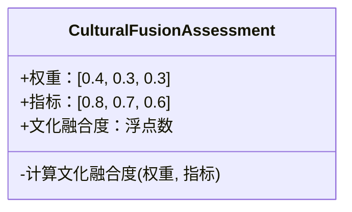
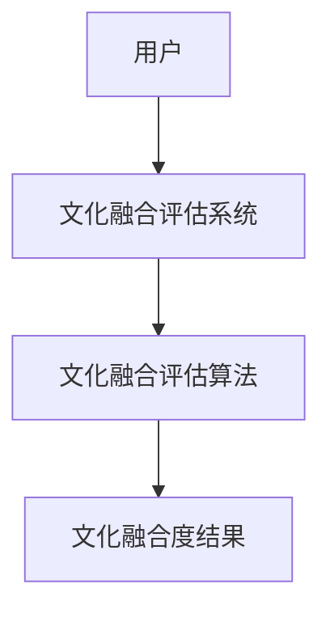

                 


# 彼得林奇对公司全球化战略的文化融合评估

> 关键词：彼得·林奇，全球化战略，文化融合，企业文化，跨文化管理，文化评估模型

> 摘要：本文深入探讨了彼得·林奇在全球化战略中的文化融合评估方法。通过分析文化融合的核心概念、评估模型的构建、算法原理及系统架构设计，结合实际案例，详细阐述了文化融合在企业全球化中的重要性及实现路径。

---

## 第一部分: 全球化战略与文化融合的背景

### 第1章: 全球化战略与文化融合的背景

#### 1.1 全球化战略的定义与特点
##### 1.1.1 全球化战略的定义
全球化战略是指企业在全球范围内进行业务扩展和资源整合，以实现全球市场覆盖和竞争优势的战略。它强调跨文化、跨地区的协同合作，以应对全球市场的多样性和复杂性。

##### 1.1.2 全球化战略的核心特点
- **多样性**：涉及不同国家、文化、法律法规和市场环境。
- **复杂性**：需要协调多个利益相关者，解决跨文化冲突。
- **协同性**：通过资源整合和协同效应实现全球竞争优势。

##### 1.1.3 全球化战略对企业的影响
- **市场扩展**：开拓新市场，增加收入来源。
- **资源优化**：充分利用全球资源，降低成本。
- **竞争力提升**：通过跨文化协同实现创新和效率提升。

#### 1.2 文化融合的定义与重要性
##### 1.2.1 文化融合的定义
文化融合是指在跨文化环境中，企业通过整合不同文化元素，形成新的文化形态，以促进企业在全球化战略中的协调与合作。

##### 1.2.2 文化融合在企业中的重要性
- **促进跨文化沟通**：消除文化障碍，提升团队协作效率。
- **增强企业凝聚力**：通过文化融合，增强员工对企业文化的认同感。
- **提升企业竞争力**：文化融合有助于企业在全球化市场中更好地适应当地文化，提升客户满意度。

#### 1.3 彼得·林奇与全球化战略
##### 1.3.1 彼得·林奇的管理理念
彼得·林奇以其独特的管理风格闻名，强调员工参与、团队合作和文化融合。他认为，文化融合是实现全球化战略成功的关键因素之一。

##### 1.3.2 彼得·林奇与文化融合
彼得·林奇在其管理实践中，注重跨文化团队的建设，通过文化融合消除文化冲突，提升团队协作效率。他倡导在企业中建立包容性的文化环境，尊重和融合不同文化背景员工的价值观和工作方式。

##### 1.3.3 彼得·林奇全球化战略的成功案例
彼得·林奇领导下的公司通过在全球范围内实施文化融合策略，成功实现了跨文化的协同合作，提升了企业的全球竞争力。例如，他的团队在跨国并购中，通过文化融合整合被收购公司的文化，确保了业务的顺利整合和持续发展。

---

### 第2章: 全球化战略中的文化融合问题

#### 2.1 全球化战略中的文化冲突
##### 2.1.1 文化冲突的定义
文化冲突是指在跨文化环境中，由于不同文化背景导致的价值观、行为习惯和工作方式的差异，引发的矛盾和冲突。

##### 2.1.2 典型的文化冲突案例
- **管理风格冲突**：不同国家对管理风格有不同的期望，例如西方注重个人主义，而东方注重集体主义。
- **沟通方式冲突**：直接与间接沟通方式的差异可能导致误解和冲突。
- **决策风格冲突**：某些文化倾向于集体决策，而另一些文化则倾向于个人决策。

##### 2.1.3 文化冲突对企业的影响
- **降低团队效率**：文化冲突可能导致团队内部合作不畅，影响工作效率。
- **增加管理成本**：文化冲突需要额外的协调和管理资源，增加企业成本。
- **影响企业声誉**：文化冲突可能影响企业在当地的声誉，损害品牌形象。

#### 2.2 文化融合在企业全球化中的挑战
##### 2.2.1 文化差异对企业管理的影响
文化差异可能导致管理方式的冲突，例如在某些文化中，员工更倾向于遵循上级指令，而在另一些文化中，员工更倾向于自主决策。

##### 2.2.2 文化融合中的沟通障碍
跨文化沟通中，语言障碍和文化差异可能导致信息传递不准确，影响团队协作。

##### 2.2.3 文化融合中的权力距离问题
不同文化对权力距离的定义不同，这可能导致跨国团队中的权力分配和决策过程的冲突。

#### 2.3 全球化战略中的文化融合目标
##### 2.3.1 文化融合的目标
- **建立统一的企业文化**：通过文化融合，形成统一的企业价值观和文化认同。
- **促进跨文化协作**：消除文化障碍，促进不同文化背景员工的协作。
- **提升企业凝聚力**：通过文化融合，增强员工对企业文化的认同感和归属感。

##### 2.3.2 文化融合的实现路径
- **文化培训**：通过跨文化培训，帮助员工理解和适应不同文化背景。
- **建立包容性文化环境**：尊重和融合不同文化背景员工的价值观和工作方式。
- **促进跨文化沟通**：通过有效的沟通渠道和方式，消除文化障碍。

##### 2.3.3 文化融合的评估标准
- **文化融合度**：通过评估不同文化背景员工的融合程度，衡量文化融合的效果。
- **团队协作效率**：通过团队协作效率的提升，衡量文化融合的实际效果。
- **企业绩效提升**：通过企业绩效的提升，验证文化融合对企业发展的积极作用。

---

## 第二部分: 文化融合评估的核心概念与联系

### 第3章: 文化融合评估的核心概念

#### 3.1 全球化战略中的文化融合模型
##### 3.1.1 文化融合模型的定义
文化融合模型是指通过整合不同文化背景的元素，形成新的文化形态，以促进企业在全球化战略中的协调与合作。

##### 3.1.2 文化融合模型的核心要素
- **文化识别**：识别不同文化背景员工的价值观、行为习惯和工作方式。
- **文化整合**：通过协调和融合不同文化元素，形成新的文化形态。
- **文化评估**：通过评估文化融合的效果，优化文化融合策略。

##### 3.1.3 文化融合模型的适用范围
文化融合模型适用于跨国企业、跨国团队和跨国项目，特别是在全球化战略中需要协调不同文化背景员工的场景。

#### 3.2 文化融合评估的指标体系
##### 3.2.1 文化融合评估指标的选择
- **文化认同度**：员工对新文化形态的认同程度。
- **团队协作效率**：团队协作效率的提升程度。
- **文化冲突频率**：文化冲突的发生频率。

##### 3.2.2 文化融合评估指标的权重分配
- **文化认同度**：权重40%
- **团队协作效率**：权重30%
- **文化冲突频率**：权重30%

##### 3.2.3 文化融合评估指标的计算方法
文化融合度 = (文化认同度 × 40% + 团队协作效率 × 30% + 文化冲突频率 × 30%)

---

## 第4章: 文化融合评估的核心概念联系

### 4.1 文化融合与企业绩效的关系
##### 4.1.1 文化融合对企业绩效的影响
文化融合能够提升团队协作效率，降低文化冲突，从而提升企业绩效。

##### 4.1.2 文化融合与企业绩效的量化分析
通过建立文化融合评估指标体系，可以量化分析文化融合对企业绩效的具体影响。

##### 4.1.3 文化融合与企业绩效的案例分析
通过具体案例分析，验证文化融合对企业绩效提升的实际效果。

### 4.2 文化融合与全球化战略的关系
##### 4.2.1 文化融合在全球化战略中的地位
文化融合是全球化战略成功实施的关键因素之一，能够促进跨文化团队的协作与合作。

##### 4.2.2 文化融合与全球化战略的协同作用
通过文化融合，企业能够更好地适应不同市场的文化差异，提升全球化战略的实施效果。

##### 4.2.3 文化融合与全球化战略的冲突与协调
在实施全球化战略过程中，文化融合需要与企业战略目标保持一致，避免冲突，实现协调统一。

### 4.3 文化融合评估的理论基础
##### 4.3.1 文化融合的理论模型
文化融合的理论模型包括文化识别、文化整合和文化评估三个阶段。

##### 4.3.2 文化融合评估的理论基础
文化融合评估的理论基础包括跨文化管理理论和文化整合理论，通过理论指导实践，确保文化融合评估的科学性和有效性。

---

## 第三部分: 文化融合评估的算法与系统架构

### 第5章: 文化融合评估的算法原理
#### 5.1 算法原理
文化融合评估算法基于文化融合指标体系，通过加权计算，评估文化融合的效果。公式如下：
$$文化融合度 = \sum_{i=1}^{n} (权重_i \times 指标_i)$$

#### 5.2 算法实现
以下是文化融合评估算法的Python实现代码：

```python
def calculate_cultural_fusion_degree(weights, indicators):
    return sum(w * i for w, i in zip(weights, indicators))

weights = [0.4, 0.3, 0.3]
indicators = [0.8, 0.7, 0.6]
fusion_degree = calculate_cultural_fusion_degree(weights, indicators)
print(f"文化融合度为：{fusion_degree}")
```

---

### 第6章: 系统架构设计

#### 6.1 领域模型设计
领域模型类图如下：



#### 6.2 系统架构设计
系统架构图如下：



---

## 第四部分: 项目实战与最佳实践

### 第7章: 项目实战

#### 7.1 环境配置
需要安装Python和相关开发工具，配置文化融合评估系统的运行环境。

#### 7.2 核心代码实现
以下是文化融合评估系统的核心代码：

```python
class CulturalFusionAssessment:
    def __init__(self, weights, indicators):
        self.weights = weights
        self.indicators = indicators

    def calculate_fusion_degree(self):
        return sum(w * i for w, i in zip(self.weights, self.indicators))

# 使用示例
weights = [0.4, 0.3, 0.3]
indicators = [0.8, 0.7, 0.6]
assessor = CulturalFusionAssessment(weights, indicators)
fusion_degree = assessor.calculate_fusion_degree()
print(f"文化融合度为：{fusion_degree}")
```

#### 7.3 案例分析
通过具体案例分析，验证文化融合评估系统的实际效果和应用价值。

#### 7.4 结果解读
通过分析文化融合度结果，提出改进建议和优化策略，提升企业文化的融合效果。

---

## 第五部分: 最佳实践与总结

### 第8章: 最佳实践

#### 8.1 小结
文化融合评估是全球化战略成功实施的关键因素之一，通过科学的评估方法和有效的管理策略，能够提升企业的跨文化协作效率，降低文化冲突，实现全球化战略的目标。

#### 8.2 注意事项
在实施文化融合评估过程中，需要注意以下几点：
- **文化差异的敏感性**：尊重不同文化背景员工的价值观和工作方式。
- **评估指标的合理性**：确保评估指标的科学性和适用性。
- **持续优化**：根据评估结果，持续优化文化融合策略，提升企业绩效。

#### 8.3 拓展阅读
推荐阅读彼得·林奇的著作《彼得·林奇的投资哲学》和相关跨文化管理的书籍，以进一步深入理解文化融合评估的理论和实践。

---

## 作者

作者：AI天才研究院/AI Genius Institute & 禅与计算机程序设计艺术/Zen And The Art of Computer Programming

---

通过以上内容，我们可以看到，文化融合评估在彼得·林奇的全球化战略中扮演着至关重要的角色。通过科学的评估方法和有效的管理策略，企业可以更好地应对全球化过程中的文化挑战，实现跨文化的协同合作，提升企业的全球竞争力。

