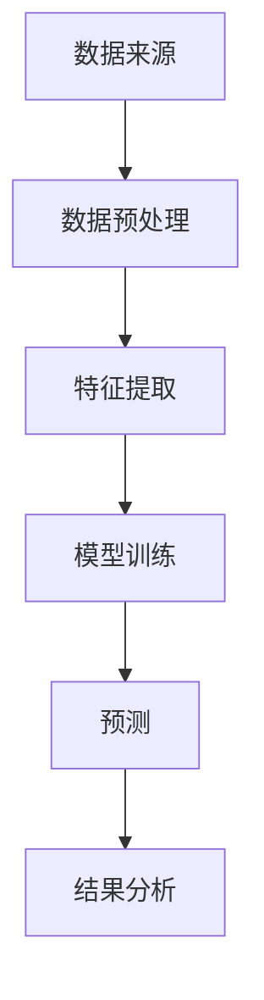
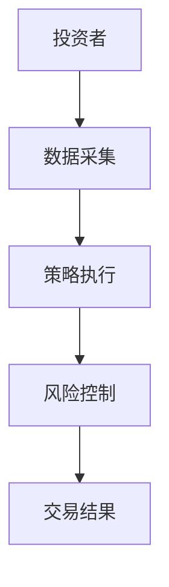

                 


# 彼得林奇的"慢牛"投资在高频交易环境中的优势

## 关键词：彼得林奇、慢牛投资、高频交易、算法交易、投资策略

## 摘要

本文探讨了彼得林奇的“慢牛”投资策略在高频交易环境中的应用优势。通过分析高频交易的特点和“慢牛”投资的长期增长策略，本文展示了如何将两者结合，利用大数据分析和机器学习优化投资决策。文章详细讲解了算法实现、数学模型和系统架构，并通过实际案例分析，展示了在真实市场中的应用。本文还总结了最佳实践和注意事项，为投资者提供了有价值的参考。

---

## 第一部分：背景介绍

### 第1章：彼得林奇的“慢牛”投资概述

#### 1.1 问题背景

- **投资市场的基本概念**  
  投资市场分为股票、债券、基金等多种类型，投资者通过买入并持有资产以获得收益。市场波动受多种因素影响，包括经济指标、公司业绩和政策变化。

- **长期投资与短期交易的对比**  
  长期投资强调买入并持有优质资产，追求稳定增长；而短期交易则频繁买卖，利用价格波动获利。

- **彼得林奇投资理念的核心要素**  
  彼得林奇以寻找具有持续增长潜力的公司著称，主张长期持有优质股票，避免频繁交易。

#### 1.2 高频交易的基本概念

- **高频交易的定义与特点**  
  高频交易指通过计算机算法在极短时间内进行大量交易，利用微小价格波动获利。

- **高频交易的技术基础**  
  依赖高速网络、低延迟硬件和复杂算法，通常涉及大数据分析和机器学习。

- **高频交易与传统交易的对比**  
  高频交易速度快、自动化，而传统交易依赖人工判断，周期长。

---

## 第二部分：核心概念与联系

### 第2章：“慢牛”投资与高频交易的结合

#### 2.1 核心概念原理

- **“慢牛”投资的长期增长策略**  
  通过分析公司基本面，选择具有持续增长潜力的股票长期持有。

- **高频交易的快速执行机制**  
  利用算法快速捕捉市场机会，执行大量交易。

- **两者结合的优势与挑战**  
  结合长期价值判断与短期交易机会，优化收益与风险。

#### 2.2 核心概念对比表格

| 属性            | “慢牛”投资                  | 高频交易                  |
|-----------------|-----------------------------|---------------------------|
| 时间周期        | 长期（数年）                | 短期（数秒至数分钟）        |
| 风险承受能力    | 较高，愿意承担市场波动风险  | 较低，追求低风险快速收益    |
| 收益来源        | 股价长期增长                | 微小价格波动              |

#### 2.3 实体关系图（ER图）

```mermaid
erDiagram
    investor {
        id
        name
        strategy
    }
    market_data {
        time_stamp
        price
        volume
    }
    trading_system {
        algorithm
        data_feed
    }
    investor --> market_data : 监测
    investor --> trading_system : 执行
    trading_system --> market_data : 订阅
```

---

## 第三部分：算法原理讲解

### 第3章：高频交易中的“慢牛”策略实现

#### 3.1 算法原理

- **数据流分析算法**  
  实时分析市场数据，识别潜在的投资机会。

- **时间序列预测模型**  
  使用历史数据预测未来价格走势。

- **机器学习在投资决策中的应用**  
  利用深度学习模型分析市场情绪和趋势。

#### 3.2 代码实现

```python
import pandas as pd
import numpy as np
from sklearn.model_selection import train_test_split
from sklearn.linear_model import LinearRegression

# 示例数据加载
data = pd.read_csv('market_data.csv')

# 特征与目标变量分离
X = data[['open', 'high', 'low', 'volume']]
y = data['close']

# 数据分割
X_train, X_test, y_train, y_test = train_test_split(X, y, test_size=0.2)

# 线性回归模型训练
model = LinearRegression()
model.fit(X_train, y_train)

# 预测与评估
predictions = model.predict(X_test)
print("预测值:", predictions[:5])
print("实际值:", y_test[:5])
print("均方误差:", np.mean((predictions - y_test) ** 2))
```

#### 3.3 算法流程图



---

## 第四部分：数学模型与公式

### 第4章：数学模型分析

#### 4.1 统计模型

- **时间序列分析模型**  
  使用ARIMA模型预测未来价格。

- **马尔可夫链模型**  
  分析市场状态转移概率。

- **风险评估模型**  
  计算VaR（Value at Risk）以衡量潜在损失。

#### 4.2 公式推导

- **收益计算公式**  
  $$ \text{收益} = \frac{\text{最终价格} - \text{初始价格}}{\text{初始价格}} \times 100\% $$

- **风险调整后收益模型**  
  $$ \text{夏普比率} = \frac{\text{平均收益} - \text{无风险利率}}{\text{收益标准差}} $$

---

## 第五部分：系统分析与架构设计

### 第5章：系统架构方案

#### 5.1 系统功能设计

- **数据采集模块**  
  实时获取市场数据，包括价格、成交量等。

- **策略执行模块**  
  执行交易指令，根据模型结果下单。

- **风险控制模块**  
  监控交易风险，设定止损点。

#### 5.2 系统架构图



---

## 第六部分：项目实战

### 第6章：实际案例分析

#### 6.1 环境安装

- **开发环境配置**  
  安装Python、Jupyter Notebook、数据处理库（如pandas、numpy）。

- **数据库安装与配置**  
  使用MySQL或MongoDB存储市场数据。

- **交易模拟器安装**  
  使用Interactive Brokers或其他模拟交易平台。

#### 6.2 核心实现

```python
import pandas as pd
import numpy as np

# 数据加载与处理
data = pd.read_csv('market_data.csv')
data['date'] = pd.to_datetime(data['date'])
data.set_index('date', inplace=True)

# 特征工程
data['return'] = data['close'].pct_change()

# 模型训练与预测
from sklearn.linear_model import LinearRegression
model = LinearRegression()
X = data[['open', 'high', 'low', 'volume']]
y = data['close']
model.fit(X, y)

# 预测与回测
predictions = model.predict(X)
returns = (predictions / X - 1).multiply(100)
print(returns)
```

#### 6.3 案例分析

- **真实市场数据的应用**  
  使用实际市场数据测试模型效果。

- **策略表现分析**  
  计算回测结果，包括收益、风险指标（夏普比率、最大回撤）。

- **实验结果与优化**  
  根据回测结果优化模型参数，调整交易策略。

---

## 第七部分：总结与展望

### 第7章：最佳实践与小结

#### 7.1 最佳实践

- **数据选择与处理**  
  确保数据质量和相关性，清洗数据。

- **策略优化技巧**  
  根据市场变化调整策略参数，避免过度拟合。

- **风险控制**  
  设定合理的止损点，分散投资组合。

#### 7.2 小结

本文探讨了彼得林奇的“慢牛”投资在高频交易环境中的应用，通过算法和数学模型展示了如何优化投资策略，实现长期稳定收益。

---

## 作者信息

作者：AI天才研究院/AI Genius Institute & 禅与计算机程序设计艺术/Zen And The Art of Computer Programming

---

本文旨在为投资者提供理论与实践相结合的指导，帮助他们在高频交易环境中优化“慢牛”投资策略。

