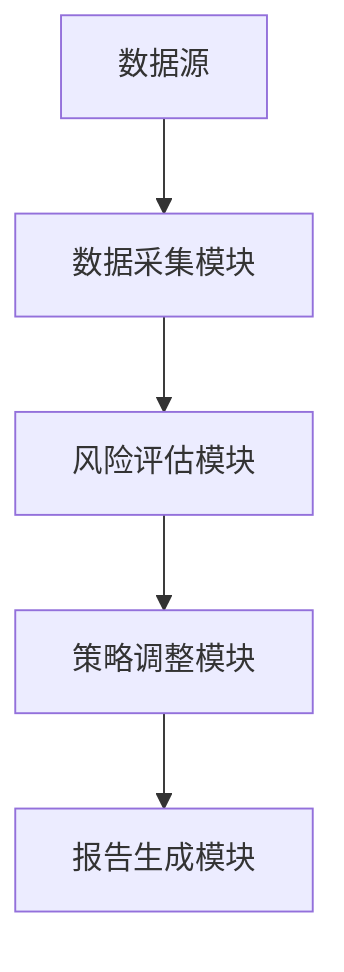
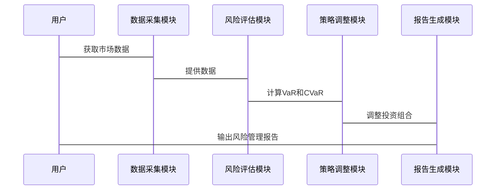

                 


# 投资组合保险策略：动态风险管理方法

## 关键词：投资组合保险，动态风险管理，风险评估模型，VaR，CVaR，算法实现，系统架构

## 摘要：本文深入探讨投资组合保险策略中的动态风险管理方法，从基本概念到数学模型，再到算法实现和系统设计，全面分析如何通过动态调整来优化投资组合的风险管理。

---

# 第一部分: 投资组合保险策略的背景与基础

## 第1章: 投资组合保险策略的背景与基础

### 1.1 投资组合保险的基本概念

#### 1.1.1 投资组合的基本定义
投资组合是将多种金融资产（如股票、债券、基金等）按一定比例组合在一起，以实现风险分散和收益优化的一种投资方式。通过多样化投资，可以降低单一资产的风险，从而提高整体投资的稳定性。

#### 1.1.2 投资组合保险的定义与目标
投资组合保险是一种通过特定策略和工具，保护投资组合免受重大损失的手段。其目标是在市场波动时，确保投资组合的本金安全或至少维持最低收益。

#### 1.1.3 投资组合保险与风险管理的关系
投资组合保险是风险管理的重要组成部分。通过动态风险管理，投资者可以及时识别和应对潜在风险，从而优化投资组合的表现。

### 1.2 动态风险管理的重要性

#### 1.2.1 风险管理的核心概念
风险管理包括风险识别、评估、量化和应对。动态风险管理强调根据市场变化实时调整策略，以应对不断变化的金融环境。

#### 1.2.2 动态风险管理的必要性
金融市场波动频繁，静态风险管理无法适应变化。动态风险管理能够及时捕捉市场变化，调整投资组合，降低风险敞口。

#### 1.2.3 投资组合保险在动态风险管理中的作用
投资组合保险通过动态调整资产配置，能够在市场下跌时减少损失，在市场上涨时捕捉收益，从而实现稳健的投资回报。

### 1.3 投资组合保险策略的分类

#### 1.3.1 保险策略的主要类型
- **恒定比例保险策略（CPPI）**：通过动态调整风险资产和无风险资产的比例，维持投资组合的保险特性。
- **目标风险保险策略（TRAM）**：设定投资组合的风险水平，并根据市场变化调整资产配置。
- **基于VaR的保险策略**：根据VaR指标动态调整投资组合的风险敞口。

#### 1.3.2 不同保险策略的优缺点对比
| 策略类型       | 优点                           | 缺点                             |
|----------------|--------------------------------|-----------------------------------|
| CPPI            | 简单易行，风险控制有效         | 可能错过市场上涨机会               |
| TRAM            | 风险可控，适应性强             | 调整频繁，交易成本较高             |
| 基于VaR的策略    | 风险量化准确，实时调整           | VaR模型依赖假设，存在局限性         |

#### 1.3.3 选择保险策略的关键因素
- 投资目标：收益目标和风险承受能力。
- 市场环境：宏观经济状况和市场波动性。
- 资产配置：不同资产类别在投资组合中的比例。

---

## 第2章: 动态风险管理的基本原理

### 2.1 风险评估模型

#### 2.1.1 风险评估的基本步骤
1. **数据收集**：获取历史价格、收益率等数据。
2. **风险因子识别**：确定影响投资组合的主要风险因素。
3. **模型选择**：选择适合的风险评估模型，如VaR、CVaR等。
4. **模型计算**：计算投资组合的风险指标。
5. **结果分析**：评估风险并制定应对策略。

#### 2.1.2 常用风险评估指标
- **VaR（Value at Risk）**：在一定置信水平下，投资组合的最大潜在损失。
- **CVaR（Conditional Value at Risk）**：VaR的条件期望损失，衡量尾部风险。
- **波动率**：资产收益的波动程度，反映市场的不确定性。

#### 2.1.3 风险评估模型的构建与应用
使用历史模拟法或蒙特卡洛模拟法构建风险评估模型，根据市场数据计算VaR和CVaR，评估投资组合在不同情景下的风险。

### 2.2 动态风险管理的机制

#### 2.2.1 风险的动态变化特征
市场环境不断变化，风险因素也随之变化。动态风险管理需要实时跟踪这些变化，及时调整策略。

#### 2.2.2 动态风险管理的调整原则
- **及时性**：根据市场变化快速调整。
- **灵活性**：根据目标和约束灵活调整资产配置。
- **稳健性**：确保调整后的投资组合风险可控。

#### 2.2.3 投资组合保险在动态风险管理中的作用
通过动态调整投资组合的资产配置，保持保险特性，确保在市场波动中实现风险控制和收益优化。

---

## 第3章: 动态风险管理的数学模型与公式

### 3.1 VaR模型

#### 3.1.1 VaR的定义与计算公式
$$ \text{VaR}(\alpha) = \text{最小损失，使得在}\alpha\text{置信水平下，损失不超过该值} $$

#### 3.1.2 VaR的计算方法
- **历史模拟法**：基于历史数据排序，计算分位数。
- **蒙特卡洛模拟法**：通过模拟市场情景，计算损失分布。

### 3.2 CVaR模型

#### 3.2.1 CVaR的定义与计算公式
$$ \text{CVaR}(\alpha) = \mathbb{E}[L | L \geq \text{VaR}(\alpha)] $$
其中，L为损失，α为置信水平。

#### 3.2.2 CVaR的计算方法
在VaR的基础上，计算超过VaR的平均损失。

### 3.3 动态风险管理中的数学模型应用

#### 3.3.1 VaR和CVaR在投资组合优化中的应用
通过最小化VaR或CVaR，优化投资组合的资产配置，降低风险。

#### 3.3.2 风险调整后的收益优化
结合风险指标，调整投资组合的收益目标，实现风险与收益的最佳平衡。

---

## 第4章: 动态风险管理的算法实现

### 4.1 蒙特卡洛模拟算法

#### 4.1.1 蒙特卡洛模拟的步骤
1. **设定参数**：确定模拟的次数、置信水平等。
2. **生成情景**：模拟不同市场情景，计算投资组合的收益和损失。
3. **计算VaR和CVaR**：根据模拟结果，计算风险指标。
4. **分析结果**：根据VaR和CVaR调整投资组合。

#### 4.1.2 Python实现代码
```python
import numpy as np

def calculate_var(monte_carlo_results, alpha):
    sorted_results = np.sort(monte_carlo_results)
    var_index = int(alpha * len(sorted_results))
    return sorted_results[var_index]

def calculate_cvar(monte_carlo_results, alpha):
    var = calculate_var(monte_carlo_results, alpha)
    filtered_results = [x for x in monte_carlo_results if x >= var]
    cvar = np.mean(filtered_results)
    return cvar
```

### 4.2 动态规划算法

#### 4.2.1 动态规划的基本原理
通过分阶段决策，逐步优化投资组合，确保在每一步都做出最优选择。

#### 4.2.2 动态规划在动态风险管理中的应用
将投资组合调整问题分解为多个阶段，每阶段优化资产配置，逐步构建最优投资组合。

#### 4.2.3 Python实现代码
```python
def dynamic_programming_optimizer(returns, risk_free_rate):
    # 定义状态转移方程和价值函数，计算最优资产配置
    # 具体实现根据具体问题调整
    pass
```

---

## 第5章: 系统架构设计与实现

### 5.1 系统功能设计

#### 5.1.1 系统功能模块划分
- 数据采集模块：收集市场数据。
- 风险评估模块：计算VaR、CVaR等指标。
- 策略调整模块：根据风险评估结果调整投资组合。
- 报告生成模块：生成风险管理报告。

#### 5.1.2 系统功能流程
1. 数据采集：获取市场数据。
2. 风险评估：计算VaR和CVaR。
3. 策略调整：优化投资组合。
4. 报告生成：输出风险管理报告。

### 5.2 系统架构设计

#### 5.2.1 系统架构图


#### 5.2.2 系统接口设计
- 数据接口：提供数据获取和存储接口。
- 计算接口：提供VaR和CVaR计算接口。
- 调整接口：提供投资组合调整的接口。

### 5.3 系统交互流程

#### 5.3.1 系统交互序列图


---

## 第6章: 项目实战——构建动态投资组合管理系统

### 6.1 环境配置

#### 6.1.1 安装所需库
```bash
pip install numpy pandas matplotlib
```

#### 6.1.2 数据准备
获取历史市场数据，清洗数据，计算收益率等指标。

### 6.2 核心实现

#### 6.2.1 风险评估实现
使用VaR和CVaR模型计算投资组合的风险。

#### 6.2.2 动态调整实现
根据风险评估结果，动态调整资产配置，优化投资组合。

### 6.3 案例分析

#### 6.3.1 案例背景
假设投资组合包含股票和债券，目标是控制VaR在5%置信水平下的损失不超过2%。

#### 6.3.2 模拟结果分析
通过蒙特卡洛模拟计算VaR和CVaR，优化投资组合的资产配置，确保风险在可控范围内。

---

## 第7章: 最佳实践与小结

### 7.1 最佳实践

#### 7.1.1 定期监控
定期评估投资组合的风险，及时调整策略。

#### 7.1.2 分散投资
通过多元化投资降低特定风险，优化投资组合的稳定性。

#### 7.1.3 灵活调整
根据市场变化和风险评估结果，灵活调整投资组合的资产配置。

### 7.2 小结
投资组合保险策略通过动态风险管理，能够在不同市场环境下有效控制风险，优化投资回报。本文详细介绍了动态风险管理的核心概念、数学模型、算法实现和系统设计，为投资者提供了实用的指导。

---

## 注意事项

1. **模型假设**：VaR和CVaR模型依赖假设，实际应用中需结合具体情况调整。
2. **数据质量**：数据质量直接影响风险评估结果，需确保数据的准确性和完整性。
3. **市场风险**：金融市场波动大，模型结果仅供参考，需结合实际情况灵活运用。

---

## 拓展阅读

1. "Risk Management and Financial Institutions" by John C. Hull
2. "Dynamic Asset Allocation" by Richard C. Merton
3. "Practical Portfolio Performance Measurement and Attribution" by Carl R. Green

---

# 作者：AI天才研究院 & 禅与计算机程序设计艺术

---

以上是《投资组合保险策略：动态风险管理方法》的技术博客文章的完整目录和内容概要。

