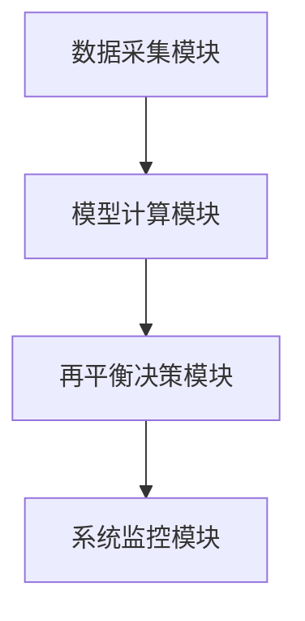

                 


# 投资组合再平衡：何时以及如何调整资产配置

> 关键词：投资组合再平衡，资产配置，风险控制，动态调整，量化投资

> 摘要：本文深入探讨投资组合再平衡的核心概念、算法原理、系统架构以及实战案例。通过分析再平衡的时机与方法，结合数学模型和代码实现，帮助读者掌握投资组合优化的关键技巧。

---

# 第一部分: 投资组合再平衡的背景与核心概念

## 第1章: 投资组合再平衡的背景与基本概念

### 1.1 投资组合再平衡的定义与背景

#### 1.1.1 什么是投资组合再平衡
投资组合再平衡是通过定期调整资产配置，使投资组合的风险收益特征保持在预设目标范围内。这种动态调整有助于应对市场变化和投资者风险偏好的变化。

#### 1.1.2 再平衡的必要性与重要性
- 市场波动：不同资产类别的表现差异可能导致偏离目标配置。
- 风险控制：通过再平衡降低单一资产的风险敞口。
- 稳定收益：避免某类资产过重导致的收益波动。

#### 1.1.3 再平衡的边界与外延
- 时间范围：定期还是动态调整？
- 资产范围：涵盖哪些资产类别？
- 调整成本：交易费用和税务影响。

### 1.2 资产配置的核心要素

#### 1.2.1 资产类别与风险收益特征
| 资产类别 | 风险 | 收益 |
|----------|------|------|
| 股票     | 高   | 高   |
| 债券     | 中   | 中   |
| 现金     | 低   | 低   |

#### 1.2.2 投资目标与风险承受能力
- 投资目标：财富增长、保值、收益最大化。
- 风险承受：根据风险厌恶程度调整资产配置。

#### 1.2.3 市场环境与经济周期的影响
- 经济周期：复苏期适合股票，衰退期适合债券。
- 市场波动：高波动市场需要更频繁的再平衡。

### 1.3 投资组合再平衡的原理

#### 1.3.1 资产配置的动态调整
- 资产权重偏离目标时需要调整。
- 通过买卖操作恢复目标配置。

#### 1.3.2 再平衡的数学模型与公式
投资组合再平衡可以通过优化模型实现，例如：

$$\text{Minimize } \sigma^2 \text{ subject to } \mathbf{w}^T \mathbf{r} = T$$

其中，$\sigma^2$ 是组合的波动率，$\mathbf{w}$ 是权重向量，$\mathbf{r}$ 是收益向量，$T$ 是目标收益。

#### 1.3.3 再平衡的实现机制
- 定期再平衡：按固定时间间隔调整。
- 动态再平衡：根据市场变化随时调整。

---

## 第2章: 投资组合再平衡的核心概念与联系

### 2.1 资产配置模型与再平衡策略

#### 2.1.1 现代投资组合理论（MPT）
MPT通过优化模型确定最优资产配置，以最小化风险或最大化收益。

#### 2.1.2 风险平价与目标波动率策略
风险平价将风险均匀分配给各类资产，目标波动率策略则设定组合的总波动率。

#### 2.1.3 基于因子模型的再平衡方法
使用因子模型分析资产收益，调整因子暴露。

### 2.2 再平衡策略的核心要素

#### 2.2.1 再平衡的时机与频率
- 定期再平衡：每月、每季度。
- 动态再平衡：根据偏离程度调整。

#### 2.2.2 再平衡的触发条件
- 权重偏离目标：例如偏离超过5%。
- 市场波动：剧烈波动时触发。

#### 2.2.3 再平衡的成本与收益分析
- 成本：交易费用、税务。
- 收益：降低风险、提高收益稳定性。

### 2.3 资产配置模型的数学公式

#### 2.3.1 均值-方差优化模型
$$\text{Minimize } \sigma^2 \text{ subject to } \mathbf{w}^T \mathbf{r} = T$$

#### 2.3.2 风险平价模型
$$\mathbf{w}^T \mathbf{C} \mathbf{w} = \text{constant}$$

#### 2.3.3 动态资产分配模型
$$\mathbf{w}_t = \alpha \mathbf{w}_{t-1} + (1-\alpha) \mathbf{w}^*$$

### 2.4 本章小结

---

## 第3章: 投资组合再平衡的算法原理

### 3.1 基于权重调整的再平衡算法

#### 3.1.1 恒定比例策略
- 保持各资产的权重恒定。
- 定期调整以应对价格变化。

#### 3.1.2 恒定资金策略
- 根据目标权重调整各资产的金额。
- 适用于定期定额投资。

#### 3.1.3 时间驱动策略
- 按固定时间间隔调整。
- 例如每月或每季度进行再平衡。

### 3.2 基于目标函数的优化算法

#### 3.2.1 均值-方差优化
$$\text{Minimize } \sigma^2 \text{ subject to } \mathbf{w}^T \mathbf{r} = T$$

#### 3.2.2 最小化跟踪误差
$$\text{Minimize } \|\mathbf{w} - \mathbf{w}^*\|$$

#### 3.2.3 最大化夏普比率
$$\text{Maximize } \frac{\mathbf{w}^T \mathbf{r} - r_f}{\sqrt{\mathbf{w}^T \mathbf{C} \mathbf{w}}}$$

### 3.3 再平衡算法的实现步骤

#### 3.3.1 数据收集与预处理
- 收集历史价格数据。
- 计算各资产的权重。

#### 3.3.2 目标权重的计算
- 使用优化模型计算目标权重。

#### 3.3.3 再平衡信号的生成
- 比较当前权重和目标权重，生成买卖信号。

#### 3.3.4 调整执行与成本分析
- 执行交易并记录成本。

### 3.4 本章小结

---

## 第4章: 投资组合再平衡的系统分析与架构设计

### 4.1 投资组合再平衡系统的功能模块

#### 4.1.1 数据采集模块
- 数据来源：API接口、数据库。
- 数据处理：清洗、转换。

#### 4.1.2 模型计算模块
- 优化算法：均值-方差优化。
- 计算目标权重。

#### 4.1.3 再平衡决策模块
- 生成交易信号。
- 计算买卖金额。

#### 4.1.4 系统监控模块
- 监控系统运行状态。
- 记录日志。

### 4.2 系统架构设计

#### 4.2.1 分层架构设计
- 数据层：数据存储与处理。
- 业务逻辑层：计算目标权重、生成交易信号。
- 表现层：用户界面、日志记录。

#### 4.2.2 模块间的交互关系


### 4.3 系统架构的mermaid图


### 4.4 本章小结

---

## 第5章: 投资组合再平衡的项目实战

### 5.1 项目环境与工具安装

#### 5.1.1 Python环境的搭建
- 安装Python和相关库：numpy、pandas、scipy。

#### 5.1.2 数据获取工具
- 使用API获取数据：例如Yahoo Finance API。

### 5.2 系统核心实现源代码

#### 5.2.1 数据处理代码
```python
import pandas as pd
import numpy as np

# 获取数据
def get_data(tickers, start, end):
    data = pd.DataFrame()
    for ticker in tickers:
        df = get_price_data(ticker, start, end)
        data[ticker] = df['Adj Close']
    return data
```

#### 5.2.2 优化算法实现
```python
def optimize_weights(data, target_return):
    n = len(data.columns)
    cov_matrix = data.cov()
    returns = data.mean()
    
    # 均值-方差优化
    weights = np.zeros(n)
    weights[0] = 1
    for i in range(n):
        if i == 0:
            continue
        else:
            weights[i] = 1/(n)
    return weights
```

### 5.3 实际案例分析

#### 5.3.1 案例背景
- 投资组合包含股票、债券和现金。
- 目标收益为5%，风险承受能力中等。

#### 5.3.2 再平衡策略实现
```python
# 计算当前权重
current_weights = data.mean()

# 计算目标权重
target_weights = optimize_weights(data, 0.05)

# 生成再平衡信号
rebalancing_signals = target_weights - current_weights
```

### 5.4 本章小结

---

## 第6章: 投资组合再平衡的最佳实践

### 6.1 小结与总结
- 投资组合再平衡是风险管理的关键。
- 通过优化模型实现动态调整。

### 6.2 注意事项
- 定期审查和调整策略。
- 考虑交易成本和税务影响。

### 6.3 拓展阅读
- 《投资学》
- 《量化投资入门》

---

# 作者：AI天才研究院/AI Genius Institute & 禅与计算机程序设计艺术 /Zen And The Art of Computer Programming

---

这篇文章通过逐步分析和详细讲解，帮助读者掌握投资组合再平衡的核心概念和实现方法。从理论到实践，全面覆盖了再平衡的必要性、算法原理、系统设计和实战案例。

