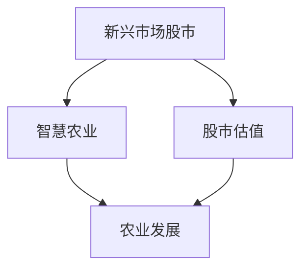
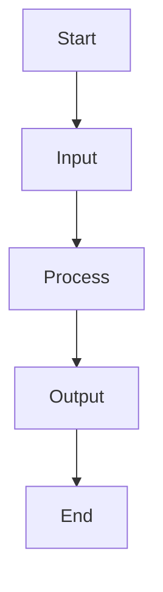
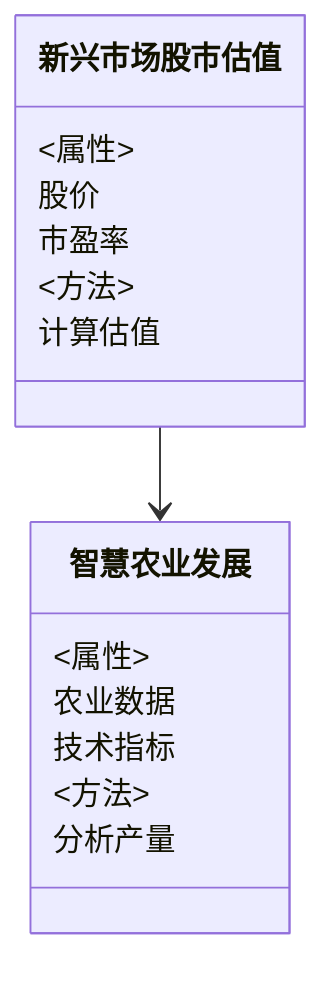
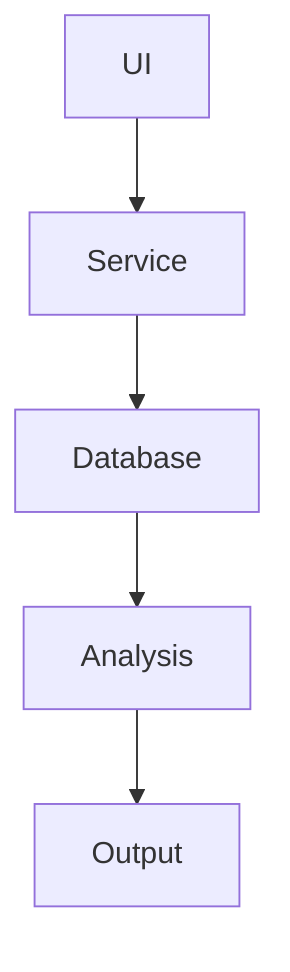
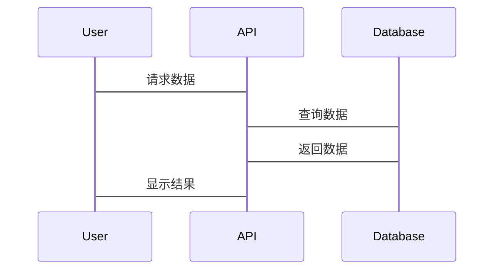

                 


# 新兴市场股市估值与智慧农业发展的互动

> 关键词：新兴市场，股市估值，智慧农业，大数据，人工智能

> 摘要：本文探讨新兴市场股市估值与智慧农业发展的互动关系，分析大数据和人工智能技术在其中的作用，提出互动模型和实现方法。

---

## 第一部分: 新兴市场股市估值与智慧农业发展的背景与核心概念

### 第1章: 新兴市场股市估值与智慧农业发展的背景与问题

#### 1.1 新兴市场股市估值的现状与挑战

##### 1.1.1 新兴市场的定义与特点
- 新兴市场是指经济快速增长、基础设施逐步完善但尚未完全发达的国家或地区。
- 特点包括高增长潜力、市场波动性大、投资者结构多元化。

##### 1.1.2 新兴市场股市估值的现状
- 市场参与者包括机构投资者、散户和外国投资者。
- 估值指标包括市盈率（P/E）、市净率（P/B）和股息率等。

##### 1.1.3 新兴市场股市估值的挑战与问题
- 市场波动性大，受宏观经济政策影响。
- 数据不透明，影响估值准确性。
- 风险因素复杂，如地缘政治和自然灾害。

##### 1.1.4 新兴市场股市估值的核心要素
- 公司基本面：收入、利润、增长率。
- 宏观经济：GDP、利率、通胀。
- 市场情绪：投资者情绪、市场流动性。

#### 1.2 智慧农业发展的现状与趋势

##### 1.2.1 智慧农业的定义与核心要素
- 智慧农业是将信息技术、大数据、人工智能等技术应用于农业。
- 核心要素包括物联网（IoT）、数据分析、自动化和智能决策。

##### 1.2.2 智慧农业发展的现状
- 应用场景：精准农业、供应链管理、环境监测。
- 技术支撑：传感器、无人机、AI算法。

##### 1.2.3 智慧农业发展的趋势与机遇
- 技术进步：5G、AI、区块链推动农业数字化。
- 政策支持：政府出台政策鼓励智慧农业发展。
- 市场需求：消费者对高质量农产品的需求增加。

#### 1.3 新兴市场股市估值与智慧农业发展的互动关系

##### 1.3.1 问题背景与问题描述
- 新兴市场股市波动影响农业投资。
- 智慧农业技术进步推动股市估值变化。

##### 1.3.2 问题解决的思路与方法
- 数据分析：收集股市和农业数据，建立关联模型。
- 技术应用：利用大数据和AI技术预测股市和农业趋势。

##### 1.3.3 边界与外延
- 限定于新兴市场，排除发达国家市场。
- 仅考虑农业技术与股市估值的互动，不涉及其他产业。

##### 1.3.4 核心概念与组成
- 核心概念：股市估值、智慧农业。
- 组成部分：数据采集、模型构建、结果分析。

### 第2章: 新兴市场股市估值与智慧农业发展的核心概念与联系

#### 2.1 核心概念原理

##### 2.1.1 新兴市场股市估值的原理
- 市场参与者通过分析公司基本面和宏观经济指标进行估值。

##### 2.1.2 智慧农业发展的原理
- 通过技术手段优化农业生产，降低成本，提高效率。

##### 2.1.3 两者互动的机制
- 智慧农业技术进步推动农业公司业绩增长，影响股市估值。
- 股市波动影响农业投资，反过来推动智慧农业技术发展。

#### 2.2 核心概念属性对比

| 属性 | 新兴市场股市估值 | 智慧农业发展 |
|------|------------------|--------------|
| 数据来源 | 股价、市盈率 | 农业数据、传感器数据 |
| 影响因素 | 宏观经济、政策 | 技术进步、政策支持 |
| 应用场景 | 投资决策 | 农业生产优化 |

#### 2.3 实体关系图



### 第3章: 新兴市场股市估值与智慧农业发展的算法原理

#### 3.1 算法原理概述

##### 3.1.1 多元回归分析
- 用于分析多个自变量对因变量的影响。
- 公式：$$ y = \beta_0 + \beta_1x_1 + \beta_2x_2 + ... + \beta_nx_n + \epsilon $$

##### 3.1.2 时间序列分析
- 分析数据随时间的变化趋势。
- 方法：ARIMA、GARCH。

##### 3.1.3 机器学习算法
- 使用神经网络、随机森林等算法进行预测。

#### 3.2 算法流程图



#### 3.3 算法实现代码

```python
import pandas as pd
import numpy as np
from sklearn.linear_model import LinearRegression

# 示例数据
data = {'GDP': [5, 6, 7, 8, 9],
        'Inflation': [2, 3, 2, 4, 5],
        'Stock_Price': [100, 120, 110, 130, 140]}
df = pd.DataFrame(data)

# 多元回归模型
model = LinearRegression()
model.fit(df[['GDP', 'Inflation']], df['Stock_Price'])

# 预测
new_data = {'GDP': [10], 'Inflation': [3]}
new_df = pd.DataFrame(new_data)
prediction = model.predict(new_df[['GDP', 'Inflation']])
print(f'预测股票价格：{prediction[0]:.2f}')
```

---

## 第四部分: 系统分析与架构设计方案

### 第4章: 新兴市场股市估值与智慧农业发展的系统架构设计

#### 4.1 问题场景介绍
- 系统目标：分析股市估值与智慧农业互动。
- 业务需求：提供数据采集、分析、预测功能。

#### 4.2 领域模型设计



#### 4.3 系统架构设计



#### 4.4 接口设计与交互流程图



---

## 第五部分: 项目实战

### 第5章: 新兴市场股市估值与智慧农业发展的项目实战

#### 5.1 环境安装
- Python 3.8+
- 安装库：pandas、numpy、scikit-learn。

#### 5.2 核心代码实现

```python
import pandas as pd
from sklearn.ensemble import RandomForestRegressor

# 数据预处理
data = pd.read_csv('agriculture_data.csv')
features = data[['temp', 'rainfall', 'crop_yield']]
target = data['stock_value']

# 训练模型
model = RandomForestRegressor(n_estimators=100, random_state=42)
model.fit(features, target)

# 预测
new_features = pd.DataFrame({'temp': [30], 'rainfall': [80], 'crop_yield': [50]})
predicted_stock_value = model.predict(new_features)
print(f'预测股票价值：{predicted_stock_value[0]:.2f}')
```

#### 5.3 代码解读与分析
- 数据预处理：清洗和特征选择。
- 模型训练：随机森林回归模型。
- 预测：基于农业数据预测股市价值。

#### 5.4 实际案例分析
- 数据来源：新兴市场农业和股市数据。
- 案例分析：使用模型分析某农业公司股票估值。

#### 5.5 项目小结
- 项目实现：构建互动模型，验证其准确性。
- 实践意义：为投资者提供科学决策依据。

---

## 第六部分: 最佳实践

### 第6章: 新兴市场股市估值与智慧农业发展的最佳实践

#### 6.1 小结
- 本文通过大数据和AI技术，分析了新兴市场股市估值与智慧农业的互动关系。

#### 6.2 注意事项
- 数据质量：确保数据准确性和完整性。
- 模型优化：定期更新模型，适应市场变化。
- 风险管理：制定风险管理策略，降低投资风险。

#### 6.3 拓展阅读
- 推荐书籍：《Data Science for Business》、《Machine Learning for Investment》。
- 学术论文：关注智慧农业和金融交叉领域的最新研究。

---

## 作者

作者：AI天才研究院/AI Genius Institute & 禅与计算机程序设计艺术/Zen And The Art of Computer Programming

