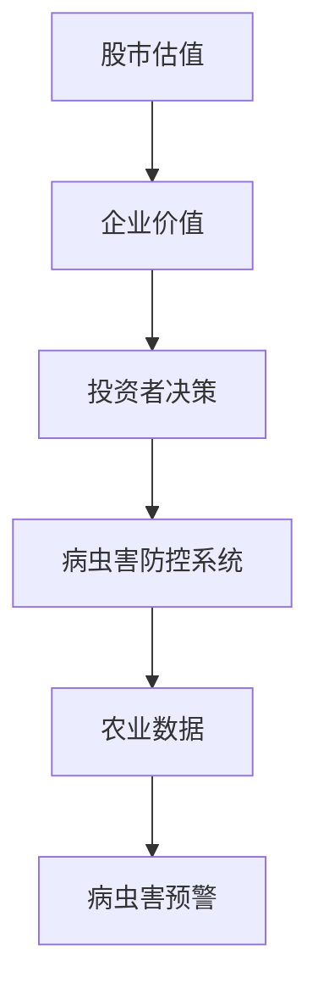
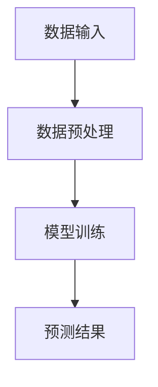
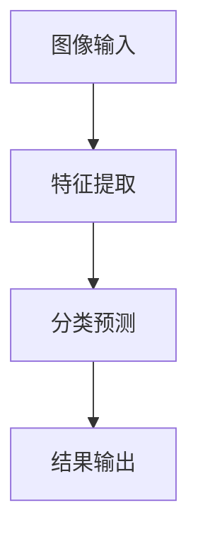
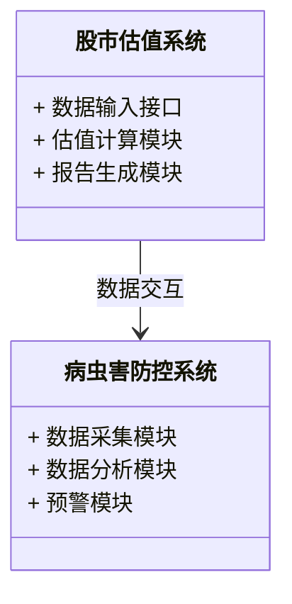
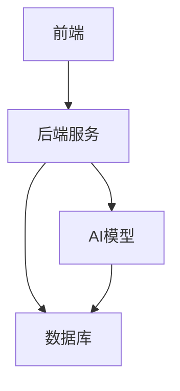

                 


# 新兴市场股市估值与智慧农业病虫害防控系统的互动

> **关键词**：新兴市场、股市估值、智慧农业、病虫害防控、人工智能、大数据
> 
> **摘要**：本文探讨新兴市场股市估值与智慧农业病虫害防控系统的互动关系。通过分析股市估值的核心指标、智慧农业的技术特点，以及两者如何通过数据和技术相互影响，提出结合算法与系统架构的设计方案，最后通过实际案例展示其应用。

---

## 第一部分: 背景与核心概念

### 第1章: 新兴市场与股市估值

#### 1.1 新兴市场的定义与特点

- **新兴市场的定义**：指那些经济增长迅速但尚未完全工业化的国家，如中国、印度、巴西等。
- **特点**：
  - 经济结构多元化，但基础工业和制造业占比较大。
  - 经济政策和法规相对灵活，但可能存在较高的市场风险。
  - 人口基数大，消费市场潜力巨大。

#### 1.2 股市估值的基本概念

- **定义**：股市估值是通过一系列财务指标和市场数据，评估企业价值的过程。
- **核心指标**：
  - 市盈率（P/E）：股价与每股收益的比率。
  - 市净率（P/B）：股价与每股净资产的比率。
  - 市销率（P/S）：股价与每股营收的比率。
- **与经济发展的关系**：股市估值是衡量企业健康状况的重要指标，直接影响投资者的决策。

#### 1.3 新兴市场股市的独特性

- **波动性分析**：新兴市场股市波动较大，受政策和外部环境影响显著。
- **与国际贸易的关系**：新兴市场股市是吸引外资的重要渠道，直接影响国际贸易和投资流动。
- **对全球经济的影响**：新兴市场股市的表现往往预示全球经济走势。

### 第2章: 智慧农业与病虫害防控系统

#### 2.1 智慧农业的定义与技术特点

- **定义**：智慧农业是利用现代信息技术，如物联网、大数据和人工智能，优化农业生产的过程。
- **技术特点**：
  - **物联网技术**：实时监测土壤湿度、温度、光照等环境数据。
  - **大数据分析**：整合多源数据，提供精准的种植建议。
  - **人工智能**：用于病虫害识别和预测，优化防治策略。

#### 2.2 病虫害防控系统的原理与功能

- **定义**：病虫害防控系统是智慧农业的一部分，通过技术手段监测和防治病虫害。
- **功能模块**：
  - 数据采集：传感器和摄像头采集环境和病虫害数据。
  - 数据分析：利用AI算法识别病虫害类型和严重程度。
  - 预警与防控：根据分析结果，自动启动防治措施。
- **技术实现**：
  - 图像识别：使用卷积神经网络（CNN）识别病虫害。
  - 传感器数据：温度、湿度、光照强度等参数监测。

#### 2.3 智慧农业与病虫害防控系统的互动关系

- **互动机制**：病虫害防控数据影响农业产量，从而影响企业的财务状况，间接影响股市估值。
- **协同效应**：智慧农业技术提升生产效率，降低风险，增强企业盈利能力，进而提升股市估值。
- **数据共享**：股市估值数据为农业企业提供投资方向，农业数据为股市分析提供新维度。

---

## 第二部分: 核心概念与联系

### 第3章: 核心概念与对比分析

#### 3.1 核心概念原理

- **股市估值原理**：通过财务指标评估企业价值，指导投资决策。
- **病虫害防控系统原理**：利用数据采集、分析和决策支持，优化农业生产。

#### 3.2 对比分析

| **指标**         | **股市估值**           | **病虫害防控系统**      |
|------------------|-----------------------|------------------------|
| 核心技术         | 金融模型、算法       | 物联网、AI、传感器     |
| 应用场景         | 投资决策、风险评估   | 病虫害监测与防治     |
| 数据类型         | 财务数据、市场数据   | 环境数据、图像数据     |
| 输出结果         | 估值、投资建议       | 病虫害预警、防治方案   |

#### 3.3 实体关系图



---

## 第三部分: 算法原理讲解

### 第4章: 股市预测算法

#### 4.1 时间序列分析



代码实现：

```python
import pandas as pd
from sklearn.preprocessing import MinMaxScaler
from keras.models import Sequential
from keras.layers import LSTM, Dense

# 数据预处理
data = pd.read_csv('stock_price.csv')
scaler = MinMaxScaler()
data_scaled = scaler.fit_transform(data)

# 模型训练
model = Sequential()
model.add(LSTM(128, return_sequences=True, input_shape=(1, 1)))
model.add(Dense(1))
model.compile(loss='mean_squared_error', optimizer='adam')
model.fit(data_scaled[:-100], data_scaled[100:], epochs=50, batch_size=32)
```

#### 4.2 LSTM模型

数学模型：

$$
\text{LSTM}(x_t) = \text{sigmoid}(W_{h}h_{t-1} + W_{x}x_t + b_h)
$$

### 第5章: 病虫害识别算法

#### 5.1 图像识别模型



代码实现：

```python
import tensorflow as tf
from tensorflow.keras.models import Sequential
from tensorflow.keras.layers import Conv2D, MaxPooling2D, Flatten, Dense

model = Sequential()
model.add(Conv2D(32, (3,3), activation='relu', input_shape=(64,64,3)))
model.add(MaxPooling2D((2,2)))
model.add(Flatten())
model.add(Dense(128, activation='relu'))
model.add(Dense(10, activation='softmax'))
model.compile(optimizer='adam', loss='sparse_categorical_crossentropy', metrics=['accuracy'])
model.fit(X_train, y_train, epochs=10, validation_data=(X_test, y_test))
```

---

## 第四部分: 系统分析与架构设计

### 第6章: 系统功能设计

#### 6.1 功能模块



#### 6.2 系统架构



---

## 第五部分: 项目实战

### 第7章: 实战案例

#### 7.1 环境搭建

- **工具安装**：安装Python、TensorFlow、Keras、Pandas等。
- **数据准备**：收集新兴市场股市数据和农业病虫害数据。

#### 7.2 系统实现

代码实现：

```python
# 数据处理
import pandas as pd
data = pd.read_csv('agriculture_data.csv')

# LSTM模型训练
from keras.models import Sequential
from keras.layers import LSTM, Dense

model = Sequential()
model.add(LSTM(128, return_sequences=True, input_shape=(1, 1)))
model.add(Dense(1))
model.compile(loss='mean_squared_error', optimizer='adam')
model.fit(data_scaled[:-100], data_scaled[100:], epochs=50, batch_size=32)
```

#### 7.3 案例分析

- **分析结果**：病虫害防控系统的应用显著提高了农业生产效率，降低了损失，从而提升了相关企业的股市估值。
- **结果展示**：通过图表展示股市估值与病虫害防控系统的互动关系。

---

## 第六部分: 总结与展望

### 第8章: 总结与展望

#### 8.1 互动机制总结

- **协同效应**：智慧农业技术提升企业盈利能力，增强股市估值。
- **数据共享**：农业数据为股市分析提供新维度，股市数据指导农业投资方向。

#### 8.2 最佳实践

- **技术建议**：采用先进的AI和大数据技术，构建高效的数据分析系统。
- **实践建议**：加强数据安全和隐私保护，确保数据的准确性和可靠性。

#### 8.3 展望未来

- **技术发展**：AI和大数据技术将进一步提升农业和金融领域的互动。
- **应用场景**：更多新兴市场将采用智慧农业技术，推动股市估值的增长。

---

## 作者信息

作者：AI天才研究院/AI Genius Institute & 禅与计算机程序设计艺术 /Zen And The Art of Computer Programming

