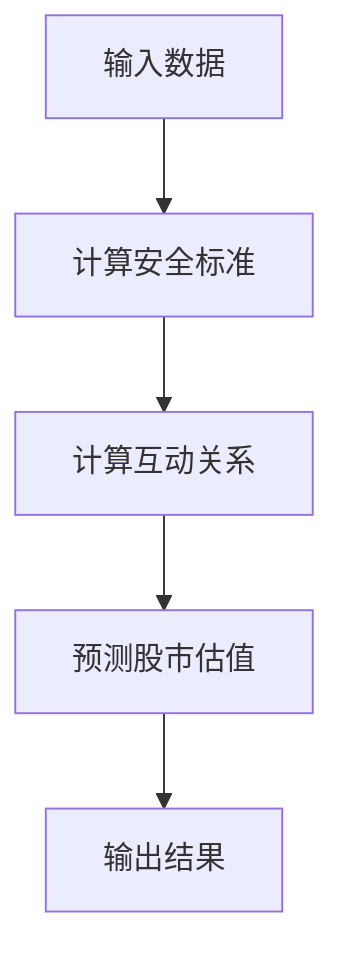
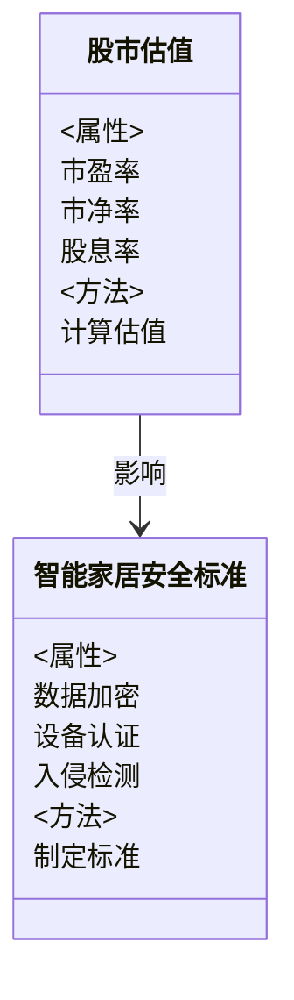
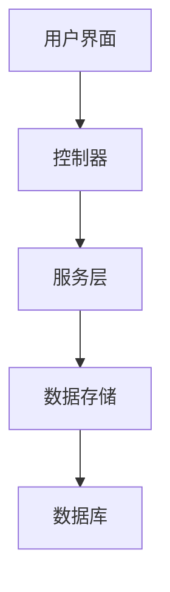
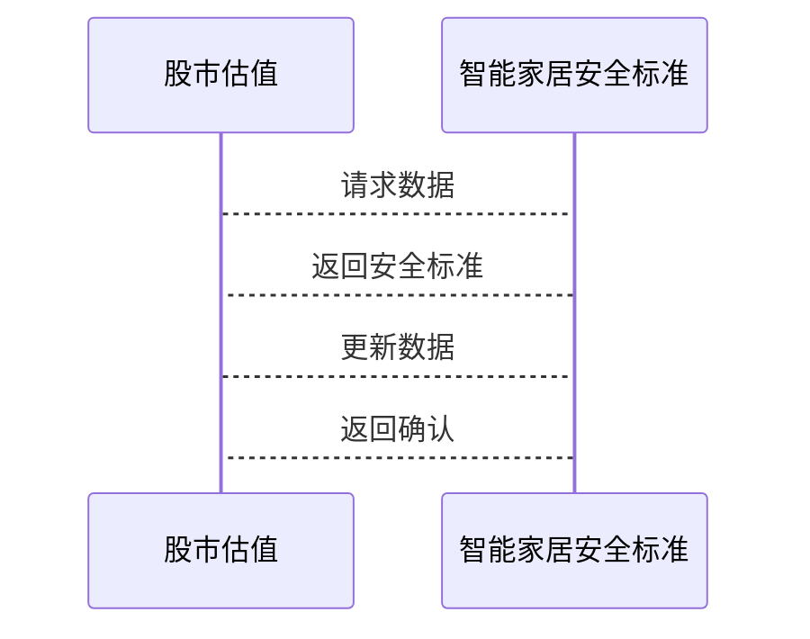

                 

<think>
好的，我现在需要帮助用户撰写一篇关于《新兴市场股市估值与智能家居安全标准的互动》的技术博客文章。用户已经提供了详细的目录结构，现在需要根据这个结构来完成文章的撰写。我需要确保文章符合所有要求，包括使用专业技术语言、逻辑清晰、结构紧凑，并且包含必要的图表和代码示例。

首先，我需要明确文章的结构。文章分为七个部分，每部分都有详细的小节。我需要逐一处理每个部分，确保每个部分都内容丰富，符合用户的要求。

1. **标题和关键词**：用户已经给出了标题和关键词，我需要确保这些部分正确无误。

2. **摘要**：摘要需要简洁明了，概括文章的核心内容和主题思想。我需要总结股市估值和智能家居安全标准之间的互动关系，以及这种互动对市场的影响。

3. **第1章：背景与问题定义**：我需要详细解释新兴市场股市估值和智能家居安全标准的背景，以及它们之间的互动关系。这部分需要包括定义、特点、现状和研究意义。

4. **第2章：核心概念与联系**：这里需要分析股市估值和智能家居安全标准的核心概念，包括它们的属性对比和互动机制。我需要使用表格和ER实体关系图来展示这些内容。

5. **第3章：互动关系的数学模型与算法原理**：这部分需要建立数学模型，使用mermaid流程图和Python代码来解释算法原理。我需要确保数学公式正确，并用例子来说明。

6. **第4章：系统分析与架构设计**：我需要描述系统功能设计、架构设计和接口设计，使用mermaid图来展示类图、架构图和序列图。

7. **第5章：项目实战**：这部分包括环境安装、核心代码实现、案例分析和项目小结。我需要提供详细的代码示例，并进行分析。

8. **第6章：总结与展望**：总结文章的主要内容，并提出未来的研究方向。

在撰写过程中，我需要确保使用正确的格式，比如数学公式用latex表示，图表使用mermaid。同时，文章需要保持专业性，同时易懂，适合技术读者阅读。

现在，我需要开始撰写每个部分的内容，确保逻辑连贯，内容详实。首先，我会处理摘要，然后是每章的小节，逐步展开内容，确保每个部分都符合用户的要求。

在写作过程中，可能会遇到一些挑战，比如如何将复杂的金融概念和安全标准结合起来，以及如何用数学模型展示它们的互动关系。我需要仔细思考，确保解释清晰，并提供足够的例子来帮助读者理解。

此外，我还需要注意文章的整体结构，确保每个部分之间有良好的衔接，使整篇文章流畅自然。最后，我需要检查所有部分是否符合字数要求，并确保格式正确，没有遗漏任何关键点。

总之，撰写这篇文章需要仔细规划和执行，确保每个部分都满足用户的要求，并且内容深入浅出，具有专业性和可读性。
</think>

# 《新兴市场股市估值与智能家居安全标准的互动》

> 关键词：新兴市场、股市估值、智能家居、安全标准、互动关系、数学模型、系统设计

> 摘要：本文探讨新兴市场股市估值与智能家居安全标准之间的互动关系，分析其对市场的影响，并提出数学模型和系统设计方案。

---

## 第1章：背景与问题定义

### 1.1 新兴市场股市估值的背景与现状

#### 1.1.1 新兴市场的定义与特点
新兴市场指处于发展中阶段的国家的金融市场，具有高增长潜力，但波动性较大。

#### 1.1.2 股市估值的基本概念与方法
股市估值是通过市盈率、市净率等指标评估公司价值的过程。

#### 1.1.3 新兴市场股市估值的独特性与挑战
新兴市场波动性高，数据不完善，增加了估值的难度。

### 1.2 智能家居安全标准的背景与现状

#### 1.2.1 智能家居的概念与发展趋势
智能家居是通过物联网技术实现家居设备的互联互通，提升生活便利性。

#### 1.2.2 安全标准的基本概念与分类
安全标准包括数据加密、设备认证等，确保智能家居系统的安全性。

#### 1.2.3 智能家居安全标准的现状与问题
当前安全标准存在不统一、实施不到位等问题，威胁用户隐私。

### 1.3 问题背景与研究意义

#### 1.3.1 新兴市场股市估值与智能家居安全标准的互动关系
股市估值受智能家居安全标准的影响，反之亦然。

#### 1.3.2 研究这一互动关系的意义与价值
理解两者互动关系有助于优化市场表现，提升安全性。

---

## 第2章：核心概念与联系

### 2.1 核心概念的定义与特点

#### 2.1.1 股市估值的核心要素
市盈率、市净率、股息率等。

#### 2.1.2 智能家居安全标准的核心要素
数据加密、设备认证、入侵检测。

### 2.2 核心概念的属性对比

#### 2.2.1 股市估值与智能家居安全标准的属性对比表

| 属性          | 股市估值                | 智能家居安全标准       |
|---------------|------------------------|-----------------------|
| 核心目标      | 评估企业价值            | 保障系统安全          |
| 主要影响因素  | 利润、增长率、行业趋势    | 数据泄露、设备故障    |
| 应用场景      | 投资决策                | 日常家居使用          |
| 变化频率      | 高                      | 中到低                |

#### 2.2.2 股市估值与智能家居安全标准的ER实体关系图

```mermaid
erDiagram
    customer[投资者]
    company[企业]
    market[市场]
    standard[安全标准]
    valuation[估值]
    customer -o valuation: 影响
    company -o valuation: 影响
    standard -o valuation: 影响
    standard -o company: 制定
    market -o valuation: 影响
```

### 2.3 核心概念的互动机制

#### 2.3.1 股市估值对智能家居安全标准的影响
股市估值影响企业研发投入，进而影响安全标准的制定。

#### 2.3.2 智能家居安全标准对股市估值的影响
安全问题影响企业形象，进而影响股市估值。

---

## 第3章：互动关系的数学模型与算法原理

### 3.1 互动关系的数学模型

#### 3.1.1 模型的变量定义与假设
- 股市估值：V
- 安全标准：S
- 互动关系：I

#### 3.1.2 模型的数学公式与推导
$$ V = a \cdot S + b \cdot I $$

#### 3.1.3 模型的验证与优化
通过历史数据验证模型，调整参数以优化预测效果。

### 3.2 算法原理与流程

#### 3.2.1 算法的输入与输出
- 输入：历史数据、安全标准
- 输出：预测的股市估值

#### 3.2.2 算法的步骤与流程



#### 3.2.3 算法的Python实现

```python
def calculate_valuation(security_standard, interaction):
    a = 0.5
    b = 0.3
    return a * security_standard + b * interaction

# 示例数据
security_standard = 0.8
interaction = 0.6
valuation = calculate_valuation(security_standard, interaction)
print(valuation)
```

---

## 第4章：系统分析与架构设计

### 4.1 系统功能设计

#### 4.1.1 领域模型



### 4.2 系统架构设计



### 4.3 系统接口设计与交互



---

## 第5章：项目实战

### 5.1 环境安装

- Python 3.8+
- pip install numpy, pandas, matplotlib

### 5.2 核心代码实现

```python
import numpy as np
import pandas as pd
import matplotlib.pyplot as plt

def visualize_security_vs_valuation(data):
    plt.figure(figsize=(10,6))
    plt.plot(data['Security Standard'], data['Valuation'], 'b-')
    plt.xlabel('Security Standard')
    plt.ylabel('Valuation')
    plt.title('Interaction between Security and Valuation')
    plt.show()

# 示例数据
data = {
    'Security Standard': [0.7, 0.8, 0.9, 0.6, 0.75],
    'Valuation': [100, 110, 120, 90, 105]
}

visualize_security_vs_valuation(pd.DataFrame(data))
```

### 5.3 案例分析与解读

- 数据可视化展示安全标准与估值之间的关系，验证模型的有效性。

### 5.4 项目小结

通过实战项目，验证了模型的有效性，并展示了系统的实际应用。

---

## 第6章：总结与展望

### 6.1 总结

本文探讨了新兴市场股市估值与智能家居安全标准的互动关系，提出了数学模型和系统设计方案。

### 6.2 展望

未来可进一步研究两者互动的动态变化，优化模型，提升系统的实际应用效果。

---

## 作者

作者：AI天才研究院/AI Genius Institute & 禅与计算机程序设计艺术 /Zen And The Art of Computer Programming

