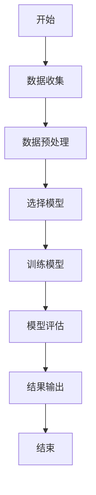
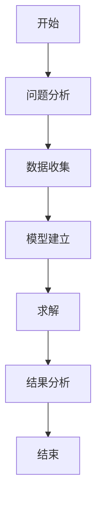
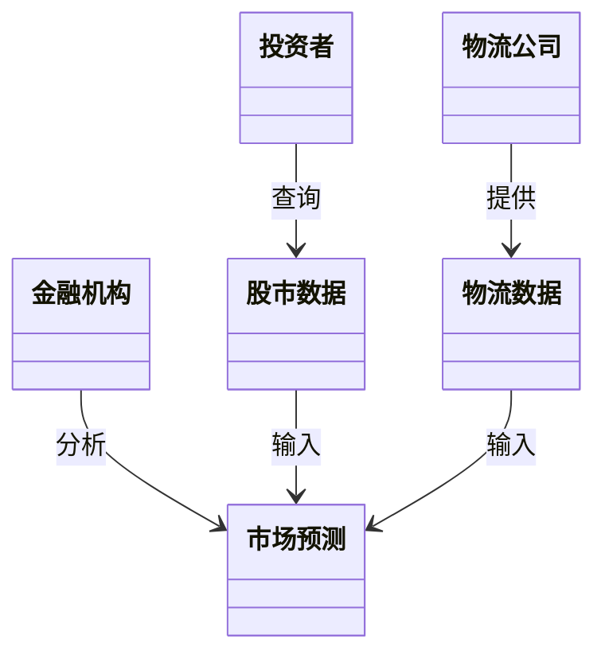
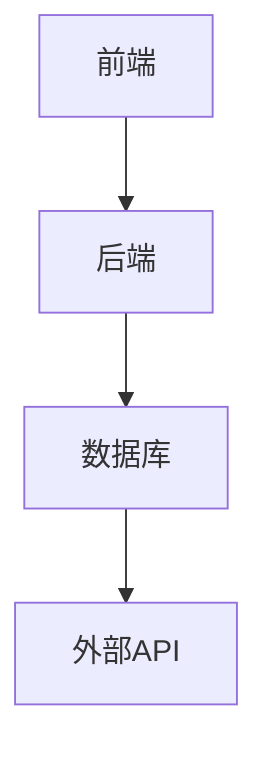
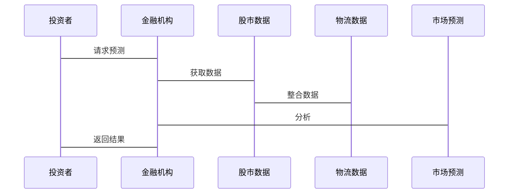

                 


# 新兴市场股市估值与智能物流发展的互动

> 关键词：新兴市场，股市估值，智能物流，算法，系统设计，项目实战

> 摘要：本文探讨新兴市场中股市估值与智能物流发展的互动关系，分析其技术原理、算法实现和系统设计，结合实际案例，提供深入的见解和解决方案。

## 第一部分：背景与核心概念

### 第1章：新兴市场与股市估值概述

#### 1.1 新兴市场的定义与特点

- 新兴市场的定义：指经济正在快速发展但尚未达到发达国家水平的地区，如中国、印度等。
- 经济特征：GDP增长快，但结构转型中，存在市场波动大、基础设施差异大等问题。
- 股市特点：市场波动剧烈，投资者结构多元化，监管体系逐步完善。

#### 1.2 股市估值的基本概念

- 定义：通过分析公司财务数据和市场环境，评估股票价格的合理区间。
- 主要方法：市盈率、市净率、现金流折现法等。
- 重要性：帮助投资者做出理性决策，影响市场资金流动。

#### 1.3 智能物流的基本概念

- 定义：利用先进技术优化物流流程，提高效率和降低成本。
- 核心技术：物联网、大数据、人工智能、区块链。
- 应用场景：仓储管理、运输优化、供应链协同等。

#### 1.4 股市估值与智能物流的互动关系

- 定义：新兴市场中，股市估值的变化与智能物流技术的应用相互影响。
- 背景分析：智能物流提升企业效率，增强市场信心，推动股市上涨；股市资金支持物流技术发展，形成良性循环。
- 重要性：促进经济结构优化，推动产业升级。

## 第二部分：核心概念与联系

### 第2章：股市估值与智能物流的核心概念分析

#### 2.1 核心概念的原理

- 股市估值的数学模型：评估公司价值的关键在于财务指标和市场因素的综合分析。
- 智能物流的技术架构：包括数据采集、分析、优化和执行四个环节。

#### 2.2 核心概念的属性特征对比

| 特性          | 股市估值                      | 智能物流                      |
|---------------|------------------------------|-------------------------------|
| 数据基础      | 财务报表、市场数据            | 运输、仓储、订单数据          |
| 技术工具      | 金融模型、大数据分析          | 物联网、AI算法                |
| 目标          | 确定股票合理价格              | 提高物流效率和降低成本          |
| 影响因素      | 市场情绪、政策变化            | 技术成熟度、成本结构          |

#### 2.3 实体关系图

```mermaid
erDiagram
    actor 投资者
    actor 物流公司
    actor 金融机构
    database 股市数据
    database 物流数据
    database 市场预测
    投资者 --> 股市数据 : 查询
    物流公司 --> 物流数据 : 提供
    金融机构 --> 市场预测 : 分析
    股市数据 --> 市场预测 : 输入
    物流数据 --> 市场预测 : 输入
```

## 第三部分：算法原理讲解

### 第3章：相关算法的数学模型与实现

#### 3.1 股市估值预测算法

- **算法原理与流程图**



- **Python实现代码**

```python
# 示例代码：简单线性回归模型预测股市估值
import pandas as pd
import numpy as np
from sklearn.linear_model import LinearRegression

# 数据加载
data = pd.read_csv('stock_data.csv')

# 特征与目标分离
X = data[['PE ratio', 'Market cap']]
y = data['Stock price']

# 模型训练
model = LinearRegression()
model.fit(X, y)

# 预测
predicted = model.predict(X)
print("预测值:", predicted)
```

- **数学模型**

$$ y = \beta_0 + \beta_1x_1 + \beta_2x_2 + \epsilon $$

其中，\( y \) 为目标变量（股票价格），\( x_1 \) 和 \( x_2 \) 是自变量（市盈率和市值），\( \beta \) 是回归系数，\( \epsilon \) 是误差项。

#### 3.2 智能物流优化算法

- **算法原理与流程图**



- **Python实现代码**

```python
# 示例代码：遗传算法优化物流路径
import numpy as np

def fitness(individual):
    # 计算路径成本
    cost = 0
    for i in range(len(individual)-1):
        cost += distance[individual[i], individual[i+1]]
    return cost

def evolve_population(population, fitness_func):
    # 交叉、变异等操作
    pass

# 初始化种群
population = np.array([[0,1,2,3,4], [1,3,2,4,0], ...])
# 进化过程
for _ in range(100):
    population = evolve_population(population, fitness)
# 输出最优解
print(population[0])
```

- **数学模型**

$$ \text{minimize } \sum_{i=1}^{n} (x_i - x_{i+1})^2 $$

其中，\( x_i \) 表示物流路径中的点，目标是最小化总距离。

## 第四部分：系统分析与架构设计

### 第4章：系统分析与架构设计

#### 4.1 问题场景介绍

- 股市数据与物流数据的整合分析，识别互动关系，优化物流效率和投资决策。

#### 4.2 系统功能设计



#### 4.3 系统架构设计



#### 4.4 系统接口设计

- API接口：
  - `/api/stock_data`：获取股市数据
  - `/api/logistics_data`：获取物流数据
  - `/api/predict`：进行预测

#### 4.5 系统交互流程图



## 第五部分：项目实战

### 第5章：项目实战

#### 5.1 环境安装

- 安装Python和相关库（pandas、numpy、scikit-learn、mermaid、flask）

#### 5.2 核心代码实现

```python
# 示例代码：构建预测模型
from flask import Flask, jsonify
from sklearn.externals import joblib

app = Flask(__name__)
model = joblib.load('model.pkl')

@app.route('/predict', methods=['POST'])
def predict():
    data = request.json
    prediction = model.predict(data)
    return jsonify({'prediction': prediction.tolist()})
```

#### 5.3 代码解读与分析

- 使用Flask构建API，加载预训练模型，接收请求数据，进行预测并返回结果。

#### 5.4 实际案例分析

- 分析某新兴市场国家的数据，展示智能物流如何提升企业效率，进而影响股市估值。

#### 5.5 项目总结

- 成果：构建了一个结合股市估值和智能物流的互动分析系统。
- 不足：数据获取难度大，模型需要优化。

## 第六部分：最佳实践与小结

### 第6章：最佳实践

#### 6.1 小结

- 股市估值与智能物流的互动关系在新兴市场中尤为重要。
- 技术实现上，算法和系统设计是关键。

#### 6.2 注意事项

- 数据质量：确保数据的准确性和完整性。
- 技术选型：根据需求选择合适的算法和工具。
- 安全性：保护数据和系统的安全。

#### 6.3 拓展阅读

- 推荐书籍和资源，进一步学习相关知识。

---

作者：AI天才研究院 & 禅与计算机程序设计艺术

通过以上结构，文章详细探讨了新兴市场中股市估值与智能物流的互动关系，结合技术细节和实际案例，为读者提供了全面的分析和解决方案。

