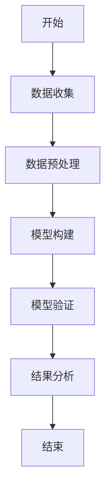
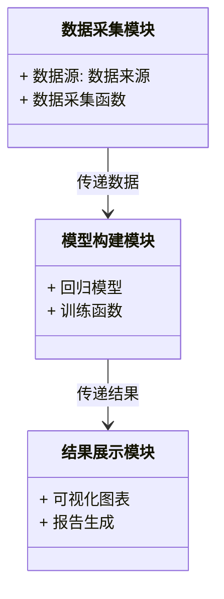

                 


```markdown
# 新兴市场股市估值与智能电网储能技术的互动

> 关键词：股市估值，智能电网，储能技术，互动关系，新兴市场

> 摘要：本文探讨了新兴市场股市估值与智能电网储能技术之间的互动关系，分析了影响股市估值的关键因素和智能电网储能技术的经济影响，构建了两者之间的互动模型，为投资者和政策制定者提供了参考。

---

## 第一部分: 背景介绍

### 第1章: 问题背景

#### 1.1 新兴市场股市的特点
新兴市场股市具有高增长潜力，但波动性较大。股市估值受政策、经济和市场情绪的影响显著。

#### 1.2 智能电网储能技术的发展现状
智能电网储能技术是实现能源转型的关键，应用场景广泛，但成本高、技术复杂。

#### 1.3 互动关系的重要性
新兴市场的经济增长与能源需求密切相关，智能电网储能技术对能源供应稳定性的影响直接关系到股市估值。

### 第2章: 问题描述

#### 2.1 股市估值的核心要素
- 市盈率（P/E）
- 市净率（P/B）
- 股息率（Dividend Yield）

#### 2.2 智能电网储能技术的经济影响
- 投资成本高
- 运营成本低
- 政策支持的影响

#### 2.3 互动关系的定义与范围
新兴市场股市与智能电网储能技术的互动主要体现在政策变化、技术进步和市场预期上。

### 第3章: 问题解决

#### 3.1 理论框架的构建
构建一个包含股市估值和储能技术影响的动态模型。

#### 3.2 数据分析方法的选择
使用回归分析和时间序列分析。

#### 3.3 模型构建的目标与路径
目标是预测储能技术对股市的影响，路径包括数据收集、模型构建和验证。

### 第4章: 边界与外延

#### 4.1 新兴市场的界定
新兴市场包括中国、印度等经济快速增长的国家。

#### 4.2 智能电网储能技术的边界
储能技术的应用场景和成本范围。

#### 4.3 互动关系的外延与限制
新兴市场的经济政策和国际环境对互动关系的影响。

## 第二部分: 核心概念与联系

### 第5章: 核心概念原理

#### 5.1 股市估值的原理
- 市场价值与内在价值的计算
- 影响股价波动的因素

#### 5.2 智能电网储能技术的原理
- 储能技术的基本原理
- 智能电网的运行机制

### 第6章: 核心概念属性特征对比

#### 6.1 比较表格
| 概念       | 属性1 | 属性2 | 属性3 |
|------------|-------|-------|-------|
| 股市估值   | 价格 | 波动性 | 政策影响 |
| 储能技术   | 成本 | 效率 | 技术复杂性 |

#### 6.2 ER实体关系图
```mermaid
erd
    entity 股市估值 {
        id
        估值指标
        时间
    }
    entity 储能技术 {
        id
        技术参数
        成本
    }
    entity 互动关系 {
        id
        关联因素
        影响程度
    }
    股市估值 --> 互动关系: 影响
    储能技术 --> 互动关系: 影响
```

## 第三部分: 算法原理讲解

### 第7章: 算法流程图



### 第8章: Python源代码实现

```python
import pandas as pd
import numpy as np
from sklearn.linear_model import LinearRegression

# 数据预处理
data = pd.read_csv('data.csv')
X = data[['储能成本', '政策支持']]
y = data['股市估值']

# 模型训练
model = LinearRegression()
model.fit(X, y)

# 预测
predictions = model.predict(X)
print('预测值:', predictions)
print('系数:', model.coef_)
print('截距:', model.intercept_)
```

### 第9章: 数学模型与公式

#### 9.1 回归模型
$$ y = \beta_0 + \beta_1x_1 + \beta_2x_2 + \epsilon $$

#### 9.2 评价指标
$$ R^2 = 1 - \frac{SSE}{SST} $$

## 第四部分: 系统分析与架构设计

### 第10章: 问题场景介绍

#### 10.1 系统目标
分析新兴市场股市与储能技术的互动关系，为投资决策提供支持。

### 第11章: 系统功能设计

#### 11.1 功能模块
- 数据采集模块
- 模型构建模块
- 结果展示模块



### 第12章: 系统架构设计


## 第五部分: 项目实战

### 第13章: 环境安装

#### 13.1 安装Python和相关库
安装Python 3.8及以上，安装pandas、numpy、scikit-learn。

### 第14章: 系统核心实现

#### 14.1 核心代码
```python
def analyze_relationship(data):
    # 数据处理
    X = data[['储能成本', '政策支持']]
    y = data['股市估值']
    model = LinearRegression()
    model.fit(X, y)
    return model
```

#### 14.2 代码应用解读
解读代码的功能和实现逻辑，说明如何使用代码进行分析。

### 第15章: 案例分析

#### 15.1 数据分析案例
分析某新兴市场股市与储能技术的关系，展示结果和结论。

### 第16章: 项目小结

#### 16.1 成果总结
总结项目的成果和意义。

## 第六部分: 总结与展望

### 第17章: 总结

#### 17.1 研究成果
- 构建了互动模型
- 提供了投资参考

### 第18章: 展望

#### 18.1 改进建议
- 数据样本扩大
- 模型优化

## 第七部分: 最佳实践 tips、小结、注意事项、拓展阅读

### 第19章: 最佳实践 tips

- 数据质量的重要性
- 模型验证的必要性

### 第20章: 小结

- 互动关系的影响因素
- 模型的应用价值

### 第21章: 注意事项

- 数据偏差的风险
- 模型适用范围的限制

### 第22章: 拓展阅读

- 更多关于股市分析的书籍
- 智能电网技术的深入研究

---

## 作者：AI天才研究院/AI Genius Institute & 禅与计算机程序设计艺术 /Zen And The Art of Computer Programming

---

> 本文作者：AI天才研究院，专注人工智能和计算机科学领域的研究与实践。
```

