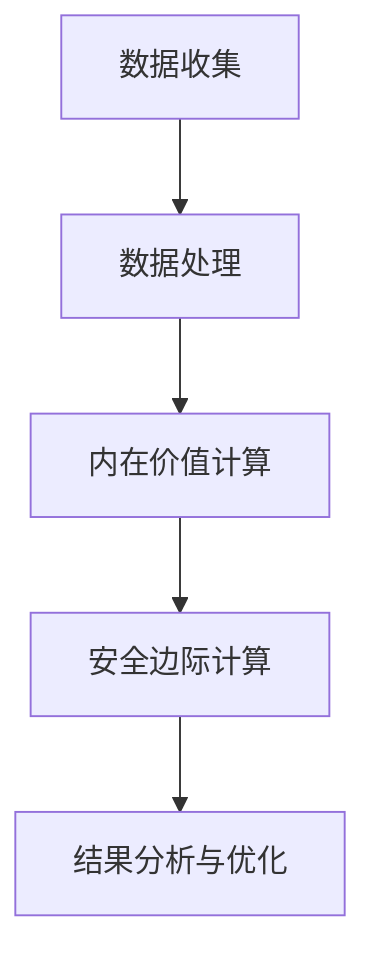
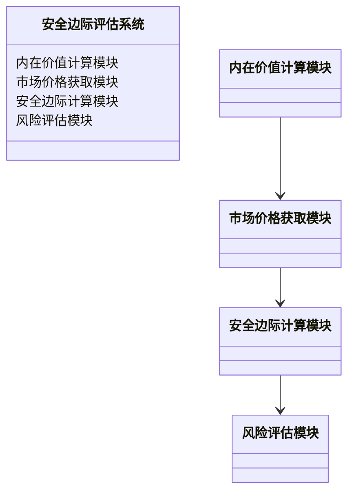
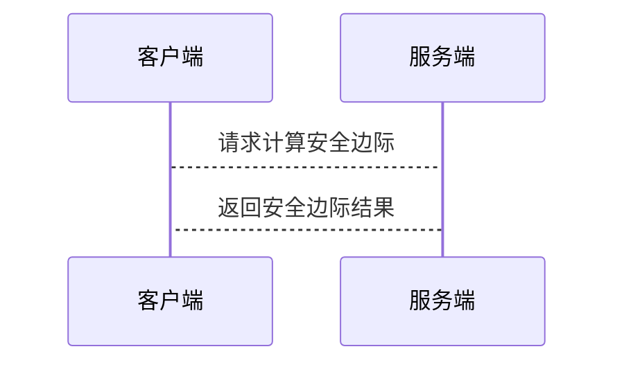

                 


---

# 格雷厄姆安全边际概念在极端市场事件中的应用

**关键词**：格雷厄姆、安全边际、投资策略、极端市场事件、风险管理

**摘要**：本文深入探讨了格雷厄姆提出的安全边际概念在应对极端市场事件中的应用。通过分析安全边际的定义、算法原理及其在投资决策中的重要性，结合实际案例，展示了如何在市场波动剧烈的情况下保护投资价值。

---

## 第一部分: 格雷厄姆安全边际概念的背景与基础

### 第1章: 安全边际概念的起源与发展

#### 1.1 格雷厄姆投资理论的概述

**1.1.1 价值投资的起源**

价值投资是一种以基本面分析为基础的投资策略，由本杰明·格雷厄姆在其著作《证券分析》中首次系统提出。格雷厄姆认为，市场的短期波动性使得股票价格往往偏离其内在价值，而这种波动为理性投资者提供了以低于内在价值的价格买入优质股票的机会。

**1.1.2 安全边际概念的提出**

安全边际是格雷厄姆投资理论中的核心概念之一。它是指股票的市场价格与其内在价值之间的差距。具体来说，当市场价格低于内在价值时，两者之间的差距即为安全边际。格雷厄姆认为，安全边际的存在为投资者提供了风险缓冲，能够在市场波动中保护投资本金。

**1.1.3 安全边际在投资中的重要性**

在投资过程中，安全边际的重要性体现在以下几个方面：
1. **风险控制**：通过预留安全边际，投资者能够在市场下跌时避免损失。
2. **长期收益**：安全边际较高的投资标的在长期表现中往往优于市场平均水平。
3. **心理因素**：安全边际为投资者提供了心理上的安全感，减少了情绪化决策的影响。

#### 1.2 市场波动与极端事件的背景

**1.2.1 市场波动的定义与特征**

市场波动是指股票价格或其他金融资产价格在短时间内出现大幅波动的现象。波动性是金融市场的一个基本特征，通常由市场参与者的预期变化、信息不对称、市场情绪等多种因素引起。波动性在极端市场事件中会显著放大，导致市场出现剧烈波动。

**1.2.2 极端市场事件的典型案例**

极端市场事件是指那些对金融市场产生重大影响的事件，通常伴随着市场崩盘、恐慌性抛售或流动性危机。典型的极端市场事件包括：
- **1929年大萧条**：美国股市崩盘，导致全球经济陷入衰退。
- **2008年全球金融危机**：由次级抵押贷款违约引发的全球性金融危机。
- **2020年新冠疫情冲击**：疫情爆发导致全球股市出现历史性暴跌。

**1.2.3 安全边际在极端事件中的应用价值**

在极端市场事件中，安全边际的重要性更加凸显。当市场出现恐慌性抛售时，许多股票的价格可能远低于其内在价值，此时具备较大安全边际的股票往往能够为投资者提供抄底的机会。此外，在市场底部区域，安全边际的存在为投资者提供了长期收益的潜力。

### 第2章: 安全边际的核心概念与数学模型

#### 2.1 安全边际的定义与属性

**2.1.1 安全边际的定义**

安全边际（Margin of Safety）是格雷厄姆提出的一个重要概念，指的是股票的市场价格与其内在价值之间的差距。具体来说，安全边际 = 内在价值 - 市场价格。当市场价格低于内在价值时，安全边际为正，表示投资标的具有抗跌能力。

**2.1.2 安全边际的属性特征对比表格**

以下是安全边际与其他相关概念的对比表格：

| 概念              | 定义                                                                 | 特性                     |
|-------------------|----------------------------------------------------------------------|--------------------------|
| 内在价值          | 股票未来现金流的现值，基于基本面分析计算得出。                             | 理论值，不随市场价格波动而变化。|
| 市场价格          | 当前市场上的股票交易价格，受市场情绪和供需关系影响。                       | 随市场波动频繁变化。     |
| 安全边际          | 内在价值与市场价格的差额，衡量投资标的的安全性。                           | 衡量投资风险的重要指标。 |

**2.1.3 核心概念的ER实体关系图**

以下是安全边际相关概念的ER实体关系图：

```mermaid
erd
    安全边际 <--- 关联关系 ---> 内在价值
    内在价值 <--- 属于关系 ---> 股票
    安全边际 <--- 关联关系 ---> 市场价格
```

#### 2.2 安全边际的数学模型与公式

**2.2.1 内在价值的计算公式**

内在价值（Intrinsic Value）是衡量一只股票真实价值的关键指标，通常通过现金流折现法（DCF）计算得出。公式如下：

$$ V = \frac{CF}{k} $$

其中：
- \( V \) 表示内在价值
- \( CF \) 表示未来现金流
- \( k \) 表示折现率

**2.2.2 安全边际的计算公式**

安全边际（Margin of Safety）的计算公式为：

$$ S = V - P $$

其中：
- \( S \) 表示安全边际
- \( V \) 表示内在价值
- \( P \) 表示市场价格

**2.2.3 核心概念的联系与对比**

以下是安全边际与其他风险管理策略的对比：

| 概念              | 定义                                                                 | 优缺点                     |
|-------------------|----------------------------------------------------------------------|--------------------------|
| 安全边际          | 通过预留价格与内在价值的差额来降低投资风险。                               | 能够在市场波动中提供保护，但需要准确估计内在价值。 |
| 多元化投资        | 通过投资不同资产或行业分散风险。                                           | 分散风险效果有限，无法完全消除系统性风险。       |
| 期权对冲          | 使用期权合约对冲特定资产的价格波动风险。                                   | 成本较高，且需要专业的金融知识。                  |

### 第3章: 安全边际的算法原理与实现

#### 3.1 安全边际评估的算法流程

以下是安全边际评估的算法流程：



#### 3.2 安全边际评估的Python源代码实现

以下是计算安全边际的Python代码示例：

```python
def calculate_intrinsic_value(cash_flows, discount_rate):
    return sum(cash_flows) / discount_rate

def calculate_margin_of_safety(intrinsic_value, price):
    return intrinsic_value - price

# 示例数据
cash_flows = [100, 150, 200]  # 假设未来现金流
discount_rate = 0.10           # 折现率
price = 100                    # 当前市场价格

# 计算内在价值
intrinsic_value = calculate_intrinsic_value(cash_flows, discount_rate)
print(f"内在价值: {intrinsic_value}")

# 计算安全边际
margin_of_safety = calculate_margin_of_safety(intrinsic_value, price)
print(f"安全边际: {margin_of_safety}")
```

#### 3.3 算法实现的数学模型与公式

以下是安全边际评估的数学模型：

$$ S = V - P $$

其中：
- \( S \) 是安全边际
- \( V \) 是内在价值
- \( P \) 是市场价格

---

## 第二部分: 安全边际在极端市场事件中的应用

### 第4章: 系统分析与架构设计

#### 4.1 问题场景介绍

在极端市场事件中，市场波动剧烈，许多股票价格可能会大幅偏离其内在价值。此时，安全边际的重要性更加凸显。投资者需要通过预留安全边际来避免过度风险。

#### 4.2 系统功能设计

以下是系统功能设计的领域模型：



#### 4.3 系统架构设计

以下是系统架构设计的架构图：


#### 4.4 系统接口设计

以下是系统接口设计的接口图：



### 第5章: 项目实战

#### 5.1 环境安装与配置

为了运行以下代码，您需要安装Python和相关的金融分析库：

```bash
pip install pandas numpy matplotlib
```

#### 5.2 核心代码实现

以下是计算安全边际的Python代码示例：

```python
import pandas as pd
import numpy as np

def calculate_margin_of_safety(data):
    data['内在价值'] = data['现金流'] / data['折现率']
    data['安全边际'] = data['内在价值'] - data['市场价格']
    return data

# 示例数据
data = pd.DataFrame({
    '现金流': [100, 150, 200],
    '折现率': [0.10, 0.10, 0.10],
    '市场价格': [100, 120, 80]
})

# 计算安全边际
result = calculate_margin_of_safety(data)
print(result)
```

#### 5.3 案例分析与解读

以下是案例分析的详细解读：

在2008年全球金融危机期间，许多股票的价格大幅下跌，内在价值与市场价格之间的差距显著扩大。此时，具备较大安全边际的股票往往能够为投资者提供抄底的机会。

---

## 第三部分: 最佳实践与小结

### 第6章: 最佳实践与注意事项

#### 6.1 小结

通过本文的分析，我们可以得出以下结论：
1. 安全边际是格雷厄姆投资理论中的核心概念，能够在极端市场事件中保护投资本金。
2. 在实际投资中，投资者需要准确估算股票的内在价值，并预留足够的安全边际。
3. 安全边际的计算需要结合市场实际情况，灵活调整。

#### 6.2 注意事项

在实际应用中，需要注意以下几点：
1. **内在价值的估算难度**：内在价值的计算需要依赖于对未来现金流的预测，这具有较大的不确定性。
2. **市场波动的影响**：在极端市场事件中，市场波动可能会影响安全边际的实际效果。
3. **组合投资的必要性**：单一投资标的的安全边际较高并不能完全消除投资风险，因此需要通过组合投资来分散风险。

#### 6.3 拓展阅读

推荐以下书籍和资源，供进一步学习：
- 《证券分析》——本杰明·格雷厄姆
- 《投资学》——威廉·夏普
- 国内外投资网站和论坛，如格雷厄姆投资俱乐部、雪球财经等。

---

**作者：AI天才研究院 & 禅与计算机程序设计艺术**

