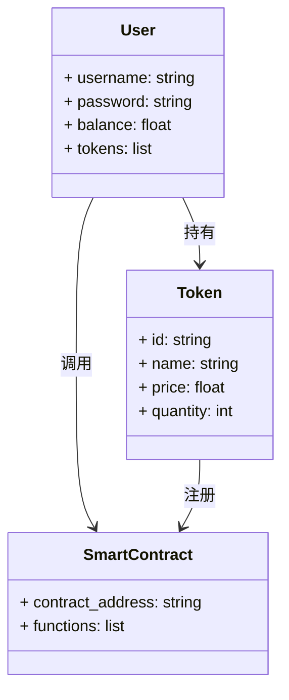

                 


# 《格雷厄姆特价股票理论在代币化证券中的运用》

> 关键词：格雷厄姆投资理论，特价股票，代币化证券，区块链技术，价值投资，安全边际

> 摘要：本文探讨了格雷厄姆价值投资理论在代币化证券中的应用，通过分析代币化证券的特点，结合格雷厄姆的安全边际和内在价值理论，提出了一种基于区块链技术的代币化证券价值评估方法，并通过具体案例和算法实现，展示了如何利用格雷厄姆理论在代币化证券市场中寻找投资机会。

---

# 第一章：背景介绍

## 1.1 传统股票市场的现状

传统股票市场是全球最重要的金融市场之一，承担着企业融资和投资者资产配置的重要功能。然而，传统股票市场存在信息不对称、交易成本高、监管复杂等问题，这些问题在一定程度上限制了投资者的收益。

## 1.2 代币化证券的概念与特点

代币化证券是将传统证券（如股票、债券等）以数字形式表示在区块链上的资产。与传统证券相比，代币化证券具有以下特点：

- **去中心化**：基于区块链技术，减少了对传统金融机构的依赖。
- **透明性**：区块链上的交易记录公开透明，易于追踪。
- **高效性**：通过智能合约实现自动化的发行、转让和结算，提高了交易效率。
- **可分割性**：数字代币可以分割成更小的单位，提高了资产的流动性。

## 1.3 格雷厄姆投资理论的起源

本杰明·格雷厄姆是价值投资的鼻祖，他的投资理念强调以低于内在价值的价格购买优质资产。格雷厄姆认为，市场先生是疯狂的，股票价格经常偏离其内在价值，投资者应该利用这种偏差进行投资。

## 1.4 代币化证券与格雷厄姆理论的结合

代币化证券的出现为格雷厄姆理论的应用提供了新的机会。通过区块链技术，投资者可以更方便地获取代币化证券的实时信息，计算其内在价值和安全边际，从而发现被市场低估的投资机会。

---

# 第二章：格雷厄姆理论的核心概念与代币化证券的联系

## 2.1 格雷厄姆理论的核心要素

### 2.1.1 安全边际

安全边际是指股票的市场价格与其内在价值之间的差距。格雷厄姆认为，投资者应该以低于内在价值的价格购买股票，这个差距就是安全边际。

### 2.1.2 内在价值

内在价值是股票本身的价值，与市场波动无关。格雷厄姆认为，内在价值可以通过对公司财务状况的分析来估算。

### 2.1.3 股息率

股息率高的股票具有较高的投资价值，因为它们能够为投资者提供稳定的现金流。

## 2.2 代币化证券的核心属性

### 2.2.1 区块链技术的应用

代币化证券基于区块链技术，确保了交易的透明性和安全性。

### 2.2.2 智能合约

智能合约可以自动执行代币的发行、转让和结算，降低了交易成本和时间。

### 2.2.3 分布式账本

区块链的分布式账本技术确保了代币化证券的记录不可篡改，提高了信任度。

## 2.3 核心概念对比分析

### 2.3.1 代币化证券与传统证券的核心要素对比

| **核心要素**       | **传统证券**           | **代币化证券**          |
|--------------------|-----------------------|------------------------|
| 交易媒介           | 纸质或电子证书         | 数字代币               |
| 交易场所           | 交易所或经纪商         | 区块链网络             |
| 交易成本           | 高                   | 低                     |
| 透明度             | 低                   | 高                     |
| 所有权证明         | 中央机构记录           | 区块链记录             |

### 2.3.2 格雷厄姆理论中的核心概念与代币化证券的结合

格雷厄姆理论中的内在价值和安全边际概念在代币化证券中仍然适用。由于代币化证券的透明性和高效性，投资者可以更方便地计算内在价值和安全边际，从而发现投资机会。

---

# 第三章：格雷厄姆理论在代币化证券中的算法实现

## 3.1 安全边际计算算法

### 3.1.1 安全边际计算的步骤

1. 计算股票的内在价值。
2. 确定市场的价格。
3. 计算安全边际 = 内在价值 - 市场价格。

### 3.1.2 安全边际计算的公式

$$ \text{安全边际} = \text{内在价值} - \text{市场价格} $$

### 3.1.3 Python实现

```python
def calculate_margin_of_safety(intrinsic_value, market_price):
    return intrinsic_value - market_price

# 示例
intrinsic_value = 100  # 内在价值
market_price = 80      # 市场价格
margin_of_safety = calculate_margin_of_safety(intrinsic_value, market_price)
print("安全边际 =", margin_of_safety)
```

## 3.2 内在价值计算算法

### 3.2.1 内在价值计算的步骤

1. 分析公司的财务状况。
2. 估算公司的未来现金流。
3. 使用适当的折现率计算内在价值。

### 3.2.2 内在价值计算的公式

$$ \text{内在价值} = \frac{\text{未来现金流}}{\text{折现率}} $$

### 3.2.3 Python实现

```python
def calculate_intrinsic_value(future_cash_flow, discount_rate):
    return future_cash_flow / discount_rate

# 示例
future_cash_flow = 200  # 未来现金流
discount_rate = 0.1      # 折现率
intrinsic_value = calculate_intrinsic_value(future_cash_flow, discount_rate)
print("内在价值 =", intrinsic_value)
```

---

# 第四章：格雷厄姆理论的数学模型与代币化证券的结合

## 4.1 内在价值的数学模型

$$ \text{内在价值} = \sum_{t=1}^{n} \frac{\text{现金流}_t}{(1 + r)^t} $$

其中，\( r \) 是折现率，\( \text{现金流}_t \) 是第 \( t \) 年的现金流。

## 4.2 安全边际的数学模型

$$ \text{安全边际} = \text{内在价值} - \text{市场价格} $$

## 4.3 代币化证券的数学模型

代币化证券的内在价值可以通过以下公式计算：

$$ \text{内在价值} = \frac{\text{未来现金流}}{\text{折现率}} $$

其中，未来现金流可以通过智能合约自动计算。

---

# 第五章：代币化证券的系统架构设计

## 5.1 系统功能设计

### 5.1.1 系统功能模块

1. 用户身份验证模块
2. 代币发行模块
3. 代币转让模块
4. 智能合约执行模块
5. 数据查询模块

### 5.1.2 功能模块之间的关系

通过Mermaid类图展示：



## 5.2 系统架构设计

通过Mermaid架构图展示：


---

# 第六章：项目实战

## 6.1 环境安装

### 6.1.1 安装区块链平台

选择以太坊平台，安装Ganache、Solidity和Web3.js。

## 6.1.2 安装Python环境

安装Python 3.8及以上版本，安装Jupyter Notebook。

## 6.2 核心实现

### 6.2.1 智能合约实现

使用Solidity编写代币化证券的智能合约：

```solidity
pragma solidity ^0.8.0;

contract Token {
    string public name = "Digital Security Token";
    uint256 public price = 1;
    uint256 public supply = 0;

    function buy() public payable {
        require(msg.value >= price, "价格不足");
        supply++;
        transfer(msg.sender, 1);
    }

    function transfer(address to, uint amount) private {
        // 转账逻辑
    }
}
```

### 6.2.2 安全边际计算实现

使用Python编写安全边际计算函数：

```python
def calculate_margin_of_safety(intrinsic_value, market_price):
    return intrinsic_value - market_price

# 示例
intrinsic_value = 100  # 内在价值
market_price = 80      # 市场价格
margin_of_safety = calculate_margin_of_safety(intrinsic_value, market_price)
print("安全边际 =", margin_of_safety)
```

## 6.3 案例分析

### 6.3.1 案例背景

假设有一个代币化证券ABC，其内在价值为100，市场价格为80。

### 6.3.2 计算安全边际

安全边际 = 100 - 80 = 20。

### 6.3.3 结论

由于安全边际为20，大于0，说明该代币被市场低估，具有投资价值。

---

# 第七章：总结与展望

## 7.1 本章小结

本文探讨了格雷厄姆投资理论在代币化证券中的应用，提出了基于区块链技术的安全边际计算方法，并通过具体案例展示了其可行性。

## 7.2 未来展望

随着区块链技术的不断发展，代币化证券将越来越普及。未来的研究可以进一步探索智能合约在价值评估中的应用，以及如何利用大数据技术提高内在价值的计算精度。

## 7.3 注意事项

在实际应用中，投资者需要综合考虑市场风险、流动性风险等多种因素，确保投资决策的科学性和安全性。

## 7.4 拓展阅读

推荐阅读格雷厄姆的《 Intelligent Investor》和《区块链：新经济蓝图及对未来的设想》。

---

作者：AI天才研究院/AI Genius Institute & 禅与计算机程序设计艺术 /Zen And The Art of Computer Programming

