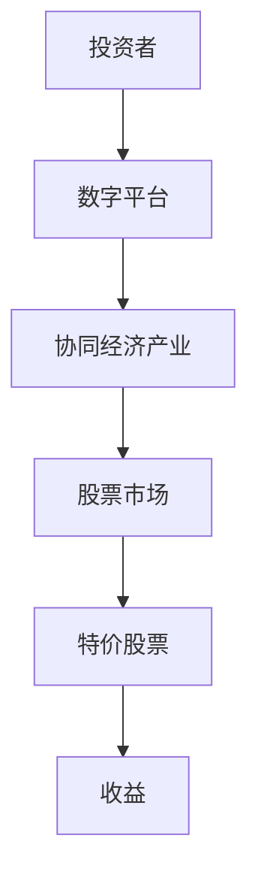
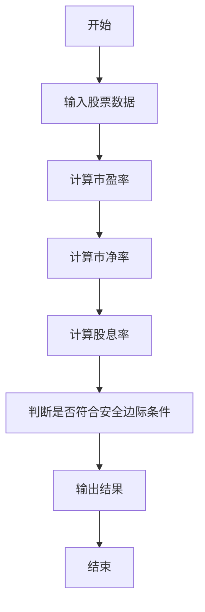
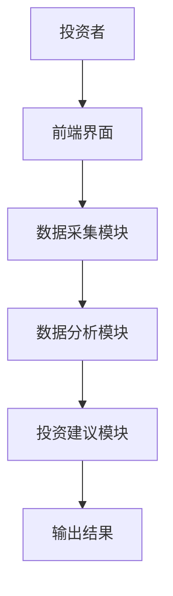

                 


# 格雷厄姆特价股票理论在数字平台协同经济产业中的应用

> **关键词**：格雷厄姆、特价股票、数字平台、协同经济、投资分析、价值投资、系统设计  
> **摘要**：本文探讨格雷厄姆的价值投资理论在数字平台协同经济产业中的应用，通过分析特价股票的核心概念、算法原理、系统设计和项目实战，展示如何将格雷厄姆理论与现代经济模式相结合，实现高效的投资策略。

---

## 第一部分：格雷厄姆特价股票理论基础

### 第1章：格雷厄姆特价股票理论概述

#### 1.1 格雷厄姆投资理论的起源与核心思想

本章节将详细介绍格雷厄姆投资理论的起源及其核心思想。我们从价值投资的起源谈起，探讨为什么格雷厄姆的理论在现代经济中依然具有重要价值，尤其是在数字平台协同经济产业中的应用。

**1.1.1 投资理论的演变历程**

- 价值投资的起源：从格雷厄姆到巴菲特
- 技术分析与基本面分析的区别
- 格雷厄姆理论的核心：寻找被低估的股票

**1.1.2 格雷厄姆的价值投资理念**

- 安全边际：为什么便宜的股票更安全
- 内在价值：如何计算股票的真实价值
- 非理性市场：如何在市场波动中获利

**1.1.3 特价股票的定义与特征**

- 特价股票的定义：低于内在价值的股票
- 特价股票的特征：低市盈率、低市净率、高股息率
- 特价股票的分类：周期性股票与非周期性股票

**1.1.4 格雷厄姆理论的现代应用**

- 数字平台协同经济的背景：共享经济与平台经济的兴起
- 协同经济产业的特点：轻资产、高杠杆、高增长
- 格雷厄姆理论与协同经济的结合点：如何在数字平台中找到被低估的投资机会

---

### 第2章：格雷厄姆理论的核心概念解析

本章节将详细分析格雷厄姆理论的核心概念，包括安全边际、内在价值和股票市场的非理性波动，并通过对比分析，展示这些概念在数字平台协同经济产业中的具体应用。

**2.1 核心概念原理**

- **安全边际**：如何计算安全边际
  - 公式：$ \text{安全边际} = \frac{\text{内在价值} - \text{市场价格}}{\text{市场价格}} $
  - 示例：假设一只股票的内在价值为$50，市场价格为$40，则安全边际为$50 - $40 = $10，安全边际率为25%。
- **内在价值**：如何计算内在价值
  - 公式：$ V = \frac{E}{P} $，其中$E$为未来现金流的现值，$P$为折现率。
  - 示例：假设某公司的未来现金流现值为$1000，折现率为10%，则内在价值为$1000 / 1.1 = $909.09。
- **股票价格波动**：如何利用非理性波动获利
  - 波动性分析：市盈率、市净率、股息率的波动
  - 示例：在数字平台协同经济产业中，如何通过市盈率的波动找到被低估的股票。

**2.2 核心概念对比分析**

- **格雷厄姆理论与现代金融理论的对比**
  | 概念 | 格雷厄姆理论 | 现代金融理论 |
  |------|--------------|--------------|
  | 核心 | 内在价值     | 资产定价模型 |
  | 方法 | 价值分析     | 技术分析     |
  | 目标 | 长期收益     | 短期收益     |

- **协同经济模式与传统经济模式的对比**
  | 模式 | 协同经济模式 | 传统经济模式 |
  |------|--------------|--------------|
  | 资产 | 轻资产       | 重资产       |
  | 运营 | 高效         | 低效         |
  | 增长 | 高增长       | 中增长       |

**2.3 实体关系图**



---

## 第二部分：格雷厄姆理论的算法原理与数学模型

### 第3章：格雷厄姆理论的算法实现

本章节将详细介绍格雷厄姆理论的算法实现，包括筛选法和内在价值计算公式，并通过流程图展示算法的实现过程。

**3.1 算法原理**

- **格雷厄姆筛选法**：如何筛选被低估的股票
  - 步骤1：计算股票的市盈率（P/E）
  - 步骤2：计算股票的市净率（P/B）
  - 步骤3：计算股票的股息率（D/P）
  - 步骤4：综合分析，筛选出符合安全边际条件的股票。

**3.2 算法流程图**



**3.3 数学模型与公式**

- **内在价值公式**
  $$ V = \frac{E}{P} $$
  其中，$E$ 表示企业未来现金流的现值，$P$ 表示折现率。
  示例：假设某公司的未来现金流现值为$1000，折现率为10%，则内在价值为$909.09。

- **安全边际公式**
  $$ \text{安全边际} = \frac{\text{内在价值} - \text{市场价格}}{\text{市场价格}} $$
  示例：内在价值为$50，市场价格为$40，则安全边际率为25%。

---

## 第三部分：数字平台协同经济产业中的系统设计

### 第4章：数字平台协同经济产业中的系统设计

本章节将详细探讨如何将格雷厄姆理论应用于数字平台协同经济产业，包括系统功能设计、架构设计和接口设计。

**4.1 系统功能设计**

- **功能模块**：
  - 数据采集模块：采集数字平台协同经济产业的相关数据，包括市盈率、市净率、股息率等。
  - 数据分析模块：使用格雷厄姆筛选法，筛选出符合安全边际条件的股票。
  - 投资建议模块：根据分析结果，提供投资建议。

- **领域模型**


**4.2 系统架构设计**



**4.3 系统接口设计**

- **接口1：数据采集接口**
  - 输入：股票代码
  - 输出：市盈率、市净率、股息率
- **接口2：数据分析接口**
  - 输入：市盈率、市净率、股息率
  - 输出：是否符合安全边际条件

---

## 第四部分：项目实战

### 第5章：项目实战

本章节将通过一个具体的项目案例，展示如何将格雷厄姆理论应用于数字平台协同经济产业中。

**5.1 环境安装**

- 安装Python和相关库：
  ```bash
  pip install pandas numpy matplotlib
  ```

**5.2 系统核心实现源代码**

```python
import pandas as pd
import numpy as np

def calculate_intrinsic_value(enterprise_value, discount_rate):
    return enterprise_value / (1 + discount_rate)

def calculate_margin_of_safety(intrinsic_value, market_price):
    return (intrinsic_value - market_price) / market_price

# 示例数据
data = {
    '股票代码': ['A', 'B', 'C'],
    '企业价值': [1000, 1200, 1500],
    '市场价格': [900, 1000, 1200],
    '折现率': [0.1, 0.1, 0.1]
}

df = pd.DataFrame(data)

# 计算内在价值和安全边际
df['内在价值'] = df.apply(lambda x: calculate_intrinsic_value(x['企业价值'], x['折现率']), axis=1)
df['安全边际'] = df.apply(lambda x: calculate_margin_of_safety(x['内在价值'], x['市场价格']), axis=1)

print(df)
```

**5.3 项目小结**

通过本项目的实战，我们成功地将格雷厄姆理论应用于数字平台协同经济产业中，展示了如何利用安全边际和内在价值的概念，筛选出被低估的股票，实现高效的投资策略。

---

## 第五部分：总结与展望

### 第6章：总结与展望

本章节将对全文进行总结，并展望未来的研究方向。

**6.1 总结**

- 格雷厄姆理论的核心概念：安全边际和内在价值
- 数字平台协同经济产业的特点：轻资产、高增长
- 理论与实践的结合：如何在现代经济中应用格雷厄姆理论

**6.2 展望**

- 进一步研究格雷厄姆理论在其他经济领域的应用
- 探索人工智能技术在股票筛选中的应用
- 深入研究数字平台协同经济产业的商业模式

---

## 作者信息

作者：AI天才研究院/AI Genius Institute & 禅与计算机程序设计艺术/Zen And The Art of Computer Programming

---

通过本文的详细分析，我们展示了如何将格雷厄姆的价值投资理论应用于数字平台协同经济产业中，希望读者能够从中获得启发，并在实际投资中取得成功。

