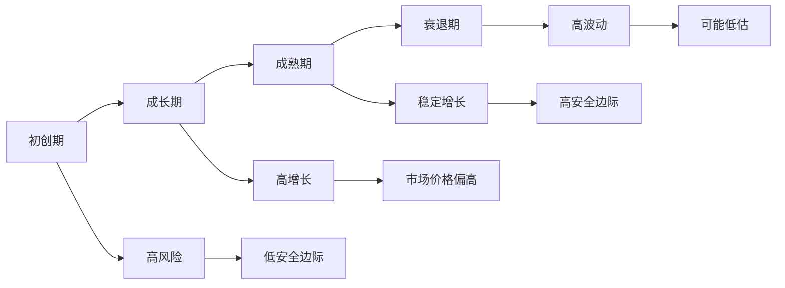

                 


# 格雷厄姆特价股票策略在不同公司生命周期阶段的效果

> 关键词：格雷厄姆策略，特价股票，公司生命周期，价值投资，内在价值

> 摘要：本文系统分析了格雷厄姆特价股票策略在不同公司生命周期阶段的效果。通过理论分析、数学模型构建、系统设计和实际案例研究，深入探讨了格雷厄姆策略在初创期、成长期、成熟期和衰退期的应用效果及投资价值。结合价值投资的核心理念，本文提供了详细的策略实施方法和实际操作建议，帮助投资者更好地理解和应用格雷厄姆策略。

---

## 第1章: 价值投资与格雷厄姆策略概述

### 1.1 价值投资的起源与发展

#### 1.1.1 价值投资的核心理念
价值投资是一种以公司内在价值为导向的投资策略，强调以低于内在价值的价格购买优质资产。这一理念由本杰明·格雷厄姆和戴维·多德在20世纪初提出，成为现代投资理论的重要基石。

- **内在价值**：指一家公司基于其财务状况、盈利能力和发展前景所具有的真实价值，与市场波动无关。
- **安全边际**：指买入价格与内在价值之间的差距，确保投资的安全性和盈利能力。

#### 1.1.2 格雷厄姆的投资理论基础
格雷厄姆的价值投资理论强调以下几点：
- **安全边际**：买入价格低于内在价值，确保投资的安全性。
- **市场波动**：市场价格围绕内在价值波动，投资者应利用这种波动获利。
- **逆向投资**：在市场恐慌时买入，在市场狂热时卖出。

#### 1.1.3 格雷厄姆策略在现代投资中的地位
格雷厄姆策略是价值投资的鼻祖，其核心思想影响了巴菲特、彼得·林奇等投资大师。尽管现代投资理论不断发展，但格雷厄姆策略在寻找低估股票方面仍具有重要的现实意义。

---

### 1.2 特价股票的定义与特征

#### 1.2.1 特价股票的定义
特价股票指的是市场价格低于其内在价值的股票，通常具有以下特征：
- **低市盈率（P/E）**：市盈率低于行业平均水平。
- **低市净率（P/B）**：市净率低于行业平均水平。
- **高股息率**：股息收益率较高，通常高于行业平均水平。

#### 1.2.2 特价股票的市场特征
- **市场低估**：通常出现在市场低迷或公司处于困境时期。
- **高波动性**：价格波动较大，但具有较大的上涨空间。
- **投资者情绪**：市场恐慌时更容易出现特价股票。

#### 1.2.3 特价股票与公司生命周期的关系
特价股票往往出现在公司生命周期的初创期和衰退期，因为这些阶段公司面临较大的经营压力和市场波动，导致市场价格被低估。

---

## 第2章: 公司生命周期阶段划分

### 2.1 公司生命周期的四个阶段

#### 2.1.1 初创期：公司成立与市场探索
- **特征**：公司刚刚成立，业务模式尚未成熟，市场地位不稳定。
- **财务特征**：收入较低，亏损可能较大，但增长潜力高。

#### 2.1.2 成长期：业务扩张与市场渗透
- **特征**：公司业务迅速扩张，市场份额逐步扩大。
- **财务特征**：收入增长快，净利润逐步转正，现金流逐渐改善。

#### 2.1.3 成熟期：稳定增长与市场领导地位
- **特征**：公司在行业内占据领导地位，业务增长稳定。
- **财务特征**：收入和利润稳定增长，现金流充裕。

#### 2.1.4 衰退期：业务收缩与价值重构
- **特征**：公司业务增长放缓，市场份额被竞争对手蚕食。
- **财务特征**：收入和利润下降，现金流可能为负。

---

### 2.2 不同阶段公司的财务特征对比

#### 2.2.1 初创期公司的财务特征
- **收入**：低且不稳定。
- **利润**：可能持续亏损。
- **现金流**：通常为负，依赖外部融资。

#### 2.2.2 成长期公司的财务特征
- **收入**：快速增长。
- **利润**：逐步转正，但可能不稳定。
- **现金流**：逐渐改善，但仍可能依赖外部融资。

#### 2.2.3 成熟期公司的财务特征
- **收入**：稳定增长。
- **利润**：稳定且较高。
- **现金流**：充裕，能够支持股息支付和再投资。

#### 2.2.4 衰退期公司的财务特征
- **收入**：下降。
- **利润**：可能为负，甚至出现亏损。
- **现金流**：可能为负，公司可能需要裁员或出售资产。

---

## 第3章: 格雷厄姆策略与公司生命周期的核心概念

### 3.1 格雷厄姆策略的核心原理

#### 3.1.1 格雷厄姆的内在价值计算方法
内在价值是通过分析公司的财务报表和行业地位来估算的。格雷厄姆的内在价值计算公式为：
$$
\text{内在价值} = \text{息税前利润} \times \text{合理市盈率}
$$
其中，合理市盈率通常取4.5至7倍。

#### 3.1.2 格雷厄姆的安全边际概念
安全边际是买入价格与内在价值之间的差距：
$$
\text{安全边际} = \text{内在价值} - \text{买入价格}
$$
格雷厄姆建议安全边际至少为内在价值的50%。

#### 3.1.3 格雷厄姆策略与市场周期的关系
格雷厄姆策略强调逆向投资，即在市场低迷时买入，在市场繁荣时卖出。

---

### 3.2 公司生命周期与格雷厄姆策略的关联

#### 3.2.1 不同阶段公司的投资价值评估
- **初创期**：由于风险高，格雷厄姆策略通常不建议投资。
- **成长期**：公司增长潜力大，但市场价格可能偏高。
- **成熟期**：公司盈利稳定，适合格雷厄姆策略。
- **衰退期**：公司可能面临重组，市场价格被低估，适合格雷厄姆策略。

#### 3.2.2 生命周期阶段对格雷厄姆策略的影响
- **初创期**：高风险，低安全边际。
- **成长期**：高增长，但市场价格可能高于内在价值。
- **成熟期**：低风险，高安全边际。
- **衰退期**：高风险，但可能有较高的安全边际。

#### 3.2.3 格雷厄姆策略在不同阶段的应用效果对比
- **初创期**：效果较差，风险较高。
- **成长期**：效果一般，需要谨慎选择。
- **成熟期**：效果最佳，风险较低。
- **衰退期**：效果较好，但需要关注公司重组风险。

---

### 3.3 格雷厄姆策略与公司生命周期的关联图



---

## 第4章: 格雷厄姆策略的数学模型与算法

### 4.1 内在价值计算公式

$$
\text{内在价值} = \text{净利润} \times (4.5 \sim 7)
$$

### 4.2 安全边际计算公式

$$
\text{安全边际} = \text{内在价值} - \text{买入价格}
$$

### 4.3 格雷厄姆策略的应用流程


---

## 第5章: 系统分析与架构设计方案

### 5.1 问题场景介绍
本系统旨在帮助投资者基于格雷厄姆策略在不同公司生命周期阶段中选择特价股票。

### 5.2 系统功能设计

#### 5.2.1 数据收集模块
- 采集公司财务数据和市场数据。

#### 5.2.2 数据分析模块
- 计算内在价值和安全边际。
- 评估公司生命周期阶段。

#### 5.2.3 策略匹配模块
- 根据公司生命周期阶段匹配格雷厄姆策略。

### 5.3 系统架构设计


---

## 第6章: 项目实战

### 6.1 环境安装
- Python 3.8+
- Pandas, NumPy, Matplotlib

### 6.2 核心代码实现

```python
import pandas as pd
import numpy as np

def calculate_intrinsic_value(net_profit, pe_ratio):
    return net_profit * pe_ratio

def calculate_margin_of_safety(intrinsic_value, market_price):
    return intrinsic_value - market_price

# 示例数据
data = {
    '公司名称': ['公司A', '公司B', '公司C'],
    '净利润': [100, 200, 150],
    '市盈率': [5, 6, 4],
    '市场价格': [400, 600, 300]
}

df = pd.DataFrame(data)

df['内在价值'] = df.apply(lambda x: calculate_intrinsic_value(x['净利润'], x['市盈率']), axis=1)
df['安全边际'] = df.apply(lambda x: calculate_margin_of_safety(x['内在价值'], x['市场价格']), axis=1)

print(df)
```

---

## 第7章: 最佳实践与小结

### 7.1 投资建议
- **长期持有**：格雷厄姆策略强调长期投资。
- **分散投资**：避免过度集中。
- **风险管理**：设置止损点。

### 7.2 小结
格雷厄姆策略在不同公司生命周期阶段的效果各异，投资者需结合公司所处阶段和市场环境灵活运用。

---

作者：AI天才研究院/AI Genius Institute & 禅与计算机程序设计艺术 /Zen And The Art of Computer Programming

