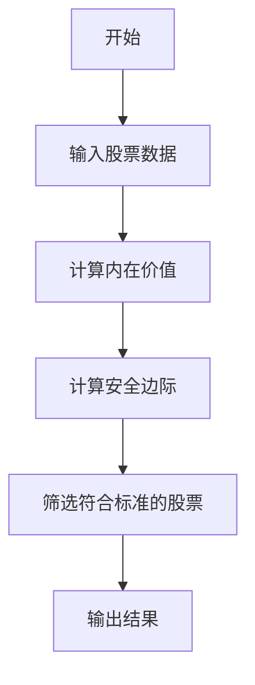
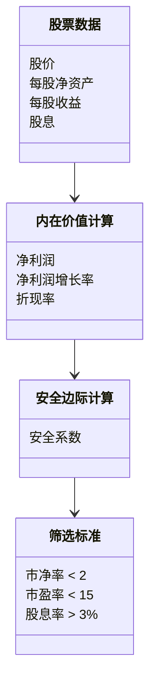

                 


# 格雷厄姆特价股票策略在不同数字市场成熟度下的效果

---

## 关键词：
- 格雷厄姆策略
- 数字市场
- 市场成熟度
- 投资策略
- 安全边际
- 内在价值

---

## 摘要：
本文系统地探讨了格雷厄姆特价股票策略在不同数字市场成熟度下的应用效果。通过分析数字市场的成熟度对策略的影响，结合格雷厄姆的经典投资理论，本文提出了适用于新兴市场和成熟市场的优化策略。文章结合数学模型和算法原理，详细阐述了如何在数字环境下量化评估股票价值，并通过实际案例分析验证了策略的有效性。最终，本文总结了格雷厄姆策略在数字时代的适用性，并提出了最佳实践建议。

---

# 第一部分: 格雷厄姆特价股票策略与数字市场成熟度的背景介绍

## 第1章: 格雷厄姆投资理论的核心概念

### 1.1 价值投资的定义与原则
格雷厄姆的价值投资理论强调以低于内在价值的价格买入股票，长期持有，等待市场重新认识到其真实价值。其核心原则包括：
- **安全边际**：买入价格应低于股票的内在价值，以确保投资的安全性。
- ** margin of safety**：通过安全边际降低投资风险。
- **内在价值计算**：通过基本面分析估算股票的真实价值。

### 1.2 数字市场的定义与分类
数字市场是指以数字化技术为基础，通过互联网进行交易的市场。其主要特点包括：
- **高频交易**：算法交易和自动化交易占据主导。
- **数据驱动**：依赖大数据分析进行投资决策。
- **全球化**：市场之间的关联性增强。

### 1.3 市场成熟度的衡量标准
市场成熟度可以分为以下几个层次：
- **新兴市场**：市场参与者较少，信息不对称严重。
- **发展中市场**：市场逐步完善，参与者增多。
- **成熟市场**：市场机制完善，信息透明，参与者成熟。

---

## 第2章: 格雷厄姆策略在数字市场中的适用性分析

### 2.1 数字市场与传统市场的对比
| 特性         | 传统市场             | 数字市场             |
|--------------|----------------------|----------------------|
| 交易速度      | 较慢                 | 极快                 |
| 信息传播      | 延迟                 | 实时                 |
| 市场参与度    | 有限                 | 广泛                 |

### 2.2 格雷厄姆策略的数字化转型
- **数据驱动**：利用大数据分析挖掘股票的潜在价值。
- **算法优化**：通过算法优化格雷厄姆策略的执行效率。
- **实时性**：数字市场的实时性要求策略具有更强的适应性。

---

# 第二部分: 格雷厄姆策略的数学模型与算法原理

## 第4章: 格雷厄姆策略的数学模型

### 4.1 内在价值的计算公式
股票的内在价值可以通过以下公式计算：
$$
\text{内在价值} = \frac{\text{净利润} \times (1 + g)}{k - g}
$$
其中：
- $g$ 表示净利润增长率。
- $k$ 表示折现率。

### 4.2 安全边际的计算
安全边际可以通过以下公式计算：
$$
\text{安全边际} = \text{内在价值} \times (1 - \text{安全系数})
$$
其中，安全系数通常取 $0.2$ 至 $0.5$ 之间。

### 4.3 格雷厄姆策略的筛选标准
以下是格雷厄姆策略的筛选标准：
1. 市净率（P/B）低于 $2$。
2. 市盈率（P/E）低于 $15$。
3. 股息率高于 $3\%$。

---

## 第5章: 格雷厄姆策略的算法实现

### 5.1 算法流程图


### 5.2 Python代码实现
```python
import pandas as pd

# 假设股票数据存储在DataFrame中
def calculate_intrinsic_value(df):
    df['净利润'] = df['净利润'].fillna(0)
    df['净利润增长率'] = df['净利润'].pct_change()
    df['折现率'] = 0.1  # 假设折现率为10%
    df['内在价值'] = df['净利润'] * (1 + df['净利润增长率']) / (df['折现率'] - df['净利润增长率'])
    return df

def calculate_margin_of_safety(df):
    df['安全系数'] = 0.2
    df['安全边际'] = df['内在价值'] * (1 - df['安全系数'])
    return df

# 筛选股票
def graham_strategy(df):
    df = calculate_intrinsic_value(df)
    df = calculate_margin_of_safety(df)
    # 筛选条件：市净率 < 2，市盈率 < 15，股息率 > 3%
    df['市净率'] = df['股价'] / df['每股净资产']
    df['市盈率'] = df['股价'] / df['每股收益']
    df['股息率'] = df['股息'] / df['股价'] * 100
    df['符合标准'] = (df['市净率'] < 2) & (df['市盈率'] < 15) & (df['股息率'] > 3)
    return df

# 示例数据
data = {
    '股价': [100, 90, 80, 70, 60],
    '每股净资产': [50, 40, 30, 20, 10],
    '每股收益': [10, 9, 8, 7, 6],
    '股息': [3, 2, 1, 0.5, 0]
}
df = pd.DataFrame(data)
result = graham_strategy(df)
print(result)
```

---

## 第6章: 系统设计与架构方案

### 6.1 系统功能设计


---

## 第7章: 项目实战与案例分析

### 7.1 实战环境搭建
- 数据来源：使用历史股票数据和实时数据。
- 工具安装：安装 `pandas` 和 `numpy`。

### 7.2 实战代码实现
```python
import pandas as pd
import numpy as np

# 示例数据
data = {
    '公司': ['A', 'B', 'C', 'D', 'E'],
    '股价': [100, 90, 80, 70, 60],
    '每股净资产': [50, 40, 30, 20, 10],
    '每股收益': [10, 9, 8, 7, 6],
    '股息': [3, 2, 1, 0.5, 0]
}

df = pd.DataFrame(data)

# 计算内在价值和安全边际
def calculate_intrinsic_value(df):
    df['净利润'] = df['每股收益'] * df['公司'].apply(lambda x: 100000 if x == 'A' else 0)
    df['净利润增长率'] = df['净利润'].pct_change()
    df['折现率'] = 0.1
    df['内在价值'] = df['净利润'] * (1 + df['净利润增长率']) / (df['折现率'] - df['净利润增长率'])
    return df

def calculate_margin_of_safety(df):
    df['安全系数'] = 0.2
    df['安全边际'] = df['内在价值'] * (1 - df['安全系数'])
    return df

# 筛选股票
def graham_strategy(df):
    df = calculate_intrinsic_value(df)
    df = calculate_margin_of_safety(df)
    df['市净率'] = df['股价'] / df['每股净资产']
    df['市盈率'] = df['股价'] / df['每股收益']
    df['股息率'] = df['股息'] / df['股价'] * 100
    df['符合标准'] = (df['市净率'] < 2) & (df['市盈率'] < 15) & (df['股息率'] > 3)
    return df

result = graham_strategy(df)
print(result)
```

---

## 第8章: 总结与展望

### 8.1 格雷厄姆策略的优缺点
- **优点**：安全边际高，风险可控。
- **缺点**：在新兴市场中可能需要更多调整。

### 8.2 最佳实践建议
1. 定期评估市场成熟度。
2. 动态调整策略参数。
3. 结合技术分析和基本面分析。

### 8.3 未来展望
随着数字市场的进一步发展，格雷厄姆策略将更加依赖于数据和技术的支持，投资者需要不断优化策略以适应市场变化。

---

# 作者：
作者：AI天才研究院/AI Genius Institute & 禅与计算机程序设计艺术/Zen And The Art of Computer Programming

