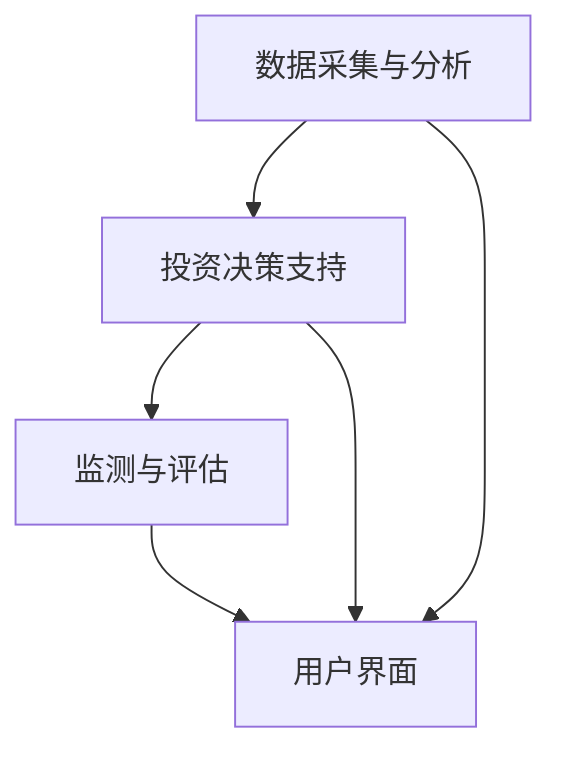

                 


# 海洋生态系统保护的经济价值与投资策略

## 关键词：海洋生态系统、经济价值、投资策略、环境保护、可持续发展

## 摘要：海洋生态系统是地球上最重要的生态系统之一，它不仅为人类提供了丰富的资源，还承担着调节气候、维持生物多样性等重要功能。然而，随着人类活动的加剧，海洋生态系统正面临前所未有的威胁。本文将从经济价值的角度出发，分析海洋生态系统的保护需求，并提出可行的投资策略，为实现海洋生态系统的可持续发展提供理论支持和实践指导。

---

# 第一部分: 海洋生态系统保护的背景与核心概念

## 第1章: 海洋生态系统保护的背景与问题背景

### 1.1 海洋生态系统的基本概念

#### 1.1.1 海洋生态系统的定义
海洋生态系统是由海洋生物群落及其所处的非生物环境（如水、底质、光线等）共同构成的动态系统。它包括从浅海区域到深海盆地的多种生态系统类型，如珊瑚礁、红树林、海草床、海藻场等。

#### 1.1.2 海洋生态系统的组成要素
海洋生态系统由以下几个核心要素组成：
- **生物要素**：包括浮游生物、底栖生物、鱼类、海洋哺乳动物等。
- **非生物要素**：包括水体、温度、盐度、光照、营养盐等。
- **人类活动**：如渔业捕捞、旅游开发、工业排放等。

#### 1.1.3 海洋生态系统的功能与服务
海洋生态系统通过提供生态服务（如氧气生产、碳封存、水循环调节）和直接资源（如渔业资源、能源资源）为人类社会创造了巨大的经济价值。

### 1.2 海洋生态系统保护的必要性

#### 1.2.1 当前海洋生态系统面临的主要问题
- **海洋污染**：工业废水、塑料垃圾、化学污染物对海洋生态系统的破坏。
- **过度捕捞**：导致鱼类资源枯竭，破坏海洋食物链。
- **栖息地破坏**：沿海开发、海底采掘等活动破坏了海洋生物的栖息地。
- **气候变化**：海水酸化、海平面上升对海洋生态系统的影响。

#### 1.2.2 海洋生态系统退化的经济与生态影响
- **生态影响**：生物多样性的减少可能导致海洋食物链的崩溃，影响整个生态系统的稳定性。
- **经济影响**：海洋生态系统的退化会降低其经济价值，如渔业产量下降、旅游收入减少。

#### 1.2.3 全球气候变化对海洋生态系统的影响
- **海水酸化**：二氧化碳的增加导致海洋酸化，影响珊瑚礁等海洋生物的生长。
- **海平面上升**：威胁沿海生态系统，如红树林、盐沼等。
- **海洋暖化**：影响海洋生物的分布和迁徙，进而影响整个生态系统的平衡。

### 1.3 问题背景与问题描述

#### 1.3.1 海洋生态系统保护的核心问题
- 如何在保护海洋生态系统的同时，实现资源的可持续利用。
- 如何量化海洋生态系统的经济价值，为保护决策提供科学依据。

#### 1.3.2 海洋资源过度开发与生态破坏的矛盾
- 过度捕捞导致鱼类资源枯竭，破坏海洋生态系统的平衡。
- 沿海开发活动破坏了海洋生物的栖息地，影响其生存和繁殖。

#### 1.3.3 人类活动对海洋生态系统的长期影响
- 工业排放和农业污染对海洋生态系统的长期影响。
- 渔业捕捞对海洋生物多样性的长期影响。

### 1.4 核心概念结构与组成要素

#### 1.4.1 海洋生态系统保护的系统结构
- **输入**：人类活动、自然环境因素。
- **处理**：海洋生态系统的自我调节和修复能力。
- **输出**：生态服务、经济价值。

#### 1.4.2 保护与利用的平衡点
- 如何在保护海洋生态系统的同时，实现资源的合理利用。
- 如何通过科学规划实现海洋资源的可持续开发。

#### 1.4.3 海洋生态系统保护的外部性与内部性
- 外部性：海洋生态系统的保护对全球气候调节有重要作用，具有外部效益。
- 内部性：海洋生态系统的保护对当地社区的经济和社会发展有直接影响。

## 第2章: 海洋生态系统保护的核心概念与联系

### 2.1 核心概念原理

#### 2.1.1 海洋生态系统的自我修复能力
海洋生态系统具有一定的自我修复能力，但这种能力是有限的，过度的人类干扰会破坏其修复能力。

#### 2.1.2 生物多样性的经济价值
生物多样性是海洋生态系统的核心要素，它不仅具有生态价值，还具有直接的经济价值，如渔业资源、旅游价值等。

#### 2.1.3 海洋资源的可持续利用
通过科学规划和管理，实现海洋资源的可持续利用，既满足当前需求，又不破坏生态系统的长期稳定性。

### 2.2 核心概念属性特征对比

#### 2.2.1 海洋生态系统与陆地生态系统的对比
- **生物群落结构**：海洋生态系统具有更大的空间异质性和时间动态性。
- **能量流动**：海洋生态系统的能量流动更为复杂，涉及浮游生物、底栖生物等多个层次。

#### 2.2.2 不同海洋生态系统的特征分析
- 珊瑚礁生态系统：高生物多样性，对海洋生态系统的稳定性起着重要作用。
- 红树林生态系统：具有重要的碳汇功能，同时也是许多海洋生物的繁殖地。

#### 2.2.3 生态系统服务的分类与价值评估
- **支持服务**：如水循环调节、土壤保持等。
- **供给服务**：如提供渔业资源、能源资源等。
- **调节服务**：如气候调节、疾病控制等。
- **文化服务**：如旅游、科学研究等。

### 2.3 ER实体关系图架构

```mermaid
er
    %% 海洋生态系统保护的ER实体关系图
    entity 海洋生态系统 {
        海洋生物群落
        海洋非生物环境
        人类活动
    }
    entity 海洋生物群落 {
        浮游生物
        底栖生物
        鱼类
        海洋哺乳动物
    }
    entity 海洋非生物环境 {
        水体
        温度
        盐度
        光照
        营养盐
    }
    entity 人类活动 {
        渔业捕捞
        旅游开发
        工业排放
    }
    relationship 海洋生物群落与海洋非生物环境的相互作用
    relationship 人类活动对海洋生态系统的干扰
```

---

# 第二部分: 海洋生态系统保护的经济价值评估

## 第3章: 海洋生态系统经济价值的评估方法

### 3.1 经济价值评估的核心原理

#### 3.1.1 生态系统服务的货币化
通过货币化的方法，将海洋生态系统的生态服务价值转化为经济价值，为保护决策提供科学依据。

#### 3.1.2 间接经济价值的评估方法
- **替代成本法**：通过估算替代方案的成本来评估生态系统的经济价值。
- **旅行成本法**：通过估算游客为访问海洋生态系统所愿意支付的费用来评估其经济价值。

#### 3.1.3 直接经济价值的评估方法
- **市场价值法**：通过市场交易数据来评估海洋资源的经济价值。
- **生产净值法**：通过估算海洋资源的生产净值来评估其经济价值。

### 3.2 经济价值评估的数学模型

#### 3.2.1 净现值模型
净现值（Net Present Value，NPV）用于评估海洋生态系统保护项目的经济效益。

$$ NPV = \sum_{t=1}^{n} \frac{C_t}{(1+r)^t} - I $$

其中：
- \( C_t \) 是第 \( t \) 年的净收益
- \( r \) 是贴现率
- \( I \) 是初始投资

#### 3.2.2 内部收益率模型
内部收益率（Internal Rate of Return，IRR）用于评估海洋生态系统保护项目的盈利能力。

$$ IRR = \text{使 NPV = 0 的利率} $$

#### 3.2.3 成本效益分析模型
成本效益分析用于比较不同海洋生态系统保护方案的经济可行性。

$$ \text{成本效益比} = \frac{\text{总成本}}{\text{总效益}} $$

### 3.3 经济价值评估的流程与步骤

#### 3.3.1 数据收集与整理
- 收集海洋生态系统相关的经济数据，如渔业产量、旅游收入等。
- 收集海洋生态系统相关的生态数据，如生物多样性、碳汇能力等。

#### 3.3.2 价值评估方法的选择
根据具体情况选择合适的评估方法，如替代成本法、旅行成本法等。

#### 3.3.3 评估结果的验证与调整
通过交叉验证和敏感性分析，调整评估结果，确保其科学性和合理性。

---

## 第4章: 海洋生态系统保护投资的核心策略

### 4.1 投资策略的制定原则

#### 4.1.1 可持续性原则
在保护海洋生态系统的同时，实现资源的可持续利用。

#### 4.1.2 经济效益与生态效益相结合
通过科学规划，实现经济效益与生态效益的双赢。

#### 4.1.3 风险控制与利益平衡
在投资过程中，注重风险控制，平衡各方利益。

### 4.2 投资策略的具体实施

#### 4.2.1 保护性投资
- **海洋保护区建设**：通过建立海洋保护区，保护关键生态系统。
- **生态修复项目**：如珊瑚礁修复、红树林恢复等。

#### 4.2.2 可持续性开发
- **负责任的渔业捕捞**：通过科学捕捞计划，实现渔业资源的可持续利用。
- **海洋能源开发**：如潮汐能、波浪能等可再生能源的开发。

#### 4.2.3 投资组合优化
- 将海洋生态系统保护与经济发展相结合，形成多元化投资组合。

### 4.3 投资风险与退出机制

#### 4.3.1 投资风险分析
- **政策风险**：海洋生态系统保护的相关政策变化可能影响投资收益。
- **环境风险**：自然灾害或环境变化可能影响投资项目的实施。

#### 4.3.2 退出机制设计
- **市场退出**：通过市场交易或转让，退出投资项目。
- **政策退出**：通过政策支持，实现投资退出。

---

## 第五部分: 项目实战与案例分析

### 5.1 项目背景与目标

#### 5.1.1 项目背景
以某区域的海洋生态系统保护项目为例，分析其经济价值与投资策略。

#### 5.1.2 项目目标
通过科学规划和投资，实现海洋生态系统的有效保护与可持续利用。

### 5.2 系统架构设计

#### 5.2.1 系统功能设计
- 数据采集与分析模块：收集和分析海洋生态系统的相关数据。
- 投资决策支持模块：基于数据分析结果，提供投资决策支持。
- 监测与评估模块：对投资项目的实施效果进行监测与评估。

#### 5.2.2 系统架构图



### 5.3 项目实施与优化

#### 5.3.1 环境影响分析
分析项目实施对海洋生态系统的影响，确保其符合环境保护要求。

#### 5.3.2 成本效益分析
通过成本效益分析，优化投资方案，确保经济效益最大化。

---

## 第六部分: 总结与展望

### 6.1 本章小结
总结全文内容，重申海洋生态系统保护的经济价值与投资策略的核心观点。

### 6.2 最佳实践 Tips
- 投资海洋生态系统保护项目时，应注重科学规划和风险管理。
- 在保护与利用之间找到平衡点，实现可持续发展。

### 6.3 注意事项
- 投资者应充分了解海洋生态系统保护的相关政策和法规。
- 项目实施过程中应注重与当地社区的合作，确保利益共享。

### 6.4 拓展阅读
- 推荐阅读相关领域的经典文献，如《海洋生态经济学》、《可持续发展投资策略》等。

---

## 作者：AI天才研究院/AI Genius Institute & 禅与计算机程序设计艺术 /Zen And The Art of Computer Programming

