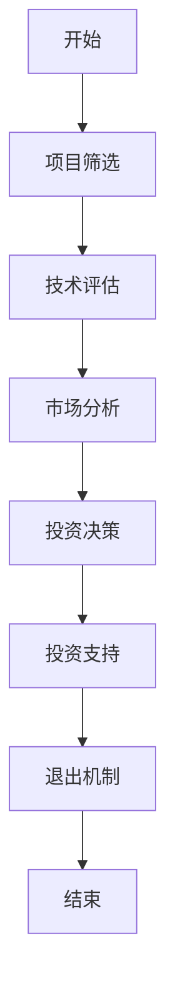
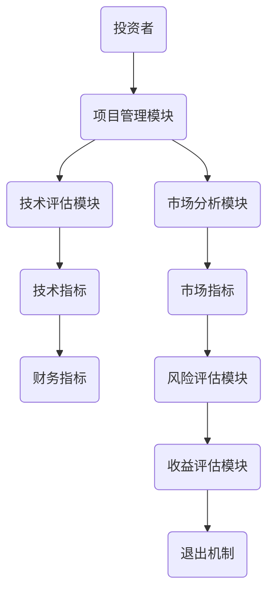

                 


# 清洁技术风险投资基金的策略与表现

## 关键词：
- 清洁技术
- 风险投资
- 投资策略
- 绩效评估
- 市场定位

## 摘要：
本文深入探讨了清洁技术风险投资基金的策略与表现，分析了清洁技术的定义、分类及其与风险投资的结合，提出了技术评估、市场定位和投资组合构建的策略。文章还通过数学模型和实际案例，详细阐述了清洁技术风险投资的表现评估方法，强调了技术创新性、环境效益和商业可行性在投资决策中的重要性。最后，本文总结了清洁技术风险投资的关键成功要素和未来发展趋势。

---

# 第一部分: 清洁技术风险投资基金的背景与核心概念

## 第1章: 清洁技术与风险投资概述

### 1.1 清洁技术的定义与分类

#### 1.1.1 清洁技术的定义
清洁技术是指能够减少资源消耗、降低环境污染、提高能源利用效率的技术和解决方案。它包括但不限于可再生能源、节能技术、环保材料、清洁能源储存和绿色建筑等领域。

#### 1.1.2 清洁技术的主要分类
1. **可再生能源**：太阳能、风能、生物质能等。
2. **节能技术**：能效提升、智能电网、建筑节能等。
3. **环保技术**：污染治理、废物资源化、水处理技术等。
4. **绿色交通**：电动汽车、智能交通系统、共享出行等。
5. **绿色材料**：生物基材料、可降解材料、循环经济相关技术。

#### 1.1.3 清洁技术的全球发展趋势
全球气候变化和环境问题的加剧，推动了清洁技术的快速发展。各国政府和企业纷纷加大对清洁技术的投入，清洁技术市场规模持续扩大，成为全球经济增长的新引擎。

---

### 1.2 风险投资的基本原理

#### 1.2.1 风险投资的定义
风险投资是一种通过投资高成长性企业，以获取高额回报的投资方式。其核心在于通过支持创新企业和技术商业化，实现资本增值。

#### 1.2.2 风险投资的核心特征
1. **高风险**：技术创新和市场不确定性导致较高的失败率。
2. **高回报**：成功项目往往能带来数倍于投资的回报。
3. **长期性**：投资周期较长，通常需要5-10年才能看到回报。

#### 1.2.3 风险投资的运作流程
1. **项目筛选**：通过初步筛选和尽职调查识别潜在投资机会。
2. **投资决策**：基于技术、团队、市场和财务分析做出投资决策。
3. **投资支持**：提供资金、资源和战略支持，帮助项目快速发展。
4. **退出机制**：通过IPO、并购或股权转让实现资本退出。

---

### 1.3 清洁技术与风险投资的结合

#### 1.3.1 清洁技术对风险投资的吸引力
1. **政策支持**：政府出台了一系列鼓励清洁技术发展的政策和补贴。
2. **市场需求**：环保和可持续发展的需求推动了清洁技术的广泛应用。
3. **技术潜力**：清洁技术在能源、交通和制造领域的广泛应用潜力巨大。

#### 1.3.2 风险投资对清洁技术的支持作用
1. **资金支持**：为清洁技术创新企业提供资金支持。
2. **资源整合**：帮助技术团队与市场、上下游企业建立联系。
3. **风险管理**：通过多元化投资降低整体风险。

#### 1.3.3 清洁技术风险投资的边界与外延
清洁技术风险投资不仅关注技术创新，还注重商业模式的可行性。其外延包括技术商业化、市场推广和生态系统的构建。

---

## 第2章: 清洁技术的核心概念与联系

### 2.1 清洁技术的核心要素

#### 2.1.1 技术创新性
技术创新是清洁技术的核心竞争力。只有具备独特的技术优势，才能在竞争中脱颖而出。

#### 2.1.2 环境效益
清洁技术的环境效益是其价值的重要体现。它通过减少碳排放、节约资源等方式为环境保护做出贡献。

#### 2.1.3 商业可行性
技术的商业化能力是清洁技术投资成功的关键。只有具备良好的商业模式，技术才能实现大规模应用。

---

### 2.2 清洁技术与风险投资的关系

#### 2.2.1 清洁技术对风险投资的吸引力
1. **技术驱动**：清洁技术往往由创新驱动，具备较高的投资价值。
2. **政策支持**：政府对清洁技术的支持为投资者提供了额外的收益保障。
3. **市场潜力**：随着环保意识的增强，清洁技术市场潜力巨大。

#### 2.2.2 风险投资对清洁技术的支持作用
1. **资金支持**：为清洁技术创新企业提供必要的资金支持。
2. **资源整合**：帮助技术团队与市场、上下游企业建立联系。
3. **风险管理**：通过多元化投资降低整体风险。

#### 2.2.3 两者之间的协同效应
1. **技术创新**：风险投资推动清洁技术创新，提升技术商业化能力。
2. **市场推广**：清洁技术的应用推动市场对环保产品的接受度。
3. **生态构建**：清洁技术与风险投资的结合促进绿色产业生态的形成。

---

### 2.3 清洁技术的ER实体关系图

```mermaid
er
  actor(投资者) -[投资]-> entity(清洁技术项目)
  entity(清洁技术项目) -[拥有]-> entity(技术)
  entity(技术) -[由]-> entity(团队)
  entity(团队) -[负责]-> entity(市场)
  entity(市场) -[反馈]-> entity(收益)
  entity(收益) -[分配]-> entity(投资者)
  entity(收益) -[分配]-> entity(技术提供方)
  entity(风险) -[由]-> entity(投资者)
  entity(风险) -[由]-> entity(技术提供方)
  entity(退出机制) -[应用于]-> entity(投资周期)
```

---

## 第3章: 清洁技术风险投资的策略与模型

### 3.1 清洁技术风险投资的策略

#### 3.1.1 技术评估策略
1. **技术可行性**：评估技术的成熟度、创新性和可扩展性。
2. **市场适应性**：分析技术是否符合市场需求和行业趋势。
3. **竞争优势**：比较同类技术，评估技术的核心竞争力。

#### 3.1.2 市场定位策略
1. **目标市场选择**：根据技术特点选择合适的市场和客户群体。
2. **商业模式设计**：制定可持续的商业模式，确保技术的商业化成功。
3. **合作伙伴关系**：与上下游企业、政府机构建立合作关系，降低市场风险。

#### 3.1.3 投资组合策略
1. **多元化投资**：通过投资不同领域的项目降低整体风险。
2. **阶段化投资**：根据项目所处阶段（种子期、成长期、成熟期）调整投资策略。
3. **退出策略**：制定明确的退出机制，确保资本回报。

---

### 3.2 清洁技术风险投资的数学模型

#### 3.2.1 投资回报率模型
$$ ROI = \frac{净收益}{投资成本} \times 100\% $$

其中，净收益 = 终值 - 投资成本，终值包括本金和利息。

#### 3.2.2 风险评估模型
$$ Risk = \frac{损失概率 \times 损失程度}{投资规模} $$

---

### 3.3 清洁技术风险投资的流程图



---

## 第4章: 清洁技术风险投资的表现与评估

### 4.1 清洁技术风险投资的表现

#### 4.1.1 投资回报率
1. **IRR（内部收益率）**：IRR越高，投资回报越好。
2. **净现值（NPV）**：NPV为正，说明项目具有投资价值。

#### 4.1.2 退出机制
1. **IPO退出**：通过公开上市实现资本退出。
2. **并购退出**：将项目出售给行业龙头企业。
3. **股权转让**：通过二级市场转让股权。

---

### 4.2 清洁技术风险投资的评估指标

#### 4.2.1 技术指标
1. **技术创新性**：技术是否具备独特性和领先性。
2. **技术成熟度**：技术是否具备可商业化的能力。

#### 4.2.2 市场指标
1. **市场规模**：目标市场的容量和增长潜力。
2. **竞争格局**：市场上现有竞争者的情况。

#### 4.2.3 财务指标
1. **盈利能力**：项目的盈利能力和财务健康状况。
2. **风险承受能力**：项目对市场波动和风险的应对能力。

---

## 第5章: 清洁技术风险投资的系统分析与架构设计

### 5.1 清洁技术风险投资的系统架构

#### 5.1.1 系统功能设计
1. **项目管理模块**：负责项目的筛选、评估和跟踪。
2. **资金管理模块**：负责资金的分配、使用和回收。
3. **风险管理模块**：识别和评估投资项目中的风险。
4. **收益评估模块**：计算投资回报率和绩效指标。

#### 5.1.2 系统架构图



---

## 第6章: 清洁技术风险投资的项目实战

### 6.1 项目背景介绍

#### 6.1.1 项目名称
清洁技术风险投资基金——绿色未来一号。

#### 6.1.2 项目目标
支持可再生能源、节能技术和环保材料的研发与商业化。

---

### 6.2 系统核心实现

#### 6.2.1 环境影响评估
1. **碳排放评估**：计算项目全生命周期的碳排放量。
2. **资源消耗评估**：评估项目对水、土地等资源的消耗情况。

#### 6.2.2 市场分析
1. **市场规模预测**：使用增长率模型预测未来市场规模。
2. **竞争分析**：分析主要竞争对手的市场份额和技术优势。

#### 6.2.3 退出策略制定
1. **IPO规划**：制定项目上市的时间表和路径。
2. **并购目标**：筛选潜在的并购方和收购价格。

---

## 第7章: 清洁技术风险投资的总结与展望

### 7.1 本章小结
清洁技术风险投资是推动绿色技术创新和可持续发展的重要手段。通过科学的技术评估、市场定位和投资组合策略，投资者可以有效降低风险，实现高回报。

---

### 7.2 注意事项
1. **技术风险**：技术创新的不确定性和失败风险较高。
2. **市场风险**：市场需求的波动可能影响项目的盈利能力。
3. **政策风险**：政策变化可能对项目产生重大影响。

---

### 7.3 拓展阅读
1. 《风险投资与技术创新》
2. 《绿色技术与可持续发展》
3. 《清洁技术商业化的成功案例》

---

## 作者：AI天才研究院/AI Genius Institute & 禅与计算机程序设计艺术 /Zen And The Art of Computer Programming

---

以上是《清洁技术风险投资基金的策略与表现》的技术博客文章的大纲和内容。

