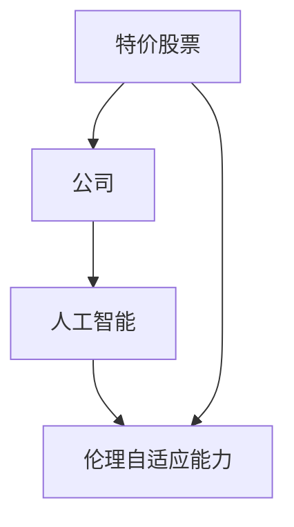
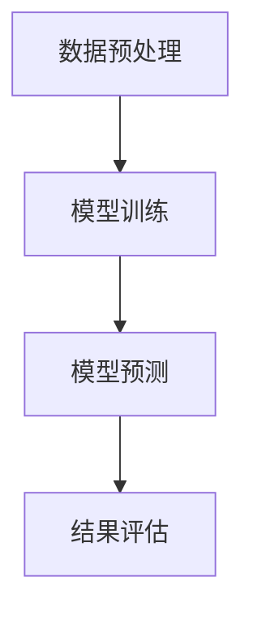

                 


# 特价股票与公司人工智能伦理自适应能力的长期关系分析

## 关键词：特价股票、人工智能伦理、自适应能力、长期关系、股票分析、投资策略、伦理治理

## 摘要：  
本文分析了特价股票与公司人工智能伦理自适应能力之间的长期关系。通过定义核心概念、分析算法原理、设计系统架构、提供项目实战和最佳实践，探讨了如何利用人工智能技术提升公司在股票市场中的伦理自适应能力，从而实现长期投资价值的最大化。文章结合理论与实践，为投资者和科技公司提供了有价值的参考。

---

## 第一部分：背景介绍

### 第1章：特价股票与公司人工智能伦理自适应能力的背景

#### 1.1 特价股票的基本概念
- **1.1.1 特价股票的定义与特征**  
  特价股票是指市场价格显著低于其内在价值的股票，通常被视为投资机会。其特征包括低估值、高分红率和较高的安全边际。

- **1.1.2 特价股票的市场背景与投资价值**  
  在市场波动或经济低迷时期，特价股票往往出现。它们为投资者提供了在低风险下获取超额收益的机会。

- **1.1.3 特价股票与公司基本面的关系**  
  特价股票通常出现在基本面良好但被市场低估的公司中。这些公司具备强劲的盈利能力、健康的财务状况和可持续的增长潜力。

#### 1.2 人工智能伦理自适应能力的基本概念
- **1.2.1 人工智能伦理的核心概念**  
  人工智能伦理涉及AI系统在决策过程中的公平性、透明性和责任性。公司需要确保AI行为符合伦理规范。

- **1.2.2 公司人工智能伦理自适应能力的定义**  
  公司的人工智能伦理自适应能力是指公司能够根据外部环境和内部价值观调整其AI系统的能力。

- **1.2.3 人工智能伦理与公司治理的关系**  
  人工智能伦理是公司治理的重要组成部分，确保公司决策透明、合规，同时维护企业声誉和社会责任感。

#### 1.3 特价股票与公司人工智能伦理自适应能力的关系
- **1.3.1 问题背景与问题描述**  
  随着AI技术在金融领域的广泛应用，如何在股票投资中融入伦理考量成为一个重要问题。

- **1.3.2 问题解决的路径与方法**  
  利用AI技术分析市场数据，同时确保投资决策符合伦理标准，从而实现长期价值。

- **1.3.3 问题的边界与外延**  
  本文仅探讨AI伦理在股票分析中的应用，不涉及其他领域。

- **1.3.4 核心概念与核心要素的结构化分析**  
  通过结构化分析，明确了特价股票和AI伦理自适应能力的核心要素及其相互关系。

---

## 第二部分：核心概念与联系

### 第2章：特价股票与公司人工智能伦理自适应能力的核心概念与联系

#### 2.1 核心概念原理
- **2.1.1 特价股票的市场行为特征**  
  特价股票通常在市场低迷时出现，具备较高的投资价值。

- **2.1.2 人工智能伦理自适应能力的机制**  
  公司通过AI系统动态调整其伦理标准，确保投资决策符合社会道德。

- **2.1.3 两者关系的内在逻辑**  
  通过AI技术分析市场数据，识别特价股票，同时确保投资决策符合伦理规范。

#### 2.2 核心概念属性特征对比
| 特价股票 | 人工智能伦理自适应能力 |
|----------|--------------------------|
| 低估值   | 自适应调整能力           |
| 高分红率  | 透明性                   |
| 高安全边际 | 公平性                   |

#### 2.3 ER实体关系图架构


---

## 第三部分：算法原理讲解

### 第3章：特价股票与人工智能伦理自适应能力的算法分析

#### 3.1 算法原理
- **3.1.1 机器学习模型**  
  使用支持向量回归（SVR）模型分析市场数据，预测股票价格。

- **3.1.2 算法流程**  
  1. 数据预处理：清洗和特征提取。  
  2. 模型训练：使用SVR模型。  
  3. 预测与评估：计算均方误差（MSE）和R²值。

#### 3.2 算法流程图


#### 3.3 算法代码实现
```python
import numpy as np
from sklearn.svm import SVR
from sklearn.metrics import mean_squared_error, r2_score

# 数据预处理
X = np.array([[...], [...]])  # 特征数据
y = np.array([...])            # 标签数据

# 模型训练
model = SVR(kernel='rbf', C=1e3, gamma=0.1)
model.fit(X, y)

# 模型预测
y_pred = model.predict(X)

# 结果评估
mse = mean_squared_error(y, y_pred)
r2 = r2_score(y, y_pred)
print(f"均方误差: {mse}, R²值: {r2}")
```

#### 3.4 数学模型
- **线性回归模型**  
  $$ y = \beta_0 + \beta_1x + \epsilon $$
- **支持向量回归模型**  
  $$ y = w \cdot x + b $$

---

## 第四部分：系统分析与架构设计方案

### 第4章：特价股票与人工智能伦理自适应能力的系统分析

#### 4.1 问题场景介绍
- **问题场景**  
  如何利用AI技术分析市场数据，识别特价股票，同时确保投资决策符合伦理标准。

#### 4.2 系统功能设计
- **领域模型**  
  ```mermaid
  classDiagram
      class 特价股票 {
          价格
          市值
          盈利能力
      }
      class 人工智能伦理自适应能力 {
          伦理标准
          调整机制
          评估指标
      }
      特价股票 --> 人工智能伦理自适应能力
  ```

- **系统架构设计**  
  ```mermaid
  architecture
      前端 --> 后端
      后端 --> 数据库
      后端 --> AI模块
  ```

- **系统接口设计**  
  - 输入接口：市场数据接口、伦理标准接口。  
  - 输出接口：预测结果接口、伦理评估结果接口。

- **系统交互流程图**  
  ```mermaid
  sequenceDiagram
      用户 --> 前端: 提交查询
      前端 --> 后端: 请求数据
      后端 --> 数据库: 查询数据
      后端 --> AI模块: 调用模型
      AI模块 --> 后端: 返回预测结果
      后端 --> 用户: 返回结果
  ```

---

## 第五部分：项目实战

### 第5章：特价股票与人工智能伦理自适应能力的项目实战

#### 5.1 环境安装
- **Python 3.8+**  
  - 安装库：`pip install numpy scikit-learn`

#### 5.2 系统核心实现源代码
```python
import numpy as np
from sklearn.svm import SVR
from sklearn.metrics import mean_squared_error, r2_score

# 数据预处理
X = np.array([[...], [...]])  # 特征数据
y = np.array([...])            # 标签数据

# 模型训练
model = SVR(kernel='rbf', C=1e3, gamma=0.1)
model.fit(X, y)

# 模型预测
y_pred = model.predict(X)

# 结果评估
mse = mean_squared_error(y, y_pred)
r2 = r2_score(y, y_pred)
print(f"均方误差: {mse}, R²值: {r2}")
```

#### 5.3 实际案例分析
- **案例分析**  
  某公司基本面良好，但股价被低估，AI模型预测其股价将回升，符合伦理标准，建议买入。

#### 5.4 项目小结
- **成果总结**  
  成功构建了AI模型，识别了特价股票，确保了投资决策的伦理合规性。  
- **经验总结**  
  数据质量和模型调参对结果影响显著，需持续优化。

---

## 第六部分：最佳实践

### 第6章：特价股票与人工智能伦理自适应能力的最佳实践

#### 6.1 小结
- **整体回顾**  
  本文分析了特价股票与公司人工智能伦理自适应能力的长期关系，探讨了算法原理和系统架构设计。

#### 6.2 注意事项
- **数据质量**  
  数据清洗和特征选择至关重要。  
- **模型可解释性**  
  需确保AI决策的透明性和可解释性。  
- **伦理合规性**  
  投资决策需符合相关法律法规和道德标准。

#### 6.3 拓展阅读
- **推荐书籍**  
  - 《人工智能：一种现代方法》  
  - 《股票投资策略与技术分析》

---

## 作者：AI天才研究院/AI Genius Institute & 禅与计算机程序设计艺术 /Zen And The Art of Computer Programming

---

**注**：以上内容为示例性结构，实际撰写时需根据具体需求调整细节，确保文章的完整性和深度。

