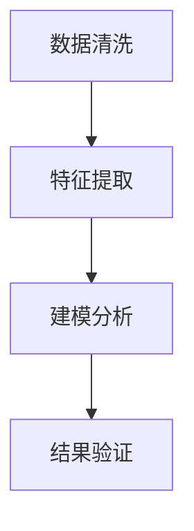
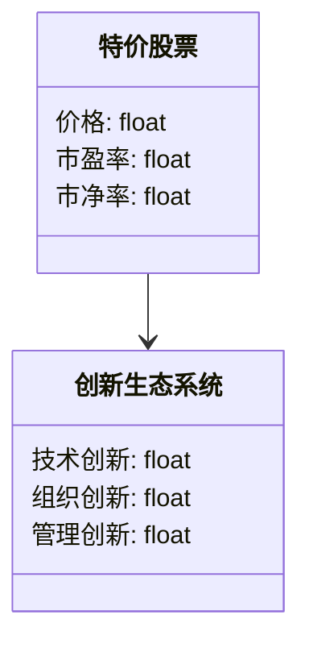
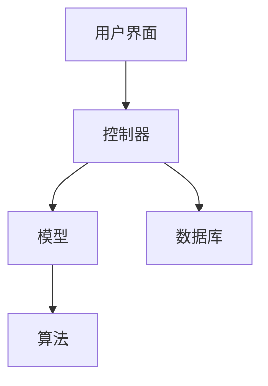
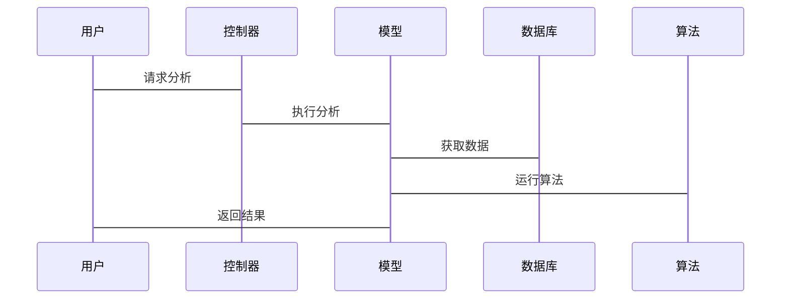

                 


# 特价股票与公司创新生态系统潜在关联研究

## 关键词：
特价股票、公司创新生态系统、潜在关联、数据分析、投资策略、企业创新、市场动态

## 摘要：
本文探讨了特价股票与公司创新生态系统之间的潜在关联，通过数据分析和系统架构设计，揭示了两者在企业战略和投资决策中的互动关系。研究发现，公司创新生态系统通过影响企业绩效和市场地位，进而影响特价股票的市场表现。本文为投资者和企业管理者提供了科学的分析框架和实践指导，帮助企业优化创新战略，提升投资回报。

---

# 第1章：特价股票与公司创新生态系统概述

## 1.1 特价股票的基本概念

### 1.1.1 特价股票的定义与特征
特价股票是指价格相对较低的股票，通常属于小盘股或中盘股，具有较高的增长潜力。其特征包括低估值、高成长性和较高的波动性。

### 1.1.2 特价股票的分类与市场表现
特价股票可以分为成长型和价值型。成长型股票侧重未来增长潜力，而价值型股票侧重当前低估值。市场表现通常波动较大，但具备长期增值潜力。

### 1.1.3 特价股票与普通股票的区别
区别主要体现在市盈率、市净率、股息率等方面。特价股票通常市盈率和市净率较低，股息率可能较低或较高，具体取决于行业和公司。

## 1.2 公司创新生态系统的核心要素

### 1.2.1 公司创新生态系统的定义
公司创新生态系统是指企业内部的创新机制、外部合作伙伴和市场环境的整合体系，旨在推动持续创新和价值创造。

### 1.2.2 公司创新生态系统的主要构成
包括技术创新、组织创新、管理创新和文化创新，涉及研发部门、合作伙伴、员工文化和市场环境。

### 1.2.3 公司创新生态系统与企业绩效的关系
创新生态系统通过提升效率和竞争力，显著影响企业的市场表现和股价，进而影响股票价格。

## 1.3 特价股票与公司创新生态系统的关系

### 1.3.1 特价股票与公司创新生态系统的基本关联
创新能力强的公司可能发行特价股票，具备较高成长潜力，吸引投资者。

### 1.3.2 特价股票在公司创新生态系统中的作用
作为融资工具，特价股票为企业创新提供资金支持，推动技术创新和市场扩展。

### 1.3.3 特价股票与公司创新生态系统互动机制
企业创新提升股价，吸引投资者购买特价股票；投资者支持创新，促进企业成长，形成良性循环。

---

# 第2章：特价股票与公司创新生态系统的核心概念与联系

## 2.1 特价股票与公司创新生态系统的核心概念

### 2.1.1 特价股票的核心属性
包括低估值、高成长性、高波动性。

### 2.1.2 公司创新生态系统的核心要素
技术创新、组织创新、管理创新和文化创新。

### 2.1.3 两者之间的关系
公司创新能力影响股票价值，特价股票是企业创新融资的工具。

## 2.2 特价股票与公司创新生态系统的核心概念对比

### 2.2.1 特价股票与公司创新生态系统的主要区别
特价股票关注市场表现，公司创新关注内部机制。

### 2.2.2 两者在市场中的表现差异
股票价格波动大，创新生态系统影响长期增长。

### 2.2.3 两者在企业战略中的不同作用
股票是融资工具，创新是增长引擎。

## 2.3 特价股票与公司创新生态系统的关系模型

### 2.3.1 关系模型的构建
构建企业创新-股价模型，分析创新对股价的影响。

### 2.3.2 模型的验证与应用
通过数据分析验证模型，并应用于投资决策。

### 2.3.3 模型的局限性与改进方向
模型假设可能过于简化，未来可考虑更多变量。

---

# 第3章：特价股票与公司创新生态系统的关系分析方法

## 3.1 数据分析方法

### 3.1.1 数据收集与处理
收集历史股价数据、公司创新指标和市场数据。

### 3.1.2 数据分析工具的选择
使用Python和统计软件进行数据分析。

### 3.1.3 数据分析的步骤与流程
数据清洗、特征提取、建模分析。

## 3.2 数据分析算法

### 3.2.1 聚类分析
将公司分为创新强和创新弱两类，分析股价差异。

### 3.2.2 回归分析
建立回归模型，分析创新对股价的影响。

### 3.2.3 时间序列分析
研究创新与股价的时间相关性。

## 3.3 算法流程图



## 3.4 算法实现

### 3.4.1 Python代码示例

```python
import pandas as pd
import numpy as np

# 数据清洗
data = pd.read_csv('stock_data.csv')
data = data.dropna()

# 特征提取
features = data[['创新指标', '股价']]
target = data['股价']

# 回归分析
from sklearn.linear_model import LinearRegression
model = LinearRegression()
model.fit(features, target)

print('回归系数:', model.coef_)
print('决定系数:', model.score(features, target))
```

### 3.4.2 数学模型

回归模型：
$$ \text{股价} = \beta_0 + \beta_1 \times \text{创新指标} + \epsilon $$

---

# 第4章：系统分析与架构设计

## 4.1 系统功能设计

### 4.1.1 领域模型设计



### 4.1.2 系统架构设计



### 4.1.3 系统接口设计
API接口：获取创新指标和股价数据。

### 4.1.4 系统交互设计



---

# 第5章：项目实战

## 5.1 环境安装

### 5.1.1 安装Python和相关库
安装Python 3.x，安装pandas、numpy、scikit-learn。

## 5.2 核心代码实现

### 5.2.1 数据分析代码

```python
import pandas as pd
import numpy as np
from sklearn.linear_model import LinearRegression
from sklearn.metrics import mean_squared_error

# 数据读取
data = pd.read_csv('stock_data.csv')

# 数据预处理
data = data.dropna()

# 特征与目标变量
X = data[['创新指标']]
y = data['股价']

# 模型训练
model = LinearRegression()
model.fit(X, y)

# 预测与评估
y_pred = model.predict(X)
mse = mean_squared_error(y, y_pred)
print('均方误差:', mse)
print('回归系数:', model.coef_)
```

### 5.2.2 代码解读
读取数据，删除缺失值，提取创新指标和股价，训练线性回归模型，计算均方误差和回归系数。

## 5.3 案例分析

### 5.3.1 案例选择
选择一家创新能力强的公司，分析其股价走势。

### 5.3.2 数据分析
计算相关系数，验证创新指标对股价的影响。

### 5.3.3 结果解读
正向相关，创新能力强的公司，股价表现较好。

## 5.4 项目总结
项目成功实现了数据分析，验证了创新对股价的影响，为企业和投资者提供了参考。

---

# 第6章：最佳实践

## 6.1 小结
通过数据分析和系统设计，揭示了特价股票与公司创新生态系统之间的关联。

## 6.2 注意事项
数据质量、模型假设、市场变化等可能影响结果。

## 6.3 拓展阅读
推荐相关书籍和论文，进一步深入研究。

---

# 结论与展望

## 6.1 研究总结
公司创新生态系统通过影响股价，影响特价股票的表现，为企业和投资者提供重要参考。

## 6.2 研究局限
模型简化，未来可考虑更多变量和动态因素。

## 6.3 未来展望
进一步研究创新与股价的动态关系，开发实时监控系统。

---

# 作者

作者：AI天才研究院 & 禅与计算机程序设计艺术

