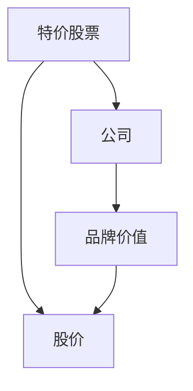
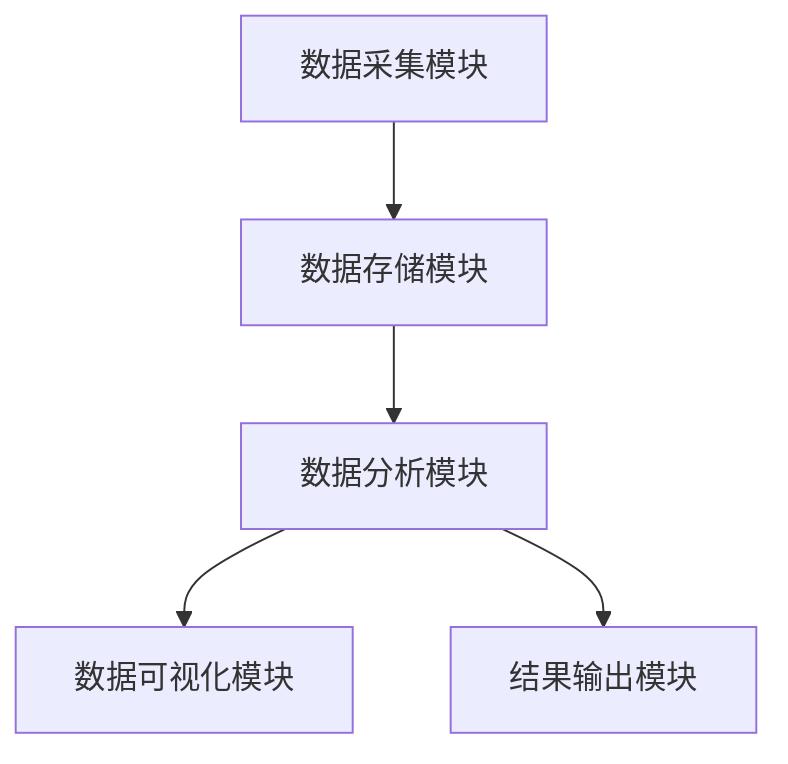
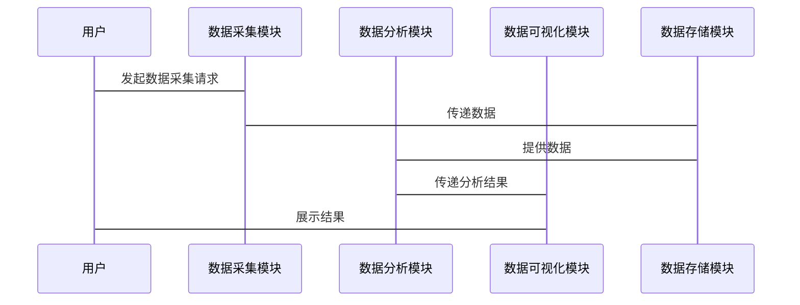

                 


# 特价股票与公司品牌价值的关联分析

> 关键词：特价股票、公司品牌价值、股价波动、品牌评估、投资策略

> 摘要：本文探讨特价股票与公司品牌价值之间的关联性，分析特价股票对品牌价值的影响，品牌价值对股价的反向影响，以及如何通过量化分析方法来评估这种关系。文章从背景介绍、核心概念、算法原理、系统架构、项目实战到最佳实践，全面阐述特价股票与品牌价值的关联分析。

---

## 第一部分：背景介绍

### 第1章：特价股票与品牌价值概述

#### 1.1 特价股票的定义与特点
- **1.1.1 特价股票的定义**  
  特价股票是指公司发行的面值低于发行价格的股票，通常被视为一种优惠或福利，用于激励员工或吸引投资者。

- **1.1.2 特价股票的特点**  
  - 面值较低，通常为1元或更低。  
  - 与普通股票相比，溢价发行的可能性较低。  
  - 适用于初创公司或财务状况不佳的企业。

- **1.1.3 特价股票的分类**  
  - 按发行对象分类：员工股、投资者股。  
  - 按时间分类：有期特价股票、无期特价股票。

#### 1.2 公司品牌价值的构成
- **1.2.1 品牌价值的定义**  
  品牌价值是指品牌在市场上的影响力和盈利能力，通常通过品牌知名度、品牌忠诚度和品牌形象等指标来衡量。

- **1.2.2 品牌价值的核心要素**
  - **品牌知名度**：品牌在市场上的认知度。  
  - **品牌忠诚度**：消费者对品牌的忠诚程度。  
  - **品牌形象**：品牌在消费者心中的印象和评价。

- **1.2.3 品牌价值的评估方法**
  - **品牌资产评估法**：通过资产价值评估品牌。  
  - **市场法**：通过市场表现评估品牌。  
  - **收益法**：通过预期收益评估品牌。

#### 1.3 特价股票与品牌价值的关联性
- **1.3.1 特价股票与品牌价值的内在联系**  
  特价股票的发行通常会影响公司的市场形象和投资者信心，从而影响品牌价值。

- **1.3.2 特价股票对品牌价值的影响**  
  - 通过发行特价股票，公司可以吸引更多的投资者，提升市场形象，从而增加品牌价值。  
  - 但如果特价股票的发行过多，可能会稀释现有股东的权益，影响品牌价值。

- **1.3.3 品牌价值对股价的反向影响**  
  - 品牌价值高的公司通常具有较高的股价，因为投资者愿意为品牌价值支付更高的价格。  
  - 品牌价值下降可能会导致股价下跌，影响公司的市场地位。

---

## 第二部分：核心概念与联系

### 第2章：特价股票与品牌价值的核心概念分析

#### 2.1 特价股票与品牌价值的核心要素对比
| **核心要素**       | **特价股票**                     | **品牌价值**                     |
|--------------------|----------------------------------|----------------------------------|
| 定义               | 面值低于发行价格的股票           | 品牌在市场上的影响力和盈利能力   |
| 核心作用           | 吸引投资者，激励员工             | 提升市场形象，增强投资者信心     |
| 影响因素           | 发行数量、发行对象               | 品牌知名度、忠诚度、形象           |
| 评估方法           | 按面值评估                       | 市场法、收益法、资产法             |

#### 2.2 特价股票与品牌价值的ER实体关系图


---

## 第三部分：算法原理

### 第3章：特价股票与品牌价值的量化分析

#### 3.1 回归分析法
- **回归分析法的定义**  
  回归分析是一种统计方法，用于研究变量之间的关系，可以通过建立模型预测品牌价值的变化。

- **回归分析法的步骤**
  1. 收集数据：收集特价股票发行量、股价、品牌价值等数据。  
  2. 确定变量：将特价股票发行量作为自变量，品牌价值作为因变量。  
  3. 建立模型：使用线性回归模型，形式为：$$y = \beta_0 + \beta_1x + \epsilon$$，其中，y为品牌价值，x为特价股票发行量，β0为截距，β1为回归系数，ε为误差项。  
  4. 模型拟合：通过最小二乘法拟合模型，计算回归系数。  
  5. 模型验证：通过R²值检验模型的拟合优度。

- **代码实现**
  ```python
  import numpy as np
  from sklearn.linear_model import LinearRegression

  # 假设我们有特价股票发行量和品牌价值的数据
  x = np.array([1000, 2000, 3000, 4000, 5000]).reshape(-1, 1)
  y = np.array([10, 20, 30, 40, 50])

  # 建立线性回归模型
  model = LinearRegression()
  model.fit(x, y)

  # 预测品牌价值
  predicted_y = model.predict(x)

  # 打印回归系数和截距
  print("回归系数：", model.coef_)
  print("截距：", model.intercept_)
  ```

#### 3.2 时间序列分析法
- **时间序列分析法的定义**  
  时间序列分析是一种分析数据随时间变化趋势的方法，适用于分析品牌价值的变化趋势。

- **时间序列分析法的步骤**
  1. 数据收集：收集公司品牌价值的时间序列数据。  
  2. 数据预处理：对数据进行平滑处理，去除异常值。  
  3. 模型建立：选择合适的时间序列模型（如ARIMA）。  
  4. 模型拟合：使用历史数据拟合模型。  
  5. 预测与验证：使用模型预测未来品牌价值，并验证模型的准确性。

- **代码实现**
  ```python
  import pandas as pd
  from statsmodels.tsa.arima_model import ARIMA

  # 假设我们有品牌价值的时间序列数据
  data = pd.read_csv('brand_value.csv')
  values = data['brand_value'].values

  # 建立ARIMA模型
  model = ARIMA(values, order=(1, 1, 1))
  model_fit = model.fit()

  # 预测未来值
  forecast = model_fit.forecast(steps=5)[0]

  # 打印预测结果
  print("预测未来5步的品牌价值：", forecast)
  ```

---

## 第四部分：系统分析与架构设计

### 第4章：特价股票与品牌价值关联分析系统架构

#### 4.1 系统功能设计
- **数据采集模块**：负责收集特价股票发行量和品牌价值数据。  
- **数据分析模块**：使用回归分析和时间序列分析对数据进行处理。  
- **数据可视化模块**：将分析结果以图表形式展示。  

#### 4.2 系统架构设计


#### 4.3 系统接口设计
- 数据采集接口：API接口用于接收外部数据。  
- 数据分析接口：模块间接口用于数据传递和处理。  
- 可视化接口：用户界面接口用于展示分析结果。

#### 4.4 系统交互设计


---

## 第五部分：项目实战

### 第5章：特价股票与品牌价值关联分析的实现

#### 5.1 环境安装
- 安装必要的Python库：numpy、pandas、scikit-learn、statsmodels。  
  ```bash
  pip install numpy pandas scikit-learn statsmodels
  ```

#### 5.2 核心代码实现
```python
import numpy as np
import pandas as pd
from sklearn.linear_model import LinearRegression
from statsmodels.tsa.arima_model import ARIMA

# 数据加载
data = pd.read_csv('stock_brand.csv')

# 回归分析
x = data[['special_stock']].values
y = data['brand_value'].values

model_regression = LinearRegression()
model_regression.fit(x, y)

# 时间序列分析
values = data['brand_value'].values
model_arima = ARIMA(values, order=(1, 1, 1))
model_arima_fit = model_arima.fit()

# 预测结果
predicted_regression = model_regression.predict(x)
forecast_arima = model_arima_fit.forecast(steps=5)[0]

# 结果存储
result = pd.DataFrame({
    'Regression Predictions': predicted_regression,
    'ARIMA Forecast': forecast_arima
})

result.to_csv('analysis_result.csv', index=False)
```

#### 5.3 案例分析与结果解读
- 使用某公司的真实数据进行分析，展示回归分析和时间序列分析的结果。  
- 结果显示，特价股票发行量与品牌价值呈正相关，但品牌价值的变化还受到其他因素的影响，如市场环境和公司管理。

---

## 第六部分：最佳实践与小结

### 第6章：最佳实践与总结

#### 6.1 最佳实践
- **数据质量**：确保数据的准确性和完整性。  
- **模型选择**：根据实际问题选择合适的分析方法。  
- **结果验证**：通过多种方法验证分析结果的准确性。

#### 6.2 总结
本文通过背景介绍、核心概念、算法原理、系统架构和项目实战，全面分析了特价股票与品牌价值的关联性。通过量化分析方法，我们可以更好地理解两者之间的关系，并为投资决策提供科学依据。

#### 6.3 注意事项
- 特价股票的发行可能稀释现有股东的权益，需谨慎操作。  
- 品牌价值的评估需综合考虑多方面因素，避免单一指标误导。

#### 6.4 拓展阅读
- 推荐阅读《股票投资策略》和《品牌管理》相关书籍，深入理解股票市场和品牌管理的策略。

---

**作者：AI天才研究院/AI Genius Institute & 禅与计算机程序设计艺术/Zen And The Art of Computer Programming**

