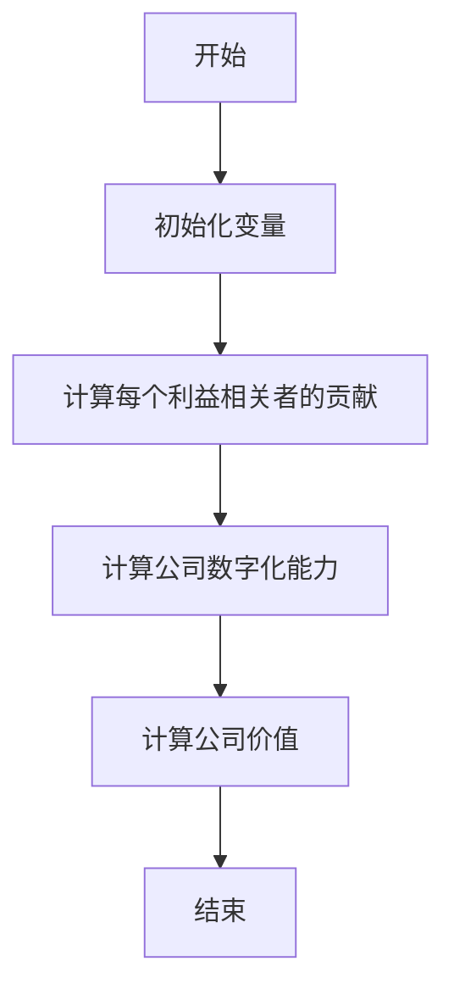
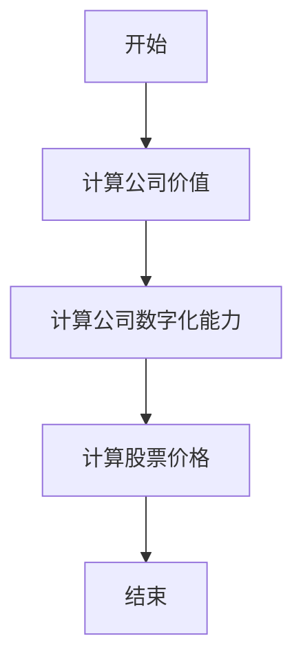
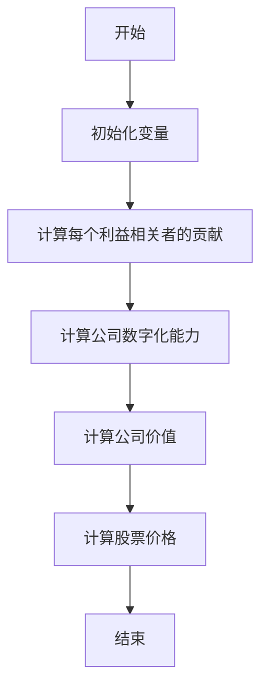
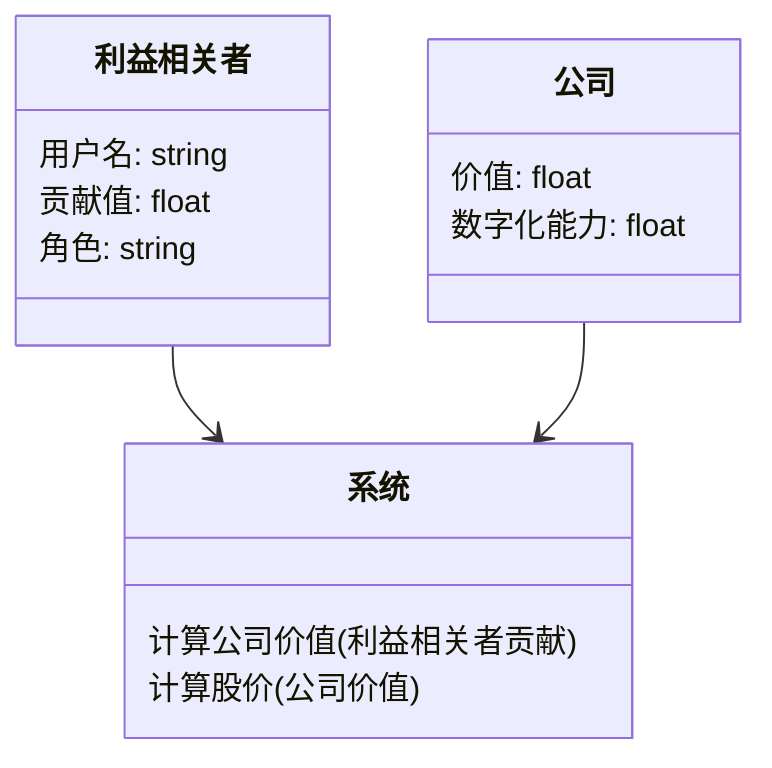
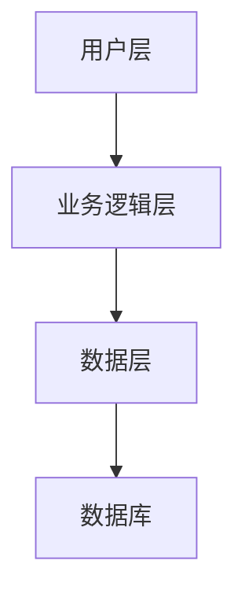
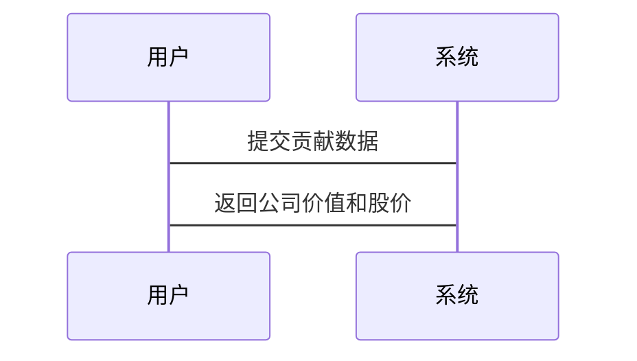

                 


# 特价股票与公司数字化利益相关者价值共创的关联性研究

**关键词**：特价股票、公司数字化、利益相关者价值共创、关联性分析、数学模型、算法实现

**摘要**：  
本文探讨了特价股票与公司数字化利益相关者价值共创之间的关联性。通过分析特价股票的定义、特点以及公司数字化背景下利益相关者价值共创的理论基础，构建了数学模型和算法，以量化利益相关者对公司价值的影响。进一步，本文通过系统分析与架构设计，提出了实现利益相关者价值共创的数字化解决方案，并通过项目实战验证了模型的有效性。本文为公司如何通过数字化手段与利益相关者协同共创价值，进而影响股价提供了理论依据和实践指导。

---

## 第1章: 特价股票与公司数字化利益相关者价值共创的背景介绍

### 1.1 特价股票的定义与特点

#### 1.1.1 特价股票的定义  
特价股票是指在特定市场条件下，由于公司经营状况、行业趋势或市场波动等原因，股票价格出现大幅波动，具有较高投资吸引力的股票。特价股票通常具有高波动性和高风险性。

#### 1.1.2 特价股票的特点  
1. **高波动性**：价格波动剧烈，短期内可能出现大幅上涨或下跌。
2. **高风险性**：投资风险较高，适合风险承受能力强的投资者。
3. **投资机会**：在市场低谷时，特价股票可能蕴含较高的投资回报机会。

#### 1.1.3 特价股票的分类  
1. **周期性股票**：受经济周期影响较大的行业股票。
2. **成长性股票**：具有高增长潜力的新兴行业股票。
3. **价值型股票**：价格被市场低估的优质股票。

### 1.2 公司数字化利益相关者价值共创的定义与特点

#### 1.2.1 公司数字化利益相关者的定义  
公司数字化利益相关者是指与公司数字化转型和运营密切相关的各方，包括股东、客户、员工、供应商、合作伙伴等。数字化使得利益相关者之间的互动更加高效和透明。

#### 1.2.2 利益相关者价值共创的定义  
利益相关者价值共创是指通过公司与利益相关者的协同合作，共同创造和实现价值的过程。数字化技术（如大数据、人工智能、区块链等）为价值共创提供了新的工具和平台。

#### 1.2.3 数字化对利益相关者价值共创的影响  
1. **提高透明度**：数字化技术使利益相关者之间的信息传递更加透明。
2. **增强互动性**：通过数字化平台，利益相关者可以实时参与价值创造。
3. **优化资源配置**：数字化技术帮助企业更高效地配置资源，提升价值创造效率。

### 1.3 特价股票与公司数字化利益相关者价值共创的关联性

#### 1.3.1 特价股票与公司数字化的内在联系  
公司数字化转型会影响其经营效率和市场竞争力，进而影响股价。数字化能力越强的公司，往往能更好地应对市场变化，从而在股价波动中表现出更强的抗跌性。

#### 1.3.2 利益相关者价值共创对股价的影响  
利益相关者通过价值共创为公司带来更多的价值，这会增强投资者对公司的信心，从而推高股价。

#### 1.3.3 数字化与利益相关者价值共创的协同效应  
数字化技术为利益相关者价值共创提供了新的工具和平台，从而进一步推动公司价值的提升，最终反映在股价上。

---

## 第2章: 特价股票与公司数字化利益相关者价值共创的核心概念与联系

### 2.1 特价股票的核心概念原理

#### 2.1.1 特价股票的形成机制  
特价股票的形成机制涉及市场供需、公司基本面、行业趋势和宏观经济环境等多方面因素。

#### 2.1.2 特价股票的市场表现分析  
通过数据分析，我们可以发现特价股票在市场中的表现往往与公司数字化能力密切相关。

#### 2.1.3 特价股票与公司治理的关系  
公司治理能力直接影响公司价值，进而影响股价。良好的公司治理是实现利益相关者价值共创的基础。

### 2.2 利益相关者价值共创的核心概念原理

#### 2.2.1 利益相关者价值共创的理论基础  
价值共创理论强调公司与利益相关者之间的协同合作，通过数字化技术实现价值共创。

#### 2.2.2 利益相关者价值共创的实现路径  
1. **数字化平台建设**：通过数字化平台连接利益相关者，实现信息共享和价值共创。
2. **协同创新**：公司与利益相关者共同参与创新，推动价值创造。
3. **利益分配机制**：建立合理的利益分配机制，确保各方利益得到保障。

#### 2.2.3 利益相关者价值共创的评估指标  
1. **利益相关者满意度**：衡量利益相关者对价值共创的满意程度。
2. **公司价值增长**：评估公司价值是否因价值共创而提升。
3. **股价表现**：观察股价是否因价值共创而上涨。

### 2.3 特价股票与公司数字化利益相关者价值共创的联系

#### 2.3.1 数字化对利益相关者价值共创的促进作用  
数字化技术通过提高信息透明度和互动效率，促进利益相关者价值共创。

#### 2.3.2 利益相关者价值共创对股价的影响  
价值共创为公司带来更多的价值，增强投资者信心，从而推高股价。

#### 2.3.3 数字化与利益相关者价值共创的协同效应  
通过数字化技术实现利益相关者价值共创，进一步提升公司价值，反映在股价上。

---

## 第3章: 特价股票与公司数字化利益相关者价值共创的数学模型与算法原理

### 3.1 利益相关者价值共创的数学模型

#### 3.1.1 利益相关者价值共创的变量定义  
- **V**：公司价值
- **S_i**：利益相关者i的贡献
- **D**：公司数字化能力

#### 3.1.2 利益相关者价值共创的数学公式  
$$ V = \sum_{i=1}^{n} S_i \times D $$  
其中，$n$为利益相关者的数量。

#### 3.1.3 利益相关者价值共创的算法流程  


### 3.2 特价股票与公司数字化的数学模型

#### 3.2.1 特价股票的数学定义  
- **P**：股票价格
- **V**：公司价值
- **D**：公司数字化能力

#### 3.2.2 特价股票与公司数字化的数学关系  
$$ P = f(V, D) $$  
其中，$f$为股票价格的函数。

#### 3.2.3 特价股票的算法流程  


### 3.3 综合模型

#### 3.3.1 综合模型的数学表达  
$$ P = f\left(\sum_{i=1}^{n} S_i \times D\right) $$  

#### 3.3.2 综合模型的算法流程  


---

## 第4章: 特价股票与公司数字化利益相关者价值共创的系统分析与架构设计

### 4.1 系统需求分析  
- 系统需要实现利益相关者价值共创的数字化管理。
- 系统需要支持多种利益相关者角色的协同合作。

### 4.2 系统功能设计  


### 4.3 系统架构设计  


### 4.4 系统接口设计  
- **输入接口**：接收利益相关者的贡献数据。
- **输出接口**：输出公司价值和股价。

### 4.5 系统交互设计  


---

## 第5章: 特价股票与公司数字化利益相关者价值共创的项目实战

### 5.1 环境配置  
- 安装Python和相关库（如NumPy、Pandas）。

### 5.2 核心代码实现  

#### 5.2.1 利益相关者价值共创模型的实现  
```python
import numpy as np
import pandas as pd

# 初始化变量
n = 5  # 利益相关者数量
S = [1, 2, 3, 4, 5]  # 利益相关者的贡献
D = 0.8  # 公司数字化能力

# 计算公司价值
V = np.sum(S) * D
print(f"公司价值 V = {V}")
```

#### 5.2.2 特价股票模型的实现  
```python
# 初始化变量
V = 100  # 公司价值
D = 0.8  # 公司数字化能力

# 计算股价
P = V * D
print(f"股价 P = {P}")
```

### 5.3 案例分析  
假设某公司有5个利益相关者，贡献分别为1, 2, 3, 4, 5，公司数字化能力为0.8。计算公司价值和股价：

- 公司价值 V = (1+2+3+4+5) * 0.8 = 20 * 0.8 = 16
- 股价 P = 16 * 0.8 = 12.8

---

## 第6章: 结论与展望

### 6.1 研究结论  
通过本文的研究，我们得出以下结论：  
1. 数字化能力是影响利益相关者价值共创和股价的重要因素。  
2. 利益相关者价值共创可以通过数字化技术实现，进而提升公司价值和股价。  

### 6.2 研究不足  
本文的研究主要基于理论模型和案例分析，实际应用中可能受到更多因素的影响，如市场波动、政策变化等。

### 6.3 未来展望  
未来的研究可以进一步结合实际市场数据，验证模型的有效性，并探索更多数字化技术在利益相关者价值共创中的应用。

---

**作者：AI天才研究院/AI Genius Institute & 禅与计算机程序设计艺术/Zen And The Art of Computer Programming**

