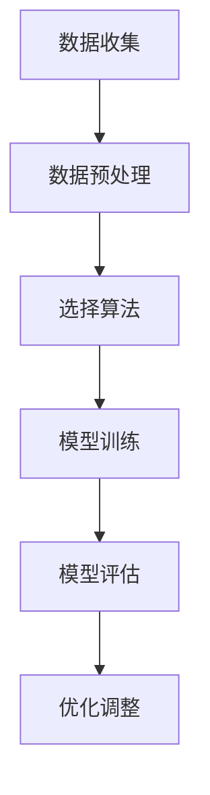
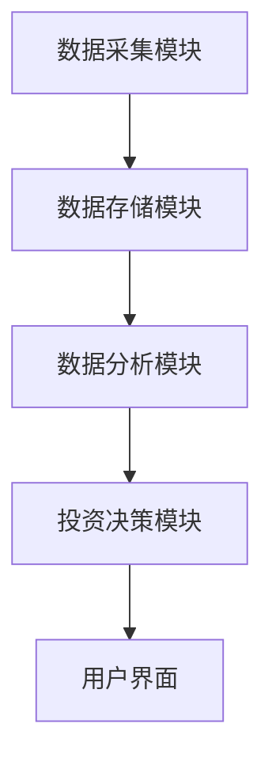

                 


```markdown
# 特价股票与公司数据变现能力的关系探讨

> 关键词：特价股票，公司数据，数据变现能力，投资策略，数据驱动，股价预测

> 摘要：本文探讨了特价股票与公司数据变现能力之间的关系，分析了数据驱动的投资策略，以及如何通过数据变现能力影响股价。文章从背景介绍、核心概念与联系、算法原理、系统分析、项目实战等多方面进行了详细阐述，提供了丰富的理论和实践指导。

---

# 第一部分: 特价股票与公司数据变现能力的背景介绍

## 第1章: 特价股票的定义与特点

### 1.1 特价股票的定义
#### 1.1.1 特价股票的定义与分类
- 特价股票是指价格相对较低的股票，通常分为成长股、价值股和周期股。
- 特价股票的特点包括低价、高波动性和高风险高回报。

#### 1.1.2 特价股票的特点
- 低价特性：通常价格低于行业平均水平。
- 高波动性：价格波动较大，适合短线交易。
- 高风险高回报：潜在收益高，但风险也较大。

#### 1.1.3 特价股票的市场定位
- 主要出现在中小型企业或新兴行业中。
- 常被视为投资的入门级产品，适合风险承受能力强的投资者。

## 第2章: 公司数据变现能力的定义与特点

### 2.1 公司数据变现能力的定义
#### 2.1.1 数据变现的定义
- 数据变现是指公司通过收集、分析和利用数据，将其转化为收入的过程。
- 数据变现的核心在于数据的利用效率和质量。

#### 2.1.2 公司数据变现能力的核心要素
- 数据采集能力：公司能否高效地收集数据。
- 数据处理能力：数据清洗、整合和分析的能力。
- 数据变现模式：数据产品化、数据服务化、数据广告等。

#### 2.1.3 数据变现的常见模式
- 数据产品化：将数据转化为产品，如API服务。
- 数据服务化：通过数据分析提供定制化服务。
- 数据广告：利用数据进行精准广告投放。

## 第3章: 特价股票与公司数据变现能力的关系

### 3.1 问题背景
#### 3.1.1 特价股票市场的现状
- 特价股票市场波动大，参与者多为散户。
- 市场信息不对称严重，数据驱动的投资策略尤为重要。

#### 3.1.2 公司数据变现能力的重要性
- 数据变现能力影响公司的收入和市场竞争力。
- 数据驱动的投资策略可以帮助投资者识别潜在价值。

#### 3.1.3 研究特价股票与数据变现能力关系的意义
- 为投资者提供新的视角，优化投资决策。
- 为公司提供数据驱动的变现策略，提升市场竞争力。

### 3.2 问题描述
#### 3.2.1 特价股票与公司数据变现能力的关联性
- 数据变现能力影响公司的财务状况，进而影响股价。
- 特价股票市场的波动为数据驱动的投资策略提供了机会。

#### 3.2.2 数据驱动的投资策略
- 利用大数据分析预测股价走势。
- 通过数据挖掘发现被低估的股票。

#### 3.2.3 数据变现对股价的影响
- 数据变现能力强的公司，股价通常表现较好。
- 数据驱动的投资策略可以帮助投资者发现特价股票的价值。

### 3.3 问题解决
#### 3.3.1 数据分析方法
- 使用大数据技术进行市场分析。
- 构建数据驱动的预测模型。

#### 3.3.2 数据驱动的投资决策
- 通过数据挖掘发现投资机会。
- 利用机器学习模型预测股价走势。

#### 3.3.3 数据变现能力对股价的提升作用
- 提升公司的市场竞争力，吸引投资者。
- 通过数据产品化和服务化，增加公司收入，间接提升股价。

## 第4章: 核心概念与联系

### 4.1 核心概念原理
#### 4.1.1 特价股票的定价机制
- 市场供需决定价格。
- 公司基本面和市场情绪影响股价。

#### 4.1.2 公司数据变现能力的评估指标
- 数据采集能力：数据量和质量。
- 数据处理能力：分析效率和准确性。
- 数据变现模式：收益能力和可持续性。

#### 4.1.3 数据驱动的股价预测模型
- 基于历史数据和市场情绪预测股价。
- 结合公司基本面和市场趋势进行综合预测。

### 4.2 概念属性特征对比表格
| 概念       | 属性特征               |
|------------|------------------------|
| 特价股票   | 低价、高波动性         |
| 数据变现能力 | 数据量、数据质量、变现模式 |

### 4.3 ER实体关系图
```mermaid
er
  Company [公司] 
  has_many DataAsset [数据资产]
  Company [公司] 
  has_many Data变现能力 [数据变现能力]
  DataAsset [数据资产] 
  has_many Data变现能力 

```

---

# 第二部分: 算法原理与数学模型

## 第5章: 数据驱动的股价预测算法

### 5.1 算法原理
#### 5.1.1 数据收集与预处理
- 收集历史股价、公司财报、市场新闻等数据。
- 数据清洗和特征提取。

#### 5.1.2 模型选择与训练
- 使用线性回归或机器学习模型。
- 训练模型并进行交叉验证。

#### 5.1.3 模型评估与优化
- 评估模型的准确性和稳定性。
- 调参优化模型性能。

### 5.2 数学模型
#### 线性回归模型
$$ y = \beta_0 + \beta_1 x_1 + \beta_2 x_2 + \dots + \beta_n x_n $$

#### 机器学习模型
- 随机森林、支持向量机等。

### 5.3 算法流程图


### 5.4 Python代码实现
```python
import pandas as pd
from sklearn.linear_model import LinearRegression

# 数据加载
data = pd.read_csv('stock_data.csv')

# 特征选择
X = data[['price', 'volume', 'market_sentiment']]
y = data['target_price']

# 模型训练
model = LinearRegression()
model.fit(X, y)

# 模型预测
predictions = model.predict(X)
```

---

# 第三部分: 系统分析与架构设计

## 第6章: 数据驱动的投资决策系统

### 6.1 系统功能设计
#### 6.1.1 数据采集模块
- 实时采集股票数据和市场新闻。
- 数据存储和管理。

#### 6.1.2 数据分析模块
- 数据清洗、特征提取和建模。
- 数据可视化和报告生成。

#### 6.1.3 投资决策模块
- 基于模型预测生成投资建议。
- 风险评估和策略优化。

### 6.2 系统架构设计


### 6.3 接口设计与交互
- 数据接口：RESTful API。
- 用户界面：Web界面或移动端应用。

---

# 第四部分: 项目实战与案例分析

## 第7章: 项目实战

### 7.1 环境安装
- 安装Python、Pandas、Scikit-learn等库。
- 配置Jupyter Notebook。

### 7.2 核心代码实现
```python
import pandas as pd
from sklearn.ensemble import RandomForestRegressor

# 数据加载
data = pd.read_csv('stock_data.csv')

# 特征选择
X = data[['feature1', 'feature2', 'feature3']]
y = data['target']

# 模型训练
model = RandomForestRegressor()
model.fit(X, y)

# 预测与评估
score = model.score(X, y)
print(f"模型得分: {score}")
```

### 7.3 案例分析
- 分析某公司数据变现能力对股价的影响。
- 通过模型预测特价股票的投资机会。

---

# 第五部分: 最佳实践与总结

## 第8章: 最佳实践

### 8.1 小结
- 特价股票与公司数据变现能力密切相关。
- 数据驱动的投资策略有助于发现潜在价值。

### 8.2 注意事项
- 数据质量是关键，需谨慎处理。
- 风险控制是投资决策的重要部分。

### 8.3 拓展阅读
- 推荐阅读《数据驱动的投资策略》和《公司数据变现的艺术》。

---

# 作者：AI天才研究院/AI Genius Institute & 禅与计算机程序设计艺术 /Zen And The Art of Computer Programming

---

**摘要**：本文系统地探讨了特价股票与公司数据变现能力之间的关系，通过背景介绍、核心概念分析、算法原理、系统架构设计和项目实战等多维度的深入探讨，为读者提供了全面的理论和实践指导。文章内容丰富，结构清晰，适合对数据驱动投资感兴趣的专业人士和研究人员阅读。

---

**Note**: 以上目录结构仅为示例，具体内容需根据实际需求进一步扩展和完善。

